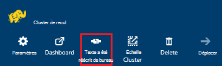
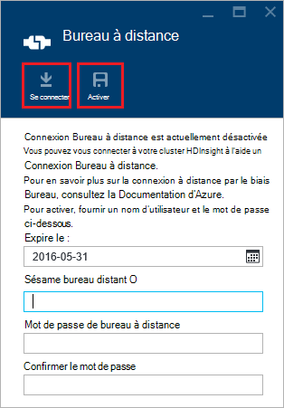
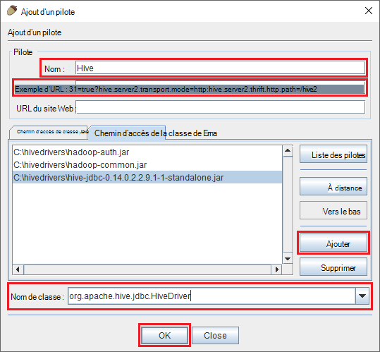
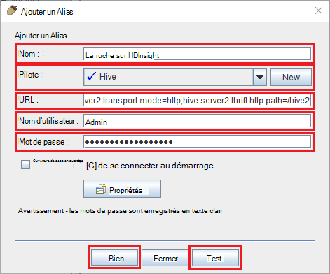
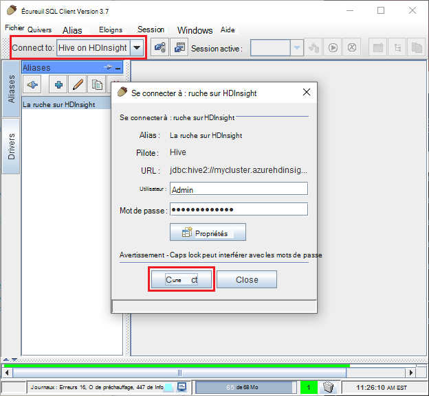
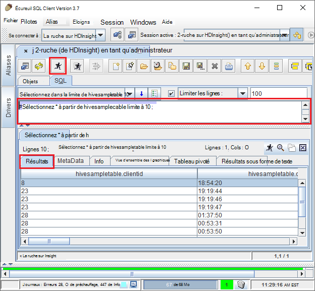

<properties
 pageTitle="Utiliser JDBC à requête ruche sur Azure HDInsight"
 description="Découvrez comment utiliser JDBC pour se connecter à la ruche sur Azure HDInsight et exécuter à distance des requêtes sur des données stockées dans le nuage."
 services="hdinsight"
 documentationCenter=""
 authors="Blackmist"
 manager="jhubbard"
 editor="cgronlun"
    tags="azure-portal"/>

<tags
 ms.service="hdinsight"
 ms.devlang="java"
 ms.topic="article"
 ms.tgt_pltfrm="na"
 ms.workload="big-data"
 ms.date="08/23/2016"
 ms.author="larryfr"/>

#Se connecter à la ruche sur HDInsight Azure utilisant le pilote JDBC de la ruche

[AZURE.INCLUDE [ODBC-JDBC-selector](../../includes/hdinsight-selector-odbc-jdbc.md)]

Dans ce document, vous apprendrez comment utiliser JDBC depuis une application Java à soumettre des requêtes de ruche à un cluster d’HDInsight d’à distance. Vous apprendrez comment se connecter à partir du client écureuil SQL et comment vous connecter par programme à partir de Java.

Pour plus d’informations sur l’Interface JDBC ruche, consultez [HiveJDBCInterface](https://cwiki.apache.org/confluence/display/Hive/HiveJDBCInterface).

##Conditions préalables

Pour terminer la procédure décrite dans cet article, vous devrez les éléments suivants :

* Un Hadoop sur cluster de HDInsight. Clusters soit basé sur Linux ou Windows fonctionne.

* [Écureuil SQL](http://squirrel-sql.sourceforge.net/). Écureuil est une application cliente JDBC.

Pour générer et exécuter l’exemple d’application Java lié à partir de cet article, vous devez le suivant.

* Le [Kit de développeur de Java (JDK) version 7](https://www.oracle.com/technetwork/java/javase/downloads/jdk7-downloads-1880260.html) ou supérieure.

* [Apache Maven](https://maven.apache.org). Maven est un projet de build système pour les projets de Java qui est utilisé par le projet associé à cet article.

##Chaîne de connexion

Les connexions JDBC à un cluster HDInsight sur Azure sont apportées sur 443 et le trafic est sécurisé à l’aide de SSL. Les clusters se trouvent derrière la passerelle publique redirige le trafic vers HiveServer2 est effectivement à l’écoute sur le port. Par conséquent, une chaîne de connexion classique serait comme suit :

    jdbc:hive2://CLUSTERNAME.azurehdinsight.net:443/default;ssl=true?hive.server2.transport.mode=http;hive.server2.thrift.http.path=/hive2

Remplacez __NOM_CLUSTER__ par le nom de votre cluster HDInsight.

##Authentification

Lors de l’établissement de la connexion, vous devez utiliser le nom de HDInsight cluster admin et le mot de passe pour s’authentifier sur la passerelle de cluster. Lors de la connexion à partir de clients JDBC comme écureuil SQL, vous devez entrer le nom d’administrateur et le mot de passe dans les paramètres client.

À partir d’une application Java, vous devez utiliser le nom et le mot de passe lors de l’établissement d’une connexion. Par exemple, le code Java suivant ouvre une nouvelle connexion à l’aide de la chaîne de connexion, le nom de l’administrateur et le mot de passe :

    DriverManager.getConnection(connectionString,clusterAdmin,clusterPassword);

##Se connecter avec les clients non SQL

Écureuil SQL est un client JDBC qui peut être utilisé pour exécuter à distance des requêtes de ruche avec votre cluster HDInsight. Les étapes suivantes supposent que vous avez déjà installé les écureuil SQL et vous aideront à télécharger et à configurer les pilotes de la ruche.

1. Copiez les pilotes JDBC de la ruche à partir de votre cluster de HDInsight.

    * Pour __HDInsight de fonctionnant sous Linux__, procédez comme suit pour télécharger les fichiers jar requis.

        1. Créez un répertoire qui contiendra les fichiers. Par exemple, `mkdir hivedriver`.

        2. À partir d’une invite de commande, Bash, PowerShell ou autre invite de commande, changez de répertoire vers le nouveau répertoire et utilisez les commandes suivantes pour copier les fichiers à partir du cluster HDInsight.

                scp USERNAME@CLUSTERNAME:/usr/hdp/current/hive-client/lib/hive-jdbc*standalone.jar .
                scp USERNAME@CLUSTERNAME:/usr/hdp/current/hadoop-client/hadoop-common.jar .
                scp USERNAME@CLUSTERNAME:/usr/hdp/current/hadoop-client/hadoop-auth.jar .

            Remplacez le __nom d’utilisateur__ avec le nom du compte utilisateur SSH pour le cluster. Remplacez __NOM_CLUSTER__ par le nom du cluster HDInsight.

            > [AZURE.NOTE] Dans les environnements Windows, vous devez utiliser l’utilitaire PSCP au lieu de scp. Vous pouvez le télécharger à partir de [http://www.chiark.greenend.org.uk/~sgtatham/putty/download.html](http://www.chiark.greenend.org.uk/~sgtatham/putty/download.html).

    * Pour __HDInsight de basés sur Windows__, procédez comme suit pour télécharger les fichiers jar.

        1. À partir du portail Azure, sélectionnez votre cluster HDInsight et sélectionnez l’icône de __Bureau à distance__ .

            

        2. Sur la lame de bureau à distance, utilisez le bouton __connexion__ pour vous connecter au cluster. Si le Bureau à distance n’est pas activé, utilisez le formulaire pour fournir un nom d’utilisateur et le mot de passe, puis sélectionnez __Activer__ pour activer le Bureau à distance pour le cluster.

            

            Après avoir sélectionné la __connexion__, un fichier .rdp sera téléchargé. Utilisez ce fichier pour lancer le client Bureau à distance. Lorsque vous y êtes invité, utilisez le nom d’utilisateur et le mot de passe entré pour l’accès aux services Bureau à distance.

        3. Une fois connecté, vous pouvez copier les fichiers suivants à partir de la session Bureau à distance sur votre ordinateur local. Les placer dans un répertoire local nommé `hivedriver`.

            * C:\apps\dist\hive-0.14.0.2.2.9.1-7\lib\hive-JDBC-0.14.0.2.2.9.1-7-Standalone.jar
            * C:\apps\dist\hadoop-2.6.0.2.2.9.1-7\share\hadoop\common\hadoop-Common-2.6.0.2.2.9.1-7.jar
            * C:\apps\dist\hadoop-2.6.0.2.2.9.1-7\share\hadoop\common\lib\hadoop-AUTH-2.6.0.2.2.9.1-7.jar

            > [AZURE.NOTE] Les numéros de version inclus dans les chemins d’accès et les noms de fichier peuvent être différents de votre cluster.

        4. Se déconnecter de la session Bureau à distance lorsque vous avez terminé la copie des fichiers.

3. Démarrez l’application écureuil SQL. À partir de la gauche de la fenêtre, sélectionnez les __pilotes__.

    

4. Dans les icônes en haut de la boîte de dialogue __pilotes__ , sélectionnez le __+__ icône pour créer un nouveau pilote.

    

5. Dans la boîte de dialogue Ajouter un pilote, ajoutez les informations suivantes.

    * __Nom__: la ruche
    * __Exemple d’URL__: jdbc:hive2://localhost:443/default;ssl=true?hive.server2.transport.mode=http;hive.server2.thrift.http.path=/hive2
    * __Chemin d’accès de classe supplémentaires__: utilisez le bouton Ajouter pour ajouter les fichiers jar téléchargé précédemment
    * __Nom de classe__: org.apache.hive.jdbc.HiveDriver

    

    Cliquez sur __OK__ pour enregistrer ces paramètres.

6. Sur la gauche de la fenêtre écureuil SQL, sélectionnez __alias__. Puis cliquez sur le __+__ icône pour créer un nouvel alias de connexion.

    

7. Utilisez les valeurs suivantes pour la boîte de dialogue __Ajouter un Alias__ .

    * __Nom__: ruche sur HDInsight
    * __Pilote__: utilisez la liste déroulante pour sélectionner le pilote de __la ruche__
    * __URL__: jdbc:hive2://CLUSTERNAME.azurehdinsight.net:443/default;ssl=true?hive.server2.transport.mode=http;hive.server2.thrift.http.path=/hive2

        Remplacez __NOM_CLUSTER__ par le nom de votre cluster HDInsight.

    * __Nom d’utilisateur__: le nom de compte de connexion de cluster pour votre cluster HDInsight. La valeur par défaut est `admin`.
    * __Mot de passe__: mot de passe pour le compte de connexion de cluster. Il s’agit d’un mot de passe que vous avez fourni lors de la création du cluster HDInsight.

    

    Utilisez le bouton __Test__ pour vérifier que la connexion fonctionne. Lors de la __se connecter à : ruche sur HDInsight__ boîte de dialogue s’affiche, sélectionnez __se connecter__ pour effectuer le test. Si le test réussit, vous verrez une boîte de dialogue de __connexion réussie__ .

    Utilisez le bouton __Ok__ en bas de la boîte de dialogue __Ajouter un Alias__ pour enregistrer l’alias de connexion.

8. Dans la liste déroulante __se connecter au__ haut d’écureuil SQL, sélectionnez __la ruche sur HDInsight__. Lorsque vous y êtes invité, cliquez sur __se connecter__.

    

9. Une fois connecté, entrez la requête suivante dans la boîte de dialogue de requête SQL et sélectionnez l’icône __exécuter__ . La zone des résultats doit afficher les résultats de la requête.

        select * from hivesampletable limit 10;

    

##Se connecter à partir d’un exemple d’application de Java

Un exemple d’utilisation d’un client Java de requête ruche sur HDInsight est disponible à l’adresse [https://github.com/Azure-Samples/hdinsight-java-hive-jdbc](https://github.com/Azure-Samples/hdinsight-java-hive-jdbc). Suivez les instructions dans le référentiel pour générer et exécuter l’exemple.

##Résolution des problèmes

### Une erreur inattendue s’est produite lors de la tentative d’ouverture d’une connexion SQL.

__Symptômes__: lorsque vous vous connectez à un cluster de HDInsight est la version 3.3 ou 3.4, vous pouvez recevoir une erreur une erreur inattendue s’est produite. Les lignes suivantes au début de la trace de la pile pour cette erreur :

    java.util.concurrent.ExecutionException: java.lang.RuntimeException: java.lang.NoSuchMethodError: org.apache.commons.codec.binary.Base64.<init>(I)V
    at java.util.concurrent.FutureTas...(FutureTask.java:122)
    at java.util.concurrent.FutureTask.get(FutureTask.java:206)

__Cause__: cette erreur est due à une incompatibilité de la version du fichier codec.jar-commons utilisé par un écureuil et celle requise par les composants de la ruche de JDBC téléchargés à partir du cluster HDInsight.

__Résolution__: pour résoudre cette erreur, procédez comme suit.

1. Téléchargez le fichier jar commons-codec de votre cluster de HDInsight.

        scp USERNAME@CLUSTERNAME:/usr/hdp/current/hive-client/lib/commons-codec*.jar ./commons-codec.jar

2. Quittez écureuil et accédez au répertoire où écureuil est installé sur votre système. Dans le répertoire écureuil, sous la `lib` répertoire, remplacer le commons-codec.jar existant par celui téléchargé à partir du cluster HDInsight.

3. Redémarrez écureuil. L’erreur doit se produit plus lorsque vous vous connectez à la ruche sur HDInsight.

##Étapes suivantes

Maintenant que vous avez appris comment utiliser JDBC avec ruche, utilisez les liens suivants pour Explorer d’autres façons de travailler avec HDInsight d’Azure.

* [Téléchargement des données vers HDInsight](hdinsight-upload-data.md)
* [Utilisez la ruche avec HDInsight](hdinsight-use-hive.md)
* [Utilisez des porcs avec HDInsight](hdinsight-use-pig.md)
* [Utiliser des travaux de MapReduce avec HDInsight](hdinsight-use-mapreduce.md)
