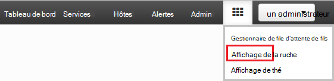
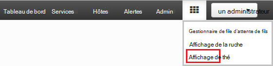
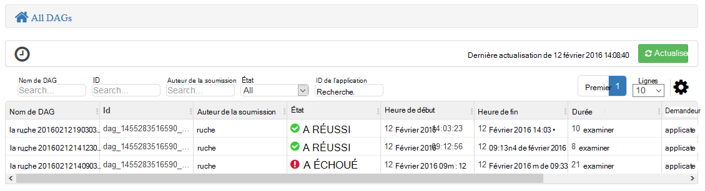
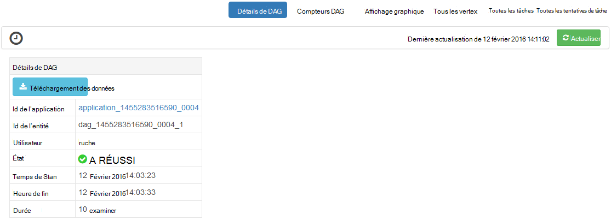
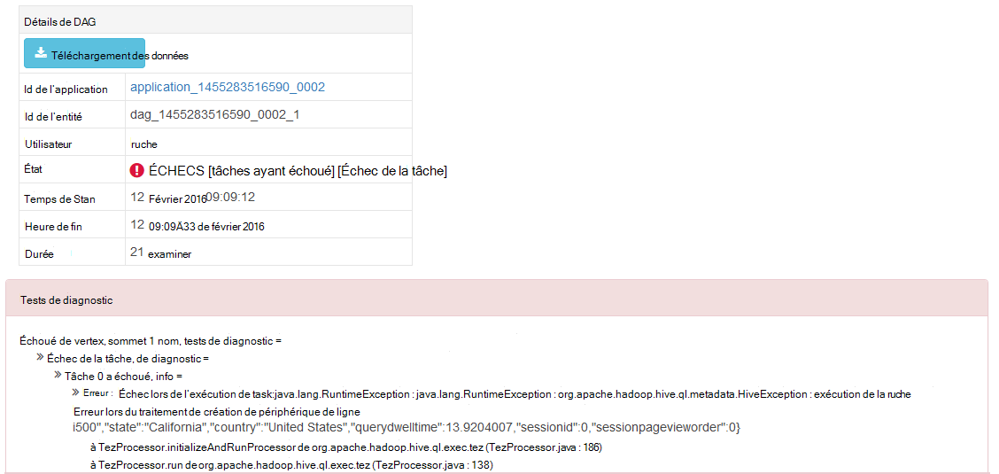
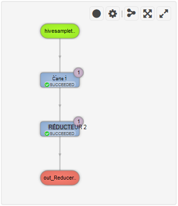
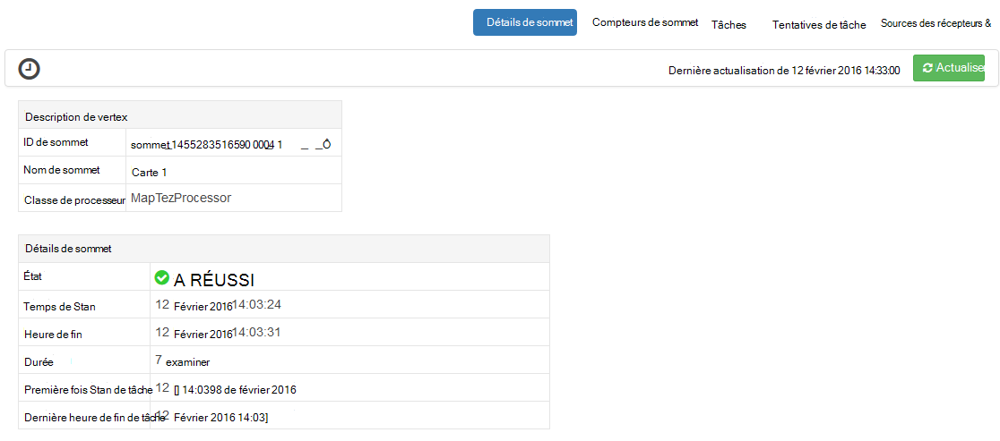
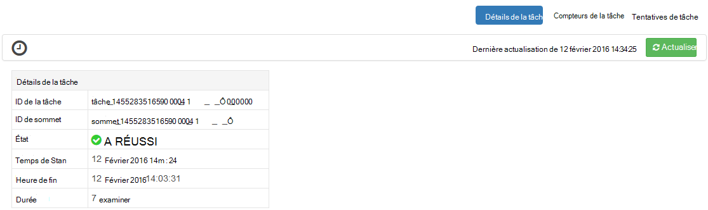

<properties
pageTitle="Utiliser le mode de Tez Ambari avec HDInsight | Azure"
description="Apprenez à utiliser la vue Ambari Tez pour déboguer des travaux Tez sur HDInsight."
services="hdinsight"
documentationCenter=""
authors="Blackmist"
manager="jhubbard"
editor="cgronlun"/>

<tags
ms.service="hdinsight"
ms.devlang="na"
ms.topic="article"
ms.tgt_pltfrm="na"
ms.workload="big-data"
ms.date="10/04/2016"
ms.author="larryfr"/>

# Utilisation des vues pour déboguer des travaux Tez sur HDInsight Ambari

L’interface utilisateur Web de Ambari pour HDInsight contient une vue Tez qui peut servir à comprendre et à déboguer les travaux qui utilisent Tez comme le moteur d’exécution. La vue Tez vous permet de visualiser le projet sous forme de graphique des éléments connectés, affiner chaque élément et extraire des statistiques et des informations de journalisation.

> [AZURE.NOTE] Les informations contenues dans ce document sont spécifiques aux clusters de HDInsight de fonctionnant sous Linux. Pour plus d’informations sur le débogage des travaux Tez à l’aide de HDInsight de basés sur Windows, reportez-vous à la section [utiliser l’interface utilisateur de Tez pour déboguer des travaux Tez sur HDInsight de basées sur Windows](hdinsight-debug-tez-ui.md).

## Conditions préalables

* Un cluster basé sur Linux de HDInsight. Les étapes de création d’un nouveau cluster, reportez-vous à la section [mise en route à l’aide de HDInsight de fonctionnant sous Linux](hdinsight-hadoop-linux-tutorial-get-started.md).

* Un navigateur web moderne qui prend en charge d’HTML5.

## Tez de présentation

Tez est une infrastructure extensible pour traitement de données dans Hadoop qui fournit plus rapidement que MapReduce traditionnel de la transformation. Pour les clusters de HDInsight de basé sur Linux, il est le moteur par défaut de la ruche.

Lorsque le travail est soumis à Tez, il crée un dirigé acycliques graphique (DAG) qui décrit l’ordre d’exécution des actions requises par la tâche. Les actions individuelles sont appelés « sommets » et d’exécuter une partie de l’ensemble du travail. L’exécution réelle du travail décrit par un sommet est appelée une tâche et peut-être être répartie sur plusieurs nœuds dans le cluster.

### Présentation de la vue Tez

La vue Tez fournit des informations sur les processus qui sont en cours d’exécution, ou qui ont précédemment exécutaient à l’aide de Tez. Il vous permet d’afficher le DAG généré par Tez, comment elle est distribuée sur plusieurs clusters, telles que la mémoire utilisée par les tâches et les sommets et les informations d’erreur des compteurs. Il offre des informations utiles dans les scénarios suivants :

* Contrôle la durée d’exécution longue traite, affichage de la progression de la carte et réduire les tâches.

* Analyse des données d’historique des processus réussis ou échouées savoir comment le traitement peut être amélioré ou en raison de cet échec.

## Générer un DAG

La vue Tez contient uniquement des données si un travail qui utilise le moteur Tez est en cours d’exécution ou a été exécuté dans le passé. Les requêtes simples ruche peuvent généralement être résolus sans utiliser Tez, requêtes toutefois plus complexes qui effectuent le filtrage, le regroupement, classement, les jointures, etc. nécessitent généralement Tez.

Utilisez les étapes suivantes pour exécuter une requête de la ruche qui s’exécute à l’aide de Tez.

1. Dans un navigateur web, accédez à https://CLUSTERNAME.azurehdinsight.net, dans laquelle __CLUSTERNAME__ est le nom de votre cluster de HDInsight.

2. Dans le menu en haut de la page, sélectionnez l’icône __affichage__ . Cela ressemble à une série de carrés. Dans la liste déroulante qui s’affiche, sélectionnez __l’affichage de la ruche__. 

    

3. Lorsque vous affichez des charges de la ruche, collez ce qui suit dans l’éditeur de requête, puis cliquez sur __exécuter__.

        select market, state, country from hivesampletable where deviceplatform='Android' group by market, country, state;
    
    Une fois la tâche terminée, vous devriez voir la sortie affichée dans la section des __Résultats du processus de requête__ . Les résultats doivent être similaires à ce qui suit
    
        market  state       country
        en-GB   Hessen      Germany
        en-GB   Kingston    Jamaica
        
4. Sélectionnez l’onglet __journal__ . Vous verrez des informations similaires à ce qui suit :
    
        INFO : Session is already open
        INFO :

        INFO : Status: Running (Executing on YARN cluster with App id application_1454546500517_0063)

    Enregistrer la valeur de __l’id de l’application__ , tel qu’il sera utilisé dans la section suivante.

## Utilisez la vue Tez

1. Dans le menu en haut de la page, sélectionnez l’icône __affichage__ . Dans la liste déroulante qui apparaît, sélectionnez __vue de Tez__.

    

2. Lorsque la vue Tez se charge, vous verrez une liste de DAGs qui sont en cours d’exécution, ou qui ont été exécutés sur le cluster. L’affichage par défaut inclut Dag Name, Id, expéditeur, statut, l’heure de début, heure de fin, durée, ID de l’Application et file d’attente. Des colonnes peuvent être ajoutées à l’aide de l’icône engrenage à droite de la page.

    

3. Si vous avez une seule entrée, il est de la requête que vous avez exécutés dans la section précédente. Si vous avez plusieurs entrées, vous pouvez effectuer une recherche en entrant l’ID d’application dans le champ __ID de l’Application__ et appuyez sur ENTRÉE.

4. Sélectionnez le __Nom de Dag__. Informations sur le DAG, ainsi que l’option de téléchargement d’un fichier zip de fichiers JSON qui contiennent des informations sur le DAG s’affiche.

    

5. Au-dessus des __Détails de DAG__ sont plusieurs liens qui peuvent être utilisés pour afficher des informations sur le DAG.

    * __DAG compteurs__ affiche les compteurs pour cet DAG.
    
    * __Représentation graphique__ affiche une représentation graphique de cette DAG.
    
    * __Tous les vertex__ affiche une liste des sommets dans ce DAG.
    
    * __Toutes les tâches__ affiche la liste des tâches pour tous les sommets dans cet DAG.
    
    * __Tous les TaskAttempts__ affiche des informations sur les tentatives d’exécuter des tâches pour cet DAG.
    
    > [AZURE.NOTE] Si vous faites défiler l’affichage de la colonne des sommets, des tâches et des TaskAttempts, notez qu’il existe des liens pour afficher les __compteurs__ et __permet d’afficher ou de télécharger les journaux__ pour chaque ligne.

    S’il y a une défaillance avec le travail, les détails de DAG affichera un état d’échec, avec des liens vers des informations sur la tâche qui a échoué. Les informations de diagnostic seront affiche sous les détails DAG.
    
    

7. Sélectionnez la __vue graphique__. Cela affiche une représentation graphique de la DAG. Vous pouvez placer la souris sur chaque sommet de l’affichage pour afficher les informations le concernant.

    

8. En cliquant sur un sommet chargera le __Sommet détails__ concernant cet élément. Cliquez sur le sommet __1 de la carte__ pour afficher les détails de cet élément.

    

9. Notez que vous devez maintenant des liens en haut de la page qui sont liées aux sommets et aux tâches.

    > [AZURE.NOTE] Vous pouvez également arrivent à cette page en revenir aux __Détails de DAG__, sélectionnant __Détails du sommet__, puis en sélectionnant le sommet __1 de la carte__ .

    * __Sommet des compteurs__ affiche des informations de compteur pour ce vertex.
    
    * __Tâches__ affiche les tâches pour ce vertex.
    
    * __Tentatives de tâche__ affiche des informations sur les tentatives d’exécution de tâches pour ce vertex.
    
    * __Sources & récepteurs__ affiche les sources de données et les récepteurs pour ce vertex.

    > [AZURE.NOTE] Comme avec le menu précédent, vous pouvez faire défiler l’affichage pour les tâches, les tentatives de tâche, Sources et Sinks__ afficher des liens vers d’autres informations pour chaque élément de la colonne.

10. Sélectionner __des tâches__, puis sélectionnez l’élément nommé __00_000000__. Ceci affichera les __Détails de la tâche__ pour cette tâche. À partir de cet écran, vous pouvez afficher les __Compteurs de la tâche__ et les __Tentatives de tâche__.

    

## Étapes suivantes

Maintenant que vous avez appris comment utiliser l’affichage Tez, plus d’informations sur [La ruche à l’aide de HDInsight](hdinsight-use-hive.md).

Pour obtenir des informations techniques plus détaillées sur Tez, consultez la [page Tez à Hortonworks](http://hortonworks.com/hadoop/tez/).

Pour plus d’informations sur l’utilisation de Ambari avec HDInsight, reportez-vous à la section [HDInsight de gérer les clusters à l’aide de l’interface utilisateur Web de Ambari](hdinsight-hadoop-manage-ambari.md)
