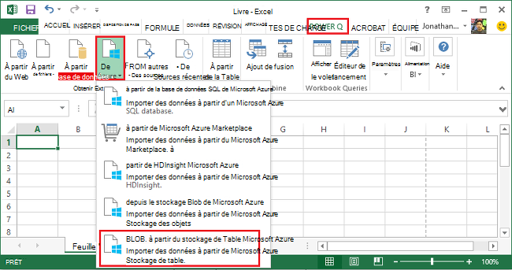
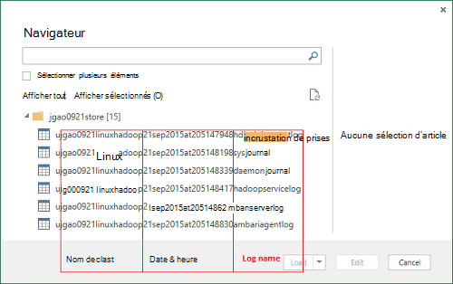
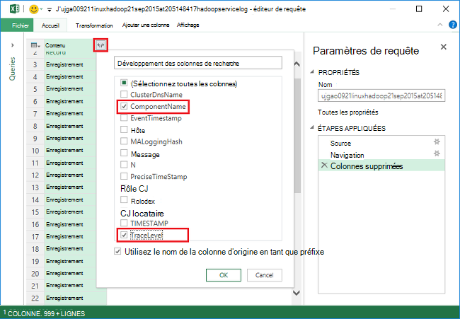
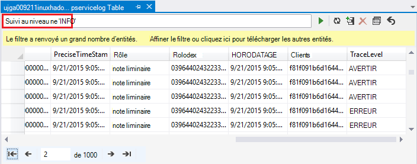
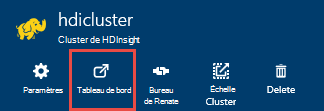
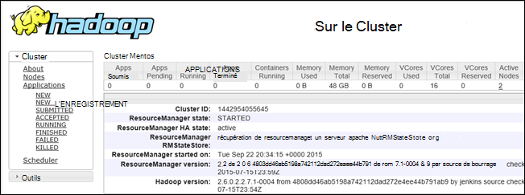

<properties
    pageTitle="Déboguer Hadoop dans HDInsight : afficher les journaux et interpréter des messages d’erreur | Microsoft Azure"
    description="Obtenir des informations sur les messages d’erreur que peut s’afficher lors de l’administration des HDInsight à l’aide de PowerShell et les étapes à que suivre pour récupérer."
    services="hdinsight"
    tags="azure-portal"
    editor="cgronlun"
    manager="jhubbard"
    authors="mumian"
    documentationCenter=""/>

<tags
    ms.service="hdinsight"
    ms.workload="big-data"
    ms.tgt_pltfrm="na"
    ms.devlang="na"
    ms.topic="article"
    ms.date="09/02/2016"
    ms.author="jgao"/>

# Analyser les journaux de HDInsight

Chaque cluster Hadoop dans Azure HDInsight a un compte de stockage Azure utilisé comme système de fichiers par défaut. Le compte de stockage est désigné comme le compte de stockage par défaut. Cluster utilise le stockage Azure Table et le stockage des objets Blob sur le compte de stockage par défaut pour stocker ses journaux.  Pour trouver le compte de stockage par défaut pour votre cluster, voir [Hadoop de gérer des clusters dans HDInsight](hdinsight-administer-use-management-portal.md#find-the-default-storage-account). Les journaux conservent dans le compte de stockage, même après la suppression de cluster.

##Journaux écrites dans les Tables Azure

Les journaux écrites dans les Tables Azure fournissent un niveau de compréhension de ce qui se passe avec un cluster de HDInsight.

Lorsque vous créez un cluster de HDInsight, 6 les tables sont automatiquement créées pour les clusters basés sur Linux dans le stockage de Table par défaut :

- hdinsightagentlog
- journal système
- démongestionnaire
- hadoopservicelog
- ambariserverlog
- ambariagentlog

3 tables sont créées pour les clusters basés sur Windows :

- Setuplog : journal des événements ou des exceptions rencontrées dans la mise en service/Configuration des clusters de HDInsight.
- hadoopinstalllog : le journal des événements ou des exceptions rencontrées lors de l’installation d’Hadoop sur le cluster. Cette table peut être utile dans le débogage des problèmes liés aux clusters créés avec des paramètres personnalisés.
- hadoopservicelog : le journal des événements ou des exceptions enregistrées par tous les services d’Hadoop. Cette table peut être utile dans le débogage des problèmes liés aux échecs de tâches sur des clusters de HDInsight.

Les noms de fichier de tableau sont **u<ClusterName>DDMonYYYYatHHMMSSsss<TableName>**.

Ces tables contient les champs suivants :

- ClusterDnsName
- NomComposant
- EventTimestamp
- Hôte
- MALoggingHash
- Message
- N
- PreciseTimeStamp
- Rôle
- RowIndex
- Clients
- HORODATAGE
- TraceLevel

### Outils permettant d’accéder aux journaux

Il existe de nombreux outils permettent d’accéder aux données de ces tables :

-  Visual Studio
-  Explorateur de stockage Azure
-  Requête de puissance pour Excel

#### Utiliser des requêtes de puissance pour Excel

Requête d’alimentation peut être installé à partir de [www.microsoft.com/en-us/download/details.aspx?id=39379]( http://www.microsoft.com/en-us/download/details.aspx?id=39379). Consultez la page de téléchargement de la configuration système requise

**Requête d’alimentation permet d’ouvrir et d’analyser le journal du service**

1. Ouvrez **Microsoft Excel**.
2. Dans le menu **Requête d’alimentation** , cliquez sur **à partir d’Azure**, puis cliquez sur **à partir de Microsoft Azure Table stockage**.
 
    
3. Entrez le nom de compte de stockage. Ce peut être soit le nom de domaine complet ou le nom court.
4. Entrez la clé de compte de stockage. Une liste de tables s’affiche :

    
5. Avec le bouton droit de la table hadoopservicelog dans le volet de **navigation** et sélectionnez **Modifier**. 4 colonnes s’affiche. Le cas échéant, supprimer les colonnes de **Clé de Partition**, la **Clé de la ligne**et **Timestamp** en les sélectionnant, puis en cliquant sur **Supprimer des colonnes** à partir des options dans le ruban.
6. Cliquez sur l’icône de développement sur la colonne contenue de choisir les colonnes que vous souhaitez importer dans la feuille de calcul Excel. Pour cette démonstration, j’ai choisi TraceLevel et NomComposant : il peut me donner quelques informations de base sur lequel les composants avaient des problèmes.

    
7. Cliquez sur **OK** pour importer les données.
8. Sélectionnez les colonnes **NomComposant** **TraceLevel**et rôle, puis cliquez sur **Grouper par** contrôle dans le ruban.
9. Cliquez sur **OK** dans la boîte de dialogue
10. Cliquez sur** appliquer et fermer**.
 
Vous pouvez maintenant utiliser Excel pour filtrer et trier comme nécessaire. Bien évidemment, vous souhaiterez inclure d’autres colonnes (par exemple, Message) pour approfondir les problèmes lorsqu’ils se produisent, mais sélectionner et à grouper les colonnes décrites ci-dessus fournit une bonne image de ce qui se passe avec les services d’Hadoop. La même idée peut être appliquée aux tables setuplog et hadoopinstalllog.

#### Utilisez Visual Studio

**Utilisation de Visual Studio**

1. Ouvrez Visual Studio.
2. Dans le menu **affichage** , cliquez sur **Explorateur de nuage**. Ou cliquez sur **CTRL +\, CTRL + X**.
3. **Cloud Explorer**, sélectionnez **Les Types de ressource**.  L’autre option disponible est des **Groupes de ressources**.
4. Développez les **Comptes de stockage**, le compte de stockage par défaut pour votre cluster, puis **Tables**.
5. Double-cliquez sur **hadoopservicelog**.
6. Ajouter un filtre. Par exemple :
    
        TraceLevel eq 'ERROR'

    

    Pour plus d’informations sur la construction des filtres, consultez [Construire des chaînes de filtrage pour le Concepteur de tables](../vs-azure-tools-table-designer-construct-filter-strings.md).
 
##Écrit dans le stockage Blob Azure des journaux

[Les journaux écrites dans les Tables Azure](#log-written-to-azure-tables) fournissent un niveau de compréhension de ce qui se passe avec un cluster de HDInsight. Toutefois, ces tables ne fournissent pas de journaux au niveau des tâches, ce qui peuvent être utiles de forage en problèmes lorsqu’ils se produisent. Pour fournir ce niveau suivant de détail, les clusters HDInsight sont configurés pour écrire les journaux des tâches à votre compte de stockage des objets Blob pour n’importe quelle tâche qui est soumis par l’intermédiaire de Templeton. En pratique, cela signifie que les tâches soumises à l’aide des applets de commande PowerShell de Microsoft Azure ou les API de soumission de projet .NET, pas les tâches soumises via RDP/ligne de commande l’accès au cluster. 

Pour afficher les journaux, consultez [application de fils d’accès ouvre une session sur HDInsight de fonctionnant sous Linux](hdinsight-hadoop-access-yarn-app-logs-linux.md).

Pour plus d’informations sur les journaux d’application, consultez [Gestion des journaux d’utilisateur Simplifying et accès de fils](http://hortonworks.com/blog/simplifying-user-logs-management-and-access-in-yarn/).
 
 
## Afficher les journaux de santé et travail du cluster

###Accéder à l’interface utilisateur d’Hadoop

À partir du portail Azure, cliquez sur un nom de cluster HDInsight pour ouvrir la carte du cluster. À partir de la blade de cluster, cliquez sur **tableau de bord**.

Lorsque vous y êtes invité, entrez les informations d’identification administrateur de cluster. Dans la Console de requête qui s’ouvre, cliquez sur **L’interface utilisateur d’Hadoop**.

###Accéder à l’interface utilisateur de fils

À partir du portail Azure, cliquez sur un nom de cluster HDInsight pour ouvrir la carte du cluster. À partir de la blade de cluster, cliquez sur **tableau de bord**. Lorsque vous y êtes invité, entrez les informations d’identification administrateur de cluster. Dans la Console de requête qui s’ouvre, cliquez sur **L’interface utilisateur de fils**.

Vous pouvez utiliser l’interface utilisateur de fils pour effectuer les opérations suivantes :

* **Obtenir l’état du cluster**. Dans le volet gauche, développez le **Cluster**et cliquez sur à **propos**. Détails de l’état comme total alloué de la mémoire, de noyaux utilisés, état du Gestionnaire de ressources de cluster du cluster de cette présent, version etc. du cluster.

    

* **Obtenir l’état du nœud**. Dans le volet gauche, développez le **Cluster**, puis cliquez sur **nœuds**. Cette liste répertorie tous les nœuds du cluster, l’adresse HTTP de chaque nœud, les ressources allouées à chaque nœud, l’etc..

* **Surveiller le statut de tâche**. Dans le volet gauche, développez le **Cluster**, puis cliquez sur **Applications** pour répertorier tous les travaux dans le cluster. Si vous souhaitez examiner les tâches dans un état spécifique (par exemple, nouveau, envoyé, en cours d’exécution, etc.), cliquez sur le lien approprié dans les **Applications**. Vous pouvez encore cliquer sur le nom du travail pour en savoir plus sur la tâche de ce type, y compris la sortie et des logs.

###Accéder à l’interface utilisateur HBase

À partir du portail Azure, cliquez sur un nom de cluster HDInsight HBase pour ouvrir la carte du cluster. À partir de la blade de cluster, cliquez sur **tableau de bord**. Lorsque vous y êtes invité, entrez les informations d’identification administrateur de cluster. Dans la Console de requête qui s’ouvre, cliquez sur **L’interface utilisateur de HBase**.

## Codes d’erreur HDInsight

Les messages d’erreur détaillés dans cette section sont fournies pour aider les utilisateurs d’Hadoop dans Azure HDInsight des conditions d’erreur possibles qu’ils peuvent rencontrer lors de l’administration du service à l’aide de PowerShell d’Azure et émettre un avis sur les mesures qui peuvent être pris pour récupérer de l’erreur.

Certains de ces messages d’erreur peuvent également se produire dans le portail Azure lorsqu’il est utilisé pour gérer les clusters de HDInsight. Autres messages d’erreur que vous pouvez rencontrer, mais il existe moins précis en raison de contraintes sur les actions correctives possibles dans ce contexte. Autres messages d’erreur sont fournies dans les contextes où l’atténuation est évidente. 

### AtleastOneSqlMetastoreMustBeProvided
- **Description**: Veuillez fournir les détails de base de données Azure SQL au moins un composant pour utiliser les paramètres personnalisés de la ruche et Oozie de metastores.
- **Réduction des risques**: l’utilisateur doit fournir un metastore de SQL Azure valide et renouvelez la demande.  

### AzureRegionNotSupported
- **Description**: pas pu créer de cluster dans la région *nameOfYourRegion*. Utilisez un HDInsight une région valide et réessayer la demande.
- **Réduction des risques**: client doit créer la région du cluster qui prend en charge les : Asie du Sud-est, Europe de l’ouest, Europe du Nord, États-Unis est ou ouest des États-Unis.  

### ClusterContainerRecordNotFound
- **Description**: le serveur n’a pas pu trouver l’enregistrement de cluster demandé.  
- **Réduction des risques**: recommencez l’opération.

### ClusterDnsNameInvalidReservedWord
- **Description**: Cluster DNS nom *yourDnsName* n’est pas valide. Vérifiez que nom commence et se termine par alphanumérique et ne peut contenir '-' un caractère spécial  
- **Atténuation**: Assurez-vous que vous avez utilisé un nom DNS valide pour votre cluster qui commence et se termine par alphanumériques et ne contient aucun spéciale des caractères autres que le tiret «- » et recommencez l’opération.

### ClusterNameUnavailable
- **Description**: nom de Cluster *yourClusterName* n’est pas disponible. Veuillez choisir un autre nom.  
- **Réduction des risques**: l’utilisateur doit spécifier un nom_cluster est unique et n’existe pas et réessayez. Si l’utilisateur utilise le portail, l’interface utilisateur les informera si un nom de cluster est déjà utilisé dans la procédure de création.

### ClusterPasswordInvalid
- **Description**: mot de passe de Cluster n’est pas valide. Mot de passe doit comporter au moins 10 caractères et doit contenir au moins un chiffre, lettre majuscule, minuscule et un caractère spécial sans espaces et ne doit pas contenir le nom d’utilisateur en tant que partie de celui-ci.  
- **Réduction des risques**: fournir un mot de passe de cluster valide et recommencez l’opération.

### ClusterUserNameInvalid
- **Description**: nom d’utilisateur du Cluster n’est pas valide. Vérifiez que le nom d’utilisateur ne contient pas de caractères spéciaux ni espaces.  
- **Réduction des risques**: fournir un nom d’utilisateur de cluster valide et recommencez l’opération.

### ClusterUserNameInvalidReservedWord
- **Description**: Cluster DNS nom *yourDnsClusterName* n’est pas valide. Vérifiez que nom commence et se termine par alphanumérique et ne peut contenir '-' un caractère spécial  
- **Réduction des risques**: fournir un nom d’utilisateur de cluster DNS valide et recommencez l’opération.

### ContainerNameMisMatchWithDnsName
- **Description**: nom de conteneur dans l' URI *yourcontainerURI* et DNS nom *yourDnsName* dans le corps de la requête doivent être les mêmes.  
- **Réduction des risques**: s’assurer que le conteneur de votre nom et votre nom de DNS sont les mêmes et recommencez l’opération.

### DataNodeDefinitionNotFound
- **Description**: configuration de cluster non valide. Impossible de trouver les définitions de nœud de données de taille du nœud.  
- **Réduction des risques**: recommencez l’opération.

### DeploymentDeletionFailure
- **Description**: Échec de la suppression du déploiement pour le Cluster  
- **Réduction des risques**: nouvelle tentative de l’opération de suppression.

### DnsMappingNotFound
- **Description**: erreur de configuration de Service. Informations de mappage de DNS requis introuvables.  
- **Réduction des risques**: supprimer le cluster et créez un nouveau cluster.

### DuplicateClusterContainerRequest
- **Description**: dupliquer la tentative de création de conteneur de cluster. Enregistrement existe pour *nameOfYourContainer* mais Etags ne correspondent pas.
- **Réduction des risques**: fournissez un nom unique pour le conteneur et recommencez l’opération de création.

### DuplicateClusterInHostedService
- **Description**: le service hébergé *nameOfYourHostedService* contient déjà un cluster. Un service hébergé ne peut pas contenir plusieurs clusters  
- **Réduction des risques**: l’hôte du cluster dans un autre service hébergé.

### FailureToUpdateDeploymentStatus
- **Description**: le serveur n’a pas pu mettre à jour l’état du déploiement de cluster.  
- **Réduction des risques**: recommencez l’opération. Si cela se produit plusieurs fois, contactez CSS.

### HdiRestoreClusterAltered
- **Description**: Cluster *yourClusterName* a été supprimé dans le cadre de la maintenance. Recréez le cluster.
- **Réduction des risques**: recréer le cluster.

### HeadNodeConfigNotFound
- **Description**: configuration de cluster non valide. Configuration du nœud de tête requis introuvable dans les tailles de nœud.
- **Réduction des risques**: recommencez l’opération.

### HostedServiceCreationFailure
- **Description**: Impossible de créer le service hébergé, *nameOfYourHostedService*. Réessayez la demande.  
- **Réduction des risques**: renouvelez la demande.

### HostedServiceHasProductionDeployment
- **Description**: le Service hébergé *nameOfYourHostedService* dispose déjà d’un déploiement de production. Un service hébergé ne peut pas contenir plusieurs déploiements de production. Renouvelez la demande avec un nom de cluster différent.
- **Atténuation**: utilisez un nom de cluster différents et renouvelez la demande.

### HostedServiceNotFound
- **Description**: hébergé le Service *nameOfYourHostedService* pour le cluster n’a pas pu être trouvé.  
- **Atténuation**: si le cluster est dans un état d’erreur, supprimez-le et essayez de nouveau.

### HostedServiceWithNoDeployment
- **Description**: le Service hébergé *nameOfYourHostedService* n’a aucun déploiement associé.  
- **Atténuation**: si le cluster est dans un état d’erreur, supprimez-le et essayez de nouveau.

### InsufficientResourcesCores
- **Description**: le SubscriptionId *yourSubscriptionId* n’a pas de noyaux de gauche pour créer le cluster *yourClusterName*. Requis : *resourcesRequired*, disponible : *resourcesAvailable*.  
- **Réduction des risques**: Libérez des ressources dans votre abonnement ou augmenter les ressources disponibles pour l’abonnement et essayez à nouveau de créer le cluster.

### InsufficientResourcesHostedServices
- **Description**: ID d’abonnement *yourSubscriptionId* n’a pas de quota pour un nouveau HostedService créer le cluster *yourClusterName*.  
- **Réduction des risques**: Libérez des ressources dans votre abonnement ou augmenter les ressources disponibles pour l’abonnement et essayez à nouveau de créer le cluster.

### InternalErrorRetryRequest
- **Description**: le serveur a rencontré une erreur interne. Réessayez la demande.  
- **Réduction des risques**: renouvelez la demande.

### InvalidAzureStorageLocation
- **Description**: emplacement de stockage Azure *dataRegionName* n’est pas un emplacement valide. Assurez-vous que la zone est correcte et réessayez la demande.
- **Réduction des risques**: sélectionner un emplacement de stockage qui prend en charge les HDInsight, vérifiez que votre cluster est situé et recommencez l’opération.

### InvalidNodeSizeForDataNode
- **Description**: taille de machine virtuelle non valide pour les nœuds de données. Taille de « Grande VM » uniquement est pris en charge pour tous les nœuds de données.  
- **Réduction des risques**: spécifiez la taille de nœud pris en charge pour le nœud de données et réessayez l’opération.

### InvalidNodeSizeForHeadNode
- **Description**: taille de machine virtuelle non valide pour le nœud de tête. Uniquement les taille 'VM extra-large XXL' sont pris en charge pour le nœud de tête.  
- **Réduction des risques**: spécifiez la taille de nœud pris en charge pour le nœud de tête et de réessayer l’opération

### InvalidRightsForDeploymentDeletion
- **Description**: ID d’abonnement, *yourSubscriptionId* en cours d’utilisation n’a pas les autorisations suffisantes pour exécuter l’opération de suppression de cluster *yourClusterName*.  
- **Atténuation**: si le cluster est dans un état d’erreur, déplacer et essayez de nouveau.  

### InvalidStorageAccountBlobContainerName
- **Description**: stockage externe compte blob conteneur nom *yourContainerName* n’est pas valide. Assurez-vous que le nom commence par une lettre et contient uniquement des lettres minuscules, des chiffres et des tirets.  
- **Réduction des risques**: spécifier un nom de conteneur de stockage valide compte blob et recommencez l’opération.

### InvalidStorageAccountConfigurationSecretKey
- **Description**: Configuration compte de stockage externe *yourStorageAccountName* est nécessaire pour que les détails de la clé secrètes à définir.  
- **Réduction des risques**: spécifiez une clé secrète valide pour le compte de stockage et recommencez l’opération.

### InvalidVersionHeaderFormat
- **Description**: en-tête de Version *yourVersionHeader* n’est pas dans un format valide d’aaaa-mm-jj.  
- **Réduction des risques**: spécifier un format valide pour l’en-tête de version et renouvelez la demande.

### MoreThanOneHeadNode
- **Description**: configuration de cluster non valide. A trouvé plus d’une configuration de nœud principal.  
- **Réduction des risques**: modifier la configuration de ce nœud de tête un onloy est spécifié.

### OperationTimedOutRetryRequest
- **Description**: l’opération a échoué dans le délai autorisé ou le nombre maximal de nouvelles tentatives possibles. Réessayez la demande.  
- **Réduction des risques**: renouvelez la demande.

### ParameterNullOrEmpty
- **Description**: paramètre *yourParameterName* ne peut pas être null ou vide.  
- **Réduction des risques**: spécifiez une valeur valide pour le paramètre.

### PreClusterCreationValidationFailure
- **Description**: une ou plusieurs des entrées de demande de création de cluster ne sont pas valide. Assurez-vous que les valeurs d’entrée sont corrects et réessayez la demande.  
- **Réduction des risques**: Assurez-vous que les valeurs d’entrée sont corrects et réessayez la demande.

### RegionCapabilityNotAvailable
- **Description**: capacité de région non disponible pour la région *yourRegionName* et l' ID d’abonnement *yourSubscriptionId*.  
- **Réduction des risques**: permet de spécifier une région qui prend en charge les clusters HDInsight. Les régions publiquement pris en charge sont : Asie du Sud-est, Europe de l’ouest, Europe du Nord, États-Unis est ou ouest des États-Unis.

### StorageAccountNotColocated
- **Description**: compte de stockage *yourStorageAccountName* se trouve dans la région *currentRegionName*. Il doit être identique à celle de région de cluster *yourClusterRegionName*.  
- **Réduction des risques**: spécifiez un compte de stockage dans la même région qui participe à votre cluster ou si vos données sont déjà dans le compte de stockage, créez un nouveau cluster dans la même région que le compte de stockage existant. Si vous utilisez le portail, l’interface utilisateur de ce problème informe à l’avance.

### SubscriptionIdNotActive
- **Description**: étant donné les ID d’abonnement *yourSubscriptionId* n’est pas actif.  
- **Réduction des risques**: réactiver votre abonnement ou obtenir un abonnement valide.

### SubscriptionIdNotFound
- **Description**: ID d’abonnement *yourSubscriptionId* n’a pas pu être trouvé.  
- **Réduction des risques**: Vérifiez que votre ID d’abonnement est valide et recommencez l’opération.

### UnableToResolveDNS
- **Description**: Impossible de résoudre le DNS *yourDnsUrl*. Vérifiez que l’URL qualifiée complète pour le point de terminaison blob est fourni.  
- **Réduction des risques**: indiquez une URL de blob valide. L’URL doit être entièrement valide, y compris commençant par *http://* et se terminant par *.com*.

### UnableToVerifyLocationOfResource
- **Description**: Impossible de vérifier l’emplacement de la ressource *yourDnsUrl*. Vérifiez que l’URL qualifiée complète pour le point de terminaison blob est fourni.  
- **Réduction des risques**: indiquez une URL de blob valide. L’URL doit être entièrement valide, y compris commençant par *http://* et se terminant par *.com*.

### VersionCapabilityNotAvailable
- **Description**: fonctionnalité de la Version non disponible pour la version *specifiedVersion* et l' ID d’abonnement *yourSubscriptionId*.  
- **Réduction des risques**: choisissez une version qui n’est disponible et recommencez l’opération.

### VersionNotSupported
- **Description**: Version d' *specifiedVersion* non pris en charge.
- **Réduction des risques**: choisissez une version prise en charge et recommencez l’opération.

### VersionNotSupportedInRegion
- **Description**: Version *specifiedVersion* n’est pas disponible dans la région Azure *specifiedRegion*.  
- **Réduction des risques**: choisissez une version prise en charge dans la région spécifiée et recommencez l’opération.

### WasbAccountConfigNotFound
- **Description**: configuration de cluster non valide. Configuration du compte WASB requise introuvable dans des comptes externes.  
- **Réduction des risques**: Vérifiez que le compte existe et est correctement spécifié dans la configuration et recommencez l’opération.

## Étapes suivantes

- [Utilisation des vues pour déboguer des travaux Tez sur HDInsight Ambari](hdinsight-debug-ambari-tez-view.md)
- [Activer des dumps de tas pour les services d’Hadoop sur HDInsight de basé sur Linux](hdinsight-hadoop-collect-debug-heap-dump-linux.md)
- [Gérer les clusters HDInsight à l’aide de l’interface utilisateur Web de Ambari](hdinsight-hadoop-manage-ambari.md)
