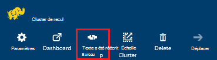
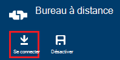
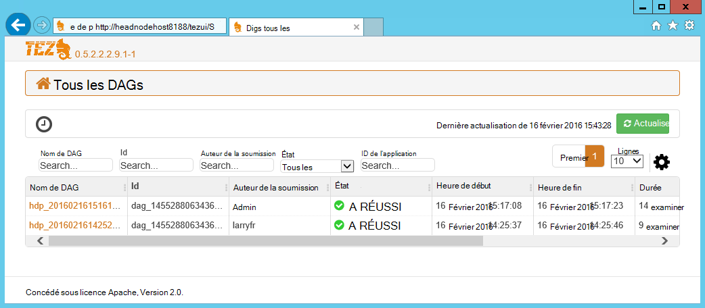
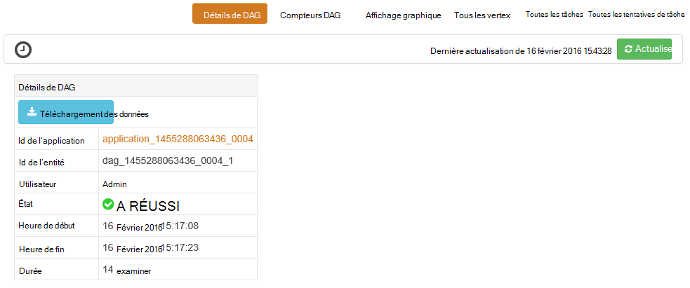
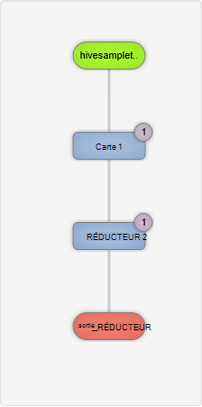
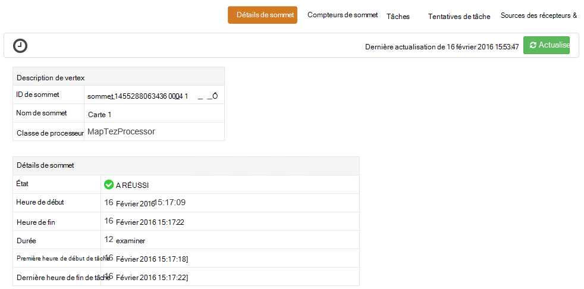
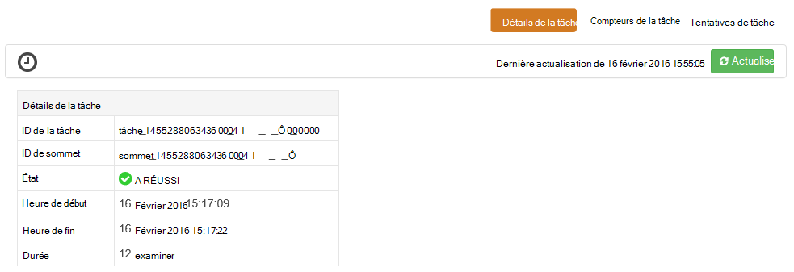

<properties
pageTitle="Utilisez l’interface utilisateur de Tez avec HDInsight de basés sur Windows | Azure"
description="Apprenez à utiliser l’UI Tez pour déboguer des travaux Tez sur basé sur Windows les HDInsight HDInsight."
services="hdinsight"
documentationCenter=""
authors="Blackmist"
manager="jhubbard"
editor="cgronlun"/>

<tags
ms.service="hdinsight"
ms.devlang="na"
ms.topic="article"
ms.tgt_pltfrm="na"
ms.workload="big-data"
ms.date="10/04/2016"
ms.author="larryfr"/>

# L’UI Tez permet de déboguer les travaux Tez sur HDInsight de basées sur Windows

L’UI Tez est une page web qui peut servir à comprendre et à déboguer les travaux qui utilisent Tez comme le moteur d’exécution sur les clusters basés sur Windows de HDInsight. L’UI Tez vous permet de visualiser le projet sous forme de graphique des éléments connectés, affiner chaque élément et extraire des statistiques et des informations de journalisation.

> [AZURE.NOTE] Les informations contenues dans ce document sont spécifiques aux clusters de HDInsight de basées sur Windows. Pour plus d’informations sur l’affichage et le débogage Tez sur HDInsight de basé sur Linux, consultez [Utilisation des affichages de Ambari pour déboguer des travaux Tez sur HDInsight](hdinsight-debug-ambari-tez-view.md).

## Conditions préalables

* Un cluster d’HDInsight de basées sur Windows. Les étapes de création d’un nouveau cluster, reportez-vous à la section [mise en route à l’aide de HDInsight de basées sur Windows](hdinsight-hadoop-tutorial-get-started-windows.md).

    > [AZURE.IMPORTANT] L’UI Tez est disponible uniquement sur les clusters basés sur Windows de HDInsight créés après le 8 février 2016.

* Un client fonctionnant sous Windows de bureau à distance.

## Tez de présentation

Tez est une infrastructure extensible pour traitement de données dans Hadoop qui fournit plus rapidement que MapReduce traditionnel de la transformation. Pour les clusters de HDInsight de basés sur Windows, il s’agit d’un moteur facultatif que vous pouvez activer pour la ruche à l’aide de la commande suivante en tant que partie de votre requête de ruche :

    set hive.execution.engine=tez;

Lorsque le travail est soumis à Tez, il crée un dirigé acycliques graphique (DAG) qui décrit l’ordre d’exécution des actions requises par la tâche. Les actions individuelles sont appelés « sommets » et d’exécuter une partie de l’ensemble du travail. L’exécution réelle du travail décrit par un sommet est appelée une tâche et peut-être être répartie sur plusieurs nœuds dans le cluster.

### Présentation de l’interface utilisateur de Tez

L’UI Tez est qu'une page web fournit des informations sur les processus qui sont en cours d’exécution, ou qui ont précédemment exécutaient à l’aide de Tez. Il vous permet d’afficher le DAG généré par Tez, comment elle est distribuée sur plusieurs clusters, telles que la mémoire utilisée par les tâches et les sommets et les informations d’erreur des compteurs. Il offre des informations utiles dans les scénarios suivants :

* Contrôle la durée d’exécution longue traite, affichage de la progression de la carte et réduire les tâches.

* Analyse des données d’historique des processus réussis ou échouées savoir comment le traitement peut être amélioré ou en raison de cet échec.

## Générer un DAG

L’UI Tez contient uniquement des données si une tâche qui utilise le moteur Tez est en cours d’exécution ou a été exécuté dans le passé. Les requêtes simples ruche peuvent généralement être résolus sans utiliser Tez, requêtes toutefois plus complexes qui effectuent le filtrage, le regroupement, classement, les jointures, etc. nécessitent généralement Tez.

Utilisez les étapes suivantes pour exécuter une requête de la ruche qui s’exécute à l’aide de Tez.

1. Dans un navigateur web, accédez à https://CLUSTERNAME.azurehdinsight.net, dans laquelle __CLUSTERNAME__ est le nom de votre cluster de HDInsight.

2. Dans le menu en haut de la page, sélectionnez l' __Éditeur de la ruche__. Cela affiche une page avec l’exemple de requête suivant.

        Select * from hivesampletable

    Effacer la requête d’exemple et le remplacer par le texte suivant.

        set hive.execution.engine=tez;
        select market, state, country from hivesampletable where deviceplatform='Android' group by market, country, state;

3. Sélectionnez le bouton __Envoyer__ . La section de la __Session de travail__ en bas de la page affiche l’état de la requête. Une fois que l’état passe à __terminé__, sélectionnez le lien __View Details__ pour afficher les résultats. La __Sortie de la tâche__ doit être semblable au suivant :
        
        en-GB   Hessen      Germany
        en-GB   Kingston    Jamaica
        en-GB   Nairobi Area    Kenya

## Utilisez l’interface utilisateur de Tez

> [AZURE.NOTE] L’UI Tez est uniquement disponible à partir du bureau, les tête de nœuds de cluster, vous devez utiliser le Bureau à distance pour se connecter aux nœuds de tête.

1. À partir du [portail Azure](https://portal.azure.com), sélectionnez votre cluster HDInsight. À partir du haut de la lame de HDInsight, sélectionnez l’icône de __Bureau à distance__ . Ceci affichera la lame de bureau à distance

    

2. À partir de la blade de bureau à distance, sélectionnez __se connecter__ pour vous connecter au nœud principal du cluster. Lorsque vous y êtes invité, utilisez le nom d’utilisateur de bureau à distance de cluster et d’un mot de passe pour authentifier la connexion.

    

    > [AZURE.NOTE] Si vous n’avez pas activé les connexion Bureau à distance, fournir un nom d’utilisateur, mot de passe et date d’expiration, puis sélectionnez __Activer__ pour activer le Bureau à distance. Une fois qu’elle a été activée, utilisez les étapes précédentes pour se connecter.

3. Une fois connecté, ouvrez Internet Explorer sur le Bureau à distance, sélectionnez l’icône de l’engin dans le coin supérieur droit du navigateur et puis sélectionnez les __Paramètres d’affichage de compatibilité__.

4. À partir du bas de __Paramètres d’affichage de compatibilité__, désactivez la case à cocher pour __les sites intranet affichage en mode de compatibilité__ et les __listes de compatibilité de Microsoft d’utiliser__et puis sélectionnez __Fermer__.

5. Dans Internet Explorer, accédez à http://headnodehost:8188/tezui / #/. Cela permet d’afficher l’UI Tez

    

    Lors du chargement de l’UI Tez, vous verrez une liste de DAGs qui sont en cours d’exécution, ou qui ont été exécutés sur le cluster. L’affichage par défaut inclut Dag Name, Id, expéditeur, statut, l’heure de début, heure de fin, durée, ID de l’Application et file d’attente. Des colonnes peuvent être ajoutées à l’aide de l’icône engrenage à droite de la page.

    Si vous avez une seule entrée, il est de la requête que vous avez exécutés dans la section précédente. Si vous avez plusieurs entrées, vous pouvez effectuer une recherche en entrant des critères de recherche dans les champs situés au-dessus des DAGs, puis appuyez sur __entrée__.

4. Sélectionnez le __Nom de Dag__ pour l’entrée DAG plus récente. Informations sur le DAG, ainsi que l’option de téléchargement d’un fichier zip de fichiers JSON qui contiennent des informations sur le DAG s’affiche.

    

5. Au-dessus des __Détails de DAG__ sont plusieurs liens qui peuvent être utilisés pour afficher des informations sur le DAG.

    * __DAG compteurs__ affiche les compteurs pour cet DAG.
    
    * __Représentation graphique__ affiche une représentation graphique de cette DAG.
    
    * __Tous les vertex__ affiche une liste des sommets dans ce DAG.
    
    * __Toutes les tâches__ affiche la liste des tâches pour tous les sommets dans cet DAG.
    
    * __Tous les TaskAttempts__ affiche des informations sur les tentatives d’exécuter des tâches pour cet DAG.
    
    > [AZURE.NOTE] Si vous faites défiler l’affichage de la colonne des sommets, des tâches et des TaskAttempts, notez qu’il existe des liens pour afficher les __compteurs__ et __permet d’afficher ou de télécharger les journaux__ pour chaque ligne.

    S’il y a une défaillance avec le travail, les détails de DAG affichera un état d’échec, avec des liens vers des informations sur la tâche qui a échoué. Les informations de diagnostic seront affiche sous les détails DAG.

7. Sélectionnez la __vue graphique__. Cela affiche une représentation graphique de la DAG. Vous pouvez placer la souris sur chaque sommet de l’affichage pour afficher les informations le concernant.

    

8. En cliquant sur un sommet chargera le __Sommet détails__ concernant cet élément. Cliquez sur le sommet __1 de la carte__ pour afficher les détails de cet élément. Sélectionnez __Confirmer__ pour confirmer la navigation.

    

9. Notez que vous devez maintenant des liens en haut de la page qui sont liées aux sommets et aux tâches.

    > [AZURE.NOTE] Vous pouvez également arrivent à cette page en revenir aux __Détails de DAG__, sélectionnant __Détails du sommet__, puis en sélectionnant le sommet __1 de la carte__ .

    * __Sommet des compteurs__ affiche des informations de compteur pour ce vertex.
    
    * __Tâches__ affiche les tâches pour ce vertex.
    
    * __Tentatives de tâche__ affiche des informations sur les tentatives d’exécution de tâches pour ce vertex.
    
    * __Sources & récepteurs__ affiche les sources de données et les récepteurs pour ce vertex.

    > [AZURE.NOTE] Comme avec le menu précédent, vous pouvez faire défiler l’affichage pour les tâches, les tentatives de tâche, Sources et Sinks__ afficher des liens vers d’autres informations pour chaque élément de la colonne.

10. Sélectionner __des tâches__, puis sélectionnez l’élément nommé __00_000000__. Ceci affichera les __Détails de la tâche__ pour cette tâche. À partir de cet écran, vous pouvez afficher les __Compteurs de la tâche__ et les __Tentatives de tâche__.

    

## Étapes suivantes

Maintenant que vous avez appris comment utiliser l’affichage Tez, plus d’informations sur [La ruche à l’aide de HDInsight](hdinsight-use-hive.md).

Pour obtenir des informations techniques plus détaillées sur Tez, consultez la [page Tez à Hortonworks](http://hortonworks.com/hadoop/tez/).
