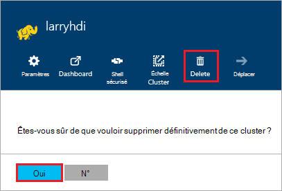

<properties
pageTitle="Comment faire pour supprimer un cluster d’HDInsight | Azure"
description="Informations sur les différentes méthodes que vous pouvez supprimer un cluster d’HDInsight."
services="hdinsight"
documentationCenter=""
authors="Blackmist"
manager="jhubbard"
editor="cgronlun"/>

<tags
ms.service="hdinsight"
ms.devlang="na"
ms.topic="article"
ms.tgt_pltfrm="na"
ms.workload="big-data"
ms.date="10/28/2016"
ms.author="larryfr"/>

#Comment faire pour supprimer un cluster HDInsight

Cluster HDInsight facturation démarre une fois qu’un cluster est créé et s’arrête lorsque le cluster est supprimé et étant au prorata par minute, vous devriez toujours supprimer votre cluster lorsqu’il n’est plus en cours d’utilisation. Dans ce document, vous allez apprendre à supprimer un cluster à l’aide de la CLI d’Azure, Azure PowerShell et le portail Azure.

> [AZURE.IMPORTANT] Suppression d’un HDInsight cluster ne supprime pas les comptes de stockage Azure associés au cluster. Cela vous permet de conserver et de réutiliser toutes les données stockées par le cluster.

##Azure Portal

1. Connexion au [portail Azure](https://portal.azure.com) et sélectionnez votre cluster HDInsight. Si votre cluster HDInsight n’est pas fixé au tableau de bord, vous pouvez rechercher pour elle par nom en utilisant le champ Rechercher (icône de loupe), sur le côté droit de la barre de navigation.

    

2. Une fois que la lame s’ouvre pour le cluster, sélectionnez l’icône de __suppression__ . Lorsque vous y êtes invité, cliquez sur __Oui__ pour supprimer le cluster.

    

##PowerShell Azure

À partir d’une invite de commandes PowerShell, utilisez la commande suivante pour supprimer le cluster :

    Remove-AzureRmHDInsightCluster -ClusterName CLUSTERNAME

Remplacez __NOM_CLUSTER__ par le nom de votre cluster HDInsight.

##CLI Azure

À partir d’une invite de commandes, utilisez la suivante pour supprimer le cluster :

    azure hdinsight cluster delete CLUSTERNAME
    
Remplacez __NOM_CLUSTER__ par le nom de votre cluster HDInsight.
