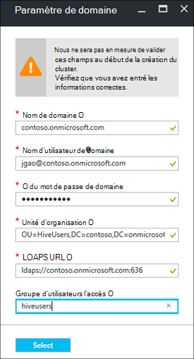

<properties
    pageTitle="Configurer les clusters à un domaine de HDInsight | Microsoft Azure"
    description="Découvrez comment installer et configurer les clusters à un domaine de HDInsight"
    services="hdinsight"
    documentationCenter=""
    authors="saurinsh"
    manager="jhubbard"
    editor="cgronlun"
    tags=""/>

<tags
    ms.service="hdinsight"
    ms.devlang="na"
    ms.topic="article"
    ms.tgt_pltfrm="na"
    ms.workload="big-data"
    ms.date="10/26/2016"
    ms.author="saurinsh"/>

# Configurer des clusters de HDInsight de joints au domaine (aperçu)

Apprenez à configurer un cluster Azure HDInsight avec Azure Active Directory (AD Azure) et [Apache Ranger](http://hortonworks.com/apache/ranger/) pour tirer parti de l’authentification renforcée et des politiques d’accès riche de basée sur les rôles (RBAC).  HDInsight de joints au domaine peut être configuré uniquement sur les clusters basés sur Linux. Pour plus d’informations, voir [clusters de HDInsight de présenter à un domaine](hdinsight-domain-joined-introduction.md).

Cet article est le premier didacticiel d’une série :

- Créer un cluster HDInsight connecté à Azure AD (via la fonctionnalité de Services de domaine de répertoire Azure) avec Ranger Apache activé.
- Créer et appliquer des stratégies de ruche à Ranger d’Apache et permettre aux utilisateurs (par exemple, des scientifiques de données) pour se connecter à la ruche à l’aide d’outils basés sur ODBC, par exemple Excel, etc. du Tableau. Microsoft travaille sur l’ajout des autres charges de travail, tels que HBase et Storm, allumage à dès HDInsight de joints au domaine.

Un exemple de la topologie final se présente comme suit :

Annonce Azure actuellement prend uniquement en charge les réseaux virtuels classiques (VNets) et prennent uniquement en charge les clusters basés sur Linux de HDInsight Azure le Gestionnaire de ressources en fonction des VNets, il HDInsight AD Azure intégration nécessite deux VNets et une homologation entre eux. Pour les informations de comparaison entre les deux modèles de déploiement, reportez-vous à la section [Azure le Gestionnaire de ressources et de déploiement classique : comprendre les modèles de déploiement et de l’état de vos ressources](../resource-manager-deployment-model.md). Les deux VNets doit être dans la même région, comme le service d’annuaire Active Directory Azure.

Les noms de service Azure doivent être globalement uniques. Les noms suivants sont utilisés dans ce didacticiel. Contoso est un nom fictif. Lorsque vous utilisez le didacticiel, vous devez remplacer *contoso* avec un nom différent. 
    
**Noms :**

|Propriété|Valeur|
|--------|-----|
| Azure AD VNet|contosoaadvnet|
| Annonce Azure Virtual Machine (VM)|contosoaadadmin. Cet ordinateur virtuel est utilisé pour configurer l’unité d’organisation et d’inverser la zone DNS.|
| Répertoire de publicité Azure|contosoaaddirectory|
| Nom de domaine AD Azure|Contoso (contoso.onmicrosoft.com)|
| HDInsight VNet|contosohdivnet|
| Groupe de ressources de HDInsight VNet|contosohdirg|
| Cluster de HDInsight|contosohdicluster|

Ce didacticiel fournit la procédure de configuration d’un cluster de HDInsight à un domaine. Chaque section comprend des liens vers d’autres articles avec plus d’informations.

## Au préalable :

- Familiarisez-vous avec [les Services de domaine Active Directory de Azure](https://azure.microsoft.com/services/active-directory-ds/) sa structure de [tarification](https://azure.microsoft.com/pricing/details/active-directory-ds/) .
- Assurez-vous que votre abonnement est la liste d’autorisation pour cette version d’évaluation. Vous pouvez le faire en envoyant un e-mail à hdipreview@microsoft.com avec votre ID d’abonnement.
- Un certificat SSL signé par une autorité de signature pour votre domaine. Le certificat est requis par la configuration de LDAP sécurisé. Les certificats auto-signés ne peut pas être utilisés.

## Procédures

1. Créer une VNet classique Azure pour votre annonce Azure.  
2. Créez et configurez AD Azure et Azure AD DS.
3. Ajouter une machine virtuelle à le VNet classique de création d’unité d’organisation. 
4. Créer une unité d’organisation pour Azure AD DS.
5. Créer un HDInsight VNet dans le mode de gestion de ressources Azure.
6. Configurer les zones DNS inverse pour le service d’annuaire Active Directory Azure.
6. VNets de l’homologue les deux.
7. Créer un cluster de HDInsight.

> [AZURE.NOTE] Ce didacticiel suppose que vous n’avez pas une annonce Azure. Si vous en avez, vous pouvez ignorer la partie à l’étape 2.
    
## Créer une VNet classique Azure

Dans cette section, vous créez un classique VNet via le portail Azure. Dans la section suivante, vous activez le service d’annuaire Active Directory Azure pour votre annonce Azure dans la VNet classique. Pour plus d’informations sur la procédure suivante et utiliser d’autres méthodes de création de VNet, voir [Création d’un réseau virtuel (classique) à l’aide du portail Azure](../virtual-network/virtual-networks-create-vnet-classic-portal.md).

**Pour créer un VNet classique**

1. Ouvrez une session sur le [portail Azure](https://portal.azure.com). 
2. Cliquez sur **Nouveau** > **réseau** > **réseau virtuel**.
3. Dans la zone **Sélectionner un modèle de déploiement**, sélectionnez **classique**, puis cliquez sur **créer**.
4. Entrez ou sélectionnez les valeurs suivantes :

    - **Nom**: contosoaadvnet
    - **Espace d’adressage**: 10.1.0.0/16
    - **Nom du sous-réseau**: Subnet1
    - **Plage d’adresses de sous-réseau**: 10.1.0.0/24
    - **Abonnement**: (sélectionnez un abonnement utilisé pour la création de cette VNet.)
    - **ResourceGroup**:
    - **Emplacement**: (Sélectionner une région pour votre cluster HDInsight.)

        > [AZURE.IMPORTANT] Vous devez choisir un emplacement prenant en charge les services AD DS Azure. Pour plus d’informations, consultez [produits disponibles par région](https://azure.microsoft.com/en-us/regions/services/). 
        >
        > Le VNet classique et la VNet de groupe de ressources doivent être dans la même région, comme le service d’annuaire Active Directory Azure.

5. Cliquez sur **créer** pour créer le VNet.

## Créer et configurer les services AD DS Azure pour votre annonce Azure

Dans cette section, vous allez :

1. Créer une annonce Azure.
2. Créer des utilisateurs AD Azure. Ces utilisateurs sont des utilisateurs de domaine. Vous utilisez le premier utilisateur pour la configuration du cluster HDInsight avec la publicité Azure.  Les deux utilisateurs sont facultatives pour ce didacticiel. Ils seront utilisés dans la [ruche de configurer des stratégies pour les clusters à un domaine de HDInsight](hdinsight-domain-joined-run-hive.md) lorsque vous configurez les stratégies de Ranger d’Apache.
3. Créer le groupe d’administrateurs du contrôleur de domaine DAS et ajoutez l’utilisateur AD Azure au groupe. Cet utilisateur vous permet de créer l’unité d’organisation.
4. Activer Azure AD DS Domain Services (AD Azure) pour la publicité Azure.
7. Configurer LDAPS pour la publicité Azure. Le LDAP Lightweight Directory Access Protocol () est utilisé pour lire et écrire dans Active Directory Azure.

Si vous préférez utiliser une annonce Azure existante, vous pouvez ignorer les étapes 1 et 2.

**Pour créer une annonce Azure**

1. À partir du [Azure portal classique](https://manage.windowsazure.com), cliquez sur **Nouveau** > **Application Services** > **Active Directory** > **répertoire** > **Personnalisé créer**. 
3. Entrez ou sélectionnez les valeurs suivantes :

    - **Nom**: contosoaaddirectory
    - **Nom de domaine**: contoso.  Ce nom doit être unique.
    - **Pays ou région**: sélectionnez votre pays ou votre région.
4. Cliquez sur **terminé**.

**Créer un utilisateur AD Azure**

1. À partir du [Azure portal classique](https://manage.windowsazure.com), cliquez sur **Active Directory** -> **contosoaaddirectory**. 
3. Dans le menu supérieur, cliquez sur **utilisateurs** .
4. Cliquez sur **Ajouter un utilisateur**.
4. Entrez le **Nom d’utilisateur**, puis cliquez sur **suivant**. 
5. Configurer le profil utilisateur ; Dans **rôle**, sélectionnez **Administrateur Global**; puis cliquez sur **suivant**.  Le rôle d’administrateur Global est nécessaire pour créer des unités d’organisation.
6. Cliquez sur **créer** pour obtenir un mot de passe temporaire.
7. Faites une copie du mot de passe, puis cliquez sur **Terminer**. Plus loin dans ce didacticiel, vous utiliserez cet utilisateur administrateur global pour vous connecter à la machine virtuelle de l’administrateur pour la création d’une unité d’organisation et de configuration du service DNS inverse.

Suivez la même procédure pour créer deux davantage d’utilisateurs avec le rôle **utilisateur** , hiveuser1 et hiveuser2. Les utilisateurs suivants seront utilisés dans la [ruche de configurer des stratégies pour les clusters à un domaine de HDInsight](hdinsight-domain-joined-run-hive.md).

**Créer le DAS DC groupe Administrateurs et d’ajouter un utilisateur AD Azure**

1. À partir du [Azure portal classique](https://manage.windowsazure.com), cliquez sur **Active Directory** > **contosoaaddirectory**. 
3. Dans le menu supérieur, cliquez sur **groupes** .
4. Cliquez sur **Ajouter un groupe** ou **Ajouter un groupe**.
5. Entrez ou sélectionnez les valeurs suivantes :

    - **Nom**: administrateurs du contrôleur de domaine DAS.  Ne modifiez pas le nom du groupe.
    - **Type de groupe**: sécurité.
6. Cliquez sur **terminé**.
7. Cliquez sur **Administrateurs du contrôleur de domaine DAS** pour ouvrir le groupe.
8. Cliquez sur **Ajouter des membres**.
9. Sélectionnez le premier utilisateur que vous avez créé à l’étape précédente, puis cliquez sur **Terminer**.
10. Répétez les mêmes étapes pour créer un autre groupe appelé **HiveUsers**et ajoutez les deux utilisateurs de ruche au groupe.

Pour plus d’informations, voir [Services de domaine Active Directory de Azure (aperçu) - créer un groupe « Administrateurs du contrôleur de domaine DAS »](../active-directory-domain-services/active-directory-ds-getting-started.md).

**Pour activer les services AD DS Azure pour votre annonce Azure**

1. À partir du [Azure portal classique](https://manage.windowsazure.com), cliquez sur **Active Directory** > **contosoaaddirectory**. 
3. Dans le menu supérieur, cliquez sur **configurer** .
4. Accédez à des **Services de domaine**et définissez les valeurs suivantes :

    - **Activer les services de domaine de ce répertoire**: Oui.
    - **Nom de domaine DNS des services de domaine**: affiche le nom de DNS par défaut du répertoire Azure. Par exemple, contoso.onmicrosoft.com.
    - **Services de domaine de se connecter à ce réseau virtuel**: sélectionnez le réseau virtuel classique, vous avez créé précédemment, par exemple, **contosoaadvnet**.
    
6. Cliquez sur **Enregistrer** à partir du bas de la page. Vous verrez **en attente...** en regard de **Activer les services de domaine pour ce répertoire**.  
7. Patientez jusqu'à ce que **en attente...** disparaît, et **l’Adresse IP** est remplie. Deux adresses IP ne seront remplis. Ce sont les adresses IP des contrôleurs de domaine mis en service par les Services de domaine. Chaque adresse IP seront visible une fois que le contrôleur de domaine correspondant est mis en service et prêt. Notez que les deux adresses IP. Vous en aurez besoin ultérieurement.

Pour plus d’informations, consultez [Services domaine Active Directory de Azure (aperçu) - activer les domaines d’Azure Active Directory Services](../active-directory-domain-services/active-directory-ds-getting-started-enableaadds.md).

**Pour synchroniser le mot de passe**

Si vous utilisez votre propre domaine, vous devez synchroniser le mot de passe. Consultez [Activer la synchronisation de mot de passe pour les services de domaine Active Directory Azure pour un Azure cloud uniquement les répertoire AD](../active-directory-domain-services/active-directory-ds-getting-started-password-sync.md).

**Pour configurer le protocole LDAPS pour la publicité Azure**

1. Obtenir un certificat SSL signé par une autorité de signature pour votre domaine. Les certificats auto-signés ne peut pas être utilisés. Si vous ne pouvez pas obtenir un certificat SSL, veuillez contacter hdipreview@microsoft.com pour une exception.
1. À partir du [Azure portal classique](https://manage.windowsazure.com), cliquez sur **Active Directory** > **contosoaaddirectory**. 
3. Dans le menu supérieur, cliquez sur **configurer** .
4. Accédez aux **services de domaine**.
5. Cliquez sur **certificat de configurer**.
6. Suivez les instructions pour spécifier le fichier de certificat et le mot de passe. Vous verrez **en attente...** en regard de **Activer les services de domaine pour ce répertoire**.  
7. Patientez jusqu'à ce que **en attente...** disparaît, et **Sécuriser un certificat LDAP** a été remplie.  Cette opération peut prendre 10 minutes ou plus.
 
>[AZURE.NOTE] Si certaines tâches en arrière-plan sont en cours d’exécution sur l’Azure AD DS, vous pouvez observer une erreur lors du téléchargement du certificat - <i>il est une opération effectuée pour ce client. Veuillez réessayer ultérieurement</i>.  Si vous rencontrez cette erreur, essayez à nouveau après un certain temps. La deuxième IP de contrôleur de domaine peut prendre jusqu'à 3 heures pour être mis en service.

Pour plus d’informations, voir [Configurer Secure LDAP (LDAPS) pour un domaine des Services de domaine Active Directory de Azure gérés](../active-directory-domain-services/active-directory-ds-admin-guide-configure-secure-ldap.md).

## Configurer une unité organisationnelle et de la recherche DNS inversée

Dans cette section, vous ajoutez un ordinateur virtuel à l’AD VNet Azure et installez les outils d’administration sur cet ordinateur virtuel pour vous permettre de configurer une unité organisationnelle et de la recherche DNS inversée. La recherche DNS inversée est requise pour l’authentification Kerberos.

**Pour créer un ordinateur virtuel sur le réseau virtuel**

1. À partir du [Azure portal classique](https://manage.windowsazure.com), cliquez sur **Nouveau** > **Calculer** > **Machine virtuelle** > **De la galerie**.
3. Sélectionnez une image, puis cliquez sur **suivant**.  Si vous ne connaissez pas celui que vous souhaitez utiliser, sélectionnez la valeur par défaut, **Windows Server 2012 R2 Datacenter**.
4. Entrez ou sélectionnez les valeurs suivantes :

    - Nom de la Machine virtuelle : **contosoaadadmin**
    - Niveau : **base**
    - Nouveau nom d’utilisateur : (Entrez un nom d’utilisateur)
    - Mot de passe : (Entrez un mot de passe)
    
    Veuillez noter que le nom d’utilisateur et le mot de passe de l’administrateur local est
    
5. Cliquez sur **suivant**
6. **Région/Virtual Network**, sélectionnez le nouveau réseau virtuel que vous avez créé dans la dernière étape (contosoaadvnet), puis cliquez sur **suivant**.
7. Cliquez sur **terminé**.

**À RDP de la machine virtuelle**

1. À partir du [Azure portal classique](https://manage.windowsazure.com), cliquez sur **ordinateurs virtuels** > **contosoaadadmin**.
3. Dans le menu supérieur, cliquez sur **tableau de bord** .
4. Cliquez sur **se connecter** à partir du bas de la page.
5. Suivez les instructions et utilisez le nom d’utilisateur de l’administrateur local et d’un mot de passe pour vous connecter.

**Pour joindre un ordinateur virtuel au domaine AD Azure**

1. À partir de la session RDP, cliquez sur **Démarrer**, puis cliquez sur **Gestionnaire de serveur**.
2. Dans le menu de gauche, cliquez sur **Serveur Local** .
3. À partir du groupe de travail, cliquez sur **groupe de travail**.
4. Cliquez sur **Modifier**.
5. Cliquez sur **domaine**, entrez **contoso.onmicrosoft.com**, puis cliquez sur **OK**.
6. Entrez les informations d’identification utilisateur de domaine, puis cliquez sur **OK**.
7. Cliquez sur **OK**.
8. Cliquez sur **OK** pour accepter le redémarrage de l’ordinateur.
9. Cliquez sur **Fermer**.
10. Cliquez sur **Redémarrer maintenant**.

Pour plus d’informations, consultez [joindre un ordinateur virtuel de Windows Server pour un domaine géré](../active-directory-domain-services/active-directory-ds-admin-guide-join-windows-vm.md).

**Pour installer les outils d’administration Active Directory et DNS**

1. RDP dans **contosoaadadmin** en utilisant le compte d’utilisateur Active Directory Azure.
2. Cliquez sur **Démarrer**, puis cliquez sur **Gestionnaire de serveur**.
3. Dans le menu de gauche, cliquez sur **tableau de bord** .
4. Cliquez sur **Gérer**, puis cliquez sur **Ajouter des rôles et fonctionnalités**.
5. Cliquez sur **suivant**.
6. Sélectionnez **installation basée sur les rôles ou basé sur la fonctionnalité**, puis cliquez sur **suivant**.
7. Sélectionnez l’ordinateur virtuel en cours à partir du pool du serveur, puis cliquez sur **suivant**.
8. Cliquez sur **suivant** pour ignorer des rôles.
9. Développer des **Outils d’Administration de serveur distant**, développer des **Outils d’Administration de rôles**, sélectionnez **AD DS et AD LDS outils** et **Outils du serveur DNS**, puis cliquez sur **suivant**. 
10. Cliquez sur **suivant**
10. Cliquez sur **installer**.

Pour plus d’informations, consultez [Outils d’administration installer Active Directory sur l’ordinateur virtuel](../active-directory-domain-services/active-directory-ds-admin-guide-administer-domain.md#task-2---install-active-directory-administration-tools-on-the-virtual-machine).

**Pour configurer DNS inversée**

1. RDP pour contosoaadadmin en utilisant le compte d’utilisateur Active Directory Azure.
2. Cliquez sur **Démarrer**, sur **Outils d’administration**, puis cliquez sur **DNS**. 
3. Cliquez sur **non** pour ignorer l’ajout de ContosoAADAdmin.
4. Sélectionnez **l’ordinateur suivant**, entrez l’adresse IP du premier serveur DNS que vous avez configurée précédemment, puis cliquez sur **OK**.  Vous veillent que le contrôleur de domaine/serveur DNS est ajouté au volet de gauche.
3. Développez le contrôleur de domaine/serveur DNS, cliquez sur **Zones de recherche inversée**, puis cliquez sur **Nouvelle Zone**. L’Assistant Nouvelle Zone s’ouvre.
4. Cliquez sur **suivant**.
5. Sélectionnez **zone principale**, puis cliquez sur **suivant**.
6. Sélectionnez cette option **pour tous les serveurs DNS exécutés sur des contrôleurs de domaine dans ce domaine**, puis cliquez sur **suivant**.
6. Sélectionnez la **Zone de recherche inversée IPv4**et puis cliquez sur **suivant**.
7. Dans l' **ID réseau**, entrez le préfixe pour la plage de réseau HDInsight VNET, puis cliquez sur **suivant**. Vous allez créer le HDInsight VNet dans la section suivante.
8. Cliquez sur **suivant**.
9. Cliquez sur **suivant**.
10. Cliquez sur **Terminer**.

L’unité d’organisation que vous créez sera ensuite utilisée lors de la création du cluster HDInsight. Les utilisateurs du système Hadoop et comptes d’ordinateur seront placés dans cette unité d’organisation.

**Créer une unité d’organisation (OU) dans un domaine géré de Services de domaine Active Directory de Azure**

1. RDP dans **contosoaadadmin** en utilisant le compte de domaine qui se trouve dans le groupe **Administrateurs du contrôleur de domaine DAS** .
2. Cliquez sur **Démarrer**, sur **Outils d’administration**, puis cliquez sur **Centre d’administration Active Directory**.
5. Cliquez sur le nom de domaine dans le volet gauche. Par exemple, contoso.
6. Cliquez sur **Nouveau** sous le nom de domaine dans le volet **Office** , puis cliquez sur **Unité d’organisation**.
7. Entrez un nom, par exemple, **HDInsightOU**et puis cliquez sur **OK**. 

Pour plus d’informations, voir [Création d’une unité d’organisation (OU) dans un domaine des Services de domaine Active Directory de Azure gérés](../active-directory-domain-services/active-directory-ds-admin-guide-create-ou.md).

## Créer un VNet le Gestionnaire de ressources de cluster de HDInsight

Dans cette section, vous allez créer un VNet Azure le Gestionnaire de ressources qui sera utilisé pour le cluster HDInsight. Pour plus d’informations sur la création de VNET Azure utilisant d’autres méthodes, voir [Création d’un réseau virtuel](../virtual-network/virtual-networks-create-vnet-arm-pportal.md)

Après avoir créé le VNet, vous allez configurer le Gestionnaire de ressources VNet pour utiliser les serveurs DNS de même que pour la AD VNet Azure. Si vous avez suivi les étapes de ce didacticiel pour créer le VNet classique et la publicité d’Azure, les serveurs DNS sont 10.1.0.4 et 10.1.0.5.

**Pour créer un gestionnaire de ressources de VNet**

1. Ouvrez une session sur le [portail Azure](https://portal.azure.com).
2. Cliquez sur **Nouveau**, **réseau**, **réseau virtuel**. 
3. Dans la zone **Sélectionner un modèle de déploiement**, sélectionnez **Le Gestionnaire de ressources**, puis cliquez sur **créer**.
4. Tapez ou sélectionnez les valeurs suivantes :

    - **Nom**: contosohdivnet
    - **Espace d’adresse**: 10.2.0.0/16. Assurez-vous que la plage d’adresses ne peut pas chevaucher la plage d’adresses IP de le VNet classique.
    - **Nom du sous-réseau**: Subnet1
    - **Plage d’adresses de sous-réseau**: 10.2.0.0/24
    - **Abonnement**: (sélectionnez votre abonnement Azure.)
    - **Groupe de ressources**: contosohdirg
    - **Emplacement**: (sélectionnez le même emplacement que le AD VNet Azure, c'est-à-dire contosoaadvnet.)

5. Cliquez sur **créer**.

**Pour configurer DNS pour le Gestionnaire de ressources VNet**

1. À partir du [portail Azure](https://portal.azure.com), cliquez sur **plus de services** -> **réseaux virtuels**. Assurez-vous de cliquer de **réseaux virtuels (classiques)**.
2. Cliquez sur **contosohdivnet**.
4. Cliquez sur **serveurs DNS** à partir du côté gauche de la nouvelle blade.
6. Cliquez sur **personnalisé**et entrez les valeurs suivantes :

    - 10.1.0.4
    - 10.1.0.5

    Ces adresses IP du serveur DNS doivent correspondre aux serveurs DNS dans le VNet de publicité Azure (VNet classique).
7. Cliquez sur **Enregistrer**.

## L’homologue de la AD VNet Azure et la HDInsight VNet

**Pour examiner les deux VNet**

1. Ouvrez une session sur le [portail Azure](https://portal.azure.com).
2. Dans le menu de gauche, cliquez sur **plus de services** .
3. Cliquez sur **réseaux virtuels**. Ne cliquez pas sur **les réseaux virtuels (classiques)**.
4. Cliquez sur **contosohdivnet**.  Il s’agit de la HDInsight VNet.
5. Cliquez sur **Peerings** dans le menu de gauche de la lame.
6. Dans le menu supérieur, cliquez sur **Ajouter** . Il ouvre la lame **ajouter d’homologation** .
7. Sur la lame **Ajouter l’homologation** , définissez ou sélectionnez les valeurs suivantes :

    - **Nom**: ContosoAADHDIVNetPeering
    - **Modèle de déploiement réseau virtuel**: classique
    - **Abonnement**: sélectionnez le nom d’abonnement utilisé pour le vnet classique (Azure AD).
    - **Réseau virtuel**: contosoaadvnet.
    - **Autoriser l’accès réseau virtuel**: (vérification)
    - **Autoriser sur le trafic transféré**: (vérifier). Laissez les deux autres cases à cocher désactivée.

8. Cliquez sur **OK**.

## Créer le cluster de HDInsight

Dans cette section, vous créez un cluster basé sur Linux de Hadoop dans HDInsight en utilisant le [modèle du Gestionnaire de ressources Azure](../resource-group-template-deploy.md)Azure portal ou. Pour d’autres méthodes de création de cluster et la compréhension les paramètres, reportez-vous à la section [HDInsight de créer des clusters](hdinsight-hadoop-provision-linux-clusters.md). Pour plus d’informations sur l’utilisation du Gestionnaire de ressources du modèle pour créer des clusters d’Hadoop dans HDInsight, reportez-vous à la section [Hadoop de créer des clusters dans HDInsight à l’aide des modèles du Gestionnaire de ressources](hdinsight-hadoop-create-windows-clusters-arm-templates.md)

**Pour créer un cluster à un domaine de HDInsight l’aide du portail Azure**

1. Ouvrez une session sur le [portail Azure](https://portal.azure.com).
2. Cliquez sur **Nouveau**, **Intelligence + analytique**, puis **HDInsight**.
3. À partir de la blade **HDInsight nouveau cluster** , entrez ou sélectionnez les valeurs suivantes :

    - **Nom de cluster**: entrez un nouveau nom de cluster du cluster à un domaine de HDInsight.
    - **Abonnement**: sélectionnez un abonnement Azure utilisé pour la création de ce cluster.
    - **Configuration de cluster**:

        - **Type de cluster**: Hadoop. HDInsight de joints au domaine est actuellement seulement les Hadoop pris en charge sur les clusters.
        - **Système d’exploitation**: Linux.  HDInsight de joints au domaine est uniquement pris en charge sur les clusters basés sur Linux de HDInsight.
        - **Version**: Hadoop 2.7.3 (HDI 3.5). À un domaine de HDInsight est uniquement pris en charge sur la version de cluster HDInsight 3.5.
        - **Type de cluster**: prime

        Cliquez sur **Sélectionner** pour enregistrer les modifications.

    - **Informations d’identification**: configurer les informations d’identification de l’utilisateur de cluster et l’utilisateur SSH.
    - **Source de données**: créer un nouveau compte de stockage ou d’utiliser un compte de stockage existant en tant que le compte de stockage par défaut pour l’HDInsight du cluster. L’emplacement doit être le même que les deux VNets.  L’emplacement est également l’emplacement du cluster HDInsight.
    - **Tarification**: sélectionnez le nombre de nœuds de travailleur de votre cluster.
    - **Les configurations avancées**: 

        - **Jonction de domaine & Vnet/sous-réseau**: 

            - **Paramètres de domaine**: 

                - **Nom de domaine**: contoso.onmicrosoft.com
                - **Nom d’utilisateur de domaine**: permet d’entrer un nom d’utilisateur de domaine. Ce domaine doit posséder les privilèges suivants : joindre des ordinateurs au domaine et les placer dans l’unité d’organisation que vous avez configurée précédemment ; Créer des entités de service au sein de l’unité d’organisation que vous avez configurée précédemment ; Créer des entrées DNS inverses. Cet utilisateur du domaine devient l’administrateur de ce cluster de HDInsight à un domaine.
                - **Mot de passe de domaine**: entrez le mot de passe de l’utilisateur.
                - **Unité d’organisation**: entrez le nom unique de l’instance d’unités d’organisation vous avez configurée précédemment. Par exemple : unité d’organisation = HDInsightOU, DC = contoso, DC = onmicrosoft, DC = com
                - **LDAPS URL**: ldaps://contoso.onmicrosoft.com:636
                - **Groupe d’accès utilisateur**: spécifier le groupe de la sécurité dont les utilisateurs que vous voulez synchroniser avec le cluster. Par exemple, HiveUsers.

                Cliquez sur **Sélectionner** pour enregistrer les modifications.

                
            - **Réseau virtuel**: contosohdivnet
            - **Sous-réseau**: Subnet1

            Cliquez sur **Sélectionner** pour enregistrer les modifications.       
        Cliquez sur **Sélectionner** pour enregistrer les modifications.
    - **Groupe de ressources**: sélectionnez le groupe de ressources utilisé pour le HDInsight VNet (contosohdirg).

4. Cliquez sur **créer**.  

Une autre option pour la création de HDInsight de domaine cluster consiste à utiliser le modèle de gestion des ressources Azure. La procédure suivante vous montre comment :

**Pour créer un cluster à un domaine de HDInsight à l’aide d’un modèle de gestion des ressources**

1. Cliquez sur l’image suivante pour ouvrir un modèle de gestionnaire de ressources dans le portail Azure. Le modèle de gestionnaire de ressources se trouve dans un conteneur blob publique. 

    

2. À partir de la blade de **paramètres** , entrez les valeurs suivantes :

    - **Abonnement**: (sélectionnez votre abonnement Azure).
    - **Groupe de ressources**: cliquez sur **utiliser existant**, et spécifient le même groupe de ressources que vous utilisez.  Par exemple, contosohdirg. 
    - **Emplacement**: spécifiez un emplacement de groupe de ressources.
    - **Nom de cluster**: entrez un nom pour le cluster Hadoop que vous allez créer. Par exemple, contosohdicluster.
    - **Type de cluster**: sélectionnez un type de cluster.  La valeur par défaut est **hadoop**.
    - **Emplacement**: sélectionnez un emplacement pour le cluster.  Le compte de stockage par défaut utilise le même emplacement.
    - **Nombre de nœuds de travailleur de cluster**: sélectionnez le nombre de nœuds du travailleur.
    - **Mot de passe et le nom de connexion de cluster**: le nom d’ouverture de session par défaut est **admin**.
    - **Mot de passe et nom d’utilisateur SSH**: le nom d’utilisateur par défaut est **sshuser**.  Vous pouvez le renommer. 
    - **Id de réseau virtuel**: /subscriptions/&lt;SubscriptionID > /resourceGroups/&lt;ResourceGroupName > /providers/Microsoft.Network/virtualNetworks/&lt;VNetName >
    - **Sous-réseau de réseau virtuel**: /subscriptions/&lt;SubscriptionID > /resourceGroups/&lt;ResourceGroupName > /providers/Microsoft.Network/virtualNetworks/&lt;VNetName > sous-réseaux/Subnet1
    - **Nom de domaine**: contoso.onmicrosoft.com
    - **DN d’unité d’organisation**: unité d’organisation = HDInsightOU, DC = contoso, DC = onmicrosoft, DC = com
    - **Cluster utilisateurs groupe D Ns**: «\"CN = HiveUsers, l’unité d’organisation = AADDC utilisateurs, DC =<DomainName>, DC = onmicrosoft, DC = com\""
    - **LDAPUrls**: [« ldaps://contoso.onmicrosoft.com:636 »]
    - **DomainAdminUserName**: (entrez le nom d’utilisateur de domaine admin)
    - **DomainAdminPassword**: (entrez le mot de passe domaine admin)
    - **J’accepte les termes et conditions susmentionnées**: (vérification)
    - **Fixer au tableau de bord**: (vérification)

6. Cliquez sur **achat**. Vous verrez une nouvelle mosaïque intitulée de **déploiement de modèle de déploiement**. Il faut environ 20 minutes environ pour créer un cluster. Une fois que le cluster est créé, vous pouvez cliquer sur la lame de cluster dans le portail pour l’ouvrir.

Après avoir terminé le didacticiel, vous pouvez souhaiter supprimer le cluster. Avec HDInsight, vos données sont stockées dans le stockage Azure, donc vous pouvez supprimer en toute sécurité un cluster lorsqu’il n’est pas en cours d’utilisation. Vous êtes également chargé pour un cluster de HDInsight, même lorsqu’il n’est pas en cours d’utilisation. Dans la mesure où les frais pour le cluster sont bien plus que les frais de stockage, il est économique judicieux de supprimer les clusters lorsqu’ils ne sont pas en cours d’utilisation. Pour les instructions de la suppression d’un cluster, consultez [Hadoop de gérer des clusters dans HDInsight en utilisant le portail Azure](hdinsight-administer-use-management-portal.md#delete-clusters).

## Étapes suivantes

- Pour la configuration des stratégies de la ruche et exécution des requêtes de ruche, consultez [configurer la ruche des stratégies pour les clusters à un domaine de HDInsight](hdinsight-domain-joined-run-hive.md).
- Pour l’exécution de requêtes de ruche à l’aide de SSH sur des clusters de HDInsight d’à un domaine, reportez-vous à la section [Utiliser SSH avec basé sur Linux d’Hadoop sur HDInsight de Linux, Unix ou OS X](hdinsight-hadoop-linux-use-ssh-unix.md#connect-to-a-domain-joined-hdinsight-cluster).
