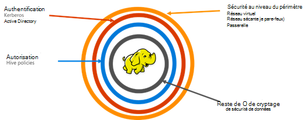

<properties
    pageTitle="Sécuriser la vue d’ensemble de l’HDInsight | Microsoft Azure"
    description="En savoir plus..."
    services="hdinsight"
    documentationCenter=""
    authors="saurinsh"
    manager="jhubbard"
    editor="cgronlun"
    tags="azure-portal"/>

<tags
    ms.service="hdinsight"
    ms.devlang="na"
    ms.topic="hero-article"
    ms.tgt_pltfrm="na"
    ms.workload="big-data"
    ms.date="10/24/2016"
    ms.author="saurinsh"/>

# Introduire les clusters à un domaine de HDInsight (aperçu)

HDInsight Azure jusqu'à aujourd'hui pris en charge uniquement un seul administrateur d’utilisateurs locaux. Ceci fonctionne à merveille pour petites équipes d’application ou les services. Hadoop en fonction des charges de travail a gagné en popularité plus dans le secteur de l’entreprise, le besoin de capacités de niveau entreprise comme active directory en fonction de l’authentification et contrôle d’accès basé sur les rôles prise en charge multi-utilisateurs est devenu plus en plus important. À l’aide de clusters de HDInsight d’à un domaine, vous pouvez créer un cluster HDInsight joint à un domaine Active Directory, configurez une liste des employés de l’entreprise qui peuvent s’authentifier via Azure Active Directory pour vous connecter à un cluster de HDInsight. Toute personne extérieure à l’entreprise ne peut pas se connecter ou d’accéder au cluster HDInsight. L’administrateur de l’entreprise peut configurer le contrôle d’accès basé sur un rôle pour la sécurité de la ruche à l’aide de [Apache Ranger](http://hortonworks.com/apache/ranger/), donc restreindre l’accès aux données de seulement autant que nécessaire. Enfin, l’administrateur peut auditer l’accès des données par les employés et toute modification apportée aux stratégies de contrôle d’accès, d'où un degré élevé de gouvernance des ressources de l’entreprise.

[AZURE.NOTE]> Nouvelles fonctionnalités décrites dans cet aperçu ne sont disponibles que sur les clusters basés sur Linux de HDInsight pour charge de travail de la ruche. Les autres charges de travail, tels que HBase, étincelle, tempête et Kafka, seront activés dans les versions futures. 

## Avantages

Sécurité d’entreprise contient quatre piliers big – sécurisation du périmètre réseau, authentification, d’autorisation et de cryptage.

.

### Sécurité du périmètre

La sécurité du périmètre de HDInsight est obtenue à l’aide des réseaux virtuels et le service passerelle. Aujourd'hui, un administrateur de l’entreprise peut créer un cluster de HDInsight à l’intérieur d’un réseau virtuel et utiliser les groupes de sécurité réseau (règles de pare-feu de trafic entrant ou sortant) pour restreindre l’accès au réseau virtuel. Seules les adresses IP définies dans les règles de pare-feu entrant sera en mesure de communiquer avec le cluster HDInsight, fournissant ainsi la sécurité du périmètre. Une autre couche de sécurité de périmètre est obtenue à l’aide du service de passerelle. La passerelle est le service qui agit en tant que première ligne de défense pour toute requête entrante sur le cluster de HDInsight. Il accepte la demande, il valide et n’autorise la demande passer aux autres nœuds dans le cluster, offrant ainsi la sécurité de périmètre à d’autres nœuds de données et le nom du cluster.

### Authentification

Avec cette version d’évaluation, un administrateur de l’entreprise peut mettre en service un cluster à un domaine de HDInsight, dans un [réseau virtuel](https://azure.microsoft.com/services/virtual-network/). Les nœuds du cluster HDInsight seront joint à un domaine géré par l’entreprise. Cela s’effectue via l’utilisation [d’Azure des Services de domaine Active Directory](https://technet.microsoft.com/library/cc770946.aspx). Tous les nœuds dans le cluster sont joints à un domaine qui gère de l’entreprise. Avec cette configuration, les employés de l’entreprise peuvent ouvrir une session sur les nœuds de cluster à l’aide de leurs informations d’identification de domaine. Leurs informations d’identification de domaine leur permet également de s’authentifier auprès d’autres points de terminaison approuvés comme la teinte, les vues Ambari, ODBC, JDBC, PowerShell reste API et d’interagir avec le cluster. L’administrateur dispose du contrôle total sur la limitation du nombre d’utilisateurs d’interagir avec le cluster via ces points de terminaison.

### Autorisation

Une meilleure pratique suivie par la plupart des entreprises est que pas chaque employé a accès à toutes les ressources de l’entreprise. Même, avec cette version, l’administrateur peut définir des politiques de contrôle d’accès basé sur les rôles pour les ressources de cluster. Par exemple, l’administrateur peut configurer [Apache Ranger](http://hortonworks.com/apache/ranger/) pour définir des politiques de contrôle d’accès de la ruche. Cette fonctionnalité garantit que les employés seront en mesure d’accéder uniquement à autant de données que nécessaire réussir dans leur travail. Accès SSH au cluster est également limité uniquement à l’administrateur.

### L’audit

Protéger les ressources de cluster HDInsight des utilisateurs non autorisés et la sécurisation des données, l’audit d’accès aux ressources du cluster et les données est nécessaire pour assurer le suivi des accès non autorisé ou non des ressources. Avec cet aperçu, l’administrateur peut afficher et signaler tous les accès aux ressources de cluster HDInsight et aux données. L’administrateur peut également afficher et de consigner toutes les modifications pour les stratégies de contrôle d’accès dans les points de terminaison de Ranger Apache pris en charge. Un cluster à un domaine de HDInsight utilise l’interface utilisateur de Ranger Apache familier pour rechercher les journaux d’audit. Sur le serveur principal, Ranger utilise [Le mode série sur LAN.r Apache]( http://hortonworks.com/apache/solr/) pour le stockage et la recherche dans les journaux.

### Cryptage

Protection des données est importante pour les exigences de conformité et de sécurité de l’organisation réunion, et avec la restriction de l’accès aux données des employés non autorisés, il doit également être sécurisé en la chiffrant. Les banques de données de clusters, Blob de stockage Azure et stockage Azure lac HDInsight support transparent côté serveur, [le cryptage des données](../storage/storage-service-encryption.md) au repos. Sécuriser les clusters fonctionnera en toute transparence avec ce cryptage du côté serveur de données en fonction du reste de HDInsight.

## Étapes suivantes

- Pour configurer un cluster à un domaine de HDInsight, consultez [clusters d’HDInsight de configuration à un domaine](hdinsight-domain-joined-configure.md).
- Pour la gestion des clusters d’un à un domaine de HDInsight, voir [clusters de HDInsight de gestion à un domaine](hdinsight-domain-joined-manage.md).
- Pour la configuration des stratégies de la ruche et exécution des requêtes de ruche, consultez [configurer la ruche des stratégies pour les clusters à un domaine de HDInsight](hdinsight-domain-joined-run-hive.md).
- Pour l’exécution de requêtes de ruche à l’aide de SSH sur des clusters de HDInsight d’à un domaine, reportez-vous à la section [Utiliser SSH avec basé sur Linux d’Hadoop sur HDInsight de Linux, Unix ou OS X](hdinsight-hadoop-linux-use-ssh-unix.md#connect-to-a-domain-joined-hdinsight-cluster).