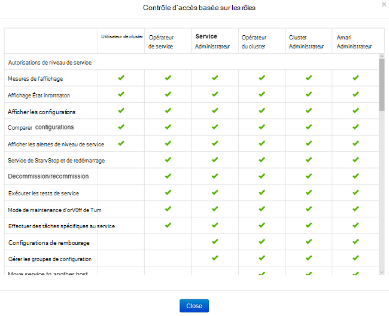
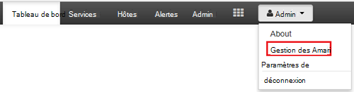
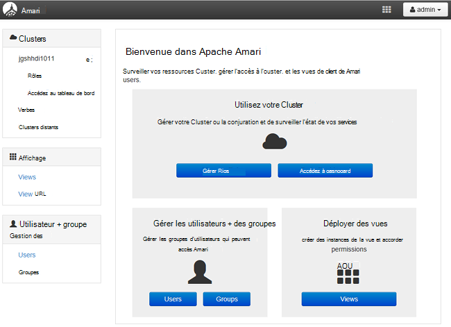
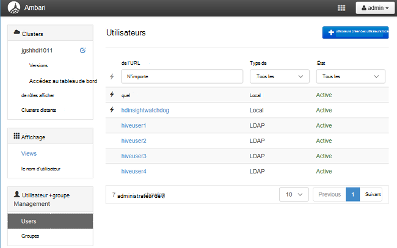
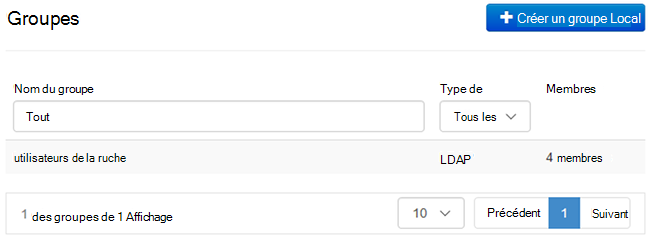
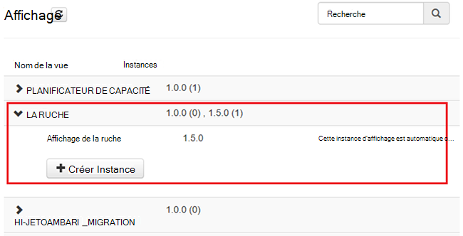
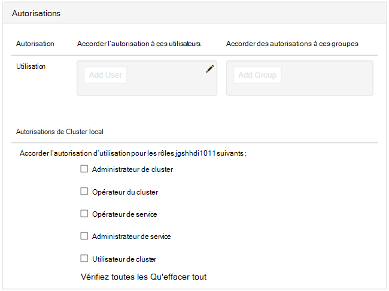

<properties
    pageTitle="Gérer les clusters à un domaine de HDInsight | Microsoft Azure"
    description="Découvrez comment gérer les clusters à un domaine de HDInsight"
    services="hdinsight"
    documentationCenter=""
    authors="saurinsh"
    manager="jhubbard"
    editor="cgronlun"
    tags=""/>

<tags
    ms.service="hdinsight"
    ms.devlang="na"
    ms.topic="article"
    ms.tgt_pltfrm="na"
    ms.workload="big-data"
    ms.date="10/25/2016"
    ms.author="saurinsh"/>

# Gérer les clusters à un domaine de HDInsight (aperçu)

Découvrez les utilisateurs et les rôles associés à un domaine de HDInsight, et comment gérer les clusters de HDInsight à un domaine.

## Utilisateurs de clusters de joints au domaine de HDInsight

Un cluster de HDInsight domaine n’est pas joint a deux comptes d’utilisateur qui sont créés lors de la création du cluster :

- **Ambari admin**: ce compte est également appelé *Hadoop utilisateur* ou *HTTP*. Ce compte peut être utilisé pour ouvrir une session sur Ambari à https://&lt;nomcluster >. azurehdinsight.net. Il peut également être utilisé pour exécuter des requêtes sur les vues de Ambari, d’exécuter des travaux à l’aide des outils externes (PowerShell, Templeton, Visual Studio) et s’authentifier avec le pilote ODBC de la ruche et les outils d’analyse Décisionnelle (Excel, PowerBI ou Tableau).

- **Utilisateur SSH**: ce compte peut être utilisé avec SSH et exécuter des commandes sudo. Il a des privilèges racine aux ordinateurs virtuels Linux.

Un cluster à un domaine de HDInsight a trois nouveaux utilisateurs en plus Ambari administrateur et utilisateur SSH.

- **Administration de ranger**: ce compte est le compte d’administrateur local de Ranger d’Apache. Il n’est pas un utilisateur de domaine active directory. Ce compte peut être utilisé pour configurer des stratégies et de rendre les autres administrateurs d’utilisateurs ou les administrateurs délégués (de sorte que les utilisateurs peuvent gérer les stratégies). Par défaut, le nom d’utilisateur est *admin* et le mot de passe est le même que le mot de passe administrateur Ambari. Le mot de passe peut être mis à jour à partir de la page Paramètres de Ranger.

- **Utilisateur de domaine administrateur de cluster**: ce compte est un utilisateur de domaine active directory désigné comme l’administrateur de cluster Hadoop, y compris de Ambari et Ranger. Vous devez fournir des informations d’identification de l’utilisateur lors de la création du cluster. Cet utilisateur dispose des autorisations suivantes :

    - Joindre des ordinateurs au domaine et les placer dans l’unité d’organisation que vous spécifiez lors de la création du cluster.
    - Créer des entités de service au sein de l’unité d’organisation que vous spécifiez lors de la création du cluster. 
    - Créer des entrées DNS inverses.

    Notez que les autres utilisateurs AD également posséder les privilèges. 

    Il existe certains points de terminaison dans le cluster (par exemple, Templeton) qui ne sont pas gérés par Ranger et ne sont donc pas sécurisés. Ces points de terminaison sont verrouillés pour tous les utilisateurs, à l’exception de l’utilisateur de domaine d’administrateur de cluster. 

- **Normal**: lors de la création du cluster, vous pouvez fournir plusieurs groupes d’active directory. Les utilisateurs de ces groupes seront synchronisés avec le Ranger et Ambari. Ces utilisateurs sont des utilisateurs du domaine et ont accès aux seuls gérés Ranger points de terminaison (par exemple, Hiveserver2). Toutes les stratégies RBAC et audit sera applicable à ces utilisateurs.

## Rôles des HDInsight de domaine clusters

HDInsight de domaine avoir les rôles suivants :

- Administrateur de cluster
- Opérateur du cluster
- Administrateur de service
- Opérateur de service
- Utilisateur de cluster

**Pour afficher les autorisations de ces rôles.**

1. Ouvrez l’interface utilisateur de gestion de Ambari.  Reportez-vous à [Ouvrir l’interface utilisateur de gestion de Ambari](#open-the-ambari-management-ui).
2. Dans le menu de gauche, cliquez sur **rôles**.
3. Cliquez sur le point d’interrogation bleu pour afficher les autorisations :

    

## Ouvrez l’interface utilisateur de gestion de Ambari

1. Ouvrez une session sur le [portail Azure](https://portal.azure.com).
2. Ouvrez votre cluster HDInsight dans une lame. Voir la [liste et afficher des clusters](hdinsight-administer-use-management-portal.md#list-and-show-clusters).
3. Cliquez sur **tableau de bord** dans le menu supérieur pour ouvrir Ambari.
4. Ouvrez une session sur Ambari en utilisant le nom de cluster administrateur d’utilisateur et le mot de passe.
5. Cliquez sur le menu déroulant **Admin** dans le coin supérieur droit, puis cliquez sur **Gérer les Ambari**.

    

    L’interface utilisateur ressemble à :

    

## Liste des utilisateurs du domaine synchronisés à partir de Active Directory

1. Ouvrez l’interface utilisateur de gestion de Ambari.  Reportez-vous à [Ouvrir l’interface utilisateur de gestion de Ambari](#open-the-ambari-management-ui).
2. Dans le menu de gauche, cliquez sur **utilisateurs**. Vous veillent à tous les utilisateurs synchronisés à partir d’Active Directory pour le cluster HDInsight.

    

## Répertorier les groupes de domaine synchronisés à partir de Active Directory

1. Ouvrez l’interface utilisateur de gestion de Ambari.  Reportez-vous à [Ouvrir l’interface utilisateur de gestion de Ambari](#open-the-ambari-management-ui).
2. Dans le menu de gauche, cliquez sur **groupes**. Tous les groupes synchronisés à partir d’Active Directory dans le cluster HDInsight s’affiche.

    

## Configurer les autorisations de la ruche de vues

1. Ouvrez l’interface utilisateur de gestion de Ambari.  Reportez-vous à [Ouvrir l’interface utilisateur de gestion de Ambari](#open-the-ambari-management-ui).
2. Dans le menu de gauche, cliquez sur **vues**.
3. Cliquez sur **la ruche** pour afficher les détails.

    

4. Cliquez sur le lien de **l’Affichage de la ruche** pour configurer l’affichage de la ruche.
5. Faites défiler jusqu'à la section **autorisations** .

    

6. Cliquez sur **Ajouter un utilisateur** ou un **Groupe d’ajouter**, puis spécifiez les utilisateurs ou les groupes que vous peuvent utiliser les affichages de la ruche. 

## Configurer des utilisateurs pour les rôles

 Pour afficher une liste de rôles et leurs permissions, voir [clusters de HDInsight de rôles d’à un domaine](#roles-of-domain---joined-hdinsight-clusters).

1. Ouvrez l’interface utilisateur de gestion de Ambari.  Reportez-vous à [Ouvrir l’interface utilisateur de gestion de Ambari](#open-the-ambari-management-ui).
2. Dans le menu de gauche, cliquez sur **rôles**.
3. Cliquez sur **Ajouter un utilisateur** ou **Ajouter un groupe** pour affecter des utilisateurs et des groupes à des rôles différents.
 
## Étapes suivantes

- Pour configurer un cluster à un domaine de HDInsight, consultez [clusters d’HDInsight de configuration à un domaine](hdinsight-domain-joined-configure.md).
- Pour la configuration des stratégies de la ruche et exécution des requêtes de ruche, consultez [configurer la ruche des stratégies pour les clusters à un domaine de HDInsight](hdinsight-domain-joined-run-hive.md).
- Pour l’exécution de requêtes de ruche à l’aide de SSH sur des clusters de HDInsight d’à un domaine, reportez-vous à la section [Utiliser SSH avec basé sur Linux d’Hadoop sur HDInsight de Linux, Unix ou OS X](hdinsight-hadoop-linux-use-ssh-unix.md#connect-to-a-domain-joined-hdinsight-cluster).
