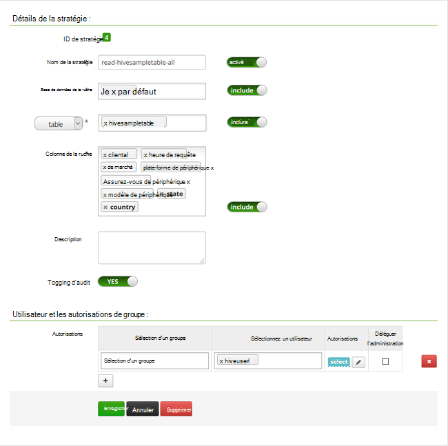

<properties
    pageTitle="Configurer des stratégies de la ruche dans à un domaine de HDInsight | Microsoft Azure"
    description="En savoir plus..."
    services="hdinsight"
    documentationCenter=""
    authors="saurinsh"
    manager="jhubbard"
    editor="cgronlun"
    tags="azure-portal"/>

<tags
    ms.service="hdinsight"
    ms.devlang="na"
    ms.topic="hero-article"
    ms.tgt_pltfrm="na"
    ms.workload="big-data"
    ms.date="10/25/2016"
    ms.author="saurinsh"/>

# Configurer des stratégies de la ruche dans à un domaine HDInsight (aperçu)

Apprenez à configurer des stratégies de Ranger d’Apache pour la ruche. Dans cet article, vous créez deux stratégies de Ranger pour restreindre l’accès à la hivesampletable. Le hivesampletable est fourni avec les clusters HDInsight. Après avoir configuré les stratégies, vous utilisez Excel et le pilote ODBC pour se connecter à des tables de ruche dans HDInsight.

## Conditions préalables

- Un cluster à un domaine de HDInsight. Voir [clusters de HDInsight de configuration à un domaine](hdinsight-domain-joined-configure.md).
- Une station de travail avec Office 2016, Office 2013 Professionnel Plus, Office 365 Pro Plus, Excel 2013 autonome ou Office 2010 Professionnel Plus.

## Se connecter à l’interface utilisateur Admin de Ranger Apache

**Pour vous connecter à l’interface utilisateur Admin de Ranger**

1. À partir d’un navigateur, connectez-vous à l’interface utilisateur Admin de Ranger. L’URL est https://&lt;nomcluster >.azurehdinsight.net/Ranger/. 

    >[AZURE.NOTE] Ranger utilise différentes informations d’identification que Hadoop cluster. Pour empêcher les navigateurs à l’aide des informations d’identification mises en cache des Hadoop, utilisez la nouvelle fenêtre de navigation inprivate pour se connecter à l’interface utilisateur Admin de Ranger.
4. Ouvrez une session en utilisant le nom de cluster administrateur d’utilisateur et le mot de passe :

    

    Actuellement, les Ranger fonctionne uniquement avec les fils et de la ruche.

## Créer des utilisateurs de domaine

Dans les [clusters de HDInsight de configuration à un domaine](hdinsight-domain-joined-configure.md#create-and-configure-azure-ad-ds-for-your-azure-ad), vous avez créé hiveruser1 et hiveuser2. Vous allez utiliser le compte d’utilisateur de deux dans ce didacticiel.

## Créer des stratégies de Ranger

Dans cette section, vous allez créer deux stratégies de Ranger pour accéder à hivesampletable. Vous donner l’autorisation select sur un ensemble différent de colonnes. Les deux utilisateurs ont été créés dans des [clusters de HDInsight de configuration à un domaine](hdinsight-domain-joined-configure.md#create-and-configure-azure-ad-ds-for-your-azure-ad).  Dans la section suivante, vous allez tester les deux stratégies dans Excel.

**Pour créer des stratégies de Ranger**

1. Ouvrez l’interface utilisateur Admin de Ranger. Voir [se connecter à l’interface utilisateur Admin de Apache Ranger](#connect-to-apache-ranager-admin-ui).
2. Cliquez sur ** &lt;nom_cluster > _hive**, sous **la ruche**. Vous deux veillent à préconfigurer les stratégies.
3. Cliquez sur **Ajouter une nouvelle stratégie**, puis saisissez les valeurs suivantes :

    - Nom de la stratégie : en lecture-hivesampletable-tous
    - Base de données de la ruche : par défaut
    - tableau : hivesampletable
    - La ruche de colonne : *
    - Sélectionnez utilisateur : hiveuser1
    - Autorisations : sélectionner

    .

    >[AZURE.NOTE] Si un utilisateur de domaine n’est pas renseigné dans Sélectionner un utilisateur, attendez quelques instants pour Ranger pour une synchronisation avec DAS.

4. Cliquez sur **Ajouter** pour enregistrer la stratégie.
5. Répétez les deux dernières étapes pour créer une autre stratégie avec les propriétés suivantes :

    - Nom de la stratégie : en lecture-hivesampletable-devicemake
    - Base de données de la ruche : par défaut
    - tableau : hivesampletable
    - La ruche de colonne : clientid, devicemake
    - Sélectionnez utilisateur : hiveuser2
    - Autorisations : sélectionner

## Créer la source de données ODBC de la ruche

Vous trouverez les instructions dans la [source de données ODBC de la ruche créer](hdinsight-connect-excel-hive-odbc-driver.md).  

    Propriété|Description
    ---|---
    Nom de Source de données|Donner un nom à votre source de données
    Hôte|Entrez &lt;HDInsightClusterName >. azurehdinsight.net. Par exemple, myHDICluster.azurehdinsight.net
    Port|Utilisez <strong>443</strong>. (Ce port a été modifié à partir de 563 à 443.)
    Base de données|Utiliser <strong>par défaut</strong>.
    Type de serveur de la ruche|Sélectionnez <strong>la ruche serveur 2</strong>
    Mécanisme|Sélectionnez <strong>Azure Service de HDInsight</strong>
    Chemin d’accès HTTP|Laissez le champ vide.
    Nom d’utilisateur|Entrez hiveuser1@contoso158.onmicrosoft.com. Mettre à jour le nom de domaine s’il est différent.
    Mot de passe|Entrez le mot de passe pour hiveuser1.
    </table>

Assurez-vous de cliquer sur **Test** avant d’enregistrer la source de données.

##Importer des données dans Excel à partir de HDInsight

Dans la dernière section, vous avez configuré les deux stratégies.  hiveuser1 a l’autorisation select sur toutes les colonnes, et que hiveuser2 a l’autorisation select sur deux colonnes. Dans cette section, vous emprunter l’identité de deux utilisateurs pour importer des données dans Excel.

1. Dans Excel, ouvrez un classeur existant ou nouveau.
2. Sous l’onglet **données** , cliquez sur **à partir d’autres Sources de données**, puis cliquez sur **Assistant de connexion de données** pour lancer l' **Assistant connexion de données**.

    ! [Assistant connexion de données ouverts] [img-hdi-simbahiveodbc.excel.dataconnection]

3. Sélectionnez le **DSN ODBC** comme source de données, puis cliquez sur **suivant**.
4. À partir de sources de données ODBC, sélectionnez le nom de source de données que vous avez créé à l’étape précédente, puis cliquez sur **suivant**.
5. Entrez à nouveau le mot de passe pour le cluster dans l’Assistant, puis cliquez sur **OK**. Attendez que la boîte de dialogue **Sélectionner la base de données et la Table** à ouvrir. Cette opération peut prendre quelques secondes.
8. Sélectionnez **hivesampletable**, puis cliquez sur **suivant**. 
8. Cliquez sur **Terminer**.
9. Dans la boîte de dialogue **Importer des données** , vous pouvez modifier ou spécifier la requête. Pour ce faire, cliquez sur **Propriétés**. Cette opération peut prendre quelques secondes. 
10. Cliquez sur l’onglet **définition** . Le texte de commande est la suivante :

        SELECT * FROM "HIVE"."default"."hivesampletable"

    Par les politiques de Ranger que vous avez défini, hiveuser1 a l’autorisation select sur toutes les colonnes.  Ainsi, cette requête fonctionne avec les informations d’identification de hiveuser1, mais pas cette requête ne fonctionne pas avec les informations d’identification de la de hiveuser2.

    ! [Propriétés de connexion] [img-hdi-simbahiveodbc-excel-connectionproperties]

11. Cliquez sur **OK** pour fermer la boîte de dialogue Propriétés de la connexion.
12. Cliquez sur **OK** pour fermer la boîte de dialogue **Importer des données** .  
13. Entrez de nouveau le mot de passe hiveuser1, puis cliquez sur **OK**. Il faut quelques secondes avant Obtient les données importées dans Excel. Lorsqu’il est terminé, vous veillent 11 colonnes de données.

Pour tester la deuxième stratégie (en lecture-hivesampletable-devicemake) que vous avez créé dans la dernière section

1. Ajouter une nouvelle feuille dans Excel.
2. Suivez la dernière procédure pour importer les données.  La seule modification que vous effectuerez consiste à utiliser des informations d’identification de hiveuser2 au lieu de hiveuser1. Une erreur se produit, car hiveuser2 a uniquement l’autorisation de voir les deux colonnes. Vous obtiendra l’erreur suivante :

        [Microsoft][HiveODBC] (35) Error from Hive: error code: '40000' error message: 'Error while compiling statement: FAILED: HiveAccessControlException Permission denied: user [hiveuser2] does not have [SELECT] privilege on [default/hivesampletable/clientid,country ...]'.

3. Suivez la même procédure pour importer des données. Cette fois, utilisez les informations d’identification de hiveuser2 et également modifier l’instruction select à partir de :

        SELECT * FROM "HIVE"."default"."hivesampletable"

    À :

        SELECT clientid, devicemake FROM "HIVE"."default"."hivesampletable"

    Lorsqu’il est terminé, vous doit afficher deux colonnes de données importées.

## Étapes suivantes

- Pour configurer un cluster à un domaine de HDInsight, consultez [clusters d’HDInsight de configuration à un domaine](hdinsight-domain-joined-configure.md).
- Pour la gestion des clusters d’un à un domaine de HDInsight, voir [clusters de HDInsight de gestion à un domaine](hdinsight-domain-joined-manage.md).
- Pour l’exécution de requêtes de ruche à l’aide de SSH sur des clusters de HDInsight d’à un domaine, reportez-vous à la section [Utiliser SSH avec basé sur Linux d’Hadoop sur HDInsight de Linux, Unix ou OS X](hdinsight-hadoop-linux-use-ssh-unix.md#connect-to-a-domain-joined-hdinsight-cluster).
- Pour connecter la ruche à l’aide de JDBC de la ruche, voir [se connecter à la ruche sur HDInsight Azure utilisant le pilote JDBC de la ruche](hdinsight-connect-hive-jdbc-driver.md)
- Pour vous connecter à Excel à Hadoop utilisant ODBC de la ruche, voir [Excel de se connecter à Hadoop avec le lecteur Microsoft ODBC de la ruche](hdinsight-connect-excel-hive-odbc-driver.md)
- Pour se connecter à Excel d’Hadoop à l’aide de la requête de l’alimentation, voir [Se connecter Excel Hadoop à l’aide de requêtes de puissance](hdinsight-connect-excel-power-query.md)