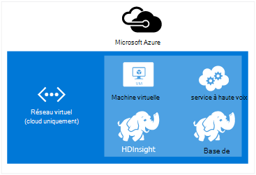
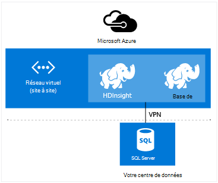

<properties
    pageTitle="Étendre la HDInsight avec le réseau virtuel | Microsoft Azure"  
    description="Apprenez à utiliser le réseau virtuel d’Azure pour HDInsight de se connecter à d’autres ressources de cloud ou des ressources dans votre centre de données"
    services="hdinsight"
    documentationCenter=""
    authors="Blackmist"
    manager="jhubbard"
    editor="cgronlun"/>

<tags
   ms.service="hdinsight"
   ms.devlang="na"
   ms.topic="article"
   ms.tgt_pltfrm="na"
   ms.workload="big-data"
   ms.date="10/21/2016"
   ms.author="larryfr"/>


#<a name="extend-hdinsight-capabilities-by-using-azure-virtual-network"></a>Étendre les fonctionnalités de HDInsight à l’aide de réseau virtuel d’Azure

Azure réseau virtuel vous permet d’étendre vos solutions Hadoop pour incorporer des ressources locales telles que SQL Server, de combiner plusieurs types de cluster HDInsight ou pour créer des réseaux privés sécurisés entre les ressources dans le nuage.

[AZURE.INCLUDE [upgrade-powershell](../../includes/hdinsight-use-latest-powershell-and-cli.md)]


##<a id="whatis"></a>Quel est le réseau virtuel d’Azure ?

[Azure réseau virtuel](https://azure.microsoft.com/documentation/services/virtual-network/) vous permet de créer un réseau sécurisé et permanent contenant les ressources que vous avez besoin pour votre solution. Un réseau virtuel vous permet de :

* Connexion des ressources de cloud dans un réseau privé (cloud uniquement).

    

    À l’aide de réseau virtuel pour lier des services Azure avec HDInsight d’Azure permet les scénarios suivants :

    * **Services d’appel de HDInsight ou de tâches** à partir de sites Web Azure ou les services qui s’exécutent sur des machines virtuelles Azure.

    * **Transférer directement des données** entre HDInsight et base de données de SQL Azure, SQL Server ou une autre solution de stockage de données en cours d’exécution sur une machine virtuelle.

    * **Combinaison de plusieurs serveurs de HDInsight** dans une solution unique. HDInsight clusters sont dotés de types qui correspondent à la charge de travail ou de la technologie de cluster est réglé pour. Il n’existe aucune méthode prise en charge pour créer un cluster qui combine plusieurs types, tels que tempête et HBase sur un cluster. À l’aide d’un réseau virtuel permet plusieurs clusters à communiquer directement entre eux.

* Se connecter à vos ressources de cloud à votre réseau de centre de données local (site-à-site ou site-à-point) à l’aide d’un réseau privé virtuel (VPN).

    Configuration de site à site vous permet de connecter plusieurs ressources à partir de votre centre de données sur le réseau virtuel Azure à l’aide d’un VPN de matériel ou le service Routage et accès distant.

    

    Configuration de point-à-site vous permet de vous connecter une ressource spécifique au réseau virtuel Azure à l’aide du logiciel VPN.

    

    À l’aide de réseau virtuel pour lier le nuage et votre centre de données permet des scénarios similaires à la configuration cloud uniquement. Mais au lieu d’être limité à l’utilisation des ressources dans le nuage, vous pouvez également travailler avec des ressources dans votre centre de données.

    * **Transférer directement des données** entre HDInsight et votre centre de données. Un exemple utilise Sqoop pour transférer des données vers ou à partir de SQL Server ou de la lecture des données générées par une application (LOB) de secteur d’activité.

    * **Services d’appel de HDInsight ou de tâches** à partir d’une application métier. Un exemple est à l’aide d’API Java de HBase pour stocker et récupérer des données à partir d’un cluster de HDInsight HBase.

Pour plus d’informations sur les fonctionnalités, les avantages et les fonctionnalités de réseau virtuel, consultez la [vue d’ensemble du réseau virtuel d’Azure](../virtual-network/virtual-networks-overview.md).

> [AZURE.NOTE] Vous devez créer le réseau virtuel Azure avant mise en service d’un cluster de HDInsight. Pour plus d’informations, reportez-vous à la section [tâches de configuration de réseau virtuel](https://azure.microsoft.com/documentation/services/virtual-network/).

## <a name="virtual-network-requirements"></a>Configuration du réseau virtuelle

> [AZURE.IMPORTANT] Création d’un cluster de HDInsight sur un réseau virtuel nécessite des configurations de réseau virtuel spécifiques, qui sont décrites dans cette section.

###<a name="location-based-virtual-networks"></a>Fondée sur l’emplacement des réseaux virtuels

HDInsight Azure prend en charge uniquement les réseaux virtuels fondée sur l’emplacement et ne fonctionne pas actuellement avec les réseaux virtuels en fonction de l’affinité du groupe.

###<a name="classic-or-v2-virtual-network"></a>Classique ou v2 réseau virtuel

Clusters basés sur Windows nécessitent un réseau virtuel classique, tandis que les clusters basés sur Linux nécessitent un réseau virtuel du Gestionnaire de ressources Azure. Si vous n’avez pas le type de réseau correct, il ne sera pas utilisable lors de la création du cluster.

Si vous avez des ressources sur un réseau virtuel qui n’est pas utilisable par le cluster que vous prévoyez sur la création, vous pouvez créer un réseau virtuel qui est utilisable par le cluster et connectez-le au réseau virtuel incompatible. Vous pouvez ensuite créer le cluster dans la version réseau dont il a besoin, et il sera en mesure d’accéder aux ressources de l’autre réseau puisque les deux sont liés. Pour plus d’informations sur la connexion des réseaux virtuels classique et nouvelle, consultez [VNets classique de connexion à VNets de nouveau](../vpn-gateway/vpn-gateway-connect-different-deployment-models-portal.md).

###<a name="custom-dns"></a>Custom DNS

Lorsque vous créez un réseau virtuel, Azure fournit la résolution de noms par défaut pour des services Azure, tels que des HDInsight qui sont installés dans le réseau. Toutefois, vous devrez peut-être utiliser votre propre système DNS (Domain Name System) pour des situations telles qu’entre la résolution de noms de domaine de réseau. Par exemple, lors de la communication entre les services situés dans deux rejoint les réseaux virtuels. HDInsight prend en charge à la fois la résolution de nom Azure par défaut ainsi que DNS personnalisé lorsqu’il est utilisé avec le réseau virtuel d’Azure.

Pour plus d’informations sur l’utilisation de votre propre serveur DNS avec réseau virtuel d’Azure, reportez-vous à la section de __résolution de noms à l’aide de votre propre serveur DNS__ de la [Résolution de noms pour les ordinateurs virtuels et des Instances de rôle](../virtual-network/virtual-networks-name-resolution-for-vms-and-role-instances.md#name-resolution-using-your-own-dns-server) de document.

###<a name="secured-virtual-networks"></a>Réseaux virtuels sécurisés

Le service HDInsight est un service géré et nécessite un accès à Internet au cours de la mise en service et en cours d’exécution. Il s’agit donc que Azure peut surveiller la santé du cluster, déclencher le basculement des ressources de cluster, modifiez le nombre de nœuds dans le cluster à travers des opérations de mise à l’échelle et d’autres tâches de gestion.

Si vous devez installer HDInsight dans un réseau virtuel sécurisé, vous devez autoriser l’accès entrant sur le port 443 pour les adresses IP suivantes, qui permettent d’Azure gérer le cluster HDInsight.

* 168.61.49.99
* 23.99.5.239
* 168.61.48.131
* 138.91.141.162

Autorisant l’accès entrant à partir du port 443 pour ces adresses vous permettra d’installer avec succès des HDInsight dans un réseau virtuel sécurisé.

> [AZURE.IMPORTANT] HDInsight ne prend pas en charge la restriction du trafic sortant, uniquement le trafic entrant. Lorsque vous définissez les règles du groupe de sécurité réseau pour le sous-réseau contenant HDInsight, utiliser uniquement les règles de trafic entrant.

Les exemples suivants montrent comment créer un nouveau groupe de sécurité réseau qui permet les adresses nécessaires et s’applique au groupe de sécurité à un sous-réseau de votre réseau virtuel. Ces étapes supposent que vous avez déjà créé un réseau virtuel et le sous-réseau que vous souhaitez installer HDInsight dans.

__À l’aide de PowerShell Azure__

    $vnetName = "Replace with your virtual network name"
    $resourceGroupName = "Replace with the resource group the virtual network is in"
    $subnetName = "Replace with the name of the subnet that HDInsight will be installed into"
    # Get the Virtual Network object
    $vnet = Get-AzureRmVirtualNetwork `
        -Name $vnetName `
        -ResourceGroupName $resourceGroupName
    # Get the region the Virtual network is in.
    $location = $vnet.Location
    # Get the subnet object
    $subnet = $vnet.Subnets | Where-Object Name -eq $subnetName
    # Create a new Network Security Group.
    # And add exemptions for the HDInsight health and management services.
    $nsg = New-AzureRmNetworkSecurityGroup `
        -Name "hdisecure" `
        -ResourceGroupName $resourceGroupName `
        -Location $location `
        | Add-AzureRmNetworkSecurityRuleConfig `
            -name "hdirule1" `
            -Description "HDI health and management address 168.61.49.99" `
            -Protocol "*" `
            -SourcePortRange "*" `
            -DestinationPortRange "443" `
            -SourceAddressPrefix "168.61.49.99" `
            -DestinationAddressPrefix "VirtualNetwork" `
            -Access Allow `
            -Priority 300 `
            -Direction Inbound `
        | Add-AzureRmNetworkSecurityRuleConfig `
            -Name "hdirule2" `
            -Description "HDI health and management 23.99.5.239" `
            -Protocol "*" `
            -SourcePortRange "*" `
            -DestinationPortRange "443" `
            -SourceAddressPrefix "23.99.5.239" `
            -DestinationAddressPrefix "VirtualNetwork" `
            -Access Allow `
            -Priority 301 `
            -Direction Inbound `
        | Add-AzureRmNetworkSecurityRuleConfig `
            -Name "hdirule3" `
            -Description "HDI health and management 168.61.48.131" `
            -Protocol "*" `
            -SourcePortRange "*" `
            -DestinationPortRange "443" `
            -SourceAddressPrefix "168.61.48.131" `
            -DestinationAddressPrefix "VirtualNetwork" `
            -Access Allow `
            -Priority 302 `
            -Direction Inbound `
        | Add-AzureRmNetworkSecurityRuleConfig `
            -Name "hdirule4" `
            -Description "HDI health and management 138.91.141.162" `
            -Protocol "*" `
            -SourcePortRange "*" `
            -DestinationPortRange "443" `
            -SourceAddressPrefix "138.91.141.162" `
            -DestinationAddressPrefix "VirtualNetwork" `
            -Access Allow `
            -Priority 303 `
            -Direction Inbound
    # Set the changes to the security group
    Set-AzureRmNetworkSecurityGroup -NetworkSecurityGroup $nsg
    # Apply the NSG to the subnet
    Set-AzureRmVirtualNetworkSubnetConfig `
        -VirtualNetwork $vnet `
        -Name $subnetName `
        -AddressPrefix $subnet.AddressPrefix `
        -NetworkSecurityGroupId $nsg

__À l’aide de l’interface CLI Azure__

1. Utilisez la commande suivante pour créer un nouveau groupe de sécurité de réseau nommé `hdisecure`. Remplacez le groupe de ressources qui contient le réseau virtuel Azure et l’emplacement (région), que le groupe a été créé dans __RESOURCEGROUPNAME__ et __l’emplacement__ .

        azure network nsg create RESOURCEGROUPNAME hdisecure LOCATION
    
    Une fois que le groupe a été créé, vous recevrez des informations sur le nouveau groupe. Recherchez une ligne similaire à la suivante et enregistrer le `/subscriptions/GUID/resourceGroups/RESOURCEGROUPNAME/providers/Microsoft.Network/networkSecurityGroups/hdisecure` informations. Il va être utilisé dans une étape ultérieure.
    
        data:    Id                              : /subscriptions/GUID/resourceGroups/RESOURCEGROUPNAME/providers/Microsoft.Network/networkSecurityGroups/hdisecure

2. Pour ajouter des règles pour le nouveau groupe de sécurité réseau qui autorisent les communications entrantes sur le port 443 à partir du service de santé et de la gestion des HDInsight d’Azure, utilisez ce qui suit. Remplacez __RESOURCEGROUPNAME__ par le nom du groupe de ressources qui contient le réseau virtuel Azure.

        azure network nsg rule create RESOURCEGROUPNAME hdisecure hdirule1 -p "*" -o "*" -u "443" -f "168.61.49.99" -e "VirtualNetwork" -c "Allow" -y 300 -r "Inbound"
        azure network nsg rule create RESOURCEGROUPNAME hdisecure hdirule2 -p "*" -o "*" -u "443" -f "23.99.5.239" -e "VirtualNetwork" -c "Allow" -y 301 -r "Inbound"
        azure network nsg rule create RESOURCEGROUPNAME hdisecure hdirule3 -p "*" -o "*" -u "443" -f "168.61.48.131" -e "VirtualNetwork" -c "Allow" -y 302 -r "Inbound"
        azure network nsg rule create RESOURCEGROUPNAME hdisecure hdirule4 -p "*" -o "*" -u "443" -f "138.91.141.162" -e "VirtualNetwork" -c "Allow" -y 303 -r "Inbound"

3. Une fois que la règle a été créée, utilisez les éléments suivants pour appliquer le nouveau groupe de sécurité réseau à un sous-réseau. Remplacez __RESOURCEGROUPNAME__ par le nom du groupe de ressources qui contient le réseau virtuel Azure. Remplacez le nom du réseau virtuel Azure et le sous-réseau que vous utiliserez lors de l’installation de HDInsight __VNETNAME__ et __SUBNETNAME__ .

        azure network vnet subnet set RESOURCEGROUPNAME VNETNAME SUBNETNAME -w "/subscriptions/GUID/resourceGroups/RESOURCEGROUPNAME/providers/Microsoft.Network/networkSecurityGroups/hdisecure"
    
    Une fois cette commande exécutée, vous pouvez installer HDInsight dans le réseau virtuel sécurisé sur le sous-réseau utilisé dans ces étapes.

> [AZURE.IMPORTANT] À l’aide de l’accès uniquement ouvrir étapes ci-dessus pour le service de santé et de la gestion des HDInsight sur le nuage Azure. Cela vous permet à installer correctement un cluster HDInsight sur le même sous-réseau, mais l’accès au cluster HDInsight à partir de l’extérieur du réseau virtuel est bloqué par défaut. Vous devrez ajouter les règles du groupe de sécurité de réseau supplémentaires si vous souhaitez activer l’accès à partir de l’extérieur du réseau virtuel.
>
> Par exemple, pour autoriser l’accès SSH à partir d’internet, vous devrez ajouter une règle similaire à la suivante : 
>
> * PowerShell Azure-```Add-AzureRmNetworkSecurityRuleConfig -Name "SSSH" -Description "SSH" -Protocol "*" -SourcePortRange "*" -DestinationPortRange "22" -SourceAddressPrefix "*" -DestinationAddressPrefix "VirtualNetwork" -Access Allow -Priority 304 -Direction Inbound```
> * Azure CLI-```azure network nsg rule create RESOURCEGROUPNAME hdisecure hdirule4 -p "*" -o "*" -u "22" -f "*" -e "VirtualNetwork" -c "Allow" -y 304 -r "Inbound"```

Pour plus d’informations sur les groupes de sécurité réseau, consultez la [vue d’ensemble des groupes de sécurité réseau](../virtual-network/virtual-networks-nsg.md). Pour plus d’informations sur le contrôle du routage dans un réseau virtuel d’Azure, consultez [transfert des itinéraires de défini par l’utilisateur et la période d’enquête](../virtual-network/virtual-networks-udr-overview.md).

##<a id="tasks"></a>Tâches et informations

Cette section contient des informations sur les tâches courantes et des informations qu'utiles lors de l’utilisation de HDInsight avec un réseau virtuel.

###<a name="determine-the-fqdn"></a>Déterminer le nom de domaine complet

Le cluster HDInsight recevra un nom de domaine complet (FQDN) spécifique pour l’interface de réseau virtuel. Il s’agit de l’adresse à utiliser lors de la connexion au cluster à partir d’autres ressources sur le réseau virtuel. Pour déterminer le nom de domaine complet, utilisez ce qui suit à l’URL pour interroger le service de gestion de Ambari :

    https://<clustername>.azurehdinsight.net/ambari/api/v1/clusters/<clustername>.azurehdinsight.net/services/<servicename>/components/<componentname>

> [AZURE.NOTE] Pour plus d’informations sur l’utilisation de Ambari avec HDInsight, voir [clusters de moniteur Hadoop dans HDInsight à l’aide de l’API Ambari](hdinsight-monitor-use-ambari-api.md).

Vous devez spécifier le nom du cluster et un service et le composant en cours d’exécution sur le cluster, tels que le Gestionnaire de ressources de fils.

> [AZURE.NOTE] Les données renvoyées sont un document JavaScript Objet Notation (JSON) qui contient un grand nombre d’informations sur le composant. Pour extraire uniquement le nom de domaine complet, vous devez utiliser un analyseur JSON pour récupérer le `host_components[0].HostRoles.host_name` valeur.

Par exemple, pour retourner le nom de domaine complet d’un cluster HDInsight Hadoop, vous pouvez utiliser une des méthodes suivantes pour récupérer les données pour le Gestionnaire de ressources de fils :

* [PowerShell Azure](../powershell-install-configure.md)

        $ClusterDnsName = <clustername>
        $Username = <cluster admin username>
        $Password = <cluster admin password>
        $DnsSuffix = ".azurehdinsight.net"
        $ClusterFQDN = $ClusterDnsName + $DnsSuffix

        $webclient = new-object System.Net.WebClient
        $webclient.Credentials = new-object System.Net.NetworkCredential($Username, $Password)

        $Url = "https://" + $ClusterFQDN + "/ambari/api/v1/clusters/" + $ClusterFQDN + "/services/yarn/     components/resourcemanager"
        $Response = $webclient.DownloadString($Url)
        $JsonObject = $Response | ConvertFrom-Json
        $FQDN = $JsonObject.host_components[0].HostRoles.host_name
        Write-host $FQDN

* [coin](http://curl.haxx.se/) et [jq](http://stedolan.github.io/jq/)

        curl -G -u <username>:<password> https://<clustername>.azurehdinsight.net/ambari/api/v1/clusters/<clustername>.azurehdinsight.net/services/yarn/components/resourcemanager | jq .host_components[0].HostRoles.host_name

###<a name="connecting-to-hbase"></a>Connexion à HBase

Pour se connecter à HBase à distance à l’aide de l’API Java, vous devez déterminer les adresses de quorum de soigneur pour l’HBase du cluster et spécifier dans votre application.

Pour obtenir le soigneur adresse de quorum, utilisez une des méthodes suivantes pour interroger le service de gestion de Ambari :

* [PowerShell Azure](../powershell-install-configure.md)

        $ClusterDnsName = <clustername>
        $Username = <cluster admin username>
        $Password = <cluster admin password>
        $DnsSuffix = ".azurehdinsight.net"
        $ClusterFQDN = $ClusterDnsName + $DnsSuffix

        $webclient = new-object System.Net.WebClient
        $webclient.Credentials = new-object System.Net.NetworkCredential($Username, $Password)

        $Url = "https://" + $ClusterFQDN + "/ambari/api/v1/clusters/" + $ClusterFQDN + "/configurations?type=hbase-site&tag=default&fields=items/properties/hbase.zookeeper.quorum"
        $Response = $webclient.DownloadString($Url)
        $JsonObject = $Response | ConvertFrom-Json
        Write-host $JsonObject.items[0].properties.'hbase.zookeeper.quorum'

* [coin](http://curl.haxx.se/) et [jq](http://stedolan.github.io/jq/)

        curl -G -u <username>:<password> "https://<clustername>.azurehdinsight.net/ambari/api/v1/clusters/<clustername>.azurehdinsight.net/configurations?type=hbase-site&tag=default&fields=items/properties/hbase.zookeeper.quorum" | jq .items[0].properties[]

> [AZURE.NOTE] Pour plus d’informations sur l’utilisation de Ambari avec HDInsight, voir [clusters de moniteur Hadoop dans HDInsight à l’aide de l’API Ambari](hdinsight-monitor-use-ambari-api.md).

Une fois que vous avez les informations de quorum, l’utiliser dans votre application cliente.

Par exemple, pour une application Java qui utilise l’API HBase, vous souhaitez ajouter un fichier de **hbase-site.xml** au projet et spécifiez les informations de quorum dans le fichier, comme suit :

```
<configuration>
  <property>
    <name>hbase.cluster.distributed</name>
    <value>true</value>
  </property>
  <property>
    <name>hbase.zookeeper.quorum</name>
    <value>zookeeper0.address,zookeeper1.address,zookeeper2.address</value>
  </property>
  <property>
    <name>hbase.zookeeper.property.clientPort</name>
    <value>2181</value>
  </property>
</configuration>
```

###<a name="verify-network-connectivity"></a>Vérifiez la connectivité réseau

Certains services, tels que SQL Server, peuvent limiter les connexions réseau entrantes. Cela empêchera le HDInsight de fonctionner correctement avec ces services.

Si vous rencontrez des problèmes d’accès à un service à partir de HDInsight, consultez la documentation du service pour vous assurer que vous avez activé l’accès réseau. Vous pouvez également vérifier l’accès réseau en créant une machine virtuelle Azure sur le même réseau virtuel et utilisez les utilitaires client pour vérifier que la machine virtuelle peut se connecter au service du réseau virtuel.

##<a id="nextsteps"></a>Étapes suivantes

Les exemples suivants illustrent l’utilisation de HDInsight avec le réseau virtuel d’Azure :

* [Analyse des données de capteur avec tempête et HBase dans un HDInsight](hdinsight-storm-sensor-data-analysis.md) - montre comment configurer un cluster tempête et HBase dans un réseau virtuel, ainsi que comment écrire à distance des données pour HBase d’orage.

* [Clusters de fourniture Hadoop dans HDInsight](hdinsight-hadoop-provision-linux-clusters.md) - fournit des informations sur la configuration des clusters Hadoop, y compris des informations sur l’utilisation du réseau virtuel d’Azure.

* [Sqoop utilisation avec Hadoop dans HDInsight](hdinsight-use-sqoop-mac-linux.md) - fournit des informations sur l’utilisation de Sqoop pour transférer des données avec SQL Server via un réseau virtuel.

Pour en savoir plus sur les réseaux virtuels Azure, consultez la [vue d’ensemble du réseau virtuel d’Azure](../virtual-network/virtual-networks-overview.md).
