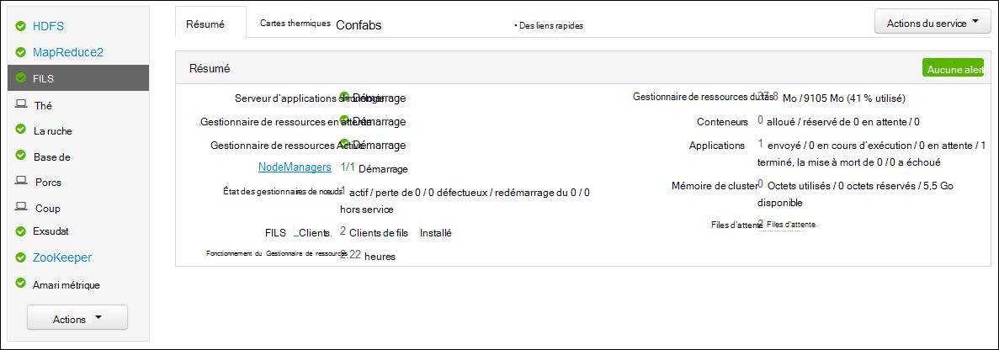
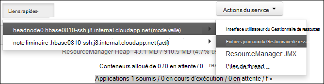

<properties
    pageTitle="Application de fils d’Hadoop Access se connecte basé sur Linux de HDInsight | Microsoft Azure"
    description="Découvrez comment accéder aux journaux d’application fils sur un cluster basé sur Linux HDInsight (Hadoop) à l’aide de la ligne de commande et un navigateur web."
    services="hdinsight"
    documentationCenter=""
    tags="azure-portal"
    authors="Blackmist" 
    manager="jhubbard"
    editor="cgronlun"/>

<tags
    ms.service="hdinsight"
    ms.workload="big-data"
    ms.tgt_pltfrm="na"
    ms.devlang="na"
    ms.topic="article"
    ms.date="10/21/2016"
    ms.author="larryfr"/>

# Application de fils Access ouvre une session sur HDInsight de basé sur Linux 

Ce document explique comment accéder aux journaux des applications de fils (encore une autre ressource négociateur) terminés sur un cluster Hadoop dans Azure HDInsight.

> [AZURE.NOTE] Les informations contenues dans ce document sont spécifiques aux clusters de HDInsight de fonctionnant sous Linux. Pour plus d’informations sur les clusters basés sur Windows, reportez-vous à la section [application de fils d’accès ouvre une session sur HDInsight de basés sur Windows](hdinsight-hadoop-access-yarn-app-logs.md)

## Conditions préalables

* Un cluster basé sur Linux de HDInsight.

* Vous devez [créer un tunnel SSH](hdinsight-linux-ambari-ssh-tunnel.md) avant d’accéder à l’interface utilisateur de ResourceManager journaux web.

## Serveur de montage de fils

Les [Fils de barre de Planning Server](http://hadoop.apache.org/docs/r2.4.0/hadoop-yarn/hadoop-yarn-site/TimelineServer.html) fournit des informations génériques sur les applications terminées ainsi que les informations spécifiques à l’infrastructure application par le biais de deux interfaces différentes. En particulier :

* Stockage et récupération des informations d’application générique sur des clusters de HDInsight a été activé avec la version 3.1.1.374 ou ultérieure.
* Le composant d’informations spécifiques à l’infrastructure application de la barre de Planning Server n’est pas actuellement disponible sur les clusters de HDInsight.

Les types suivants de données incluent des informations génériques sur les applications :

* L’ID d’application, un identificateur unique d’une application
* L’utilisateur qui a démarré l’application.
* Informations sur les tentatives effectuées pour exécuter l’application
* Les conteneurs utilisés par toute tentative par une application donnée

## Les journaux et les applications des fils

FILS prend en charge plusieurs modèles de programmation (MapReduce un d’eux étant) en découplant la gestion des ressources de planification/analyse d’application. Cela s’effectue via un global *ResourceManager* (RM), noeud de travail *NodeManagers* (NMs) et par application *ApplicationMasters* (AMs). L’AM par application négocie des ressources (processeur, mémoire, disque, réseau) pour l’exécution de votre application avec le Gestionnaire de ressources. Le Gestionnaire de ressources travaille avec NMs accorder ces ressources, qui sont accordées en tant que *conteneurs*. L’AM est responsable du suivi de la progression des conteneurs qui lui est assignée par le Gestionnaire de ressources. Une application peut nécessiter de nombreux conteneurs en fonction de la nature de l’application.

En outre, chaque application peut consister en plusieurs *tentatives d’application* afin de terminer en présence de pannes ou à la perte de communication entre un AM et un gestionnaire de ressources. Par conséquent, les conteneurs sont accordés à une tentative spécifique d’une application. Dans un sens, un conteneur fournit le contexte pour l’unité de base du travail effectué par une application de fils, et tout le travail est effectué dans le contexte d’un conteneur est effectué sur le nœud de travail unique sur lequel le conteneur a été alloué. Consultez [Les Concepts de fils] [ YARN-concepts] pour référence ultérieure.

Journaux de l’application (et les journaux de conteneur associées) sont essentiels dans le débogage des applications Hadoop problématiques. FILS fournit un cadre agréable de collecte, d’agrégation et de stocker les journaux d’application avec l' [Agrégation de journaux] [ log-aggregation] fonctionnalité. La fonction d’agrégation de journaux permet l’accès aux journaux d’application plus déterministe, car il regroupe des journaux sur tous les conteneurs sur un nœud du travailleur et les stocke sous la forme d’un fichier journal agrégées par noeud de travail sur le système de fichiers par défaut, une fois une application terminée. Votre application peut utiliser des centaines ou des milliers de conteneurs, mais tous les conteneurs qui s’exécutés sur un nœud de travail unique dans les journaux seront toujours agrégées dans un seul fichier, ce qui résulte dans un fichier journal par nœud de travail utilisé par votre application. Agrégation de journal est activée par défaut sur les clusters de HDInsight (version 3.0 et ultérieure), et agrégées journaux se trouvent dans le conteneur par défaut de votre cluster à l’emplacement suivant :

    wasbs:///app-logs/<user>/logs/<applicationId>

Emplacement, *l’utilisateur* est le nom de l’utilisateur qui a démarré l’application et *applicationId* est l’identificateur unique d’une application, tel qu’assigné par le RM de fils.

Les journaux agrégées ne sont pas lisibles directement, comme elles sont écrites dans un [TFile]de[T-file], [au format binaire] [ binary-format] indexé par conteneur. Vous devez utiliser les outils de la CLI ou de journaux de fils ResourceManager pour afficher ces fichiers journaux au format texte brut pour les applications ou les conteneurs d’intérêt. 

##Outils de l’interface CLI de fils

Pour utiliser les outils de l’interface CLI de fils, vous devez vous connecter au cluster HDInsight à l’aide de SSH. Pour plus d’informations sur l’utilisation de SSH avec HDInsight, utilisez un des documents suivants :

- [Utiliser le protocole SSH avec basé sur Linux d’Hadoop sur HDInsight à partir d’OS X, Unix ou Linux](hdinsight-hadoop-linux-use-ssh-unix.md)

- [Utiliser le protocole SSH avec basé sur Linux d’Hadoop sur HDInsight à partir de Windows](hdinsight-hadoop-linux-use-ssh-windows.md)
    
Vous pouvez afficher ces fichiers journaux au format texte brut en exécutant une des commandes suivantes :

    yarn logs -applicationId <applicationId> -appOwner <user-who-started-the-application>
    yarn logs -applicationId <applicationId> -appOwner <user-who-started-the-application> -containerId <containerId> -nodeAddress <worker-node-address>
    
Vous devez spécifier le &lt;applicationId >, &lt;utilisateur qui-démarré-applications >, &lt;Id_conteneur >, et & adresse de nœud ltworker > informations lors de l’exécution de ces commandes.

##Interface utilisateur de ResourceManager fils

L’interface utilisateur de fils ResourceManager s’exécute sur le headnode de cluster et peuvent être accessibles via le web de Ambari l’interface utilisateur ; Toutefois, vous devez d’abord [créer un tunnel SSH](hdinsight-linux-ambari-ssh-tunnel.md) avant de pouvoir accéder le ResourceManager UI.

Une fois que vous avez créé un tunnel SSH, procédez comme suit pour afficher les journaux de fils :

1. Dans votre navigateur web, accédez à https://CLUSTERNAME.azurehdinsight.net. Remplacez NOM_CLUSTER par le nom de votre cluster HDInsight.

2. Dans la liste des services sur la gauche, sélectionnez __fils__.

    

3. Dans la liste déroulante __Liens rapides__ , sélectionnez un des nœuds de tête du cluster, puis __Journal de ResourceManager__.

    
    
    S’affiche avec une liste de liens vers les journaux de fils.

[YARN-timeline-server]:http://hadoop.apache.org/docs/r2.4.0/hadoop-yarn/hadoop-yarn-site/TimelineServer.html
[log-aggregation]:http://hortonworks.com/blog/simplifying-user-logs-management-and-access-in-yarn/
[T-file]:https://issues.apache.org/jira/secure/attachment/12396286/TFile%20Specification%2020081217.pdf
[binary-format]:https://issues.apache.org/jira/browse/HADOOP-3315
[YARN-concepts]:http://hortonworks.com/blog/apache-hadoop-yarn-concepts-and-applications/
