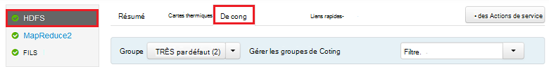
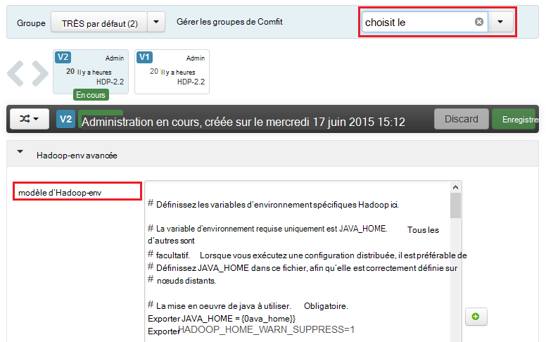
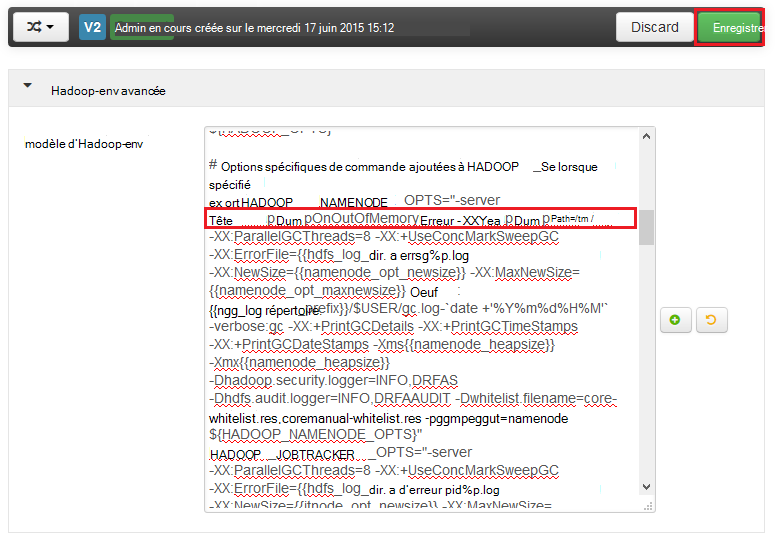
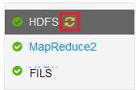
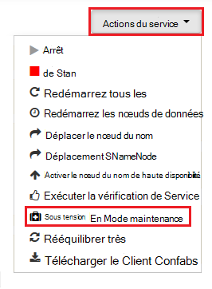
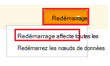

<properties
    pageTitle="Activer des dumps de tas pour les services d’Hadoop sur HDInsight | Microsoft Azure"
    description="Activer des dumps de tas pour services Hadoop les clusters basés sur Linux de HDInsight pour le débogage et d’analyse."
    services="hdinsight"
    documentationCenter=""
    authors="Blackmist"
    manager="jhubbard"
    editor="cgronlun"
    tags="azure-portal"/>

<tags
    ms.service="hdinsight"
    ms.workload="big-data"
    ms.tgt_pltfrm="na"
    ms.devlang="na"
    ms.topic="article"
    ms.date="09/27/2016"
    ms.author="larryfr"/>

#Activer des dumps de tas pour les services d’Hadoop sur basé sur Linux HDInsight (aperçu)

[AZURE.INCLUDE [heapdump-selector](../../includes/hdinsight-selector-heap-dump.md)]

Dumps de tas contiennent un instantané de la mémoire de l’application, y compris les valeurs des variables au moment de que la création de l’image. Pour qu’ils soient très utiles pour diagnostiquer des problèmes qui se produisent au moment de l’exécution.

> [AZURE.NOTE] Les informations contenues dans cet article ne s’applique qu’à la HDInsight de fonctionnant sous Linux. Pour plus d’informations sur les HDInsight de basés sur Windows, reportez-vous à la section [Activer les dumps de tas pour les services d’Hadoop sur HDInsight de basés sur Windows](hdinsight-hadoop-collect-debug-heap-dumps.md)

## Services

Vous pouvez activer des dumps de tas pour les services suivants :

*  **hcatalog** - tempelton
*  **ruche** - hiveserver2, metastore, derbyserver
*  **mapreduce** - jobhistoryserver
*  **fils** - resourcemanager, nodemanager, timelineserver
*  **très** - datanode, secondarynamenode, namenode

Vous pouvez également activer des dumps de tas pour le mappage et réduire les processus exécutaient par HDInsight.

## Configuration du dump du tas de présentation

Dumps de tas sont activés en passant des options (parfois appelés choisit, ou paramètres) pour la machine virtuelle Java lors du démarrage d’un service. Pour la plupart des services d’Hadoop, cela est possible en modifiant le script du shell utilisé pour démarrer le service.

Dans chaque script, il existe une exportation pour ** \* \_se**, qui contient les options passées à la machine virtuelle Java. Par exemple, dans le script **hadoop-env.sh** , la ligne qui commence par `export HADOOP_NAMENODE_OPTS=` contient les options pour le service NameNode.

Mapper et de réduire les processus sont légèrement différents, comme il s’agit d’un processus enfant du service MapReduce. Chaque mappage ou réduire les processus qui s’exécute dans un conteneur enfant, et il y a deux entrées qui contiennent les options JVM pour ces. Tous deux contenus dans **site.xml-mapred**:

* **MapReduce.Admin.Map.Child.Java.OPTS**
* **MapReduce.Admin.reduce.Child.Java.OPTS**

> [AZURE.NOTE] Nous recommandons d’utiliser Ambari pour modifier les scripts et les paramètres de le mapred-site.xml, comme Ambari prendra en charge la réplication des modifications sur les nœuds du cluster. Consultez la section [Ambari de l’aide](#using-ambari) pour connaître les étapes spécifiques.

###Activer des dumps de tas

L’option suivante permet des dumps de tas lorsqu’une OutOfMemoryError se produit :

    -XX:+HeapDumpOnOutOfMemoryError

Le **+** indique que cette option est activée. La valeur par défaut est désactivé.

> [AZURE.WARNING] Dumps de tas ne sont pas activés pour les services d’Hadoop sur HDInsight par défaut, comme les fichiers dump peuvent être volumineux. Si vous activez les pour la résolution des problèmes, pensez à les désactiver après avoir reproduit le problème et collecter les fichiers de vidage.

###Emplacement de l’image

L’emplacement par défaut pour le fichier de vidage est le répertoire de travail actuel. Vous pouvez contrôler où le fichier est stocké à l’aide de l’option suivante :

    -XX:HeapDumpPath=/path

Par exemple, à l’aide de `-XX:HeapDumpPath=/tmp` provoque le vidage sont stockées dans le répertoire /tmp.

###Scripts

Vous pouvez également déclencher un script lorsqu’un **OutOfMemoryError** se produit. Par exemple, pour déclencher une notification afin que vous sachiez que l’erreur s’est produite. Cette opération est contrôlée à l’aide de l’option suivante :

    -XX:OnOutOfMemoryError=/path/to/script

> [AZURE.NOTE] Hadoop étant un système distribué, n’importe quel script utilisé doit être placé sur le cluster que le service s’exécute sur tous les nœuds.
>
> Le script doit également être dans un emplacement accessible par le compte que le service s’exécute en tant qu’et doit fournir les autorisations d’exécution. Par exemple, vous pouvez souhaiter stocker les scripts de `/usr/local/bin` et `chmod go+rx /usr/local/bin/filename.sh` à accorder de lecture et d’exécution.

##À l’aide de Ambari

Pour modifier la configuration d’un service, procédez comme suit :

1. Ouvrez l’interface utilisateur du web Ambari pour votre cluster. L’URL sera https://YOURCLUSTERNAME.azurehdinsight.net.

    Lorsque vous y êtes invité, s’authentifier sur le site en utilisant le nom du compte HTTP (par défaut : administrateur,) et le mot de passe de votre cluster.

    > [AZURE.NOTE] Vous devrez peut-être utiliser une deuxième fois par Ambari le nom d’utilisateur et mot de passe. Si tel est le cas, simplement retaper le même nom de compte et le mot de passe

2. À l’aide de la liste de gauche, sélectionnez la zone de service que vous souhaitez modifier. Par exemple, **très**. Dans la zone centrale, sélectionnez l’onglet **configurations** .

    

3. Avec l’entrée de **filtre...** , entrez **choisit**. Ce filtre la liste des éléments de configuration uniquement à ceux contenant ce texte et est un moyen rapide de trouver le script shell, ou le **modèle** qui peut être utilisé pour définir ces options.

    

4. Trouver la ** \* \_se** entrée pour le service que vous souhaitez activer des dumps de tas pour et ajouter les options que vous souhaitez activer. Dans l’image ci-dessous, j’ai ajouté `-XX:+HeapDumpOnOutOfMemoryError -XX:HeapDumpPath=/tmp/` à le **HADOOP\_NAMENODE\_se** entrée :

    

    > [AZURE.NOTE] Lors de l’activation de tas vide pour le mappage ou réduire le processus enfant, ressemblera à la place de champs intitulée **mapreduce.admin.map.child.java.opts** et **mapreduce.admin.reduce.child.java.opts**.

    Utilisez le bouton **Enregistrer** pour enregistrer les modifications. Vous pourrez entrer une note décrivant les modifications apportées.

5. Une fois que les modifications ont été appliquées, l’icône de **redémarrage requis** s’affiche en regard d’un ou plusieurs services.

    

6. Sélectionnez chaque service nécessitant un redémarrage et utilisez le bouton de **Service Actions** **Activer sur en Mode**de Maintenance. Cela empêche les alertes à partir de ce service en cours de génération lorsque vous le redémarrez.

    

7. Une fois vous avez activé le mode de maintenance, cliquez sur le bouton **redémarrer** pour le service à **Redémarrer le effectuées toutes les**

    

    > [AZURE.NOTE] les entrées pour le bouton de **redémarrage** peuvent être différentes pour les autres services.

8. Une fois que les services ont été redémarrés, utilisez le bouton **Actions de Service** à **Activer en Mode Maintenance**. Ce Ambari pour reprendre la surveillance des alertes pour le service.
