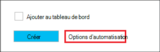

<properties
   pageTitle="Créer les clusters basés sur Linux de Hadoop dans HDInsight à l’aide des modèles du Gestionnaire de ressources Azure | Microsoft Azure"
    description="Apprenez à créer des clusters pour HDInsight Azure à l’aide des modèles du Gestionnaire de ressources Azure Azure."
   services="hdinsight"
   documentationCenter=""
   tags="azure-portal"
   authors="mumian"
   manager="jhubbard"
   editor="cgronlun"/>

<tags
   ms.service="hdinsight"
   ms.devlang="na"
   ms.topic="article"
   ms.tgt_pltfrm="na"
   ms.workload="big-data"
   ms.date="09/02/2016"
   ms.author="jgao"/>

# Créer les clusters basés sur Linux de Hadoop dans HDInsight à l’aide des modèles du Gestionnaire de ressources Azure

[AZURE.INCLUDE [selector](../../includes/hdinsight-selector-create-clusters.md)]

Apprenez à créer des clusters HDInsight à l’aide de modèles de Manager(ARM) de ressources Azure. Pour plus d’informations, voir [déploiement d’une application avec le modèle de gestionnaire de ressources Azure](../resource-group-template-deploy.md). Pour autre création du cluster les fonctionnalités et outils cliquez sur l’onglet, sélectionnez en haut de cette page ou [les méthodes de création de Cluster](hdinsight-provision-clusters.md#cluster-creation-methods).

##Conditions préalables :

[AZURE.INCLUDE [delete-cluster-warning](../../includes/hdinsight-delete-cluster-warning.md)]

Avant de commencer les instructions de cet article, vous devez disposer des éléments suivants :

- [Abonnement azure](https://azure.microsoft.com/documentation/videos/get-azure-free-trial-for-testing-hadoop-in-hdinsight/).
- CLI de PowerShell Azure et/ou Azure

    [AZURE.INCLUDE [use-latest-version](../../includes/hdinsight-use-latest-powershell-and-cli.md)]

### Exigences de contrôle d’accès

[AZURE.INCLUDE [access-control](../../includes/hdinsight-access-control-requirements.md)]

## Modèles du Gestionnaire de ressources

Modèle de gestionnaire de ressources facilite la créer des clusters de HDInsight, leurs ressources dépendantes (par exemple, le compte de stockage par défaut) et d’autres ressources (telles que SQL Azure base de données à utiliser Apache Sqoop) pour votre application dans une opération unique et coordonnée. Dans le modèle, vous définissez les ressources qui sont nécessaires à l’application et spécifiez les paramètres de déploiement pour entrer des valeurs pour les différents environnements. Le modèle est composé de JSON et des expressions que vous pouvez utiliser pour construire des valeurs pour votre déploiement.

Un modèle de gestionnaire de ressources pour la création d’un HDInsight cluster et le compte de stockage Azure dépendant se trouvent dans [L’annexe A](#appx-a-arm-template). Utilisez multiplates-formes [VSCode](https://code.visualstudio.com/#alt-downloads) avec un éditeur de texte ou de l' [extension du Gestionnaire de ressources](https://marketplace.visualstudio.com/items?itemName=msazurermtools.azurerm-vscode-tools) pour enregistrer le modèle dans un fichier sur votre station de travail. Vous allez apprendre à appeler le modèle à l’aide de différentes méthodes.

Pour plus d’informations sur le modèle du Gestionnaire de ressources, reportez-vous à la section.

- [Modèles du Gestionnaire de ressources Azure auteur](../resource-group-authoring-templates.md)
- [Déployer une application avec le modèle de gestionnaire de ressources Azure](../resource-group-template-deploy.md)

Pour connaître le schéma JSON pour certains éléments, vous pouvez suivre la procédure suivante :

1. Ouvrez le [portail Azure](https://porta.azure.com) pour créer un cluster HDInsight.  Consultez [basé sur Linux de créer des clusters dans HDInsight à l’aide du portail Azure](hdinsight-hadoop-create-linux-clusters-portal.md).
2. Configurer les éléments requis et les éléments que vous avez besoin du schéma JSON.
3. Avant de cliquer sur **créer**, cliquez sur **options d’automatisation** , comme illustré dans la capture d’écran suivante :

    

    Le portail crée un modèle de gestionnaire de ressources basé sur vos configurations.
## Déployer avec PowerShell

La procédure suivante crée un cluster d’HDInsight de fonctionnant sous Linux.

**Pour déployer un cluster à l’aide du Gestionnaire de ressources du modèle**

1. Enregistrez le fichier de json dans [l’annexe A](#appx-a-arm-template) à votre station de travail. Dans le script PowerShell, le nom de fichier est *C:\HDITutorials-ARM\hdinsight-arm-template.json*.
2. Définir les paramètres et les variables si nécessaire.
3. Exécutez le modèle à l’aide du script PowerShell suivant :

        ####################################
        # Set these variables
        ####################################
        #region - used for creating Azure service names
        $nameToken = "<Enter an Alias>" 
        $templateFile = "C:\HDITutorials-ARM\hdinsight-arm-template.json"
        #endregion

        ####################################
        # Service names and varialbes
        ####################################
        #region - service names
        $namePrefix = $nameToken.ToLower() + (Get-Date -Format "MMdd")

        $resourceGroupName = $namePrefix + "rg"
        $hdinsightClusterName = $namePrefix + "hdi"
        $defaultStorageAccountName = $namePrefix + "store"
        $defaultBlobContainerName = $hdinsightClusterName

        $location = "East US 2"

        $armDeploymentName = $namePrefix
        #endregion

        ####################################
        # Connect to Azure
        ####################################
        #region - Connect to Azure subscription
        Write-Host "`nConnecting to your Azure subscription ..." -ForegroundColor Green
        try{Get-AzureRmContext}
        catch{Login-AzureRmAccount}
        #endregion

        # Create a resource group
        New-AzureRmResourceGroup -Name $resourceGroupName -Location $Location

        # Create cluster and the dependent storage accounge
        $parameters = @{clusterName="$hdinsightClusterName"}

        New-AzureRmResourceGroupDeployment `
            -Name $armDeploymentName `
            -ResourceGroupName $resourceGroupName `
            -TemplateFile $templateFile `
            -TemplateParameterObject $parameters

        # List cluster
        Get-AzureRmHDInsightCluster -ResourceGroupName $resourceGroupName -ClusterName $hdinsightClusterName 

    Le script PowerShell configure uniquement le nom du cluster. Le nom de compte de stockage est codé en dur dans le modèle. Vous serez invité à entrer le cluster utilisateur mot de passe (le nom d’utilisateur par défaut est *admin*) ; et le mot de passe utilisateur SSH (nom d’utilisateur SSH par défaut est *sshuser*).  
    
Pour plus d’informations, voir [déploiement avec PowerShell](../resource-group-template-deploy.md#deploy-with-powershell).

## Déployer avec l’interface CLI Azure

L’exemple suivant crée un cluster, un compte de stockage dépendant et son conteneur en appelant un modèle du Gestionnaire de ressources :

    azure login
    azure config mode arm
    azure group create -n hdi1229rg -l "East US"
    azure group deployment create --resource-group "hdi1229rg" --name "hdi1229" --template-file "C:\HDITutorials-ARM\hdinsight-arm-template.json"
    
Vous devrez entrer le nom du cluster, passe du cluster (le nom d’utilisateur par défaut est *admin*) et le mot de passe utilisateur SSH (nom d’utilisateur SSH par défaut est *sshuser*). Pour fournir les paramètres en ligne :

    azure group deployment create --resource-group "hdi1229rg" --name "hdi1229" --template-file "c:\Tutorials\HDInsightARM\create-linux-based-hadoop-cluster-in-hdinsight.json" --parameters '{\"clusterName\":{\"value\":\"hdi1229\"},\"clusterLoginPassword\":{\"value\":\"Pass@word1\"},\"sshPassword\":{\"value\":\"Pass@word1\"}}'

## Déployer avec l’API REST

Consultez [déploiement avec l’API REST](../resource-group-template-deploy.md#deploy-with-the-rest-api).

## Déployer avec Visual Studio

Avec Visual Studio, vous pouvez créer un projet de groupe de ressources et le déployer vers Azure via l’interface utilisateur. Vous sélectionnez le type de ressources à inclure dans votre projet, et ces ressources sont automatiquement ajoutés au modèle du Gestionnaire de ressources. Le projet fournit également un script PowerShell pour déployer le modèle.

Pour une introduction aux groupes de ressources à l’aide de Visual Studio, consultez [Création et le déploiement de groupes de ressources Azure via Visual Studio](../vs-azure-tools-resource-groups-deployment-projects-create-deploy.md).

##Étapes suivantes
Dans cet article, vous avez appris les différentes façons de créer un cluster de HDInsight. Pour plus d’informations, consultez les articles suivants :

- Pour obtenir un exemple de déploiement de ressources par le biais de la bibliothèque cliente .NET, reportez-vous à la section [ressources de déploiement à l’aide de bibliothèques .NET et un modèle](../virtual-machines/virtual-machines-windows-csharp-template.md).
- Pour obtenir un exemple détaillé de déploiement d’une application, consultez [disposition et déployer microservices prévisible dans Azure](../app-service-web/app-service-deploy-complex-application-predictably.md).
- Pour obtenir des instructions sur le déploiement de votre solution aux différents environnements, consultez [développement et des environnements de test de Microsoft Azure](../solution-dev-test-environments.md).
- Pour obtenir des informations sur les sections du modèle de gestionnaire de ressources Azure, consultez [modèles de création](../resource-group-authoring-templates.md).
- Pour obtenir une liste des fonctions que vous pouvez utiliser dans un modèle de gestionnaire de ressources Azure, consultez [fonctions de modèle](../resource-group-template-functions.md).

##Modèle de gestionnaire de ressources AppX-a :

Le modèle de gestionnaire de ressources Azure suivant crée un cluster de Hadoop de basé sur Linux avec le compte de stockage Azure dépendant. 

> [AZURE.NOTE] L’exemple inclut des informations de configuration pour la ruche metastore et Oozie metastore.  Supprimer la section ou la configuration de la section avant d’utiliser le modèle.

    {
    "$schema": "https://schema.management.azure.com/schemas/2015-01-01/deploymentTemplate.json#",
    "contentVersion": "1.0.0.0",
    "parameters": {
        "clusterName": {
        "type": "string",
        "metadata": {
            "description": "The name of the HDInsight cluster to create."
        }
        },
        "clusterLoginUserName": {
        "type": "string",
        "defaultValue": "admin",
        "metadata": {
            "description": "These credentials can be used to submit jobs to the cluster and to log into cluster dashboards."
        }
        },
        "clusterLoginPassword": {
        "type": "securestring",
        "metadata": {
            "description": "The password must be at least 10 characters in length and must contain at least one digit, one non-alphanumeric character, and one upper or lower case letter."
        }
        },
        "sshUserName": {
        "type": "string",
        "defaultValue": "sshuser",
        "metadata": {
            "description": "These credentials can be used to remotely access the cluster."
        }
        },
        "sshPassword": {
        "type": "securestring",
        "metadata": {
            "description": "The password must be at least 10 characters in length and must contain at least one digit, one non-alphanumeric character, and one upper or lower case letter."
        }
        },
        "location": {
        "type": "string",
        "defaultValue": "East US",
        "allowedValues": [
            "East US",
            "East US 2",
            "North Central US",
            "South Central US",
            "West US",
            "North Europe",
            "West Europe",
            "East Asia",
            "Southeast Asia",
            "Japan East",
            "Japan West",
            "Australia East",
            "Australia Southeast"
        ],
        "metadata": {
            "description": "The location where all azure resources will be deployed."
        }
        },
        "clusterType": {
        "type": "string",
        "defaultValue": "hadoop",
        "allowedValues": [
            "hadoop",
            "hbase",
            "storm",
            "spark"
        ],
        "metadata": {
            "description": "The type of the HDInsight cluster to create."
        }
        },
        "clusterWorkerNodeCount": {
        "type": "int",
        "defaultValue": 2,
        "metadata": {
            "description": "The number of nodes in the HDInsight cluster."
        }
        }
    },
    "variables": {
        "defaultApiVersion": "2015-05-01-preview",
        "clusterApiVersion": "2015-03-01-preview",
        "clusterStorageAccountName": "[concat(parameters('clusterName'),'store')]"
    },
    "resources": [
        {
        "name": "[variables('clusterStorageAccountName')]",
        "type": "Microsoft.Storage/storageAccounts",
        "location": "[parameters('location')]",
        "apiVersion": "[variables('defaultApiVersion')]",
        "dependsOn": [ ],
        "tags": { },
        "properties": {
            "accountType": "Standard_LRS"
        }
        },
        {
        "name": "[parameters('clusterName')]",
        "type": "Microsoft.HDInsight/clusters",
        "location": "[parameters('location')]",
        "apiVersion": "[variables('clusterApiVersion')]",
        "dependsOn": [ "[concat('Microsoft.Storage/storageAccounts/',variables('clusterStorageAccountName'))]" ],
        "tags": {

        },
        "properties": {
            "clusterVersion": "3.4",
            "osType": "Linux",
            "tier": "standard",
            "clusterDefinition": {
            "kind": "[parameters('clusterType')]",
            "configurations": {
                "gateway": {
                "restAuthCredential.isEnabled": true,
                "restAuthCredential.username": "[parameters('clusterLoginUserName')]",
                "restAuthCredential.password": "[parameters('clusterLoginPassword')]"
                },
                "hive-site": {
                    "javax.jdo.option.ConnectionDriverName": "com.microsoft.sqlserver.jdbc.SQLServerDriver",
                    "javax.jdo.option.ConnectionURL": "jdbc:sqlserver://myadla0901dbserver.database.windows.net;database=myhive20160901;encrypt=true;trustServerCertificate=true;create=false;loginTimeout=300",
                    "javax.jdo.option.ConnectionUserName": "johndole",
                    "javax.jdo.option.ConnectionPassword": "myPassword$"
                },
                "hive-env": {
                    "hive_database": "Existing MSSQL Server database with SQL authentication",
                    "hive_database_name": "myhive20160901",
                    "hive_database_type": "mssql",
                    "hive_existing_mssql_server_database": "myhive20160901",
                    "hive_existing_mssql_server_host": "myadla0901dbserver.database.windows.net",
                    "hive_hostname": "myadla0901dbserver.database.windows.net"
                },
                "oozie-site": {
                    "oozie.service.JPAService.jdbc.driver": "com.microsoft.sqlserver.jdbc.SQLServerDriver",
                    "oozie.service.JPAService.jdbc.url": "jdbc:sqlserver://myadla0901dbserver.database.windows.net;database=myhive20160901;encrypt=true;trustServerCertificate=true;create=false;loginTimeout=300",
                    "oozie.service.JPAService.jdbc.username": "johndole",
                    "oozie.service.JPAService.jdbc.password": "myPassword$",
                    "oozie.db.schema.name": "oozie"
                },
                "oozie-env": {
                    "oozie_database": "Existing MSSQL Server database with SQL authentication",
                    "oozie_database_name": "myhive20160901",
                    "oozie_database_type": "mssql",
                    "oozie_existing_mssql_server_database": "myhive20160901",
                    "oozie_existing_mssql_server_host": "myadla0901dbserver.database.windows.net",
                    "oozie_hostname": "myadla0901dbserver.database.windows.net"
                }            
            }
            },
            "storageProfile": {
            "storageaccounts": [
                {
                "name": "[concat(variables('clusterStorageAccountName'),'.blob.core.windows.net')]",
                "isDefault": true,
                "container": "[parameters('clusterName')]",
                "key": "[listKeys(resourceId('Microsoft.Storage/storageAccounts', variables('clusterStorageAccountName')), variables('defaultApiVersion')).key1]"
                }
            ]
            },
            "computeProfile": {
            "roles": [
                {
                "name": "headnode",
                "targetInstanceCount": "2",
                "hardwareProfile": {
                    "vmSize": "Standard_D3"
                },
                "osProfile": {
                    "linuxOperatingSystemProfile": {
                    "username": "[parameters('sshUserName')]",
                    "password": "[parameters('sshPassword')]"
                    }
                }
                },
                {
                "name": "workernode",
                "targetInstanceCount": "[parameters('clusterWorkerNodeCount')]",
                "hardwareProfile": {
                    "vmSize": "Standard_D3"
                },
                "osProfile": {
                    "linuxOperatingSystemProfile": {
                    "username": "[parameters('sshUserName')]",
                    "password": "[parameters('sshPassword')]"
                    }
                }
                }
            ]
            }
        }
        }
    ],
    "outputs": {
        "cluster": {
        "type": "object",
        "value": "[reference(resourceId('Microsoft.HDInsight/clusters',parameters('clusterName')))]"
        }
    }
    }
