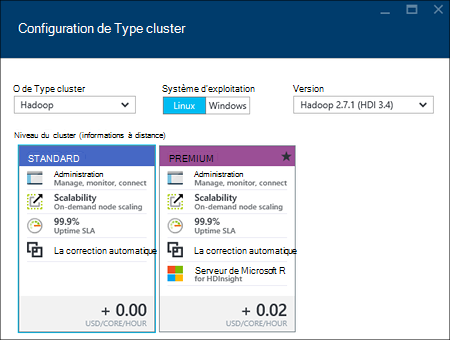

<properties
    pageTitle="Créer des clusters Hadoop, HBase, tempête ou étincelle sur Linux dans l’utilisation du portail de HDInsight | Microsoft Azure"
    description="Apprenez à créer des clusters Hadoop, HBase, tempête ou étincelle sous Linux pour HDInsight à l’aide d’un navigateur web et le portail Azure aperçu."
    services="hdinsight"
    documentationCenter=""
    authors="nitinme"
    manager="jhubbard"
    editor="cgronlun"
    tags="azure-portal"/>

<tags
    ms.service="hdinsight"
    ms.devlang="na"
    ms.topic="article"
    ms.tgt_pltfrm="na"
    ms.workload="big-data"
    ms.date="10/05/2016"
    ms.author="nitinme"/>

#Créer des grappes de serveurs Linux dans HDInsight à l’aide du portail Azure

[AZURE.INCLUDE [selector](../../includes/hdinsight-selector-create-clusters.md)]

Le portail Azure est un outil de gestion basée sur le web pour les services et les ressources hébergées dans le cloud de Microsoft Azure. Dans cet article, vous apprendrez à créer des clusters basés sur Linux de HDInsight l’aide du portail.

## Conditions préalables

[AZURE.INCLUDE [delete-cluster-warning](../../includes/hdinsight-delete-cluster-warning.md)]

- **Abonnement d’un Azure**. Consultez [Azure d’obtenir la version d’évaluation gratuite](https://azure.microsoft.com/documentation/videos/get-azure-free-trial-for-testing-hadoop-in-hdinsight/).
- __Un navigateur web moderne__. Le portail Azure utilise HTML5 et Javascript et peuvent ne pas fonctionne correctement dans les anciens navigateurs web.

### Exigences de contrôle d’accès

[AZURE.INCLUDE [access-control](../../includes/hdinsight-access-control-requirements.md)]

##Créer des clusters

Le portail Azure expose la plupart des propriétés du cluster. À l’aide du modèle d’Azure le Gestionnaire de ressources, vous pouvez masquer un grand nombre de détails. Pour plus d’informations, reportez-vous à la section [Hadoop de basé sur Linux de créer des clusters dans HDInsight à l’aide des modèles du Gestionnaire de ressources Azure](hdinsight-hadoop-create-linux-clusters-arm-templates.md).

1. Connectez-vous au [portail Azure](https://portal.azure.com).

2. Cliquez sur **Nouveau**et cliquez sur **Données Analytique**, puis cliquez sur **HDInsight**.

    ![Création d’un nouveau cluster dans le portail Azure] (./media/hdinsight-hadoop-create-linux-cluster-portal/HDI.CreateCluster.1.png "Création d’un nouveau cluster dans le portail Azure")
3. Entrez le **Nom de Cluster**: ce nom doit être unique.
4. Cliquez sur **Sélectionner le Type de cluster**, puis sélectionnez :

    - **Type de cluster**: Si vous ne savez pas quelle option choisir, sélectionnez **Hadoop**. Il est le type de cluster le plus répandu.

        > [AZURE.IMPORTANT] HDInsight clusters sont dotés de types qui correspondent à la charge de travail ou de la technologie de cluster est réglé pour. Il n’existe aucune méthode prise en charge pour créer un cluster qui combine plusieurs types, tels que tempête et HBase sur un cluster. 

    - **Système d’exploitation**: sélectionnez **Linux**.
    - **Version**: utiliser la version par défaut si vous ne savez pas quelle solution choisir. Pour plus d’informations, consultez [versions de cluster HDInsight](hdinsight-component-versioning.md).
    - **Couche de cluster**: HDInsight d’Azure fournit les offres de nuage de données volumineuses dans deux catégories : les couches Standard et Premium. Pour plus d’informations, consultez [niveaux de Cluster](hdinsight-hadoop-provision-linux-clusters.md#cluster-tiers).
    
    

4. Cliquez sur l' **abonnement** pour sélectionner l’abonnement Azure qui sera utilisé pour le cluster.

5. Cliquez sur le **Groupe de ressources** pour sélectionner un groupe de ressources existant, ou cliquez sur **Nouveau** pour créer un nouveau groupe de ressources

    > [AZURE.NOTE] Cette entrée par défaut dans l’un de vos groupes de ressource existants, si elles sont disponibles.

6. Cliquez sur les **informations d’identification** et puis entrez un mot de passe de l’utilisateur admin. Vous devez également entrer un **Nom d’utilisateur SSH** et un **mot de passe** ou **Clé publique**, qui sera utilisé pour authentifier l’utilisateur SSH. À l’aide d’une clé publique est l’approche recommandée. Dans la partie inférieure pour enregistrer la configuration des informations d’identification, cliquez sur **Sélectionner** .

    ![Informations d’identification du cluster de fournir] (./media/hdinsight-hadoop-create-linux-cluster-portal/HDI.CreateCluster.3.png "Informations d’identification du cluster de fournir")

    Pour plus d’informations sur l’utilisation de SSH avec HDInsight, consultez les articles suivants :

    * [Utiliser le protocole SSH avec basé sur Linux d’Hadoop sur HDInsight à partir d’OS X, Unix ou Linux](hdinsight-hadoop-linux-use-ssh-unix.md)
    * [Utiliser le protocole SSH avec basé sur Linux d’Hadoop sur HDInsight à partir de Windows](hdinsight-hadoop-linux-use-ssh-windows.md)

7. Cliquez sur la **Source de données** pour choisir une source de données existante pour le cluster, ou créez-en un nouveau.

    ![Lame de source de données] (./media/hdinsight-hadoop-create-linux-cluster-portal/HDI.CreateCluster.4.png "Fournissez des données de configuration de la source")

    Actuellement, vous pouvez sélectionner un compte de stockage Azure comme source de données pour un cluster de HDInsight. Utilisez ce qui suit pour comprendre les écritures sur la lame de **Source de données** .

    - **Méthode de sélection**: définir **à partir de tous les abonnements** pour activer la recherche des comptes de stockage de tous vos abonnements. Définir de **Touche d’accès rapide** si vous souhaitez entrer le **Nom de stockage** et de la **Touche d’accès rapide** d’un compte de stockage existant.

    - **Sélectionnez le compte de stockage / New**: cliquez sur **Sélectionner le compte de stockage** pour parcourir et sélectionner un compte de stockage existant à associer avec le cluster. Ou bien, cliquez sur **Nouveau** pour créer un nouveau compte de stockage. Utilisez le champ qui s’affiche permet d’entrer le nom du compte de stockage. Une coche verte s’affiche si le nom est disponible.

    - **Choisissez le conteneur par défaut**: utilisez cette option pour entrer le nom du conteneur par défaut à utiliser pour le cluster. Vous pouvez entrer ici n’importe quel nom, mais nous vous recommandons utilisant le même nom que le cluster de sorte que vous pouvez facilement reconnaître que le conteneur est utilisé pour ce cluster spécifique.

    - **Emplacement**: la région géographique du compte de stockage, ou sera créé dans.

        > [AZURE.IMPORTANT] Sélection de l’emplacement de la source de données par défaut sera permet également de définir l’emplacement du cluster HDInsight. La source de données par défaut et le cluster doit se trouver dans la même région.
        
    - **Identité du DAS cluster**: en le configurant, vous rendez le cluster accessible aux magasins lac de données Azure en fonction de la configuration DAS.

    Cliquez sur **Sélectionner** pour enregistrer la configuration de source de données.

8. Cliquez sur **Niveaux de tarification de nœud** afin d’afficher des informations sur les nœuds qui va être créé pour ce cluster. Définir le nombre de nœuds de traitement dont vous avez besoin pour le cluster. Le coût estimé du cluster est affiché au sein de la lame.

    ![Lame de niveaux de tarification nœud] (./media/hdinsight-hadoop-create-linux-cluster-portal/HDI.CreateCluster.5.png "Spécifiez le numéro de nœuds de cluster")
    
    > [AZURE.IMPORTANT] Si vous prévoyez de plus de 32 nœuds de travailleur, lors de la création du cluster ou en redimensionnant le cluster après sa création, vous devez sélectionner une taille de nœud de tête avec au moins 8 cœurs et 14 Go de ram.
    >
    > Pour plus d’informations sur les tailles de nœud et les coûts associés, reportez-vous à la section [HDInsight de tarification](https://azure.microsoft.com/pricing/details/hdinsight/).

    Cliquez sur **Sélectionner** pour enregistrer la configuration de tarification du nœud.

9. Cliquez sur **Configuration facultative** pour sélectionner la version de cluster, ainsi que configurer d’autres paramètres facultatifs, tels que l’affiliation à un **Réseau virtuel**, configurer un **Metastore externe** pour stocker les données de ruche et Oozie, utilisez des Actions de Script pour personnaliser un cluster pour installer des composants personnalisés ou utiliser des comptes de stockage supplémentaire avec le cluster.

    * **Réseau virtuel**: sélectionnez un réseau virtuel Azure et le sous-réseau si vous souhaitez placer le cluster en un réseau virtuel.  

        ![Lame de réseau virtuel] (./media/hdinsight-hadoop-create-linux-cluster-portal/HDI.CreateCluster.6.png "Détails du réseau virtuel Spécifiez")

        Pour plus d’informations sur l’utilisation de HDInsight avec un réseau virtuel, y compris la configuration spécifique requise pour le réseau virtuel, voir [HDInsight d’étendre les fonctionnalités à l’aide d’un réseau virtuel d’Azure](hdinsight-extend-hadoop-virtual-network.md).

    * Cliquez sur **Metastores externes** pour spécifier une base de données SQL que vous souhaitez utiliser pour enregistrer les métadonnées ruche et Oozie avec le cluster.
    
        > [AZURE.NOTE] Configuration de Metastore n’est pas disponible pour les types de cluster HBase.

        ![Lame de metastores personnalisé] (./media/hdinsight-hadoop-create-linux-cluster-portal/HDI.CreateCluster.7.png "Spécifier les metastores externes")

        Pour **utiliser une base de données SQL existante pour la ruche de** métadonnées, cliquez sur **Oui**, sélectionnez une base de données SQL et ensuite fournir le nom d’utilisateur/mot de passe pour la base de données. Répétez ces étapes si vous souhaitez **utiliser une base de données SQL existante pour les métadonnées de la Oozie**. Jusqu'à ce que vous êtes sur la lame de **Configuration facultatives** , cliquez sur **Sélectionner** .

        >[AZURE.NOTE] La base de données Azure SQL utilisé pour le metastore doit permettre la connectivité à d’autres services Azure, y compris les HDInsight d’Azure. Dans le tableau de bord Azure SQL de base de données sur le côté droit, cliquez sur le nom du serveur. Il s’agit du serveur sur lequel l’instance de base de données SQL est en cours d’exécution. Une fois vous êtes dans la vue du serveur, cliquez sur **configurer**, puis cliquez sur **Oui**pour les **Services d’Azure**, et puis cliquez sur **Enregistrer**.

        &nbsp;

        > [AZURE.IMPORTANT] Lors de la création d’un metastore, n’utilisez pas un nom de base de données qui contient des tirets ou des traits d’union, cela peut entraîner l’échec du processus de création cluster.

    * **Actions de script** si vous souhaitez utiliser un script personnalisé pour personnaliser un cluster, que le cluster est en cours de création. Pour plus d’informations sur les actions de script, voir [clusters de HDInsight de personnaliser à l’aide des actions de Script](hdinsight-hadoop-customize-cluster-linux.md). Sur la blade d’Actions de Script fournissent les détails, comme illustré dans la capture d’écran.

        ![Lame d’action de script] (./media/hdinsight-hadoop-create-linux-cluster-portal/HDI.CreateCluster.8.png "Action de script spécifier")

    * Cliquez sur **Comptes de stockage liés** pour spécifier des comptes de stockage supplémentaire à associer avec le cluster. De la lame de **Clés de stockage Azure** , cliquez sur **Ajouter une clé de stockage**, puis sélectionnez un compte de stockage existant ou créer un nouveau compte.

        ![Lame de stockage supplémentaire] (./media/hdinsight-hadoop-create-linux-cluster-portal/HDI.CreateCluster.9.png "Spécifiez les comptes de stockage supplémentaire")

        Vous pouvez également ajouter des comptes de stockage supplémentaires après la création d’un cluster.  Voir [clusters basés sur Linux de personnaliser la HDInsight à l’aide des actions de Script](hdinsight-hadoop-customize-cluster-linux.md).

        Cliquez sur **Sélectionner** jusqu'à ce que vous êtes sur la lame **HDInsight nouveau cluster** .
        
        En plus du compte de stockage Blob, vous pouvez également lier des banques du lac de données Azure. La configuration peut être en configurer DAS à partir de la Source de données dans lequel vous avez configuré le compte de stockage par défaut et le conteneur par défaut.

10. Sur la lame de **Nouveau HDInsight Cluster** , assurez-vous que **broche à Startboard** est sélectionnée, puis cliquez sur **créer**. Cela va créer le cluster et ajouter une mosaïque pour elle à la Startboard de votre portail Azure. L’icône indique que le cluster est mise en service et sera modifié pour afficher l’icône de HDInsight une fois la configuration terminée.

  	| Lors de la mise en service | Déploiement terminé |
  	| ------------------ | --------------------- |
  	|  |  |

    > [AZURE.NOTE] Il prend un certain temps pour le cluster doit être créée, généralement environ 15 minutes. Utilisez la mosaïque sur le Startboard ou l’entrée de **Notifications** sur la gauche de la page pour vérifier sur le processus de déploiement.

11. Une fois le processus de création est terminé, cliquez sur la mosaïque pour le cluster à partir de la Startboard pour lancer la lame du cluster. La lame de cluster fournit des informations essentielles sur le cluster, par exemple le nom, le groupe de ressources qu'auquel il appartient, l’emplacement, le système d’exploitation, l’URL pour le tableau de bord de cluster, etc..

    ![Lame de cluster] (./media/hdinsight-hadoop-create-linux-cluster-portal/HDI.Cluster.Blade.png "Propriétés du cluster")

    Pour comprendre les icônes en haut de cette lame et dans la section **Essentials** , utilisez ce qui suit :

    * **Paramètres** et **Tous les paramètres**: affiche la lame de **paramètres** pour le cluster, ce qui vous permet d’accéder aux informations de configuration détaillées pour le cluster.

    * **Tableau de bord**, **Tableau de bord de Cluster**et **l’URL**: il s’agit de tous les moyens pour accéder au panneau de commandes de cluster, qui est un portail Web pour exécuter des travaux sur le cluster.

    * **Secure Shell**: informations nécessaires pour accéder au cluster à l’aide de SSH.

    * **Supprimer**: supprime le cluster HDInsight.

    * **Démarrage rapide** () : affiche des informations qui vous aideront à démarrer à l’aide de HDInsight.

    * **Utilisateurs** () : permet de définir des autorisations pour la _gestion de portail_ de ce cluster pour d’autres utilisateurs de votre abonnement Azure.

        > [AZURE.IMPORTANT] Ce _seulement_ affecte les accès et les autorisations pour ce cluster dans Azure portal et n’a aucun effet sur les personnes autorisées à se connecter à ou soumettre des tâches au cluster HDInsight.

    * **Balises** () : balises vous permet de définir les paires clé/valeur pour définir une classification personnalisée de vos services de nuage. Vous pouvez, par exemple, créez une clé nommée __projet__et ensuite utiliser une valeur commune pour tous les services associés à un projet spécifique.

##Personnaliser des clusters

- Consultez [HDInsight de personnaliser des clusters à l’aide des données d’amorçage](hdinsight-hadoop-customize-cluster-bootstrap.md).
- Voir [clusters basés sur Linux de personnaliser la HDInsight à l’aide des actions de Script](hdinsight-hadoop-customize-cluster-linux.md).

##Supprimer du cluster

[AZURE.INCLUDE [delete-cluster-warning](../../includes/hdinsight-delete-cluster-warning.md)]

##Étapes suivantes

Maintenant que vous avez créé un cluster HDInsight, utilisez ce qui suit pour apprendre à travailler avec votre cluster :

###Hadoop clusters

* [Utilisez la ruche avec HDInsight](hdinsight-use-hive.md)
* [Utilisez des porcs avec HDInsight](hdinsight-use-pig.md)
* [Utilisez MapReduce avec HDInsight](hdinsight-use-mapreduce.md)

###Clusters HBase

* [Mise en route de HBase sur HDInsight](hdinsight-hbase-tutorial-get-started-linux.md)
* [Développement d’applications Java HBase sur HDInsight](hdinsight-hbase-build-java-maven-linux.md)

###Clusters de tempête

* [Développer des topologies de Java pour tempête sur HDInsight](hdinsight-storm-develop-java-topology.md)
* [Utilisation des composants de Python de tempête sur HDInsight](hdinsight-storm-develop-python-topology.md)
* [Déployer et surveiller des topologies avec tempête sur HDInsight](hdinsight-storm-deploy-monitor-topology-linux.md)

###Clusters d’allumage

* [Créez une application autonome à l’aide de Scala](hdinsight-apache-spark-create-standalone-application.md)
* [Exécuter des tâches à distance sur un cluster d’allumage à l’aide de Livy](hdinsight-apache-spark-livy-rest-interface.md)
* [Allumage avec BI : effectuer l’analyse interactive des données à l’aide d’étincelle dans HDInsight avec les outils d’analyse Décisionnelle](hdinsight-apache-spark-use-bi-tools.md)
* [Allumage avec apprentissage automatique : allumage utilisation de HDInsight pour prédire les résultats de l’inspection alimentaires](hdinsight-apache-spark-machine-learning-mllib-ipython.md)
* [Diffusion en continu de l’allumage : Allumage d’utilisation dans HDInsight pour générer des applications de diffusion en continu en temps réel](hdinsight-apache-spark-eventhub-streaming.md)
