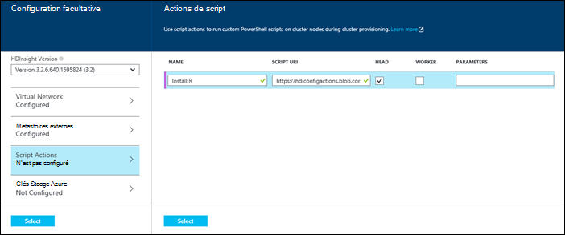
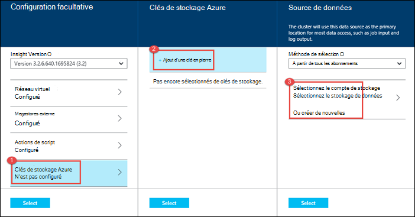

<properties
   pageTitle="Créer des clusters d’Hadoop dans HDInsight | Microsoft Azure"
    description="Apprenez à créer des clusters pour Azure HDInsight via le portail d’Azure."
   services="hdinsight"
   documentationCenter=""
   tags="azure-portal"
   authors="mumian"
   manager="jhubbard"
   editor="cgronlun"/>

<tags
   ms.service="hdinsight"
   ms.devlang="na"
   ms.topic="article"
   ms.tgt_pltfrm="na"
   ms.workload="big-data"
   ms.date="09/02/2016"
   ms.author="jgao"/>

# Créer des clusters de basée sur Windows la Hadoop dans HDInsight en utilisant le portail Azure

[AZURE.INCLUDE [selector](../../includes/hdinsight-selector-create-clusters.md)]

Apprenez à créer un cluster Hadoop dans HDInsight à l’aide du portail Azure. Le Kit de développement Microsoft [Azure portal](../azure-portal-overview.md) est un emplacement central où vous pouvez configurer et gérer vos ressources Azure. Azure Portal est un des outils que vous pouvez utiliser pour créer le cluster d’Hadoop fonctionnant sous Windows ou sous Linux dans HDInsight. Pour autre création du cluster les fonctionnalités et outils cliquez sur l’onglet, sélectionnez en haut de cette page ou [les méthodes de création de Cluster](hdinsight-provision-clusters.md#cluster-creation-methods).

##Conditions préalables :

[AZURE.INCLUDE [delete-cluster-warning](../../includes/hdinsight-delete-cluster-warning.md)]

Avant de commencer les instructions de cet article, vous devez disposer des éléments suivants :

- Un abonnement Azure. Consultez [Azure d’obtenir la version d’évaluation gratuite](https://azure.microsoft.com/documentation/videos/get-azure-free-trial-for-testing-hadoop-in-hdinsight/).

### Exigences de contrôle d’accès

[AZURE.INCLUDE [access-control](../../includes/hdinsight-access-control-requirements.md)]

## Créer des clusters

**Pour créer un cluster HDInsight**

1. Connectez-vous au [portail Azure](https://portal.azure.com).
2. Cliquez sur **Nouveau**et cliquez sur **Données Analytique**, puis cliquez sur **HDInsight**.

    ![Création d’un nouveau cluster dans le portail Azure] (./media/hdinsight-provision-clusters/HDI.CreateCluster.1.png "Création d’un nouveau cluster dans le portail Azure")

3. Tapez ou sélectionnez les valeurs suivantes :

    * **Nom de cluster**: entrez un nom pour le cluster. Une coche verte s’affiche en regard du nom de cluster, si le nom est disponible.

    * **Type de cluster**: sélectionnez **Hadoop**. Autres options inclue **HBase**, **tempête**et **Spark**.

        > [AZURE.IMPORTANT] HDInsight clusters sont dotés de types qui correspondent à la charge de travail ou de la technologie de cluster est réglé pour. Il n’existe aucune méthode prise en charge pour créer un cluster qui combine plusieurs types, tels que tempête et HBase sur un cluster.

    * **Système d’exploitation de cluster**: sélectionnez **Windows**. Pour créer un cluster de base de Linux, sélectionnez **Linux**.
    * **Version**: afficher [les versions de HDInsight](hdinsight-component-versioning.md).
    * **Abonnement**: sélectionnez l’abonnement Azure qui sera utilisé pour la création de ce cluster.
    * **Groupe de ressources**: sélectionnez une existante ou en créer un nouveau groupe de ressources. Cette entrée par défaut dans l’un de vos groupes de ressource existants, si elles sont disponibles.
    * **Informations d’identification**: configurer le nom d’utilisateur et le mot de passe pour l’Hadoop utilisateur (HTTP). Si vous activez le Bureau à distance pour le cluster, vous devez configurer une date d’expiration de compte et mot de passe et le nom d’utilisateur de l’utilisateur de bureau à distance. Dans la partie inférieure pour enregistrer les modifications, cliquez sur **Sélectionner** .

        ![Informations d’identification du cluster de fournir] (./media/hdinsight-provision-clusters/HDI.CreateCluster.3.png "Informations d’identification du cluster de fournir")

    * **Source de données**: créer un nouveau, ou sélectionnez un compte de stockage Azure existant à utiliser comme système de fichiers par défaut pour le cluster.

        ![Lame de source de données] (./media/hdinsight-provision-clusters/HDI.CreateCluster.4.png "Fournissez des données de configuration de la source")

        * **Méthode de sélection**: définir **à partir de tous les abonnements** pour activer la recherche des comptes de stockage de tous vos abonnements. Définir de **Touche d’accès rapide** si vous souhaitez entrer le **Nom de stockage** et de la **Touche d’accès rapide** d’un compte de stockage existant.
        * **Sélectionnez le compte de stockage / créer une nouvelle**: cliquez sur **Sélectionner le compte de stockage** pour parcourir et sélectionner un compte de stockage existant à associer avec le cluster. Ou bien, cliquez sur **Créer un nouveau** pour créer un nouveau compte de stockage. Utilisez le champ qui s’affiche permet d’entrer le nom du compte de stockage. Une coche verte s’affiche si le nom est disponible.
        * **Choisissez le conteneur par défaut**: utilisez cette option pour entrer le nom du conteneur par défaut à utiliser pour le cluster. Vous pouvez entrer ici n’importe quel nom, mais nous vous recommandons utilisant le même nom que le cluster de sorte que vous pouvez facilement reconnaître que le conteneur est utilisé pour ce cluster spécifique.
        * **Emplacement**: la région géographique du compte de stockage, ou sera créé dans. Cet emplacement détermine l’emplacement du cluster.  Le cluster et le compte de stockage par défaut doivent localiser conjointement dans le même centre de données Azure.
    
    * **Niveaux de tarification nœud**: définir le nombre de nœuds de traitement dont vous avez besoin pour le cluster. Le coût estimé du cluster est affiché au sein de la lame.
  

        ![Lame de niveaux de tarification nœud] (./media/hdinsight-provision-clusters/HDI.CreateCluster.5.png "Spécifiez le numéro de nœuds de cluster")

    * **Configuration facultative** , sélectionnez la version de cluster, mais aussi configurer d’autres paramètres facultatifs, tels que l’affiliation à un **Réseau virtuel**, configuration d’un **Metastore externe** pour stocker les données de la ruche et Oozie, utilisez des Actions de Script pour personnaliser un cluster pour installer des composants personnalisés ou utiliser des comptes de stockage supplémentaire avec le cluster.

    * **Version de HDInsight**: sélectionnez la version que vous souhaitez utiliser pour le cluster. Pour plus d’informations, consultez [versions de cluster HDInsight](hdinsight-component-versioning.md).
    * **Réseau virtuel**: sélectionnez un réseau virtuel Azure et le sous-réseau si vous souhaitez placer le cluster en un réseau virtuel.  

        ![Lame de réseau virtuel] (./media/hdinsight-provision-clusters/HDI.CreateCluster.6.png "Détails du réseau virtuel Spécifiez")

        Pour plus d’informations sur l’utilisation de HDInsight avec un réseau virtuel, y compris la configuration spécifique requise pour le réseau virtuel, voir [capbilities HDInsight d’étendre à l’aide d’un réseau virtuel d’Azure](hdinsight-extend-hadoop-virtual-network.md).
  

        
    * **Metastores externe**: spécifiez une base de données Azure SQL pour stocker des métadonnées ruche et Oozie avec le cluster.
 
        > [AZURE.NOTE] Configuration de Metastore n’est pas disponible pour les types de cluster HBase.

    ![Lame de metastores personnalisé] (./media/hdinsight-provision-clusters/HDI.CreateCluster.7.png "Spécifier les metastores externes")

    Pour **utiliser une base de données SQL existante pour la ruche de** métadonnées, cliquez sur **Oui**, sélectionnez une base de données SQL et ensuite fournir le nom d’utilisateur/mot de passe pour la base de données. Répétez ces étapes si vous souhaitez **utiliser une base de données SQL existante pour les métadonnées de la Oozie**. Jusqu'à ce que vous êtes sur la lame de **Configuration facultatives** , cliquez sur **Sélectionner** .

    >[AZURE.NOTE] La base de données Azure SQL utilisé pour le metastore doit permettre la connectivité à d’autres services Azure, y compris les HDInsight d’Azure. Dans le tableau de bord Azure SQL de base de données sur le côté droit, cliquez sur le nom du serveur. Il s’agit du serveur sur lequel l’instance de base de données SQL est en cours d’exécution. Une fois vous êtes dans la vue du serveur, cliquez sur **configurer**, puis cliquez sur **Oui**pour les **Services d’Azure**, et puis cliquez sur **Enregistrer**.

            &nbsp;

            > [AZURE.IMPORTANT] Lors de la création d’un metastore, n’utilisez pas un nom de base de données qui contient des tirets ou des traits d’union, cela peut entraîner l’échec du processus de création cluster.
        
        * **Script Actions** if you want to use a custom script to customize a cluster, as the cluster is being created. For more information about script actions, see [Customize HDInsight clusters using Script Action](hdinsight-hadoop-customize-cluster.md). On the Script Actions blade provide the details as shown in the screen capture.
    

            

        * **Azure Storage Keys**: Specify additional storage accounts to associate with the cluster. In the **Azure Storage Keys** blade, click **Add a storage key**, and then select an existing storage account or create a new account.
    

            

4. Cliquez sur **créer**. Sélection de **Pin à Startboard** ajoutera une mosaïque pour le cluster à la Startboard de votre portail. L’icône indique que le cluster est en cours de création et sera modifié pour afficher l’icône de HDInsight une fois la création terminée.
    
    Il prend un certain temps pour le cluster doit être créée, généralement environ 15 minutes. Utilisez la mosaïque sur le Startboard ou l’entrée de **Notifications** sur la gauche de la page pour vérifier sur le processus de déploiement.
    

5. Une fois la création terminée, cliquez sur la mosaïque pour le cluster à partir de la Startboard pour lancer la lame du cluster. La lame de cluster fournit des informations essentielles sur le cluster, par exemple le nom, le groupe de ressources qu'auquel il appartient, l’emplacement, le système d’exploitation, l’URL pour le tableau de bord de cluster, etc..

    ![Lame de cluster] (./media/hdinsight-provision-clusters/HDI.Cluster.Blade.png "Propriétés du cluster")

    Pour comprendre les icônes en haut de cette lame et dans la section **Essentials** , utilisez ce qui suit :

    * **Paramètres** et **Tous les paramètres**: affiche la lame de **paramètres** pour le cluster, ce qui vous permet d’accéder aux informations de configuration détaillées pour le cluster.
    * **Tableau de bord**, **Tableau de bord de Cluster**et **l’URL**: il s’agit de tous les moyens pour accéder au panneau de commandes de cluster, qui est un portail Web pour exécuter des travaux sur le cluster.
    * **Bureau à distance**: vous permet d’activer/désactiver le Bureau à distance sur les nœuds du cluster.
    * **Échelle de Cluster**: permet de modifier le nombre de nœuds de traitement pour ce cluster.
    * **Supprimer**: supprime le cluster HDInsight.
    * **Démarrage rapide** () : affiche des informations qui vous aideront à démarrer à l’aide de HDInsight.
    * **Utilisateurs** () : permet de définir des autorisations pour la _gestion de portail_ de ce cluster pour d’autres utilisateurs de votre abonnement Azure.
    

        > [AZURE.IMPORTANT] Ce _seulement_ affecte les accès et les autorisations pour ce cluster dans le portail et n’a aucun effet sur les personnes autorisées à se connecter à ou soumettre des tâches au cluster HDInsight.
        
    * **Balises** () : balises vous permet de définir les paires clé/valeur pour définir une classification personnalisée de vos services de nuage. Vous pouvez, par exemple, créez une clé nommée __projet__et ensuite utiliser une valeur commune pour tous les services associés à un projet spécifique.

##Personnaliser des clusters

- Consultez [HDInsight de personnaliser des clusters à l’aide des données d’amorçage](hdinsight-hadoop-customize-cluster-bootstrap.md).
- Voir [clusters basés sur Windows de personnaliser la HDInsight à l’aide des actions de Script](hdinsight-hadoop-customize-cluster.md).

##Étapes suivantes
Dans cet article, vous avez appris les différentes façons de créer un cluster de HDInsight. Pour plus d’informations, consultez les articles suivants :

* [Mise en route de HDInsight d’Azure](hdinsight-hadoop-linux-tutorial-get-started.md) - Apprenez à commencer à travailler avec votre cluster HDInsight
* [Hadoop de soumettre des travaux par programme](hdinsight-submit-hadoop-jobs-programmatically.md) - Apprenez à soumettre par programme des tâches de HDInsight
* [Gérer les clusters de Hadoop dans HDInsight en utilisant le portail Azure](hdinsight-administer-use-management-portal.md)

