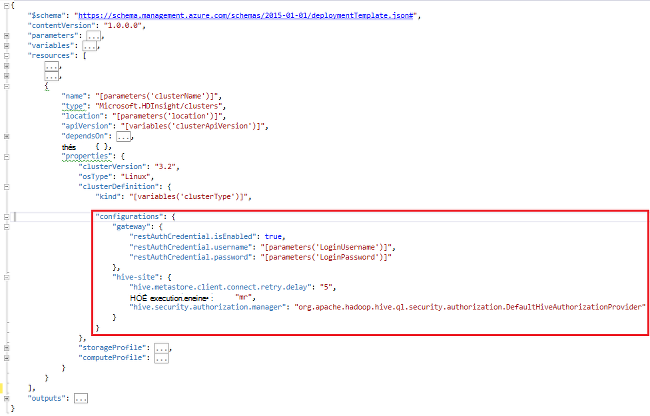

<properties
    pageTitle="Personnaliser des Clusters HDInsight à l’aide des données d’amorçage | Microsoft Azure"
    description="Apprenez à personnaliser des clusters HDInsight à l’aide des données d’amorçage."
    services="hdinsight"
    documentationCenter=""
    authors="mumian"
    manager="jhubbard"
    editor="cgronlun"
    tags="azure-portal"/>

<tags
    ms.service="hdinsight"
    ms.workload="big-data"
    ms.tgt_pltfrm="na"
    ms.devlang="na"
    ms.topic="article"
    ms.date="09/02/2016"
    ms.author="jgao"/>

# Personnaliser des clusters HDInsight à l’aide des données d’amorçage

Parfois, vous souhaitez configurer les fichiers de configuration qui comprennent :

- clusterIdentity.xml
- noyau-site.xml
- Gateway.Xml
- hbase-env.xml
- hbase-site.xml
- très-site.xml
- env.xml de la ruche
- ruche-site.xml
- mapred-site
- oozie-site.xml
- oozie-env.xml
- tempête-site.xml
- tez-site.xml
- webhcat-site.xml
- fils-site.xml

Les clusters ne peut pas conserver les modifications dues à la recréation de l’image. Pour plus d’informations sur la recréation de l’image, reportez-vous à la section [Rôle Instance redémarre en raison de mises à niveau du système d’exploitation](http://blogs.msdn.com/b/kwill/archive/2012/09/19/role-instance-restarts-due-to-os-upgrades.aspx). Pour conserver les modifications apportées à la durée de vie des clusters, vous pouvez utiliser personnalisation de cluster HDInsight pendant le processus de création. Il s’agit de la méthode recommandée pour modifier la configuration d’un cluster et persistent à ces événements de redémarrage redémarrage Azure créer une nouvelle image. Ces modifications de configuration sont appliquées avant le démarrage du service, donc pas besoin de redémarrer les services. 

Il existe 3 méthodes pour utiliser les données d’amorçage :

- Utilisation de PowerShell Azure

    [AZURE.INCLUDE [upgrade-powershell](../../includes/hdinsight-use-latest-powershell.md)]
    
- Utilisez le Kit de développement .NET
- Utiliser le modèle de gestionnaire de ressources Azure

Pour plus d’informations sur l’installation de composants supplémentaires sur cluster de HDInsight au cours de l’heure de création, consultez :

- [Personnaliser des clusters HDInsight à l’aide de l’Action de Script (Linux)](hdinsight-hadoop-customize-cluster-linux.md)
- [Personnaliser des clusters HDInsight à l’aide de l’Action de Script (Windows)](hdinsight-hadoop-customize-cluster.md)

## Utilisation de PowerShell Azure

Le code suivant de PowerShell personnalise une ruche de configuration :

    # hive-site.xml configuration
    $hiveConfigValues = @{ "hive.metastore.client.socket.timeout"="90" }
    
    $config = New-AzureRmHDInsightClusterConfig `
        | Set-AzureRmHDInsightDefaultStorage `
            -StorageAccountName "$defaultStorageAccountName.blob.core.windows.net" `
            -StorageAccountKey $defaultStorageAccountKey `
        | Add-AzureRmHDInsightConfigValues `
            -HiveSite $hiveConfigValues 
    
    New-AzureRmHDInsightCluster `
        -ResourceGroupName $existingResourceGroupName `
        -ClusterName $clusterName `
        -Location $location `
        -ClusterSizeInNodes $clusterSizeInNodes `
        -ClusterType Hadoop `
        -OSType Windows `
        -Version "3.2" `
        -HttpCredential $httpCredential `
        -Config $config 

Vous trouverez un script PowerShell complète qui fonctionne dans [L’annexe A](#hdinsight-hadoop-customize-cluster-bootstrap.md/appx-a:-powershell-sample).

**Pour vérifier la modification :**

1. Ouvrez une session sur le [portail Azure](https://portal.azure.com).
2. Dans le volet gauche, cliquez sur **Parcourir**, puis cliquez sur **HDInsight Clusters**.
3. Cliquez sur le cluster que vous venez de créer à l’aide du script PowerShell.
4. Cliquez sur le **tableau de bord** à partir du haut de la lame pour ouvrir la Ambari UI.
5. Dans le menu de gauche, cliquez sur **la ruche** .
6. Cliquez sur **HiveServer2** à partir du **Résumé**.
7. Cliquez sur l’onglet **configurations** .
8. Dans le menu de gauche, cliquez sur **la ruche** .
9. Cliquez sur l’onglet **Avancé** .
10. Faites défiler vers le bas, puis développez **site-ruche avancé**.
11. Recherchez **hive.metastore.client.socket.timeout** dans la section.

Certains exemples de plus sur la personnalisation des autres fichiers de configuration :

    # hdfs-site.xml configuration
    $HdfsConfigValues = @{ "dfs.blocksize"="64m" } #default is 128MB in HDI 3.0 and 256MB in HDI 2.1

    # core-site.xml configuration
    $CoreConfigValues = @{ "ipc.client.connect.max.retries"="60" } #default 50

    # mapred-site.xml configuration
    $MapRedConfigValues = @{ "mapreduce.task.timeout"="1200000" } #default 600000

    # oozie-site.xml configuration
    $OozieConfigValues = @{ "oozie.service.coord.normal.default.timeout"="150" }  # default 120

Pour plus d’informations, voir le blog de Azim Uddin intitulée [Création d’un Cluster de HDInsight personnalisation](http://blogs.msdn.com/b/bigdatasupport/archive/2014/04/15/customizing-hdinsight-cluster-provisioning-via-powershell-and-net-sdk.aspx).

## Utilisez le Kit de développement .NET

Consultez [basé sur Linux de créer des clusters dans HDInsight à l’aide du Kit de développement .NET](hdinsight-hadoop-create-linux-clusters-dotnet-sdk.md#use-bootstrap).

## Utilisez le Gestionnaire de ressources modèle

Vous pouvez utiliser les données d’amorçage dans le Gestionnaire de ressources du modèle :

    "configurations": {
        …
        "hive-site": {
            "hive.metastore.client.connect.retry.delay": "5",
            "hive.execution.engine": "mr",
            "hive.security.authorization.manager": "org.apache.hadoop.hive.ql.security.authorization.DefaultHiveAuthorizationProvider"
        }
    }

## Voir aussi

- [Créer des clusters d’Hadoop dans HDInsight] [ hdinsight-provision-cluster] fournit des instructions sur la création d’un cluster de HDInsight à l’aide d’autres options personnalisées.
- [Développer des scripts d’Action de Script pour HDInsight][hdinsight-write-script]
- [Installer et utiliser l’allumage sur des clusters de HDInsight][hdinsight-install-spark]
- [Installer et utiliser R sur les clusters de HDInsight][hdinsight-install-r]
- [L’installation et l’utilisation des clusters de mode série sur LAN.r sur HDInsight](hdinsight-hadoop-solr-install.md).
- [Installer et utiliser les clusters Giraph sur HDInsight](hdinsight-hadoop-giraph-install.md).

[hdinsight-install-spark]: hdinsight-hadoop-spark-install.md
[hdinsight-install-r]: hdinsight-hadoop-r-scripts.md
[hdinsight-write-script]: hdinsight-hadoop-script-actions.md
[hdinsight-provision-cluster]: hdinsight-provision-clusters.md
[powershell-install-configure]: powershell-install-configure.md

[img-hdi-cluster-states]: ./media/hdinsight-hadoop-customize-cluster/HDI-Cluster-state.png "Étapes de création d’un cluster"

## Exemple de PowerShell de AppX-a :

Ce script PowerShell crée un cluster HDInsight et personnalise un paramètre ruche :

    ####################################
    # Set these variables
    ####################################
    #region - used for creating Azure service names
    $nameToken = "<ENTER AN ALIAS>" 
    #endregion

    #region - cluster user accounts
    $httpUserName = "admin"  #HDInsight cluster username
    $httpPassword = "<ENTER A PASSWORD>" #"<Enter a Password>"

    $sshUserName = "sshuser" #HDInsight ssh user name
    $sshPassword = "<ENTER A PASSWORD>" #"<Enter a Password>"
    #endregion

    ####################################
    # Service names and varialbes
    ####################################
    #region - service names
    $namePrefix = $nameToken.ToLower() + (Get-Date -Format "MMdd")

    $resourceGroupName = $namePrefix + "rg"
    $hdinsightClusterName = $namePrefix + "hdi"
    $defaultStorageAccountName = $namePrefix + "store"
    $defaultBlobContainerName = $hdinsightClusterName

    $location = "East US 2"
    #endregion

    # Treat all errors as terminating
    $ErrorActionPreference = "Stop"

    ####################################
    # Connect to Azure
    ####################################
    #region - Connect to Azure subscription
    Write-Host "`nConnecting to your Azure subscription ..." -ForegroundColor Green
    try{Get-AzureRmContext}
    catch{Login-AzureRmAccount}
    #endregion

    #region - Create an HDInsight cluster
    ####################################
    # Create dependent components
    ####################################
    Write-Host "Creating a resource group ..." -ForegroundColor Green
    New-AzureRmResourceGroup `
        -Name  $resourceGroupName `
        -Location $location

    Write-Host "Creating the default storage account and default blob container ..."  -ForegroundColor Green
    New-AzureRmStorageAccount `
        -ResourceGroupName $resourceGroupName `
        -Name $defaultStorageAccountName `
        -Location $location `
        -Type Standard_GRS

    $defaultStorageAccountKey = (Get-AzureRmStorageAccountKey `
                                    -ResourceGroupName $resourceGroupName `
                                    -Name $defaultStorageAccountName)[0].Value
    $defaultStorageContext = New-AzureStorageContext `
                                    -StorageAccountName $defaultStorageAccountName `
                                    -StorageAccountKey $defaultStorageAccountKey
    New-AzureStorageContainer `
        -Name $defaultBlobContainerName `
        -Context $defaultStorageContext #use the cluster name as the container name

    ####################################
    # Create a configuration object
    ####################################
    $hiveConfigValues = @{ "hive.metastore.client.socket.timeout"="90" }
        
    $config = New-AzureRmHDInsightClusterConfig `
        | Set-AzureRmHDInsightDefaultStorage `
            -StorageAccountName "$defaultStorageAccountName.blob.core.windows.net" `
            -StorageAccountKey $defaultStorageAccountKey `
        | Add-AzureRmHDInsightConfigValues `
            -HiveSite $hiveConfigValues 

    ####################################
    # Create an HDInsight cluster
    ####################################
    $httpPW = ConvertTo-SecureString -String $httpPassword -AsPlainText -Force
    $httpCredential = New-Object System.Management.Automation.PSCredential($httpUserName,$httpPW)

    $sshPW = ConvertTo-SecureString -String $sshPassword -AsPlainText -Force
    $sshCredential = New-Object System.Management.Automation.PSCredential($sshUserName,$sshPW)

    New-AzureRmHDInsightCluster `
        -ResourceGroupName $resourceGroupName `
        -ClusterName $hdinsightClusterName `
        -Location $location `
        -ClusterSizeInNodes 1 `
        -ClusterType Hadoop `
        -OSType Linux `
        -Version "3.2" `
        -HttpCredential $httpCredential `
        -SshCredential $sshCredential `
        -Config $config

    ####################################
    # Verify the cluster
    ####################################
    Get-AzureRmHDInsightCluster -ClusterName $hdinsightClusterName

    #endregion
