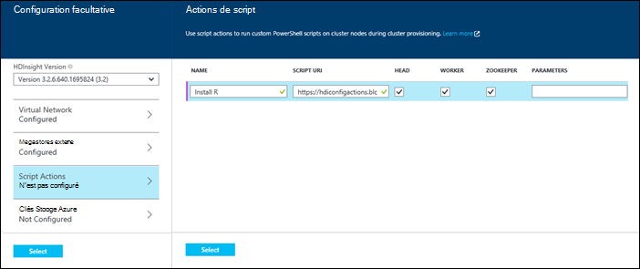

<properties
    pageTitle="Personnaliser des clusters HDInsight à l’aide des actions de script | Microsoft Azure"
    description="Découvrez comment ajouter des composants personnalisés pour les clusters basés sur Linux de HDInsight à l’aide des Actions de Script. Actions de script sont Bash scripts que sur les nœuds de cluster et peut être utilisé pour personnaliser la configuration de cluster ou ajouter d’autres services et utilitaires tels que teinte, mode série sur LAN.r ou R."
    services="hdinsight"
    documentationCenter=""
    authors="Blackmist"
    manager="jhubbard"
    editor="cgronlun"
    tags="azure-portal"/>

<tags
    ms.service="hdinsight"
    ms.workload="big-data"
    ms.tgt_pltfrm="na"
    ms.devlang="na"
    ms.topic="article"
    ms.date="09/06/2016"
    ms.author="larryfr"/>

# Personnaliser les clusters basés sur Linux de HDInsight à l’aide des actions de Script

HDInsight fournit une option de configuration appelée **Action de Script** qui appelle les scripts personnalisés qui personnalisent le cluster. Ces scripts peuvent servir lors de la création du cluster, ou sur un cluster en cours d’exécution et sont utilisés pour installer des composants supplémentaires ou modifier les paramètres de configuration.

> [AZURE.NOTE] La possibilité d’utiliser les actions de script sur un cluster en cours d’exécution est uniquement disponible pour les clusters basés sur Linux de HDInsight. Pour plus d’informations sur l’utilisation des actions de script avec les clusters Windows, voir [clusters de HDInsight de personnaliser à l’aide de l’Action de Script (Windows)](hdinsight-hadoop-customize-cluster.md).

Actions de script peuvent également être publiées sur le marché d’Azure sous la forme d’une application HDInsight. Parmi les exemples de ce document montrent comment vous pouvez installer une application de HDInsight à l’aide de commandes d’action de script PowerShell et le Kit de développement .NET. Pour plus d’informations sur les applications HDInsight, reportez-vous à la section [HDInsight de publier des applications sur le marché d’Azure](hdinsight-apps-publish-applications.md). 

## Comprendre les Actions de Script

Une Action de Script est simplement un Bash script que vous fournissez une URL et les paramètres pour, et il est ensuite exécuté sur les nœuds de cluster HDInsight. Voici les caractéristiques et fonctionnalités des actions de script.

* Doit être stocké sur un URI qui est accessible à partir du cluster HDInsight. Emplacements de stockage possibles sont les suivantes :

    * Un compte de stockage blob qui est soit le principal ou supplémentaire compte de stockage pour l’HDInsight du cluster. Étant donné que HDInsight est accordé l’accès à ces deux types de comptes de stockage lors de la création du cluster, ces fournissent un moyen d’utiliser une action de script de non public.
    
    * Un URI lisible publiquement comme un objet Blob d’Azure, de GitHub, OneDrive, échange, etc..
    
    Pour obtenir des exemples de l’URI de scripts stockés dans le conteneur d’objet blob (lisible publiquement), reportez-vous à la section [scripts d’action de script exemple](#example-script-action-scripts) .

* Peut être limité à __Exécuter uniquement certains types de nœud__, par exemple têtes nœuds ou travail.

    > [AZURE.NOTE] Lorsqu’il est utilisé avec HDInsight Premium, vous pouvez spécifier que le script doit être utilisé sur le nœud du bord.

* Peut être __rendue persistante__ ou __ad hoc__.

    Les scripts __rendues persistantes__ sont des scripts qui sont appliquées aux nœuds du travailleur et seront exécuté automatiquement sur les nouveaux nœuds créés lors de la mise à l’échelle d’un cluster.

    Un script persistant peut également appliquer les modifications à un autre type de nœud, tel qu’un nœud de tête, mais du point de vue des fonctionnalités, la seule raison pour conserver un script est afin qu’il s’applique aux nouveaux nœuds de travail créés lorsqu’un cluster est répartie.

    > [AZURE.IMPORTANT] Actions de script persistante doivent avoir un nom unique.

    __Ad hoc__ de scripts ne sont pas conservées ; Toutefois, vous pouvez ensuite promouvoir un script ad hoc dans un script permanent, ou rétrograder un script persistant à un script ad hoc.

    > [AZURE.IMPORTANT] Actions de script utilisées lors de la création du cluster sont conservées automatiquement.
    >
    > Scripts de basculement ne sont pas rendues persistantes, même si vous précisez qu’ils doivent être.

* Accepte __les paramètres__ qui sont utilisés par le script lors de l’exécution.

* Exécuté avec __des privilèges de niveau de racine__ sur les nœuds du cluster.

* Peut être utilisé via le __portail Azure__, __Azure PowerShell__, __Azure CLI__ou __Kit de développement .NET HDInsight__

    [AZURE.INCLUDE [upgrade-powershell](../../includes/hdinsight-use-latest-powershell-cli-and-dotnet-sdk.md)]

Pour vous aider à comprendre les scripts ont été appliqués à un cluster et pour déterminer que l’ID de scripts pour la promotion ou la rétrogradation, le cluster conserve un historique de tous les scripts qui ont été exécuté.

> [AZURE.IMPORTANT] Il n’y a aucune méthode automatique pour annuler les modifications apportées par une action de script. Si vous devez inverser les effets d’un script, vous devez comprendre quelles modifications ont été apportées et manuellement les inverser (ou fournir une action de script qui inverse les.)

### Action de script dans le processus de création du cluster

Actions de script utilisées lors de la création du cluster sont légèrement différentes de script actions exécutées sur un cluster existant :

* Le script est __automatiquement rendue persistante__.

* Une __défaillance__ dans le script peut provoquer l’échec du processus de création cluster.

Le diagramme suivant illustre lorsque l’Action de Script est exécutée pendant le processus de création :

![Personnalisation de cluster HDInsight et les étapes de création d’un cluster][img-hdi-cluster-states]

Le script est exécuté alors que HDInsight est en cours de configuration. À ce stade, le script est exécuté en parallèle sur tous les nœuds dans le cluster spécifiés et il est exécuté avec des privilèges racine sur les nœuds.

> [AZURE.NOTE] Étant donné que le script est exécuté avec des privilèges de niveau racine sur les nœuds de cluster, vous pouvez effectuer des opérations telles que l’arrêt et le démarrage des services, y compris des services d’Hadoop. Si vous arrêtez les services, vous devez vous assurer que le service Ambari et autres services Hadoop sont en cours d’exécution avant la fin du script en cours d’exécution. Ces services sont requis afin de correctement déterminer la santé et l’état du cluster pendant qu’il est en cours de création.

Lors de la création du cluster, vous pouvez spécifier plusieurs actions de script qui sont appelées dans l’ordre dans lequel ils ont été spécifiés.

> [AZURE.IMPORTANT] Actions de script doivent se terminer dans les 60 minutes, ou ils n’expire. Lors de la configuration du cluster, le script est exécuté en même temps que les autres processus d’installation et de configuration. Concurrence pour les ressources de la bande passante du réseau ou de temps processeur peut provoquer le script de prendre plus de temps qu’il ne le fait dans votre environnement de développement.
>
> Pour réduire le temps que nécessaire pour exécuter le script, évitez les tâches de téléchargement et de compiler des applications à partir de la source. Au lieu de cela, avant de compiler l’application et de stocker le fichier binaire dans le stockage des objets Blob Azure afin qu’il peut être téléchargé rapidement au cluster.

###Action de script sur un cluster en cours d’exécution

Contrairement aux actions utilisées lors de la création du cluster, une panne dans un script exécutées sur un cluster en cours d’exécution de script n’entraîne pas automatiquement le cluster passer à un état d’échec. Une fois un script terminé, le cluster doit retourner à un état « exécution ».

> [AZURE.IMPORTANT] Cela ne signifie pas que votre cluster en cours d’exécution est insensible aux scripts d’une opération incorrecte. Par exemple, un script peut supprimer les fichiers requis par le cluster, modifier la configuration afin que l’échec de services, etc..
>
> Les actions de scripts s’exécutent avec les privilèges root, donc vous devez vous assurer que vous comprenez de quoi un script avant de l’appliquer à votre cluster.

Lorsque vous appliquez un script à un cluster, l’état du cluster sera passez __en cours d’exécution__ à __accepté__, puis __configuration de HDInsight__et avant de revenir à __l’exécution__ des scripts réussies. Le statut du script est enregistré dans l’historique des actions de script, et vous pouvez l’utiliser pour déterminer si le script a réussi ou échoué. Par exemple, le `Get-AzureRmHDInsightScriptActionHistory` applet de commande PowerShell peut être utilisé pour afficher l’état d’un script. Il renvoie des informations semblables à ce qui suit :

    ScriptExecutionId : 635918532516474303
    StartTime         : 2/23/2016 7:40:55 PM
    EndTime           : 2/23/2016 7:41:05 PM
    Status            : Succeeded

> [AZURE.NOTE] Si vous avez modifié le mot de passe de l’utilisateur (administrateur) de cluster après que le cluster a été créé, cela peut entraîner des actions exécutées ce cluster Échec de script. Si vous disposez de toutes les actions de script persistante que noeuds de travail cible, il peuvent échouer lorsque vous ajoutez des nœuds au cluster par le biais de redimensionnement des opérations.

## Scripts d’Action de Script exemple

Scripts d’Action de script peuvent être utilisés à partir du portail Azure, Azure PowerShell, Azure CLI ou le Kit de développement .NET HDInsight. HDInsight propose des scripts pour installer les composants suivants sur des clusters de HDInsight :

Nom | Script
----- | -----
**Ajouter un compte de stockage Azure** | https://hdiconfigactions.BLOB.Core.Windows.NET/linuxaddstorageaccountv01/Add-Storage-Account-v01.sh. Voir [appliquer une Action de Script vers un cluster en cours d’exécution](#apply-a-script-action-to-a-running-cluster).
**Installation de teinte** | https://hdiconfigactions.BLOB.Core.Windows.NET/linuxhueconfigactionv02/Install-hue-uber-v02.sh. Voir [installation et l’utilisation des clusters de teinte sur HDInsight](hdinsight-hadoop-hue-linux.md).
**Installation de R** | https://hdiconfigactions.BLOB.Core.Windows.NET/linuxrconfigactionv01/r-installer-v01.sh. Reportez-vous à la section [installation et utilisation R sur les clusters de HDInsight](hdinsight-hadoop-r-scripts-linux.md).
**Installer le mode série sur LAN.r** | https://hdiconfigactions.BLOB.Core.Windows.NET/linuxsolrconfigactionv01/solr-installer-v01.sh. Voir [installation et l’utilisation des clusters de mode série sur LAN.r sur HDInsight](hdinsight-hadoop-solr-install-linux.md).
**Installation de Giraph** | https://hdiconfigactions.BLOB.Core.Windows.NET/linuxgiraphconfigactionv01/giraph-installer-v01.sh. Voir [installation et l’utilisation des clusters Giraph sur HDInsight](hdinsight-hadoop-giraph-install-linux.md).
| **Avant de charger les bibliothèques de ruche** | https://hdiconfigactions.BLOB.Core.Windows.NET/linuxsetupcustomhivelibsv01/Setup-customhivelibs-v01.sh. Voir [Ajouter la ruche de bibliothèques sur des clusters de HDInsight](hdinsight-hadoop-add-hive-libraries.md) |

## Utilisez une Action de Script lors de la création du cluster

Cette section fournit des exemples sur les différentes méthodes que vous pouvez utiliser des actions de script lors de la création d’un cluster d’HDInsight - à partir du portail Azure, à l’aide d’un modèle de gestionnaire de ressources d’Azure, à l’aide des PowerShell CMDlets et en utilisant le Kit de développement .NET.

### Utilisez une Action de Script lors de la création d’un cluster à partir du portail Azure

1. Démarrer la création d’un cluster comme décrit au [Hadoop de créer des clusters dans HDInsight](hdinsight-provision-clusters.md#portal).

2. Sous __Configuration facultative__, de la lame **d’Actions de Script** , cliquez sur **Ajouter une action de script** pour fournir plus d’informations sur l’action du script, comme indiqué ci-dessous :

    

  	| Propriété | Valeur |
  	| -------- | ----- |
  	| Nom | Spécifiez un nom pour l’action du script. |
  	| URI de script | Spécifiez l’URI du script qui est appelée pour personnaliser le cluster. |
  	| Tête/travailleur | Spécifiez les noeuds (**chef**, **travailleur**ou **soigneur**) sur lequel est exécuté le script de personnalisation. |
  	| Paramètres | Spécifiez les paramètres, si nécessaire par le script. |

    Appuyez sur ENTRÉE pour ajouter plus d’une action de script pour installer plusieurs composants sur le cluster.

3. Cliquez sur **Sélectionner** pour enregistrer la configuration et de poursuivre la création du cluster.

### Utilisez une Action de Script à partir de modèles du Gestionnaire de ressources Azure

Dans cette section, les modèles du Gestionnaire de ressources Azure nous permet de créer un cluster HDInsight et également d’utiliser une action de script pour installer des composants personnalisés (R, dans cet exemple) sur le cluster. Cette section fournit un exemple de modèle pour créer un cluster à l’aide des actions de script.

> [AZURE.NOTE] Les étapes de cette section illustrent la création d’un cluster à l’aide d’une action de script. Pour obtenir un exemple de création d’un cluster à partir d’un modèle à l’aide d’une application HDInsight, reportez-vous à la section [installer des applications de HDInsight](hdinsight-apps-install-custom-applications.md).

#### Avant de commencer

* Pour plus d’informations sur la configuration d’une station de travail pour exécuter des applets de commande Powershell de HDInsight, consultez [installer et configurer Azure PowerShell](../powershell-install-configure.md).
* Pour obtenir des instructions sur la façon de créer des modèles, consultez [modèles de création d’un gestionnaire de ressources Azure](../resource-group-authoring-templates.md).
* Si vous n'avez pas déjà utilisé Azure PowerShell avec le Gestionnaire de ressources, reportez-vous [à l’aide du PowerShell Azure avec le Gestionnaire de ressources Azure](../powershell-azure-resource-manager.md).

#### Créer des clusters à l’aide des actions de Script

1. Copiez le modèle suivant vers un emplacement sur votre ordinateur. Ce modèle installe des Giraph sur la headnodes ainsi que les noeuds de travailleur dans le cluster. Vous pouvez également vérifier si le modèle JSON est valide. Collez le contenu de votre modèle dans [JSONLint](http://jsonlint.com/), un outil de validation de JSON en ligne.

            {
            "$schema": "http://schema.management.azure.com/schemas/2015-01-01/deploymentTemplate.json#",
            "contentVersion": "1.0.0.0",
            "parameters": {
                "clusterLocation": {
                    "type": "string",
                    "defaultValue": "West US",
                    "allowedValues": [ "West US" ]
                },
                "clusterName": {
                    "type": "string"
                },
                "clusterUserName": {
                    "type": "string",
                    "defaultValue": "admin"
                },
                "clusterUserPassword": {
                    "type": "securestring"
                },
                "sshUserName": {
                    "type": "string",
                    "defaultValue": "username"
                },
                "sshPassword": {
                    "type": "securestring"
                },
                "clusterStorageAccountName": {
                    "type": "string"
                },
                "clusterStorageAccountResourceGroup": {
                    "type": "string"
                },
                "clusterStorageType": {
                    "type": "string",
                    "defaultValue": "Standard_LRS",
                    "allowedValues": [
                        "Standard_LRS",
                        "Standard_GRS",
                        "Standard_ZRS"
                    ]
                },
                "clusterStorageAccountContainer": {
                    "type": "string"
                },
                "clusterHeadNodeCount": {
                    "type": "int",
                    "defaultValue": 1
                },
                "clusterWorkerNodeCount": {
                    "type": "int",
                    "defaultValue": 2
                }
            },
            "variables": {
            },
            "resources": [
                {
                    "name": "[parameters('clusterStorageAccountName')]",
                    "type": "Microsoft.Storage/storageAccounts",
                    "location": "[parameters('clusterLocation')]",
                    "apiVersion": "2015-05-01-preview",
                    "dependsOn": [ ],
                    "tags": { },
                    "properties": {
                        "accountType": "[parameters('clusterStorageType')]"
                    }
                },
                {
                    "name": "[parameters('clusterName')]",
                    "type": "Microsoft.HDInsight/clusters",
                    "location": "[parameters('clusterLocation')]",
                    "apiVersion": "2015-03-01-preview",
                    "dependsOn": [
                        "[concat('Microsoft.Storage/storageAccounts/', parameters('clusterStorageAccountName'))]"
                    ],
                    "tags": { },
                    "properties": {
                        "clusterVersion": "3.2",
                        "osType": "Linux",
                        "clusterDefinition": {
                            "kind": "hadoop",
                            "configurations": {
                                "gateway": {
                                    "restAuthCredential.isEnabled": true,
                                    "restAuthCredential.username": "[parameters('clusterUserName')]",
                                    "restAuthCredential.password": "[parameters('clusterUserPassword')]"
                                }
                            }
                        },
                        "storageProfile": {
                            "storageaccounts": [
                                {
                                    "name": "[concat(parameters('clusterStorageAccountName'),'.blob.core.windows.net')]",
                                    "isDefault": true,
                                    "container": "[parameters('clusterStorageAccountContainer')]",
                                    "key": "[listKeys(resourceId('Microsoft.Storage/storageAccounts', parameters('clusterStorageAccountName')), '2015-05-01-preview').key1]"
                                }
                            ]
                        },
                        "computeProfile": {
                            "roles": [
                                {
                                    "name": "headnode",
                                    "targetInstanceCount": "[parameters('clusterHeadNodeCount')]",
                                    "hardwareProfile": {
                                        "vmSize": "Large"
                                    },
                                    "osProfile": {
                                        "linuxOperatingSystemProfile": {
                                            "username": "[parameters('sshUserName')]",
                                            "password": "[parameters('sshPassword')]"
                                        }
                                    },
                                    "scriptActions": [
                                        {
                                            "name": "installGiraph",
                                            "uri": "https://hdiconfigactions.blob.core.windows.net/linuxgiraphconfigactionv01/giraph-installer-v01.sh",
                                            "parameters": ""
                                        }
                                    ]
                                },
                                {
                                    "name": "workernode",
                                    "targetInstanceCount": "[parameters('clusterWorkerNodeCount')]",
                                    "hardwareProfile": {
                                        "vmSize": "Large"
                                    },
                                    "osProfile": {
                                        "linuxOperatingSystemProfile": {
                                            "username": "[parameters('sshUserName')]",
                                            "password": "[parameters('sshPassword')]"
                                        }
                                    },
                                    "scriptActions": [
                                        {
                                            "name": "installR",
                                            "uri": "https://hdiconfigactions.blob.core.windows.net/linuxrconfigactionv01/r-installer-v01.sh",
                                            "parameters": ""
                                        }
                                    ]
                                }
                            ]
                        }
                    }
                }
            ],
            "outputs": {
                "cluster":{
                    "type" : "object",
                    "value" : "[reference(resourceId('Microsoft.HDInsight/clusters',parameters('clusterName')))]"
                }
            }
        }

2. Démarrer PowerShell d’Azure et de journal dans votre compte Azure. Après avoir fourni vos informations d’identification, la commande renvoie des informations sur votre compte.

        Add-AzureRmAccount

        Id                             Type       ...
        --                             ----
        someone@example.com            User       ...

3. Si vous disposez de plusieurs abonnements, fournissez l’id d’abonnement que vous souhaitez utiliser pour le déploiement.

        Select-AzureRmSubscription -SubscriptionID <YourSubscriptionId>

    > [AZURE.NOTE] Vous pouvez utiliser `Get-AzureRmSubscription` pour obtenir une liste de tous les abonnements associés à votre compte, ce qui inclut l’Id de l’abonnement pour chacun d’eux.

5. Si vous ne disposez pas d’un groupe de ressources existant, créez un nouveau groupe de ressources. Indiquez le nom du groupe de ressources et emplacement dont vous avez besoin pour votre solution. Un résumé du nouveau groupe de ressources est retourné.

        New-AzureRmResourceGroup -Name myresourcegroup -Location "West US"

        ResourceGroupName : myresourcegroup
        Location          : westus
        ProvisioningState : Succeeded
        Tags              :
        Permissions       :
                            Actions  NotActions
                            =======  ==========
                            *
        ResourceId        : /subscriptions/######/resourceGroups/ExampleResourceGroup

6. Pour créer un nouveau déploiement de votre groupe de ressources, exécutez la commande **New-AzureRmResourceGroupDeployment** et fournir les paramètres nécessaires. Les paramètres inclut un nom pour votre déploiement, le nom de votre groupe de ressources et le chemin d’accès ou l’URL pour le modèle que vous avez créé. Si votre modèle requiert des paramètres, vous devez transmettre ces paramètres. Dans ce cas, l’action du script d’installation R sur le cluster ne nécessite pas de paramètres.

        New-AzureRmResourceGroupDeployment -Name mydeployment -ResourceGroupName myresourcegroup -TemplateFile <PathOrLinkToTemplate>

    Vous devez fournir des valeurs pour les paramètres définis dans le modèle.

7. Lorsque le groupe de ressources a été déployé, vous allez voir un récapitulatif du déploiement.

          DeploymentName    : mydeployment
          ResourceGroupName : myresourcegroup
          ProvisioningState : Succeeded
          Timestamp         : 8/17/2015 7:00:27 PM
          Mode              : Incremental
          ...

8. Si votre déploiement échoue, vous pouvez utiliser les applets de commande suivantes pour obtenir des informations sur les échecs.

        Get-AzureRmResourceGroupDeployment -ResourceGroupName myresourcegroup -ProvisioningState Failed

### Utilisez une Action de Script lors de la création d’un cluster à partir de PowerShell d’Azure

Dans cette section, nous utilisons la cmdlet [Add-AzureRmHDInsightScriptAction](https://msdn.microsoft.com/library/mt603527.aspx) à appeler des scripts en utilisant l’Action de Script pour personnaliser un cluster. Avant de continuer, assurez-vous que vous avez installé et configuré Azure PowerShell. Pour plus d’informations sur la configuration d’une station de travail pour exécuter des applets de commande PowerShell de HDInsight, consultez [installer et configurer Azure PowerShell](../powershell-install-configure.md).

Effectuez les opérations suivantes :

1. Ouvrez la console PowerShell d’Azure, utilisez la commande suivante pour vous connecter à votre abonnement Azure et déclarer des variables PowerShell :

        # LOGIN TO ZURE
        Login-AzureRmAccount

        # PROVIDE VALUES FOR THESE VARIABLES
        $subscriptionId = "<SubscriptionId>"        # ID of the Azure subscription
        $clusterName = "<HDInsightClusterName>"         # HDInsight cluster name
        $storageAccountName = "<StorageAccountName>"    # Azure storage account that hosts the default container
        $storageAccountKey = "<StorageAccountKey>"      # Key for the storage account
        $containerName = $clusterName
        $location = "<MicrosoftDataCenter>"             # Location of the HDInsight cluster. It must be in the same data center as the storage account.
        $clusterNodes = <ClusterSizeInNumbers>          # The number of nodes in the HDInsight cluster.
        $resourceGroupName = "<ResourceGroupName>"      # The resource group that the HDInsight cluster will be created in

2. Spécifiez les valeurs de configuration (par exemple, les nœuds du cluster) et le stockage par défaut à utiliser.

        # SPECIFY THE CONFIGURATION OPTIONS
        Select-AzureRmSubscription -SubscriptionId $subscriptionId
        $config = New-AzureRmHDInsightClusterConfig
        $config.DefaultStorageAccountName="$storageAccountName.blob.core.windows.net"
        $config.DefaultStorageAccountKey=$storageAccountKey

3. Utilisez l’applet de commande **Add-AzureRmHDInsightScriptAction** pour appeler le script. L’exemple suivant utilise un script qui installe des Giraph sur le cluster :

        # INVOKE THE SCRIPT USING THE SCRIPT ACTION FOR HEADNODE AND WORKERNODE
        $config = Add-AzureRmHDInsightScriptAction -Config $config -Name "Install Giraph"  -NodeType HeadNode -Uri https://hdiconfigactions.blob.core.windows.net/linuxgiraphconfigactionv01/giraph-installer-v01.sh
        $config = Add-AzureRmHDInsightScriptAction -Config $config -Name "Install Giraph"  -NodeType WorkerNode -Uri https://hdiconfigactions.blob.core.windows.net/linuxgiraphconfigactionv01/giraph-installer-v01.sh

    L’applet de commande **Add-AzureRmHDInsightScriptAction** accepte les paramètres suivants :

  	| Paramètre | Définition |
  	| --------- | ---------- |
  	| Config | Objet de configuration pour le script d’informations sur l’action sont ajoutées. |
  	| Nom | Nom de l’action du script. |
  	| NodeType | Spécifie le nœud sur lequel le script de personnalisation est exécuté. Les valeurs valides sont **HeadNode** (pour une installation sur le nœud de tête), **WorkerNode** (pour une installation sur tous les nœuds de données), ou **ZookeeperNode** (pour une installation sur le nœud de soigneur). |
  	| Paramètres | Paramètres requis par le script. |
  	| URI | Spécifie l’URI du script qui est exécuté. |

4. Définir l’utilisateur admin/HTTPS pour le cluster :

        $httpCreds = get-credential

    Lorsque vous y êtes invité, entrez « admin » comme nom et un mot de passe.

5. Définir les informations d’authentification SSH :

        $sshCreds = get-credential

    Lorsque vous y êtes invité, entrez le nom d’utilisateur SSH et le mot de passe. Si vous souhaitez sécuriser le compte SSH avec un certificat au lieu d’un mot de passe, utilisez un mot de passe vide et que la valeur `$sshPublicKey` pour le contenu de la clé publique du certificat à utiliser. Par exemple :

        $sshPublicKey = Get-Content .\path\to\public.key -Raw

4. Enfin, créez le cluster :

        New-AzureRmHDInsightCluster -config $config -clustername $clusterName -DefaultStorageContainer $containerName -Location $location -ResourceGroupName $resourceGroupName -ClusterSizeInNodes $clusterNodes -HttpCredential $httpCreds -SshCredential $sshCreds -OSType Linux

    Si vous utilisez une clé publique pour sécuriser votre compte SSH, vous devez également spécifier `-SshPublicKey $sshPublicKey` en tant que paramètre.

Elle peut prendre plusieurs minutes avant que le cluster est créé.

### Utilisez une Action de Script lors de la création d’un cluster à partir du Kit de développement .NET HDInsight

Le Kit de développement .NET HDInsight fournit les bibliothèques clientes qui le rend plus facile à manipuler de HDInsight à partir d’une application .NET. Pour un exemple de code, consultez [basé sur Linux de créer des clusters dans HDInsight à l’aide du Kit de développement .NET](hdinsight-hadoop-create-linux-clusters-dotnet-sdk.md#use-script-action).

## Appliquer une Action de Script vers un cluster en cours d’exécution

Cette section fournit des exemples sur les différentes méthodes que vous pouvez appliquer des actions de script vers un cluster de HDInsight en cours d’exécution ; à partir du portail Azure, à l’aide des PowerShell CMDlets, à l’aide de la CLI d’Azure multiplates-formes et en utilisant le Kit de développement .NET. L’action de script persistant utilisée dans cette section ajoute un compte de stockage Azure existant à un cluster en cours d’exécution. Vous pouvez également utiliser les autres actions de script, voir [scripts d’Action de Script d’exemple](#example-script-action-scripts).

### Appliquer une Action de Script vers un cluster en cours d’exécution à partir du portail Azure

1. À partir du [portail Azure](https://portal.azure.com), sélectionnez votre cluster HDInsight.

2. À partir de la blade de cluster HDInsight, sélectionnez la mosaïque __d’Actions de Script__ .

    

    > [AZURE.NOTE] Vous pouvez également sélectionner __tous les paramètres__ et puis sélectionnez __Actions de Script__ à partir de la blade de paramètres.

4. Dans la partie supérieure de la lame d’Actions de Script, sélectionnez __soumettre de nouveau__.

    

5. À partir de la blade d’ajouter une Action de Script, entrez les informations suivantes.

    * __Nom__: le nom convivial à utiliser pour cette Action de Script. Dans cet exemple, `Add Storage account`.
    * __URI de SCRIPT__: l’URI du script. Dans cet exemple,`https://hdiconfigactions.blob.core.windows.net/linuxaddstorageaccountv01/add-storage-account-v01.sh`
    * __Tête__, __collaborateur__et __soigneur__: Vérifiez les nœuds de ce script doit être appliqué à. Dans cet exemple, la tête, de travailleur et de soigneur sont vérifiés.
    * __Paramètres__: si le script accepte des paramètres, les entrer ici. Dans cet exemple, entrez le nom du compte de stockage et que la clé de compte de stockage :

        

        Dans la capture d’écran, `contosodata` est un compte de stockage Azure existant, la deuxième ligne est la clé de compte de stockage.
    * __Rendues persistantes__: vérifier cette entrée si vous souhaitez conserver le script afin qu’il s’appliquera aux nouveaux nœuds de travail lorsque vous faites évoluer le cluster.

6. Enfin, utilisez le bouton __créer__ pour appliquer le script au cluster.

### Appliquer une Action de Script vers un cluster en cours d’exécution à partir de PowerShell d’Azure

Avant de continuer, assurez-vous que vous avez installé et configuré Azure PowerShell. Pour plus d’informations sur la configuration d’une station de travail pour exécuter des applets de commande PowerShell de HDInsight, consultez [installer et configurer Azure PowerShell](../powershell-install-configure.md).

1. Ouvrez la console PowerShell d’Azure, utilisez la commande suivante pour vous connecter à votre abonnement Azure et déclarer des variables PowerShell :

        # LOGIN TO ZURE
        Login-AzureRmAccount

        # PROVIDE VALUES FOR THESE VARIABLES
        $clusterName = "<HDInsightClusterName>"         # HDInsight cluster name
        $saName = "<ScriptActionName>"                  # Name of the script action
        $saURI = "<URI to the script>"                  # The URI where the script is located
        $nodeTypes = "headnode", "workernode"
        
    > [AZURE.NOTE] Si vous utilisez un cluster HDInsight Premium, vous pouvez utiliser un type du `"edgenode"` pour exécuter le script sur le nœud du bord.

2. Pour appliquer le script sur le cluster, utilisez la commande suivante :

        Submit-AzureRmHDInsightScriptAction -ClusterName $clusterName -Name $saName -Uri $saURI -NodeTypes $nodeTypes -PersistOnSuccess

    Une fois la tâche terminée, vous recevrez des informations semblables à ce qui suit :

        OperationState  : Succeeded
        ErrorMessage    :
        Name            : Giraph
        Uri             : https://hdiconfigactions.blob.core.windows.net/linuxgiraphconfigactionv01/giraph-installer-v01.sh
        Parameters      :
        NodeTypes       : {HeadNode, WorkerNode}

### Appliquer une Action de Script vers un cluster en cours d’exécution à partir de la CLI d’Azure

Avant de continuer, assurez-vous que vous avez installé et configuré le CLI Azure. Pour plus d’informations, consultez [installer l’interface CLI d’Azure](../xplat-cli-install.md).

    [AZURE.INCLUDE [use-latest-version](../../includes/hdinsight-use-latest-cli.md)] 

1. Ouvrez une session shell, terminal, invite de commandes ou autres de ligne de commande de votre système et utilisez la commande suivante pour passer en mode de Gestionnaire des ressources Azure.

        azure config mode arm

2. Utilisez ce qui suit pour s’authentifier sur votre abonnement Azure.

        azure login

3. Utilisez la commande suivante pour appliquer une action de script vers un cluster en cours d’exécution

        azure hdinsight script-action create <clustername> -g <resourcegroupname> -n <scriptname> -u <scriptURI> -t <nodetypes>

    Si vous omettez les paramètres pour cette commande, le système vous demandera pour eux. Si le script que vous spécifiez avec `-u` accepte des paramètres, vous pouvez les spécifier à l’aide de la `-p` paramètre.

    Valide __nodetypes__ sont __headnode__, __workernode__et __soigneur__. Si le script doit être appliqué à plusieurs types de nœud, spécifiez les types séparés par un ';'. Par exemple, `-n headnode;workernode`.

    Pour rendre persistant le script, ajoutez la `--persistOnSuccess`. Vous pouvez également conserver le script à une date ultérieure à l’aide de `azure hdinsight script-action persisted set`.
    
    Une fois la tâche terminée, vous recevez une sortie similaire à ce qui suit.
    
        info:    Executing command hdinsight script-action create
        + Executing Script Action on HDInsight cluster
        data:    Operation Info
        data:    ---------------
        data:    Operation status:
        data:    Operation ID:  b707b10e-e633-45c0-baa9-8aed3d348c13
        info:    hdinsight script-action create command OK

### Appliquer une Action de Script vers un cluster en cours d’exécution à l’aide des API REST

Reportez-vous à la section [Actions de Script s’exécutent sur un cluster en cours d’exécution](https://msdn.microsoft.com/library/azure/mt668441.aspx).
### Appliquer une Action de Script vers un cluster en cours d’exécution à partir du Kit de développement .NET HDInsight

Pour obtenir un exemple de l’utilisation du Kit de développement .NET pour appliquer des scripts à un cluster, consultez [https://github.com/Azure-Samples/hdinsight-dotnet-script-action](https://github.com/Azure-Samples/hdinsight-dotnet-script-action).

## Afficher l’historique, promouvoir et rétrograder des Actions de Script

### L’utilisation du portail Azure

1. À partir du [portail Azure](https://portal.azure.com), sélectionnez votre cluster HDInsight.

2. À partir de la blade de cluster HDInsight, sélectionnez __paramètres__.

    

3. À partir de la blade de paramètres, sélectionnez __Les Actions de Script__.

    

4. Une liste de scripts persistants, ainsi que l’historique des scripts appliqués au cluster, s’affiche sur la blade d’Actions de Script. Dans la capture d’écran ci-dessous, vous pouvez voir que le mode série sur LAN.r script a été exécuté sur ce cluster, mais qu’aucune action de script n’ont été rendues persistantes.

    

5. Sélectionner un script à partir de l’historique, la lame de propriétés pour ce script s’affiche. À partir du haut de la lame, vous pouvez réexécuter le script ou le promouvoir.

    

6. Vous pouvez également utiliser le __...__ à droite des écritures sur la blade d’Actions de Script pour effectuer des actions telles que nouveau, conserver ou supprimer des (pour les actions, persistantes).

    

### À l’aide de PowerShell Azure

| Utilisez la commande suivante... | À... |
| ----- | ----- |
| Get-AzureRmHDInsightPersistedScriptAction | Récupérer des informations sur les actions de script persistant |
| Get-AzureRmHDInsightScriptActionHistory | Récupérer l’historique des actions de script appliqué sur le cluster, ou les détails d’un script spécifique |
| Ensemble-AzureRmHDInsightPersistedScriptAction | Promeut une action de script ad hoc à une action de script persistant |
| Supprimer-AzureRmHDInsightPersistedScriptAction | Rétrograde d’une action de script persistant à une action ad hoc |

> [AZURE.IMPORTANT] À l’aide de `Remove-AzureRmHDInsightPersistedScriptAction` ne pas les annuler les actions exécutées par un script, il supprime uniquement l’indicateur persistant afin que le script ne sera pas être exécuté sur les nouveaux nœuds de travail ajoutés au cluster.

L’exemple de script suivant illustre à promouvoir, puis rétrograder un script à l’aide d’applets de commande.

    # Get a history of scripts
    Get-AzureRmHDInsightScriptActionHistory -ClusterName mycluster

    # From the list, we want to get information on a specific script
    Get-AzureRmHDInsightScriptActionHistory -ClusterName mycluster -ScriptExecutionId 635920937765978529

    # Promote this to a persisted script
    # Note: the script must have a unique name to be promoted
    # if the name is not unique, you will receive an error
    Set-AzureRmHDInsightPersistedScriptAction -ClusterName mycluster -ScriptExecutionId 635920937765978529

    # Demote the script back to ad hoc
    # Note that demotion uses the unique script name instead of
    # execution ID.
    Remove-AzureRmHDInsightPersistedScriptAction -ClusterName mycluster -Name "Install Giraph"

### À l’aide de l’interface CLI Azure

| Utilisez la commande suivante... | À... |
| ----- | ----- |
| `azure hdinsight script-action persisted list <clustername>` | Récupérer une liste des actions de script persistant |
| `azure hdinsight script-action persisted show <clustername> <scriptname>` | Récupérer des informations sur une action de script persistant spécifique |
| `azure hdinsight script-action history list <clustername>` | Récupérer l’historique des actions de script appliqué au cluster |
| `azure hdinsight script-action history show <clustername> <scriptname>` | Récupérer des informations sur une action de script spécifique |
| `azure hdinsight script action persisted set <clustername> <scriptexecutionid>` | Promeut une action de script ad hoc à une action de script persistant |
| `azure hdinsight script-action persisted delete <clustername> <scriptname>` | Rétrograde d’une action de script persistant à une action ad hoc |

> [AZURE.IMPORTANT] À l’aide de `azure hdinsight script-action persisted delete` ne pas les annuler les actions exécutées par un script, il supprime uniquement l’indicateur persistant afin que le script ne sera pas être exécuté sur les nouveaux nœuds de travail ajoutés au cluster.

### À l’aide du Kit de développement .NET HDInsight

Pour obtenir un exemple de l’utilisation du Kit de développement .NET pour récupérer l’historique de script à partir d’un cluster, promouvoir ou rétrograder des scripts, consultez [https://github.com/Azure-Samples/hdinsight-dotnet-script-action](https://github.com/Azure-Samples/hdinsight-dotnet-script-action).

> [AZURE.NOTE] Cet exemple montre également comment faire pour installer une application de HDInsight à l’aide du Kit de développement .NET.

## Résolution des problèmes

Vous pouvez utiliser l’interface utilisateur web de Ambari pour afficher les informations consignées par les actions de script. Si le script a été utilisé lors de la création du cluster, et création du cluster a échoué en raison d’une erreur dans le script, les journaux sont également disponibles dans le compte de stockage par défaut associé au cluster. Cette section fournit des informations sur la façon de récupérer les journaux à l’aide de ces deux options.

### À l’aide de l’interface utilisateur du Web Ambari

1. Dans votre navigateur, accédez à https://CLUSTERNAME.azurehdinsight.net. Remplacez NOM_CLUSTER par le nom de votre cluster HDInsight.

    Lorsque vous y êtes invité, entrez le nom du compte administrateur (admin) et un mot de passe pour le cluster. Vous devrez peut-être entrer de nouveau les informations d’identification d’administrateur dans un formulaire web.

2. Dans la barre en haut de la page, sélectionnez l’entrée __OPT__ . Cela affichera une liste des opérations en cours et précédentes effectuée sur le cluster par le biais de Ambari.

    

3. Recherchez les entrées qui ont __exécuter\_customscriptaction__ dans la colonne __opérations__ . Ceux-ci sont créés lors de l’exécution sont les Actions de Script.

    

    Sélectionnez cette entrée et l’extraction vers le bas les liens pour afficher la sortie STDOUT et STDERR générée lorsque le script a été exécuté sur le cluster.

### Journaux d’accès à partir du compte de stockage par défaut

Si la création du cluster a échoué en raison d’une erreur dans une action de script, les journaux d’action de script sont toujours accessibles directement à partir du compte de stockage par défaut associé au cluster.

* Les journaux de stockage sont disponibles à l’adresse `\STORAGE_ACOCUNT_NAME\DEFAULT_CONTAINER_NAME\custom-scriptaction-logs\CLUSTER_NAME\DATE`.

    

    Dans ce cas, les journaux sont organisés séparément pour les nœuds de soigneur, workernode et headnode. Quelques exemples sont :
    * **Headnode** - `<uniqueidentifier>AmbariDb-hn0-<generated_value>.cloudapp.net`
    * **Noeud de travail** - `<uniqueidentifier>AmbariDb-wn0-<generated_value>.cloudapp.net`
    * **Nœud de soigneur** - `<uniqueidentifier>AmbariDb-zk0-<generated_value>.cloudapp.net`

* Tous les stdout et stderr de l’hôte correspondant est téléchargé vers le compte de stockage. Il y a un **sortie -\*.txt** et **les erreurs -\*.txt** pour chaque action du script. Le fichier de sortie-*.txt contient des informations sur l’URI du script que vous avez exécutée sur l’hôte. Par exemple

        'Start downloading script locally: ', u'https://hdiconfigactions.blob.core.windows.net/linuxrconfigactionv01/r-installer-v01.sh'

* Il est possible que, à plusieurs reprises, vous créez un cluster d’action de script avec le même nom. Dans ce cas, vous pouvez distinguer les journaux appropriés en fonction du nom de dossier DATE. Par exemple, la structure de dossiers pour un cluster (mon_cluster) créé à des dates différentes seront :
    * `\STORAGE_ACOCUNT_NAME\DEFAULT_CONTAINER_NAME\custom-scriptaction-logs\mycluster\2015-10-04`
    * `\STORAGE_ACOCUNT_NAME\DEFAULT_CONTAINER_NAME\custom-scriptaction-logs\mycluster\2015-10-05`

* Si vous créez un cluster d’action de script avec le même nom sur le même jour, vous pouvez utiliser le préfixe unique pour identifier les fichiers journaux concernés.

* Si vous créez un cluster à la fin de la journée, il est possible que les fichiers journaux s’étendent sur deux jours. Dans ce cas, vous verrez deux dossiers date différente pour le même cluster.

* Téléchargement des fichiers journaux vers le conteneur par défaut peut prendre jusqu'à 5 minutes, notamment pour les clusters de grande taille. Ainsi, si vous souhaitez accéder aux journaux, vous ne devez pas immédiatement supprimer le cluster en cas d’échec d’une action de script.

## Prise en charge des logiciels open source utilisés sur des clusters de HDInsight

Le service Microsoft Azure HDInsight est une plate-forme flexible qui vous permet de créer des applications de données volumineuses dans le cloud à l’aide d’un écosystème de technologies open source formé autour d’Hadoop. Microsoft Azure fournit un niveau général de prise en charge pour les technologies open source, comme expliqué dans la section **Étendue de prise en charge** du [site Web du Forum aux questions sur Azure prend en charge](https://azure.microsoft.com/support/faq/). Le service HDInsight fournit un niveau supplémentaire de prise en charge de certains composants, comme décrit ci-dessous.

Il existe deux types de composants open source qui sont disponibles dans le service HDInsight :

- **Composants intégrés** - ces composants est pré-installé sur les clusters de HDInsight et fournir des fonctionnalités de base du cluster. Par exemple, fils de ResourceManager, le langage de requête de ruche (HiveQL) et la bibliothèque Mahout appartiennent à cette catégorie. Une liste complète des composants de cluster est disponible dans [Nouveautés dans les versions de cluster Hadoop fournies par HDInsight ?](hdinsight-component-versioning.md).

- Les **composants personnalisés** - vous, en tant qu’utilisateur du cluster, installez ou utilisez dans votre charge de travail de tous les composants disponibles dans la Communauté ou créés par vous.

> [AZURE.WARNING] Les composants fournis avec le cluster HDInsight sont entièrement gérés et Support de Microsoft vous permet d’isoler et de résoudre les problèmes liés à ces composants.
>
> Composants assistance commercialement raisonnables pour vous aider à résoudre le problème. Cela peut provoquer de résolution du problème ni à vous demander d’engager les canaux disponibles pour les technologies open source où se trouve une grande expertise pour cette technologie. Par exemple, de nombreux sites de la Communauté qui peuvent être utilisés, comme : [forum MSDN pour HDInsight](https://social.msdn.microsoft.com/Forums/azure/en-US/home?forum=hdinsight), [http://stackoverflow.com](http://stackoverflow.com). Également les projets Apache ont des sites de projets sur [http://apache.org](http://apache.org), par exemple : [Hadoop](http://hadoop.apache.org/).

Le service de HDInsight fournit plusieurs moyens d’utiliser des composants personnalisés. Quelle que soit la manière dont un composant est utilisé ou installé sur le cluster, le même niveau de prise en charge s’applique. Vous trouverez ci-dessous la liste des méthodes plus courantes que les composants personnalisés peuvent être utilisés sur des clusters de HDInsight :

1. La soumission de travaux - Hadoop ou autres types de travaux à exécuter ou utilisent des composants personnalisés peut être soumise au cluster.

2. Personnalisation de cluster - lors de la création du cluster, vous pouvez spécifier des paramètres supplémentaires et les composants personnalisés qui seront installés sur les nœuds de cluster.

3. Exemples - pour les composants personnalisés, Microsoft et d’autres peuvent prévoir des exemples d’utilisation de ces composants peuvent sur les clusters HDInsight. Ces exemples sont fournis sans prise en charge.

##Résolution des problèmes

###L’historique n’affiche pas les scripts utilisés lors de la création du cluster

Si votre cluster a été créé avant le 15 mars 2016, vous ne pouvez pas voir une entrée dans l’historique des actions de Script pour les scripts utilisés lors de la création du cluster. Toutefois, si vous redimensionnez le cluster après le 15 mars 2016, les scripts à l’aide lors de la création du cluster seront affiche dans l’historique dans lequel ils sont appliqués à de nouveaux nœuds dans le cluster dans le cadre de l’opération de redimensionnement.

Il existe deux exceptions :

* Si votre cluster a été créé avant le 1er septembre 2015. C’est lorsque les Actions de Script ont été introduites, afin de n’importe quel cluster créé avant cette date n’aurait pas utilisé les Actions de Script pour la création du cluster.

* Si vous avez utilisé plusieurs Actions de Script lors de la création du cluster et utilisé le même nom pour plusieurs scripts, ou le même nom, même URI, mais des paramètres différents pour plusieurs scripts. Dans ces cas, vous recevrez l’erreur suivante.

    Aucune nouvelle action de script ne peut être exécutée sur ce cluster, en raison de conflits de noms de script dans des scripts existants. Créer des noms de script fournis au cluster doivent être uniques. Les scripts existants seront toujours exécutés lors du redimensionnement.

## Étapes suivantes

Consultez la rubrique suivante pour des informations et des exemples sur la création et l’utilisation de scripts pour personnaliser un cluster :

- [Développer des scripts d’Action de Script pour HDInsight](hdinsight-hadoop-script-actions-linux.md)
- [Installer et utiliser le mode série sur LAN.r sur des clusters de HDInsight](hdinsight-hadoop-solr-install-linux.md)
- [Installer et utiliser le Giraph sur des clusters de HDInsight](hdinsight-hadoop-giraph-install-linux.md)

[img-hdi-cluster-states]: ./media/hdinsight-hadoop-customize-cluster-linux/HDI-Cluster-state.png "Étapes de création d’un cluster"
