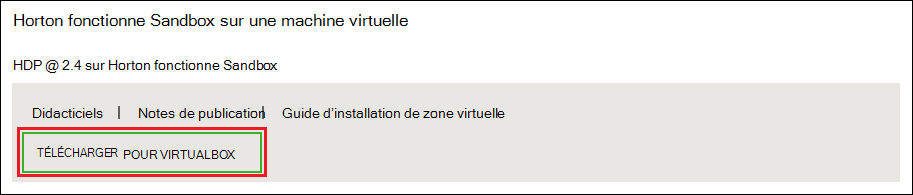
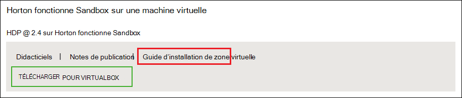
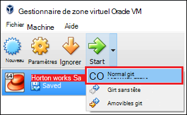

<properties
    pageTitle="Utilisez un sandbox Hadoop pour en savoir plus sur Hadoop | Microsoft Azure"
    description="Pour commencer la formation sur l’utilisation de l’écosystème Hadoop, vous pouvez configurer un sandbox Hadoop à partir de Hortonworks sur une machine virtuelle Azure. "
    keywords="Hadoop émulateur, hadoop sandbox"
    editor="cgronlun"
    manager="jhubbard"
    services="hdinsight"
    authors="nitinme"
    documentationCenter=""
    tags="azure-portal"/>

<tags
    ms.service="hdinsight"
    ms.workload="big-data"
    ms.tgt_pltfrm="na"
    ms.devlang="na"
    ms.topic="article"
    ms.date="08/24/2016"
    ms.author="nitinme"/>

# Mise en route de l’écosystème Hadoop avec un sandbox Hadoop sur une machine virtuelle

Découvrez comment installer le sandbox Hadoop de Hortonworks sur une machine virtuelle pour en savoir plus sur l’écosystème Hadoop. La sandbox offre un environnement de développement local pour en savoir plus sur Hadoop, système de fichier distribué (très) Hadoop et la soumission de travaux.

## Conditions préalables

* [Oracle VirtualBox](https://www.virtualbox.org/)

Une fois que vous êtes familiarisé avec Hadoop, vous pouvez démarrer à l’aide d’Hadoop sur Azure en créant un cluster HDInsight. Pour plus d’informations sur la mise en route, consultez [mise en route de Hadoop sur HDInsight](hdinsight-hadoop-linux-tutorial-get-started.md).

## Téléchargez et installez la machine virtuelle

1. Dans [http://hortonworks.com/downloads/#sandbox](http://hortonworks.com/downloads/#sandbox), cliquez sur __Télécharger pour VIRTUALBOX__ de 2,4 HDP sur Hortonworks Sandbox. Vous devrez enregistrer avec Hortonworks avant que le téléchargement ne commence.

    

2. À partir de la même page web, sélectionnez le __Guide d’installation de VirtualBox__ de 2,4 HDP sur Hortonworks Sandbox. Il télécharge un fichier PDF contenant des instructions d’installation de la machine virtuelle.

    

## Démarrez l’ordinateur virtuel

1. Démarrer VirtualBox, sélectionnez le bac à sable Hortonworks, sélectionnez __Démarrer__, puis sur __Démarrer de Normal__.

    

2. Une fois que la machine virtuelle a terminé le processus de démarrage, il affiche les instructions de connexion. Ouvrez un navigateur web et accédez à l’URL affichée (généralement http://127.0.0.1:8888).

## Mots de passe

1. À partir de l’étape de __mise en route__ de la page Hortonworks Sandbox, sélectionnez __Afficher les Options avancées__. Utilisez les informations de cette page pour vous connecter à la sandbox à l’aide de SSH. Utilisez le nom et le mot de passe fourni.

    > [AZURE.NOTE] Si vous ne disposez pas d’un client SSH installé, vous pouvez utiliser le SSH basée sur le web fournie à par la machine virtuelle de __http://localhost:4200 /__.

    La première fois que vous vous connectez à l’aide de SSH, vous êtes invité à modifier le mot de passe pour le compte de la racine. Entrez un nouveau mot de passe qui sera utilisé lorsque vous vous connectez à l’aide de SSH à l’avenir.

2. Une fois connecté, entrez la commande suivante :

        ambari-admin-password-reset
    
    Lorsque vous y êtes invité, fournissez un mot de passe pour le compte d’administrateur Ambari. Il sera utilisé lorsque vous accédez à l’interface utilisateur Web de Ambari.

## Utilisez la commande de la ruche

1. À partir d’une connexion SSH pour le sandbox, utilisez la commande suivante pour démarrer l’interface de la ruche :

        hive

2. Une fois que l’environnement a démarré, utilisez la suivante pour afficher les tables qui sont fournis avec le bac à sable :

        show tables;

3. Utilisez la suivante pour récupérer 10 lignes à partir de la `sample_07` table :

        select * from sample_07 limit 10;

## Étapes suivantes

* [Apprenez à utiliser Visual Studio avec le bac à sable Hortonworks](hdinsight-hadoop-emulator-visual-studio.md)
* [Les câbles du Hortonworks Sandbox d’apprentissage](http://hortonworks.com/hadoop-tutorial/learning-the-ropes-of-the-hortonworks-sandbox/)
* [Didacticiel d’Hadoop - mise en route avec HDP](http://hortonworks.com/hadoop-tutorial/hello-world-an-introduction-to-hadoop-hcatalog-hive-and-pig/)