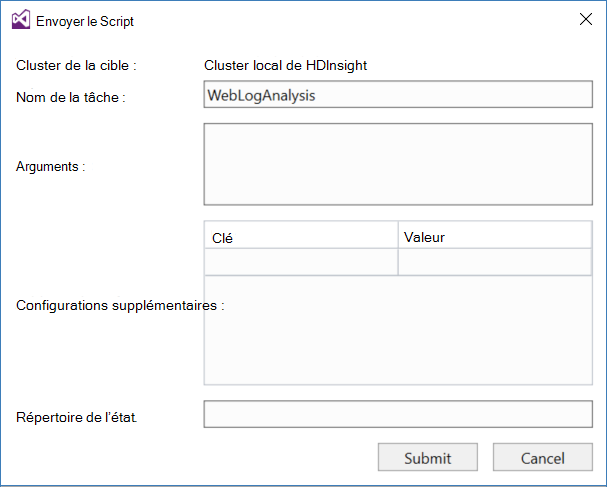

<properties
pageTitle="Utiliser les outils de Microsoft Azure données LAC pour Visual Studio avec le Sandbox Hortonworks | Microsoft Azure"
description="Apprenez à utiliser le lac de données Azure Tools pour VIsual Studio avec le sandbox de Hortonworks (en cours d’exécution sur un ordinateur virtuel local.) Grâce à ces outils, vous pouvez créer et exécuter des travaux de ruche et de porcins sur la sortie des tâches sandbox et la vue et de l’historique."
services="hdinsight"
documentationCenter=""
authors="Blackmist"
manager="paulettm"
editor="cgronlun"/>

<tags
ms.service="hdinsight"
ms.devlang="na"
ms.topic="article"
ms.tgt_pltfrm="na"
ms.workload="big-data"
ms.date="08/26/2016"
ms.author="larryfr"/>

# Utiliser les outils de LAC de données Azure pour Visual Studio avec le bac à sable Hortonworks

Les outils du lac de données Azure pour Visual Studio incluent des outils pour l’utilisation avec des clusters Hadoop génériques, en plus d’outils pour travailler avec lac de données Azure et HDInsight. Ce document fournit les étapes nécessaires pour utiliser les outils de LAC de données Azure avec le Sandbox de l’Hortonworks en cours d’exécution sur un ordinateur virtuel local.

Le Sandbox de Hortonworks vous permet de travailler avec Hadoop localement sur votre environnement de développement. Une fois que vous avez développé une solution et que vous souhaitez le déployer à grande échelle, vous pouvez ensuite déplacer à un cluster d’HDInsight.

## Conditions préalables

* Le Sandbox de Hortonworks en cours d’exécution sur une machine virtuelle sur votre environnement de développement. Ce document a été écrit et testé avec le sandbox s’exécutant dans Oracle VirtualBox, qui a été configuré en utilisant les informations dans le document [mise en route de l’écosystème Hadoop](hdinsight-hadoop-emulator-get-started.md) .

* 2013 ou 2015, n’importe quelle édition Visual Studio.

* Le [Kit de développement logiciel Azure pour .NET](https://azure.microsoft.com/downloads/) 2.7.1 ou ultérieure

* [Outils de LAC données Azure pour Visual Studio](https://www.microsoft.com/download/details.aspx?id=49504)

## Configurer les mots de passe pour le bac à sable

Assurez-vous que le bac à sable Hortonworks est en cours d’exécution, puis suivez les étapes de la [mise en route de l’écosystème Hadoop](hdinsight-hadoop-emulator-get-started.md#set-passwords) pour configurer le mot de passe pour le SSH `root` compte et la Ambari `admin` compte. Ces mots de passe seront utilisés lors de la connexion dans le sandbox de Visual Studio.

## Connecter les outils dans le sandbox

1. Ouvrez Visual Studio et sélectionnez __affichage__, puis sur __Explorateur de serveurs__.

2. Dans l' __Explorateur de serveurs__, cliquez avec le bouton droit sur l’entrée __HDInsight__ et sélectionnez __se connecter à l’émulateur de HDInsight__.

    

3. À partir de la boîte de dialogue __se connecter à l’émulateur de HDInsight__ , entrez le mot de passe que vous avez configurés pour Ambari.

    

    Sélectionnez __suivant__ pour continuer.

4. Le champ __mot de passe__ permet d’entrer le mot de passe que vous avez configurée pour le `root` compte. Laissez les autres champs à la valeur par défaut.

    

    Sélectionnez __suivant__ pour continuer.

5. Attente de validation des services pour terminer. Dans certains cas, la validation peut échouer et vous invite à mettre à jour la configuration. Lorsque cela se produit, cliquez sur le bouton __mettre à jour__ et attendez pour la configuration et la vérification du service terminer.

    

    > [AZURE.NOTE] Le processus de mise à jour utilise Ambari pour modifier la configuration de Sandbox de Hortonworks pour ce qui est attendu par les outils du lac de données Azure pour Visual Studio.

    Une fois la validation terminée, sélectionnez __Terminer__ pour terminer la configuration.

    

    > [AZURE.NOTE] En fonction de la vitesse de votre environnement de développement et la quantité de mémoire allouée à la machine virtuelle, elle peut prendre plusieurs minutes pour configurer et contrôler les services.

Après avoir suivi ces étapes, vous avez maintenant une entrée « HDInsight le cluster local » dans l’Explorateur de serveurs sous la section HDInsight.

## Écrire une requête de la ruche

Ruche fournit un langage de requête de type SQL (HiveQL), pour travailler avec des données structurées. Utilisez les étapes suivantes pour savoir comment exécuter des requêtes ad-hoc sur le cluster local.

1. Dans l' __Explorateur de serveurs__, avec le bouton droit sur l’entrée pour le cluster local que vous avez ajouté précédemment et sélectionnez ensuite __écrire une requête de la ruche__.

    

    Cela ouvre une nouvelle fenêtre de requête qui vous permet de taper et de soumettre une requête vers le cluster local rapidement.

2. Dans la nouvelle fenêtre de requête, entrez les informations suivantes :

        select count(*) from sample_08;
    
    À partir du haut de la fenêtre de requête, assurez-vous que la configuration pour le cluster local est sélectionné et sélectionnez __Envoyer__. Les autres valeurs (__traitement par lots__ et nom de serveur,), conservez les valeurs par défaut.

    

    Notez que vous pouvez également utiliser la liste déroulante en regard de __Envoyer__ pour sélectionner __Advanced__. Cette action ouvre une boîte de dialogue qui vous permet de fournir des options supplémentaires lors de l’envoi du travail.

    

3. Une fois que vous soumettez la requête, l’état du travail s’affiche. Fournit des informations sur le projet comme il est traité par Hadoop. L’entrée __d’État de tâche__ fournit l’état actuel de la tâche. L’état sera mis à jour régulièrement, ou vous pouvez utiliser l’icône d’actualisation pour actualiser manuellement l’état.

    

    Une fois que l' __État du travail__ devient __terminé__, un graphique acyclique dirigé (DAG, Switched Virtual Circuit) s’affiche. Ce document décrit le chemin d’exécution qui a été déterminé par Tez (la valeur par défaut moteur d’exécution pour ruche sur le cluster local.) 
    
    > [AZURE.NOTE] Tez est également la valeur par défaut lorsque vous utilisez les clusters basés sur Linux de HDInsight. Il n’est pas la valeur par défaut de HDInsight basée sur Windows ; pour l’utiliser, vous devez ajouter la ligne `set hive.execution.engine = tez;` au début de la requête de la ruche. 

    Cliquez sur le lien de __Sortie des tâches__ pour afficher la sortie. Dans ce cas, il est __823__; le nombre de lignes dans la table sample_08. Vous pouvez afficher des informations de diagnostic sur le travail en utilisant les liens de __Travail journal__ et __Journal de téléchargement de fils__ .

4. Vous pouvez également exécuter des travaux de la ruche de manière interactive en modifiant le champ __lot__ vers __Interactive__et puis cliquez sur __exécuter__. 

    

    Cela affiche le journal de sortie généré au cours du traitement dans la fenêtre __Sortie de HiveServer2__ .
    
    > [AZURE.NOTE] Il s’agit des mêmes informations que celle qui sont disponibles à partir du lien du __Journal de la tâche__ après qu’un travail est terminé.

    

## Créez un projet de la ruche

Vous pouvez également créer un projet qui contient plusieurs scripts de la ruche. Cela est utile lorsque vous avez lié les scripts dont vous avez besoin pour conserver ensemble, ou à l’aide d’un système de contrôle de version.

1. Dans Visual Studio, sélectionnez __fichier__, __Nouveau__et then__Project__.

2. À partir de la liste de projets, développez __modèles__, __Lac de données Azure__ et sélectionnez __la ruche (HDInsight)__. À partir de la liste des modèles, sélectionnez __l’Exemple de la ruche__. Entrez un nom et un emplacement, puis sélectionnez __OK__.

    

__L’Exemple de la ruche__ de projet contient deux scripts, __WebLogAnalysis.hql__ et __SensorDataAnalysis.hql__. Vous pouvez envoyer à l’aide du bouton __Envoyer__ même en haut de la fenêtre.

## Créez un projet de porc

Alors que la ruche fournit un langage de type SQL pour travailler avec des données structurées, porc fournit un langage (Latin de porc), qui vous permet de développer un pipeline de transformation appliqués à vos données. Utilisez les étapes suivantes pour utiliser des porcs avec le cluster local.

1. Ouvrez Visual Studio et sélectionnez le __fichier__, sur __Nouveau__, puis sur __projet__. Dans la liste de projets, développez __modèles__, __Lac de données Azure__et puis sélectionnez __porc (HDInsight)__. À partir de la liste des modèles, sélectionnez __Application de porc__. Entrez un nom, l’emplacement, puis sélectionnez __OK__.

    

2. Entrez les informations suivantes en tant que le contenu du fichier __script.pig__ qui a été créé avec ce projet.

        a = LOAD '/demo/data/Website/Website-Logs' AS (
            log_id:int, 
            ip_address:chararray, 
            date:chararray, 
            time:chararray, 
            landing_page:chararray, 
            source:chararray);
        b = FILTER a BY (log_id > 100);
        c = GROUP b BY ip_address;
        DUMP c;

    Alors que les porcs utilise une autre langue que la ruche, comment exécuter les tâches est cohérent entre les deux langues, par le biais du bouton __Envoyer__ . Sélection de la liste déroulante vers le bas en regard de __Envoyer__ affiche une boîte de dialogue avancées d’envoi porc.

    
    
3. L’état du travail et la sortie est également le même affiché sous la forme d’une requête de la ruche.

    

## Afficher les tâches

Outils de LAC de données Azure vous permettent également de vous permettent d’afficher facilement des informations sur les tâches qui ont été exécutez sur Hadoop. Utilisez les étapes suivantes pour voir les tâches qui ont été exécutés sur le cluster local.

1. Dans l' __Explorateur de serveurs__, avec le bouton droit sur le cluster local et sélectionnez __Afficher les tâches__. Ceci affichera une liste des travaux qui ont été soumises au cluster.

    

2. À partir de la liste des tâches, sélectionnez une option pour afficher les détails de la tâche.

    

    Les informations affichées sont similaires à ce qui s’affiche après avoir exécuté une requête ruche ou porc, avec des liens pour afficher les résultats et enregistrer les informations.

3. Vous pouvez également modifier et soumettre de nouveau la tâche à partir d’ici.

## Afficher les bases de données de ruche

1. Dans l' __Explorateur de serveurs__, développez l’entrée du __cluster local de HDInsight__ et puis développez __Bases de données de la ruche__. Cela permet d’afficher les bases de données __par défaut__ et __xademo__ sur le cluster local. Développement d’une base de données révèle les tables dans la base de données.

    

2. En développant une table affiche les colonnes de la table. Vous pouvez cliquez sur une table et sélectionnez __Vue Top 100 lignes__ pour afficher rapidement les données.

    

### Propriétés de base de données et de Table

Vous avez peut-être remarqué que vous pouvez choisir d’afficher les __Propriétés__ sur une base de données ou une table. Cela affiche les détails pour l’élément sélectionné dans la fenêtre Propriétés.

### Créer une table

Pour créer une nouvelle table, cliquez sur une base de données, puis sélectionnez __Create Table__.

Vous pouvez ensuite créer la table à l’aide d’un formulaire. Vous pouvez voir le brut HiveQL qui sera utilisé pour créer le tableau au bas de cette page.

## Étapes suivantes

* [Les câbles du Hortonworks Sandbox d’apprentissage](http://hortonworks.com/hadoop-tutorial/learning-the-ropes-of-the-hortonworks-sandbox/)
* [Didacticiel d’Hadoop - mise en route avec HDP](http://hortonworks.com/hadoop-tutorial/hello-world-an-introduction-to-hadoop-hcatalog-hive-and-pig/)