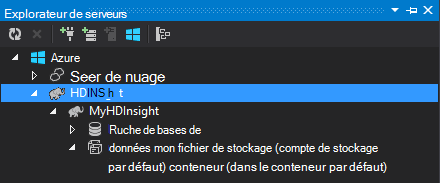

<properties
    pageTitle="Utiliser C# avec la ruche et porc sur Hadoop dans HDInsight | Microsoft Azure"
    description="Découvrez comment utiliser C# fonctions utilisateur (FDU) avec la ruche et de la diffusion en continu dans Azure HDInsight de porc."
    services="hdinsight"
    documentationCenter=""
    authors="Blackmist"
    manager="jhubbard"
    editor="cgronlun"
    tags="azure-portal"/>

<tags
    ms.service="hdinsight"
    ms.workload="big-data"
    ms.tgt_pltfrm="na"
    ms.devlang="dotnet"
    ms.topic="article"
    ms.date="10/28/2016"
    ms.author="larryfr"/>

#Utiliser des fonctions définies par l’utilisateur C# avec ruche et porc en continu sur Hadoop dans HDInsight

Ruche et porc sont très utiles pour travailler avec des données dans HDInsight d’Azure, mais parfois vous avez besoin d’un langage plus universel. Les ruche et porc vous permettent d’appeler le code externe par le biais de fonctions définies par l’utilisateur (UDF) ou de transmission en continu.

Dans ce document, découvrez comment utiliser C# avec la ruche et de porcins.

##Conditions préalables

* Windows 7 ou une version ultérieure.

* Visual Studio avec les versions suivantes :

    * Visual Studio 2012 Professional/Premium/Édition intégrale avec [mise à jour 4](http://www.microsoft.com/download/details.aspx?id=39305)

    * Visual Studio 2013 Communauté/Professionnel/Premium/Édition intégrale avec [mise à jour 4](https://www.microsoft.com/download/details.aspx?id=44921)

    * Visual Studio 2015

* Hadoop sur cluster de HDInsight - consultez [fourniture un cluster HDInsight](hdinsight-provision-clusters.md) pour obtenir la procédure pour créer un cluster

* Outils d’Hadoop pour Visual Studio. Pour obtenir la procédure d’installation et de configuration des outils, consultez [mise en route à l’aide d’outils d’Hadoop HDInsight pour Visual Studio](hdinsight-hadoop-visual-studio-tools-get-started.md) .

##.NET sur HDInsight

Le common language runtime .NET (CLR) et les infrastructures sont installés par défaut sur les clusters basés sur Windows de HDInsight. Cela vous permet d’utiliser des applications C# avec la ruche et porc en flux continu (données passées entre ruche/porc et l’application C# via stdout/stdin).

> [AZURE.NOTE] Il n’existe actuellement aucune prise en charge pour l’exécution de.NET Framework UDF sur les clusters basés sur Linux de HDInsight. 

##.NET et la diffusion en continu

Diffusion en continu implique la ruche et porc passer des données à une application externe sur stdout et reçoit les résultats via stdin. Pour les applications C#, cela est facilement réalisable `Console.ReadLine()` et `Console.WriteLine()`.

Étant donné que la ruche et les porcs ont besoin invoquer l’application en cours d’exécution, le modèle **Application Console** doit être utilisé pour vos projets C#.

##Ruche et C & #35 ;

###Créer le projet C#

1. Ouvrez Visual Studio et créez une nouvelle solution. Pour le type de projet, sélectionnez **Application Console**et nommez le nouveau projet **HiveCSharp**.

2. Remplacez le contenu de **Program.cs** par le texte suivant :

        using System;
        using System.Security.Cryptography;
        using System.Text;
        using System.Threading.Tasks;

        namespace HiveCSharp
        {
            class Program
            {
                static void Main(string[] args)
                {
                    string line;
                    // Read stdin in a loop
                    while ((line = Console.ReadLine()) != null)
                    {
                        // Parse the string, trimming line feeds
                        // and splitting fields at tabs
                        line = line.TrimEnd('\n');
                        string[] field = line.Split('\t');
                        string phoneLabel = field[1] + ' ' + field[2];
                        // Emit new data to stdout, delimited by tabs
                        Console.WriteLine("{0}\t{1}\t{2}", field[0], phoneLabel, GetMD5Hash(phoneLabel));
                    }
                }
                /// 

                /// Returns an MD5 hash for the given string
                /// 

                /// <param name="input">string value</param>
                /// <returns>an MD5 hash</returns>
                static string GetMD5Hash(string input)
                {
                    // Step 1, calculate MD5 hash from input
                    MD5 md5 = System.Security.Cryptography.MD5.Create();
                    byte[] inputBytes = System.Text.Encoding.ASCII.GetBytes(input);
                    byte[] hash = md5.ComputeHash(inputBytes);

                    // Step 2, convert byte array to hex string
                    StringBuilder sb = new StringBuilder();
                    for (int i = 0; i < hash.Length; i++)
                    {
                        sb.Append(hash[i].ToString("x2"));
                    }
                    return sb.ToString();
                }
            }
        }

3. Générez le projet.

###Télécharger vers le stockage

1. Dans Visual Studio, ouvrez **l’Explorateur de serveurs**.

3. Développez **Azure**, puis **HDInsight**.

4. Si vous y êtes invité, entrez vos informations d’identification de l’abonnement Azure, puis cliquez sur **Se connecter**.

5. Développez le cluster HDInsight que vous souhaitez déployer cette application sur et puis **Compte de stockage par défaut**.

    

6. Double-cliquez sur **Conteneur par défaut** pour le cluster. Ceci ouvrira une nouvelle fenêtre qui affiche le contenu du conteneur par défaut.

7. Cliquez sur l’icône de téléchargement et accédez au dossier **bin\debug** du projet **HiveCSharp** . Enfin, sélectionnez le fichier **HiveCSharp.exe** et cliquez sur **Ok**.

    

8. Une fois le téléchargement terminé, vous ne pourrez pas utiliser l’application à partir d’une requête de la ruche.

###Requête de la ruche

1. Dans Visual Studio, ouvrez **l’Explorateur de serveurs**.

2. Développez **Azure**, puis **HDInsight**.

5. Cliquez sur le cluster que vous avez déployé l’application **HiveCSharp** à et sélectionnez **écrire une requête de la ruche**.

6. Pour la requête de la ruche, utilisez ce qui suit :

        add file wasbs:///HiveCSharp.exe;

        SELECT TRANSFORM (clientid, devicemake, devicemodel)
        USING 'HiveCSharp.exe' AS
        (clientid string, phoneLabel string, phoneHash string)
        FROM hivesampletable
        ORDER BY clientid LIMIT 50;

    Sélectionne le `clientid`, `devicemake`, et `devicemodel` des champs à partir de `hivesampletable`et transmet les champs de l’application HiveCSharp.exe. La requête attend l’application à retourner trois champs, qui sont stockées en tant que `clientid`, `phoneLabel`, et `phoneHash`. La requête s’attend également à trouver HiveCSharp.exe dans la racine du conteneur de stockage par défaut (`add file wasbs:///HiveCSharp.exe`).

5. Cliquez sur **Soumettre** pour soumettre la tâche au cluster HDInsight. Ouvre la fenêtre **Récapitulatif de la ruche** .

6. Cliquez sur **Actualiser** pour actualiser la synthèse jusqu'à ce que **l’État du travail** devient **terminé**. Pour afficher la sortie de la tâche, cliquez sur **Sortie du projet**.

##Porcs et C & #35 ;

###Créer le projet C#

1. Ouvrez Visual Studio et créez une nouvelle solution. Pour le type de projet, sélectionnez **Application Console**et nommez le nouveau projet **PigUDF**.

2. Remplacez le contenu du fichier **Program.cs** par le texte suivant :

        using System;

        namespace PigUDF
        {
            class Program
            {
                static void Main(string[] args)
                {
                    string line;
                    // Read stdin in a loop
                    while ((line = Console.ReadLine()) != null)
                    {
                        // Fix formatting on lines that begin with an exception
                        if(line.StartsWith("java.lang.Exception"))
                        {
                            // Trim the error info off the beginning and add a note to the end of the line
                            line = line.Remove(0, 21) + " - java.lang.Exception";
                        }
                        // Split the fields apart at tab characters
                        string[] field = line.Split('\t');
                        // Put fields back together for writing
                        Console.WriteLine(String.Join("\t",field));
                    }
                }
            }
        }

    Cette application analysera les lignes envoyées à partir de porcs et de reformater les lignes qui commencent par `java.lang.Exception`.

3. Enregistrer **Program.cs**, puis générez le projet.

###Télécharger l’application

1. Diffusion en continu de porc prévoit que l’application soit local sur le système de fichiers du cluster. Activer le Bureau à distance pour le cluster de HDInsight et puis lui connecter en suivant les instructions de la section [se connecter à des clusters HDInsight utilisant le protocole RDP](hdinsight-administer-use-management-portal.md#rdp).

2. Une fois connecté, copiez **PigUDF.exe** à partir du répertoire **bin/debug** du projet PigUDF sur votre ordinateur local et collez-le dans le répertoire **% PIG_HOME %** sur le cluster.

###Utilisation de l’application à partir de porc Latin

1. À partir de la session Bureau à distance, démarrer la ligne de commande Hadoop à l’aide de l’icône de la **ligne de commande Hadoop** sur le bureau.

2. Utilisez la suivante pour démarrer la ligne de commande de porc :

        cd %PIG_HOME%
        bin\pig

    Vous obtenez un `grunt>` invite.

3. Entrez les informations suivantes pour exécuter un travail de porc simple à l’aide de l’application.NET Framework :

        DEFINE streamer `pigudf.exe` SHIP('pigudf.exe');
        LOGS = LOAD 'wasbs:///example/data/sample.log' as (LINE:chararray);
        LOG = FILTER LOGS by LINE is not null;
        DETAILS = STREAM LOG through streamer as (col1, col2, col3, col4, col5);
        DUMP DETAILS;

    Le `DEFINE` instruction crée un alias de `streamer` pour les applications pigudf.exe, et `SHIP` qu’il répartit sur les nœuds du cluster. Plus tard, `streamer` est utilisé avec le `STREAM` opérateur de traiter les lignes individuelles contenues dans le journal et retourner les données sous la forme d’une série de colonnes.

> [AZURE.NOTE] L’application qui est utilisé pour la diffusion en continu doit être entouré par le \` (backtick) caractères quand un alias, et ' (guillemet simple) lorsqu’il est utilisé avec `SHIP`.

3. Après avoir entré la dernière ligne, la tâche doit démarrer. Finalement il retournera sortie semblable à la suivante :

        (2012-02-03 20:11:56 SampleClass5 [WARN] problem finding id 1358451042 - java.lang.Exception)
        (2012-02-03 20:11:56 SampleClass5 [DEBUG] detail for id 1976092771)
        (2012-02-03 20:11:56 SampleClass5 [TRACE] verbose detail for id 1317358561)
        (2012-02-03 20:11:56 SampleClass5 [TRACE] verbose detail for id 1737534798)
        (2012-02-03 20:11:56 SampleClass7 [DEBUG] detail for id 1475865947)

##Résumé

Dans ce document, vous avez appris à utiliser une application.NET Framework à partir de la ruche et de porcins sur HDInsight. Si vous souhaitez apprendre à utiliser les Python avec la ruche et porcines, voir [Utiliser les Python avec la ruche et porc dans HDInsight](hdinsight-python.md).

Pour d’autres façons d’utiliser de porc et la ruche et pour en savoir plus sur l’utilisation de MapReduce, consultez les rubriques suivantes :

* [Utilisez la ruche avec HDInsight](hdinsight-use-hive.md)

* [Utilisez des porcs avec HDInsight](hdinsight-use-pig.md)

* [Utilisez MapReduce avec HDInsight](hdinsight-use-mapreduce.md)
