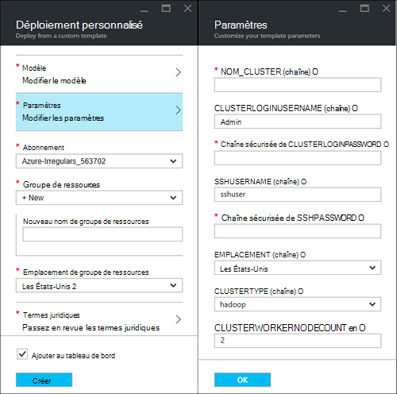
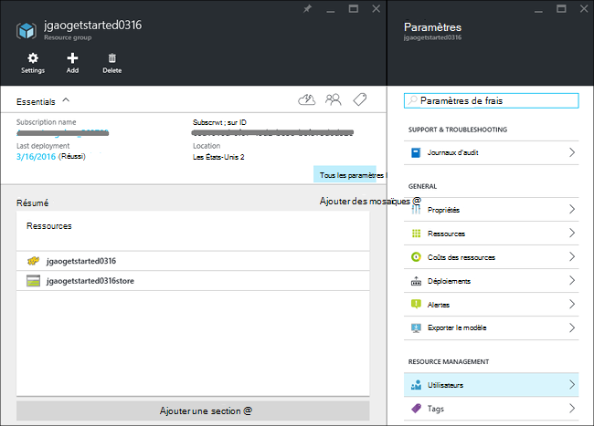
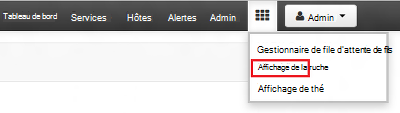
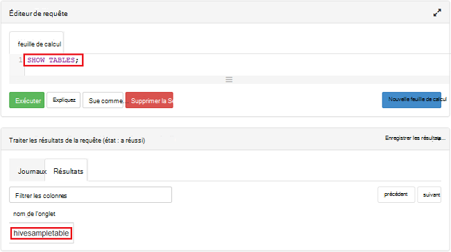

<properties
    pageTitle="Didacticiel de Linux : mise en route de Hadoop et ruche | Microsoft Azure"
    description="Suivez ce didacticiel Linux pour commencer à utiliser Hadoop dans HDInsight. Découvrez comment mettre en service les clusters Linux et interroger les données avec la ruche."
    services="hdinsight"
    documentationCenter=""
    authors="mumian"
    manager="jhubbard"
    editor="cgronlun"
    tags="azure-portal"/>

<tags
    ms.service="hdinsight"
    ms.devlang="na"
    ms.topic="hero-article"
    ms.tgt_pltfrm="na"
    ms.workload="big-data"
    ms.date="09/14/2016"
    ms.author="jgao"/>

# Hadoop didacticiel : mise en route de basé sur Linux de Hadoop dans HDInsight

> [AZURE.SELECTOR]
- [Basé sur Linux](hdinsight-hadoop-linux-tutorial-get-started.md)
- [Basé sur Windows](hdinsight-hadoop-tutorial-get-started-windows.md)

Apprenez comment créer les clusters basés sur Linux [Hadoop](http://hadoop.apache.org/) dans HDInsight et à l’exécution des tâches de la ruche dans HDInsight. [La ruche Apache](https://hive.apache.org/) est le composant les plus populaires dans l’écosystème Hadoop. Actuellement, HDInsight est livré avec 4 types de cluster différent : [Hadoop](hdinsight-hadoop-introduction.md), [étincelle](hdinsight-apache-spark-overview.md), [HBase](hdinsight-hbase-overview.md) et [Storm](hdinsight-storm-overview.md).  Chaque type de cluster prend en charge un ensemble différent de composants. Tous les types de cluster 4 prend en charge la ruche. Pour une liste des composants pris en charge dans HDInsight, reportez-vous à la section [Nouveautés dans les versions de cluster Hadoop fournies par HDInsight ?](hdinsight-component-versioning.md)  

[AZURE.INCLUDE [delete-cluster-warning](../../includes/hdinsight-delete-cluster-warning.md)]

## Conditions préalables

Avant de commencer ce didacticiel, vous devez disposer :

- **Abonnement Azure**: pour créer un compte d’essai un mois gratuit, accédez à [azure.microsoft.com/free](https://azure.microsoft.com/free).

### Exigences de contrôle d’accès

[AZURE.INCLUDE [access-control](../../includes/hdinsight-access-control-requirements.md)]

## Créer le cluster

La plupart des tâches d’Hadoop sont des traitements par lots. Vous créez un cluster, exécutez certaines tâches et puis supprimez le cluster. Dans cette section, vous allez créer un cluster basé sur Linux de Hadoop dans HDInsight à l’aide du [modèle de gestionnaire de ressources Azure](../resource-group-template-deploy.md). Modèle de gestionnaire de ressources est entièrement personnalisable ; Il est facile de créer des ressources Azure comme HDInsight. Expérience de modèle de gestionnaire de ressources n’est pas nécessaire pour la suite de ce didacticiel. Pour les autres méthodes de création de cluster et comprendre les propriétés utilisées dans ce didacticiel, consultez [HDInsight de créer des clusters](hdinsight-hadoop-provision-linux-clusters.md). Le modèle de gestionnaire de ressources utilisé dans ce didacticiel se trouve dans un conteneur public blob, [https://hditutorialdata.blob.core.windows.net/armtemplates/create-linux-based-hadoop-cluster-in-hdinsight.json](https://hditutorialdata.blob.core.windows.net/armtemplates/create-linux-based-hadoop-cluster-in-hdinsight.json). 

1. Cliquez sur l’image suivante pour vous connecter à Azure et ouvrez le modèle de gestionnaire de ressources dans le portail Azure. 

    

2. À partir de la blade de **paramètres** , entrez les informations suivantes :

    .

    - **Nom_Cluster**: entrez un nom pour le cluster Hadoop que vous allez créer.
    - **Mot de passe et le nom de connexion de cluster**: le nom d’ouverture de session par défaut est **admin**.
    - **Mot de passe et nom d’utilisateur SSH**: le nom d’utilisateur par défaut est **sshuser**.  Vous pouvez le renommer. 
    
    Autres paramètres sont facultatifs pour la suite de ce didacticiel. Vous pouvez les laisser comme ils le sont. 
    
    Chaque cluster a une dépendance de compte de stockage Azure Blob. Il est généralement appelé le compte de stockage par défaut. Cluster de HDInsight et de son compte de stockage par défaut doivent coexister dans la même région d’Azure. Suppression de clusters ne supprimera pas le compte de stockage. Dans le modèle, le nom de compte de stockage par défaut est défini comme le nom du cluster avec « banque » est ajoutée. 
    
3. Cliquez sur **OK** pour enregistrer les paramètres.
4. À partir de la blade de **déploiement de personnalisé** , entrez le **nouveau nom de groupe de ressources** pour créer un nouveau groupe de ressources.  Le groupe de ressources est un conteneur qui groupe le cluster, le compte de stockage dépendant et autres s. L’emplacement de groupe de ressources peut être différent de l’emplacement du cluster.
5. Cliquez sur **conditions**, puis cliquez sur **créer**.
6. Vérifiez que la case à cocher **Ajouter au tableau de bord** est activée, puis cliquez sur **créer**. Vous verrez une nouvelle mosaïque intitulée de **déploiement de modèle de déploiement**. Il faut environ 20 minutes environ pour créer un cluster. 
7.  Une fois que le cluster est créé, la légende de la mosaïque est remplacée par le nom du groupe de ressources spécifié. Et le portail s’ouvre automatiquement deux lames avec le cluster et les paramètres de cluster. 

    .

    Il existe deux ressources répertoriées, le cluster et le compte de stockage par défaut.

##Exécuter des requêtes de la ruche

[La ruche Apache](hdinsight-use-hive.md) est le composant les plus populaires dans HDInsight. Il existe de nombreux moyens d’exécuter des travaux de la ruche dans HDInsight. Dans ce didacticiel, vous utiliserez l’affichage Ambari ruche à partir du portail pour exécuter certaines tâches de la ruche. Pour les autres méthodes pour soumettre des tâches de la ruche, voir [Utilisation de la ruche dans HDInsight](hdinsight-use-hive.md).

1. Accédez à **https://&lt;nomcluster >. azurehdinsight.net**, où &lt;nomcluster > est le cluster vous avez créé dans la section précédente pour ouvrir Ambari.
2. Entrez le nom d’utilisateur de Hadoop et d’un mot de passe que vous avez spécifié dans la section précédente. Le nom d’utilisateur par défaut est **admin**.
3. Afficher **La ruche** comme illustré dans la capture d’écran suivante :

    .
4. Dans la section __Éditeur de requête__ de la page, collez les instructions HiveQL suivantes dans la feuille de calcul :

        SHOW TABLES;

    >[AZURE.NOTE] Point-virgule est requis par la ruche.       
        
5. Cliquez sur __exécuter__. Une section de __Requête du processus__ doit s’affichent en dessous de l’éditeur de requête et afficher des informations sur la tâche. 

    Une fois la requête terminée, la section des __Résultats du processus de requête__ affiche les résultats de l’opération. Vous veillent à une table appelée **hivesampletable**. Cet exemple de table de ruche est fourni avec tous les clusters HDInsight.

    .

6. Répétez les étapes 4 et 5 pour exécuter la requête suivante :

        SELECT * FROM hivesampletable;

    > [AZURE.TIP] Notez la liste déroulante de __Enregistrer les résultats__ dans le coin supérieur gauche de la section des __Résultats du processus de requête__ ; Vous pouvez utiliser ceci pour télécharger les résultats, ou les enregistrer sur le stockage de HDInsight dans un fichier CSV.

7. Cliquez sur **historique** pour obtenir une liste des tâches.

Après avoir terminé une tâche de la ruche, vous pouvez [Exporter les résultats de la base de données Azure SQL ou de la base de données SQL Server](hdinsight-use-sqoop-mac-linux.md), vous pouvez également [visualiser les résultats à l’aide d’Excel](hdinsight-connect-excel-power-query.md). Pour plus d’informations sur l’utilisation de la ruche dans HDInsight, consultez [utilisation de la ruche et HiveQL avec Hadoop dans HDInsight pour analyser un exemple de fichier log4j Apache](hdinsight-use-hive.md).

##Nettoyage du didacticiel

Après avoir terminé le didacticiel, vous souhaiterez probablement supprimer le cluster. Avec HDInsight, vos données sont stockées dans le stockage Azure, donc vous pouvez supprimer en toute sécurité un cluster lorsqu’il n’est pas en cours d’utilisation. Vous êtes également chargé pour un cluster de HDInsight, même lorsqu’il n’est pas en cours d’utilisation. Dans la mesure où les frais pour le cluster sont bien plus que les frais de stockage, il est économique judicieux de supprimer les clusters lorsqu’ils ne sont pas en cours d’utilisation. 

>[AZURE.NOTE] À l’aide de la [Fabrique de données Azure](hdinsight-hadoop-create-linux-clusters-adf.md), vous pouvez créer des clusters de HDInsight à la demande et configurer un paramètre de la propriété TimeToLive pour supprimer automatiquement des clusters. 

**Supprimer le cluster et/ou le compte de stockage par défaut**

1. Connectez-vous au [portail Azure](https://portal.azure.com).
2. Dans le tableau de bord de portail, cliquez sur la mosaïque avec le nom du groupe de ressources utilisé lors de la création du cluster.
3. Cliquez sur **Supprimer** sur la lame de la ressource à supprimer le groupe de ressources qui contient le cluster et le compte de stockage par défaut ; ou cliquez sur le nom du cluster dans la fenêtre **ressources** et puis cliquez sur **Supprimer** sur la lame de cluster. Veuillez Notez que la suppression du groupe de ressources va supprimer le compte de stockage. Si vous souhaitez conserver le compte de stockage, choisissez Supprimer le cluster uniquement.

## Étapes suivantes

Dans ce didacticiel, vous avez appris comment créer un cluster basé sur Linux de HDInsight à l’aide d’un modèle de gestionnaire de ressources et comment effectuer des requêtes de la ruche de base.

Pour en savoir plus sur l’analyse des données à l’aide de HDInsight, consultez les rubriques suivantes :

- Pour en savoir plus sur l’utilisation de la ruche avec HDInsight, y compris comment effectuer des requêtes de la ruche à partir de Visual Studio, consultez [Utilisation de la ruche avec HDInsight][hdinsight-use-hive].

- Pour en savoir plus sur les porcs, un langage utilisé pour transformer les données, consultez [Utilisation des porcs avec HDInsight][hdinsight-use-pig].

- Pour en savoir plus sur MapReduce, un moyen d’écrire des programmes qui traitent les données sur Hadoop, consultez [MapReduce utilisation avec HDInsight][hdinsight-use-mapreduce].

- Pour obtenir des informations sur l’utilisation des outils HDInsight pour Visual Studio pour analyser les données sur HDInsight, reportez-vous à la section [mise en route à l’aide des outils Visual Studio Hadoop pour HDInsight](hdinsight-hadoop-visual-studio-tools-get-started.md).

Si vous êtes prêt à commencer à travailler avec vos propres données et en savoir plus sur comment HDInsight stocke les données ou l’ajout de données dans HDInsight, consultez les rubriques suivantes :

- Pour plus d’informations sur la manière dont HDInsight utilise le stockage blob Azure, consultez [stockage Blob Azure d’utiliser avec HDInsight](hdinsight-hadoop-use-blob-storage.md).

- Pour plus d’informations sur la façon de télécharger des données vers HDInsight, voir [télécharger les données pour HDInsight][hdinsight-upload-data].

Si vous souhaitez en savoir plus sur la création ou la gestion d’un cluster de HDInsight, consultez les rubriques suivantes :

- Pour en savoir plus sur la gestion de votre cluster HDInsight de basé sur Linux, consultez le [HDInsight de gérer les clusters à l’aide de Ambari](hdinsight-hadoop-manage-ambari.md).

- Pour en savoir plus sur les options que vous pouvez sélectionner lors de la création d’un cluster d’HDInsight, reportez-vous à la section [Création d’HDInsight sous Linux à l’aide des options personnalisées](hdinsight-hadoop-provision-linux-clusters.md).

- Si vous êtes familiarisé avec Linux et Hadoop, mais pour connaître les caractéristiques de l’objet autour d’Hadoop sur le HDInsight, reportez-vous à la section [utilisation de HDInsight sous Linux](hdinsight-hadoop-linux-information.md). Il fournit des informations telles que :

    * URL des services hébergés sur le cluster, tels que Ambari et WebHCat
    * L’emplacement des fichiers d’Hadoop et des exemples sur le système de fichiers local
    * L’utiliser d’Azure Storage (WASB) au lieu de très comme données par défaut de la banque

[1]: ../HDInsight/hdinsight-hadoop-visual-studio-tools-get-started.md

[hdinsight-provision]: hdinsight-provision-clusters.md
[hdinsight-admin-powershell]: hdinsight-administer-use-powershell.md
[hdinsight-upload-data]: hdinsight-upload-data.md
[hdinsight-use-mapreduce]: hdinsight-use-mapreduce.md
[hdinsight-use-hive]: hdinsight-use-hive.md
[hdinsight-use-pig]: hdinsight-use-pig.md

[powershell-download]: http://go.microsoft.com/fwlink/p/?linkid=320376&clcid=0x409
[powershell-install-configure]: powershell-install-configure.md
[powershell-open]: powershell-install-configure.md#Install

[img-hdi-dashboard]: ./media/hdinsight-hadoop-tutorial-get-started-windows/HDI.dashboard.png
[img-hdi-dashboard-query-select]: ./media/hdinsight-hadoop-tutorial-get-started-windows/HDI.dashboard.query.select.png
[img-hdi-dashboard-query-select-result]: ./media/hdinsight-hadoop-tutorial-get-started-windows/HDI.dashboard.query.select.result.png
[img-hdi-dashboard-query-select-result-output]: ./media/hdinsight-hadoop-tutorial-get-started-windows/HDI.dashboard.query.select.result.output.png
[img-hdi-dashboard-query-browse-output]: ./media/hdinsight-hadoop-tutorial-get-started-windows/HDI.dashboard.query.browse.output.png
[image-hdi-clusterstatus]: ./media/hdinsight-hadoop-tutorial-get-started-windows/HDI.ClusterStatus.png
[image-hdi-gettingstarted-powerquery-importdata]: ./media/hdinsight-hadoop-tutorial-get-started-windows/HDI.GettingStarted.PowerQuery.ImportData.png
[image-hdi-gettingstarted-powerquery-importdata2]: ./media/hdinsight-hadoop-tutorial-get-started-windows/HDI.GettingStarted.PowerQuery.ImportData2.png
