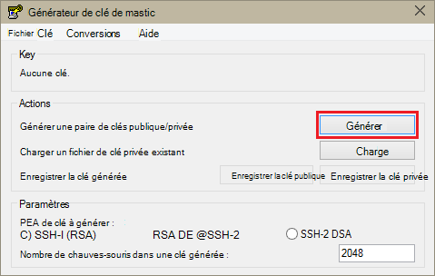
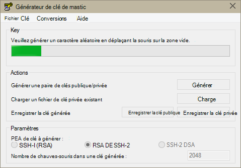
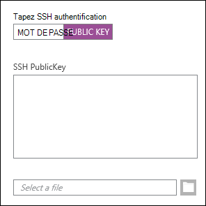
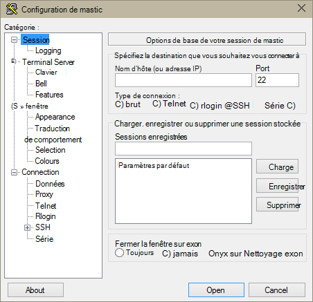
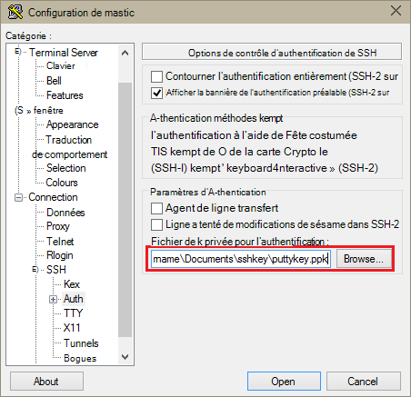
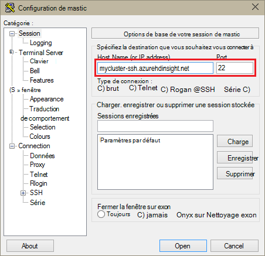
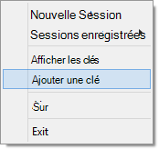
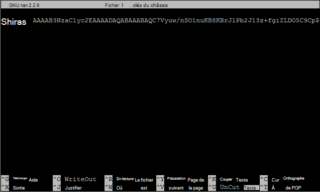

<properties
   pageTitle="Utiliser les touches SSH avec Hadoop sur des grappes de serveurs Linux à partir de Windows | Microsoft Azure"
   description="Découvrez comment créer et utiliser des clés SSH pour s’authentifier sur les clusters basés sur Linux de HDInsight. Connecter des clusters à partir de clients Windows en utilisant le client SSH PuTTY."
   services="hdinsight"
   documentationCenter=""
   authors="Blackmist"
   manager="jhubbard"
   editor="cgronlun"
    tags="azure-portal"/>

<tags
   ms.service="hdinsight"
   ms.devlang="na"
   ms.topic="get-started-article"
   ms.tgt_pltfrm="na"
   ms.workload="big-data"
   ms.date="08/30/2016"
   ms.author="larryfr"/>

#Utiliser le protocole SSH avec basé sur Linux d’Hadoop sur HDInsight à partir de Windows

> [AZURE.SELECTOR]
- [Windows](hdinsight-hadoop-linux-use-ssh-windows.md)
- [Linux, Unix, OS X](hdinsight-hadoop-linux-use-ssh-unix.md)

[SSH (Secure Shell)](https://en.wikipedia.org/wiki/Secure_Shell) permet d’effectuer des opérations sur vos clusters basés sur Linux de HDInsight à l’aide d’une interface de ligne de commande à distance. Ce document fournit des informations sur la connexion à HDInsight à partir de clients Windows, en utilisant le client SSH PuTTY.

> [AZURE.NOTE] Les étapes décrites dans cet article supposent que vous utilisez un client Windows. Si vous utilisez un client OS X, Unix ou Linux, consultez [Utiliser SSH avec basé sur Linux d’Hadoop sur HDInsight de Linux, Unix ou OS X](hdinsight-hadoop-linux-use-ssh-unix.md).
>
> Si vous avez Windows 10 et que vous utilisez [Bash sur Ubuntu sous Windows](https://msdn.microsoft.com/commandline/wsl/about), vous pouvez utiliser les étapes dans le document [d’Utiliser SSH avec basé sur Linux d’Hadoop sur HDInsight de Linux, Unix ou OS X](hdinsight-hadoop-linux-use-ssh-unix.md) .

##Conditions préalables

* **PuTTY** et **PuTTYGen** pour les clients basés sur Windows. Ces utilitaires sont disponibles à partir de [http://www.chiark.greenend.org.uk/~sgtatham/putty/download.html](http://www.chiark.greenend.org.uk/~sgtatham/putty/download.html).

* Un navigateur web moderne qui prend en charge d’HTML5.

OU

* [CLI azure](../xplat-cli-install.md).

    [AZURE.INCLUDE [use-latest-version](../../includes/hdinsight-use-latest-cli.md)] 

##Quel est le SSH ?

SSH est un utilitaire de connexion et exécuter à distance les commandes sur un serveur distant. HDInsight basé sur Linux, SSH établit une connexion cryptée avec le nœud de tête du cluster et fournit une ligne de commande qui vous permet de taper des commandes. Commandes sont ensuite exécutées directement sur le serveur.

###Nom d’utilisateur SSH

Un nom d’utilisateur SSH est le nom que vous utilisez pour s’authentifier sur le cluster de HDInsight. Lorsque vous spécifiez un nom d’utilisateur SSH lors de la création du cluster, cet utilisateur est créé sur tous les nœuds du cluster. Une fois que le cluster est créé, vous pouvez utiliser ce nom d’utilisateur pour se connecter aux nœuds de tête du cluster HDInsight. Dans les nœuds de tête, vous pouvez ensuite connecter aux nœuds du travailleur.

###Mot de passe SSH ou clé publique

Un utilisateur SSH peut utiliser soit un mot de passe ou la clé publique pour l’authentification. Un mot de passe est simplement une chaîne de texte que vous apportez, alors qu’une clé publique est partie d’une paire de clés cryptographiques générée pour vous identifier de manière unique.

Une clé est plus sûre que le mot de passe, mais il nécessite des étapes supplémentaires pour générer la clé et vous devez conserver les fichiers contenant la clé dans un emplacement sécurisé. Si tout le monde accède aux fichiers de clés, ils ont accès à votre compte. Ou, si vous perdez les fichiers de clés, vous ne serez pas en mesure de se connecter à votre compte.

Une paire de clés est constituée d’une clé publique (qui est envoyée au serveur HDInsight) et une clé privée (qui est conservée sur votre ordinateur client.) Lorsque vous vous connectez au serveur HDInsight à l’aide de SSH, le client SSH utilise la clé privée sur votre ordinateur pour s’authentifier auprès du serveur.

##Créer un code SSH

Utilisez les informations suivantes si vous prévoyez d’utiliser des clés SSH avec votre cluster. Si vous envisagez l’utilisation d’un mot de passe, vous pouvez ignorer cette section.

1. Ouvrez PuTTYGen.

2. Pour le **Type de clé pour générer**, sélectionnez **RSA de SSH-2**, puis cliquez sur **Générer**.

    

3. Déplacer la souris dans la zone située sous la barre de progression, jusqu'à ce que la barre remplit. Déplacement de la souris génère des données aléatoires qui sont utilisées pour générer la clé.

    

    Une fois que la clé a été générée, la clé publique s’affiche.

4. Pour plus de sécurité, vous pouvez entrer un mot de passe dans le champ **mot de passe de clé** et tapez la même valeur dans le champ **Confirmer le mot de passe** .

    

    > [AZURE.NOTE] Nous vous recommandons fortement d’utiliser un mot de passe sécurisé pour la clé. Toutefois, si vous oubliez le mot de passe, il n’existe aucun moyen de le récupérer.

5. Cliquez sur **Enregistrer la clé privée** pour enregistrer la clé dans un fichier **.ppk** . Cette clé permet de s’authentifier sur votre cluster HDInsight de fonctionnant sous Linux.

    > [AZURE.NOTE] Vous devez stocker cette clé dans un endroit sûr, tel qu’il peut être utilisé pour accéder à votre cluster basé sur Linux de HDInsight.

6. Cliquez sur **Enregistrer la clé publique** pour enregistrer la clé dans un fichier **.txt** . Cela vous permet de réutiliser la clé publique dans le futur, lorsque vous créez des clusters basés sur Linux de HDInsight supplémentaires.

    > [AZURE.NOTE] La clé publique est également affichée en haut de la PuTTYGen. Vous pouvez cliquez sur ce champ, copier la valeur et puis collez-le dans un formulaire lors de la création d’un cluster en utilisant le portail Azure.

##Création d’un cluster basé sur Linux de HDInsight

Lors de la création d’un cluster basé sur Linux de HDInsight, vous devez fournir la clé publique créée précédemment. À partir de clients Windows, il existe deux façons de créer un cluster basé sur Linux de HDInsight :

* **Azure Portal** - utilise un portail web pour créer le cluster.

* **Infrastructure du langage commun pour Mac, Linux et Windows azure** - utilise des commandes de ligne de commande pour créer le cluster.

Chacune de ces méthodes nécessite la clé publique. Pour plus d’informations sur la création d’un cluster basé sur Linux de HDInsight, consultez [les clusters basés sur Linux de fourniture de HDInsight](hdinsight-hadoop-provision-linux-clusters.md).

###Azure Portal

Lorsque vous utilisez le [Portail Azure] [ preview-portal] pour créer un cluster basé sur Linux de HDInsight, vous devez entrer un **Nom d’utilisateur SSH**et sélectionnez cette option pour entrer un **mot de passe** ou la **Clé publique SSH**.

Si vous sélectionnez la **Clé publique SSH**, vous pouvez soit coller la clé publique (affiché dans la __une clé publique pour les coller dans OpenSSH autorisé\_fichier de clés__ PuttyGen, champ) dans le champ de __SSH PublicKey__ ou sélectionnez __Sélectionner un fichier__ pour parcourir et sélectionner le fichier qui contient la clé publique.

Cela crée une connexion d’accès pour l’utilisateur spécifié et permet l’authentification du mot de passe ou l’authentification par clé SSH.

###Interface de ligne de commande Azure pour Windows, Linux et Mac

Vous pouvez utiliser l' [Infrastructure du langage commun pour Mac, Linux et Windows Azure](../xplat-cli-install.md) pour créer un nouveau cluster à l’aide de la `azure hdinsight cluster create` commande.

Pour plus d’informations sur l’utilisation de cette commande, voir [clusters de fourniture Hadoop Linux dans HDInsight à l’aide des options personnalisées](hdinsight-hadoop-provision-linux-clusters.md).

##Se connecter à un cluster basé sur Linux de HDInsight

1. Ouvrez PuTTY.

    

2. Si vous avez fourni un code SSH lorsque vous avez créé votre compte d’utilisateur, vous devez effectuer l’opération suivante pour sélectionner la clé privée à utiliser lors de l’authentification pour le cluster :

    Dans la **catégorie**, développez la **connexion**, développez **SSH**et sélectionnez **Auth**. Enfin, cliquez sur **Parcourir** et sélectionnez le fichier .ppk qui contient votre clé privée.

    

3. Dans la **catégorie**, sélectionnez **la Session**. Dans l’écran **des options de base de votre session de mastic** , entrez l’adresse SSH de votre serveur HDInsight dans le champ **nom d’hôte (ou adresse IP)** . Il existe deux adresses SSH possibles, que vous pouvez utiliser lors de la connexion à un cluster :

    * __Adresse de nœud de tête__: pour vous connecter au nœud principal du cluster, utilisez votre nom de cluster, puis **-ssh.azurehdinsight.net**. Par exemple, **mon_cluster-ssh.azurehdinsight.net**.
    
    * __Adresse de nœud de bord__: Si vous vous connectez à un serveur R sur cluster de HDInsight, vous pouvez vous connecter au nœud R serveur edge à l’aide de l’adresse __RServer.CLUSTERNAME.ssh.azurehdinsight.net__, où CLUSTERNAME est le nom de votre cluster. Par exemple, __RServer.mycluster.ssh.azurehdinsight.net__.

    

4. Pour enregistrer les informations de connexion pour une utilisation ultérieure, entrez un nom pour cette connexion sous **Sessions d’enregistrement**, puis cliquez sur **Enregistrer**. La connexion sera ajoutée à la liste des sessions enregistrées.

5. Cliquez sur **Ouvrir** pour vous connecter au cluster.

    > [AZURE.NOTE] Si c’est la première fois que vous vous êtes connecté à un cluster, vous recevez une alerte de sécurité. Ceci est normal. Cliquez sur **Oui** pour mettre en cache de la clé du serveur RSA2 pour continuer.

6. Lorsque vous y êtes invité, entrez l’utilisateur que vous avez entré lors de la création du cluster. Si vous avez fourni un mot de passe de l’utilisateur, vous êtes invité à l’entrer également.

> [AZURE.NOTE] Les étapes ci-dessus supposent que vous utilisez le port 22, qui se connectera à l’headnode primaire sur le cluster de HDInsight. Si vous utilisez le port 23, vous connectera sur le site secondaire. Pour plus d’informations sur les nœuds de tête, voir la [disponibilité et la fiabilité des clusters Hadoop dans HDInsight](hdinsight-high-availability-linux.md).

###Se connecter aux nœuds de travailleur

Les nœuds de travail ne sont pas directement accessibles depuis l’extérieur du centre de données Azure, mais ils sont accessibles à partir du nœud principal de cluster via le protocole SSH.

Si vous avez fourni un code SSH lorsque vous avez créé votre compte d’utilisateur, vous devez effectuer les étapes suivantes pour utiliser la clé privée lors de l’authentification au cluster si vous souhaitez vous connecter les nœuds de travailleur.

1. Installez la Fête costumée à partir de [http://www.chiark.greenend.org.uk/~sgtatham/putty/download.html](http://www.chiark.greenend.org.uk/~sgtatham/putty/download.html). Cet utilitaire est utilisé pour mettre en cache des clés SSH pour PuTTY.

2. Exécutez Fête costumée. Elle sera réduite en une icône dans la barre d’état. Cliquez sur l’icône et sélectionnez **Ajouter une clé**.

    

3. Lorsque la boîte de dialogue s’affiche, sélectionnez le fichier .ppk qui contient la clé, puis cliquez sur **Ouvrir**. Cela ajoute la clé à la Fête costumée, qui va fournir à PuTTY lors de la connexion au cluster.

    > [AZURE.IMPORTANT] Si vous avez utilisé un code SSH pour sécuriser votre compte, vous devez effectuer les étapes précédentes avant de pouvoir se connecter aux nœuds du travailleur.

4. Ouvrez PuTTY.

5. Si vous utilisez un code SSH pour authentifier, dans la section **catégorie** , développez la **connexion** **SSH**de développer et puis sélectionnez **Auth**.

    Dans la section **paramètres d’authentification** , activez **Autoriser les agents de transfert**. Ainsi, PuTTY transmettre automatiquement l’authentification de certificat par le biais de la connexion au nœud principal de cluster lors de la connexion aux nœuds du travailleur.

    

6. Se connecter au cluster en procédant comme décrit plus haut. Si vous utilisez un code SSH pour l’authentification, vous n’avez pas besoin de sélectionner la clé : la clé SSH ajoutée à la Fête costumée sera utilisée pour s’authentifier sur le cluster.

7. Une fois la connexion établie, utilisez la suivante pour récupérer une liste des nœuds de votre cluster. Remplacez *ADMINPASSWORD* avec le mot de passe pour votre compte d’administrateur de cluster. Remplacez *NOM_CLUSTER* par le nom de votre cluster.

        curl --user admin:ADMINPASSWORD https://CLUSTERNAME.azurehdinsight.net/api/v1/hosts

    Ceci renverra des informations au format JSON pour les nœuds dans le cluster, y compris les `host_name`, qui contient le nom de domaine pleinement qualifié (FQDN) pour chaque nœud. Voici un exemple d’une `host_name` entrée renvoyée par la commande de **coin** :

        "host_name" : "workernode0.workernode-0-e2f35e63355b4f15a31c460b6d4e1230.j1.internal.cloudapp.net"

8. Une fois que vous avez une liste des nœuds du travailleur que vous souhaitez vous connecter, utilisez la commande suivante à partir de la session de mastic pour ouvrir une connexion à un nœud de travail :

        ssh USERNAME@FQDN

    Remplacez le *nom d’utilisateur* avec votre nom d’utilisateur SSH et le *nom de domaine complet* avec le nom de domaine complet du nœud du travailleur. Par exemple, `workernode0.workernode-0-e2f35e63355b4f15a31c460b6d4e1230.j1.internal.cloudapp.net`.

    > [AZURE.NOTE] Si vous utilisez un mot de passe pour l’authentification de la session SSH, vous serez invité à entrer le mot de passe à nouveau. Si vous utilisez un code SSH, la connexion doit terminer sans invite.

9. Une fois la session établie, l’invite pour votre session de mastic changera à partir de `username@hn#-clustername` à `username@wn#-clustername` pour indiquer que vous êtes connecté sur le nœud du travailleur. Les commandes que vous exécutez à ce stade seront exécute sur le nœud du travailleur.

10. Une fois que vous avez terminé d’exécuter des actions sur le noeud de travail, utiliser la `exit` la commande Fermer la session sur le nœud du travailleur. Cela vous renverra à la `username@hn#-clustername` invite.

##Ajouter d’autres comptes

Si vous devez ajouter des comptes à votre cluster, effectuez les opérations suivantes :

1. Générer une nouvelle clé publique et une clé privée pour le nouveau compte d’utilisateur comme décrit précédemment.

2. À partir d’une session SSH pour le cluster, ajouter le nouvel utilisateur avec la commande suivante :

        sudo adduser --disabled-password <username>

    Cela créera un nouveau compte d’utilisateur, mais vous permet de désactiver l’authentification du mot de passe.

3. Créer le répertoire et les fichiers pour contenir la clé en utilisant les commandes suivantes :

        sudo mkdir -p /home/<username>/.ssh
        sudo touch /home/<username>/.ssh/authorized_keys
        sudo nano /home/<username>/.ssh/authorized_keys

4. Lorsque l’éditeur nano s’ouvre, copiez et collez le contenu de la clé publique pour le nouveau compte d’utilisateur. Enfin, utilisez **Ctrl-X** pour enregistrer le fichier et quittez l’éditeur.

    

5. Pour changer le propriétaire du dossier du .ssh et du contenu pour le nouveau compte d’utilisateur, utilisez la commande suivante :

        sudo chown -hR <username>:<username> /home/<username>/.ssh

6. Vous devez maintenant être en mesure de s’authentifier sur le serveur avec la clé privée et un nouveau compte d’utilisateur.

##Tunneling de SSH

SSH peut servir pour les demandes locales, telles que des demandes web, au cluster HDInsight du tunnel. La demande est ensuite dirigée vers la ressource demandée comme si elle avait a été créée sur le nœud principal du cluster HDInsight.

> [AZURE.IMPORTANT] Un tunnel SSH est obligatoire pour accéder à l’interface utilisateur web pour certains services Hadoop. Par exemple, l’interface utilisateur de l’historique de travail ou de l’interface utilisateur du Gestionnaire de ressources seulement sont accessibles à l’aide d’un tunnel SSH.

Pour plus d’informations sur la création et à l’aide d’un tunnel SSH, consultez [Utiliser SSH Tunneling pour accéder à l’interface utilisateur web de Ambari, ResourceManager, JobHistory, NameNode, Oozie et autre web, l’interface utilisateur](hdinsight-linux-ambari-ssh-tunnel.md).

##Étapes suivantes

Maintenant que vous comprenez comment authentifier à l’aide d’un code SSH, découvrez comment utiliser MapReduce avec Hadoop sur HDInsight.

* [Utilisez la ruche avec HDInsight](hdinsight-use-hive.md)

* [Utilisez des porcs avec HDInsight](hdinsight-use-pig.md)

* [Utiliser des travaux de MapReduce avec HDInsight](hdinsight-use-mapreduce.md)

[preview-portal]: https://portal.azure.com/
