<properties
   pageTitle="Surveiller et gérer des clusters HDInsight à l’aide de l’interface utilisateur Web de Apache Ambari | Microsoft Azure"
   description="Découvrez comment utiliser Ambari pour surveiller et gérer les clusters basés sur Linux de HDInsight. Dans ce document, vous apprendrez comment utiliser l’interface utilisateur Web Ambari inclus avec les clusters HDInsight."
   services="hdinsight"
   documentationCenter=""
   authors="Blackmist"
   manager="jhubbard"
   editor="cgronlun"
    tags="azure-portal"/>

<tags
   ms.service="hdinsight"
   ms.devlang="na"
   ms.topic="article"
   ms.tgt_pltfrm="na"
   ms.workload="big-data"
   ms.date="09/27/2016"
   ms.author="larryfr"/>

#Gérer les clusters HDInsight à l’aide de l’interface utilisateur Web de Ambari

[AZURE.INCLUDE [ambari-selector](../../includes/hdinsight-ambari-selector.md)]

Apache Ambari simplifie la gestion et la surveillance d’un cluster d’Hadoop en fournissant un facile à utiliser l’interface utilisateur web et les API REST. Ambari est inclus sur les clusters basés sur Linux de HDInsight et est utilisé pour surveiller le cluster et apporter des modifications de configuration.

Dans ce document, vous apprendrez comment utiliser l’interface utilisateur Web de Ambari avec un cluster de HDInsight.

##Nouveautés Ambari

<a href="http://ambari.apache.org" target="_blank">Apache Ambari</a> simplifie la gestion d’Hadoop en fournissant un interface utilisateur qui peut être utilisé pour configurer, gérer et surveiller les clusters Hadoop du web facile à utiliser. Les développeurs peuvent intégrer ces fonctionnalités dans leurs applications à l’aide de l' <a href="https://github.com/apache/ambari/blob/trunk/ambari-server/docs/api/v1/index.md" target="_blank">API de reste de Ambari</a>.

L’interface utilisateur Web de Ambari est fourni par défaut avec les clusters basés sur Linux de HDInsight. 

##Connectivité

L’interface utilisateur Web de Ambari est disponible sur votre cluster de HDInsight à HTTPS://CLUSTERNAME.azurehdidnsight.net, dans laquelle __CLUSTERNAME__ est le nom de votre cluster. 

> [AZURE.IMPORTANT] Connexion à Ambari sur HDInsight nécessite HTTPS. Vous devez également vous authentifier à Ambari en utilisant le nom du compte administrateur (la valeur par défaut est __admin__) et un mot de passe fourni lors de la création du cluster.

##Proxy SSH

> [AZURE.NOTE] Ambari pour votre cluster est accessible directement via Internet, des liens à partir de l’interface utilisateur Web de Ambari (telle que la JobTracker,) ne sont pas exposés sur internet. Donc vous recevrez des erreurs de « serveur introuvable » lorsque vous tentez d’accéder à ces fonctionnalités, sauf si vous utilisez un tunnel SSH (Secure Shell) pour le trafic web de proxy pour le nœud principal du cluster.

Pour plus d’informations sur la création d’un tunnel SSH pour travailler avec Ambari, reportez-vous à la section [Utiliser SSH Tunneling pour accéder à l’interface utilisateur web de Ambari, ResourceManager, JobHistory, NameNode, Oozie et autre web, l’interface utilisateur](hdinsight-linux-ambari-ssh-tunnel.md).

##Interface utilisateur Web de Ambari

Lors de la connexion à l’interface utilisateur Web de Ambari, le système vous demandera d’authentifier à la page. Utiliser l’utilisateur administrateur de cluster (par défaut, Admin) et mot de passe utilisé lors de la création du cluster.

Lorsque la page s’ouvre, notez la barre en haut. Cet onglet contient les informations et les contrôles suivants :

* **Logo de Ambari** - ouvre le tableau de bord, qui peut être utilisé pour surveiller le cluster.

* **Ops de cluster nom #** - affiche le nombre d’opérations de Ambari en cours. Sélectionnez le nom de cluster ou **l’ops de #** affiche une liste des opérations d’arrière-plan.

* **alertes de #** - avertissements ou des alertes critiques, le cas échéant, pour le cluster. Cette option affiche une liste des alertes.

* **Tableau de bord** - affiche le tableau de bord.

* **Services** - informations et configuration des paramètres pour les services du cluster.

* **Hôtes** - informations et configuration des paramètres pour les nœuds dans le cluster.

* **Alertes** - journal des informations, les avertissements et les alertes critiques.

* **Admin** - pile/services logiciels qui sont installés sur le cluster, les informations de compte de service et la sécurité Kerberos.

* **Bouton Admin** - Ambari gestion des paramètres utilisateur et déconnexion.

##Surveillance

###Alertes

Ambari offre de nombreuses alertes, ce qui auront une des valeurs suivantes en tant que le statut :

* **Bien**

* **Avertissement**

* **CRITIQUE**

* **INCONNU**

Alertes de **OK** entraîne l’écriture **d’alertes de #** en haut de la page pour afficher le nombre d’alertes. En sélectionnant cette entrée affichera les alertes et leur état.

Alertes sont organisés en plusieurs groupes par défaut, qui peuvent être consultées à partir de la page **des alertes** .

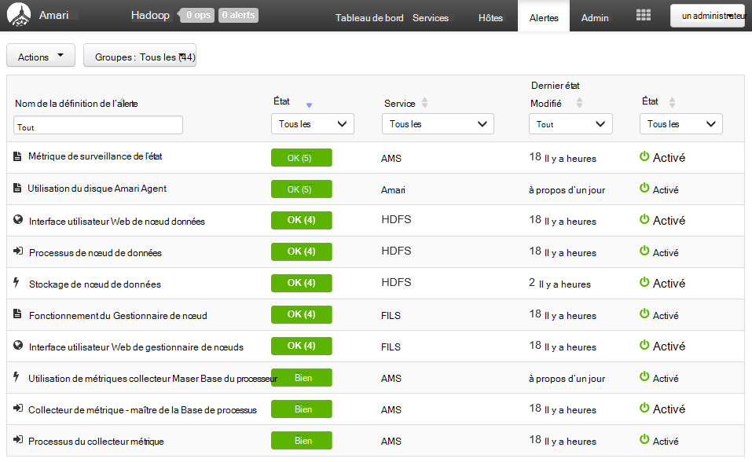

Vous pouvez gérer les groupes à l’aide du menu **Actions** , puis en sélectionnant **Gérer des groupes d’alertes**. Cela vous permet de modifier les groupes existants ou créer de nouveaux groupes.

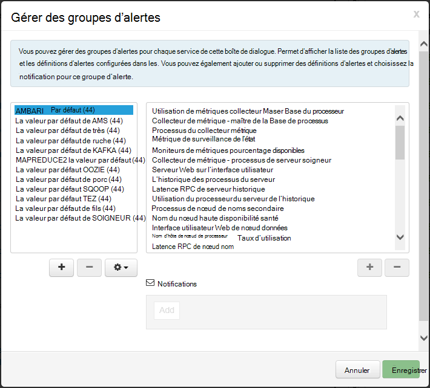

Vous pouvez également créer des notifications d’alerte à partir du menu **Actions** . Cela vous permet de créer des déclencheurs qui envoient des notifications par **E-mail** ou **SNMP** lorsque se produisent les combinaisons d’alerte/gravité spécifique. Par exemple, vous pouvez envoyer une alerte lorsque des alertes dans le groupe de **Fils par défaut** est la valeur **critique**.

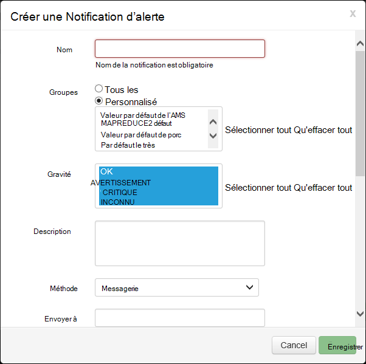

###Cluster

L’onglet **Metrics** du tableau de bord contient une série de widgets qui permet de surveiller l’état de votre cluster en un clin de œil. Plusieurs accessoires, tels **L’utilisation du processeur**, fournissent des informations supplémentaires lorsque vous cliquez dessus.

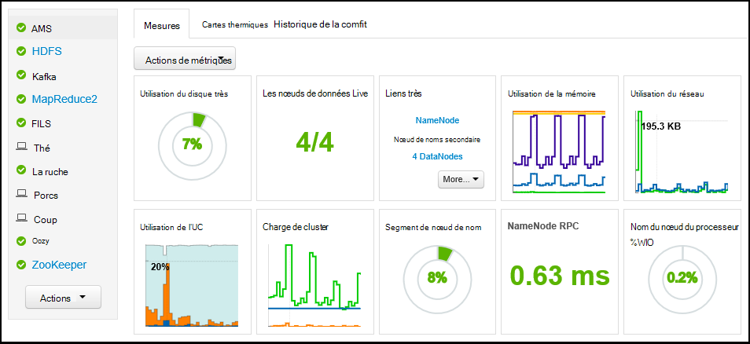

L’onglet **Heatmaps** affiche les mesures heatmaps en couleur, allant du vert au rouge.

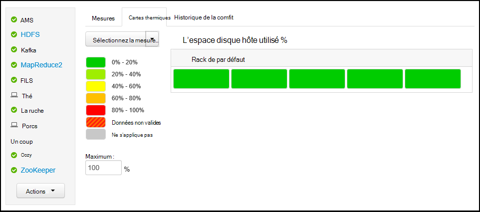

Pour obtenir des informations plus détaillées sur les nœuds dans le cluster, sélectionnez les **hôtes**, puis sélectionnez le nœud spécifique qui que vous intéressez.

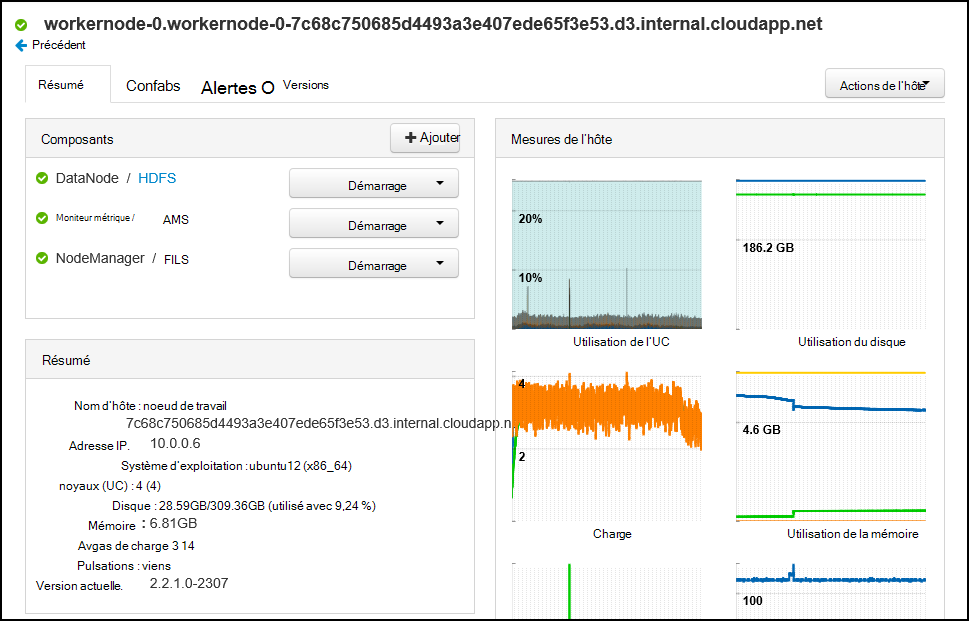

###Services

Le volet **Services** du tableau de bord offre un aperçu rapide de l’état des services s’exécutant sur le cluster. Des icônes différentes sont utilisées pour indiquer l’état ou les actions à entreprendre, comme un symbole de recyclage jaune si un service doit être recyclé.

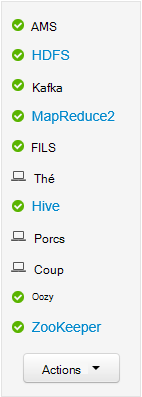

Sélection d’un service affiche des informations plus détaillées sur le service.

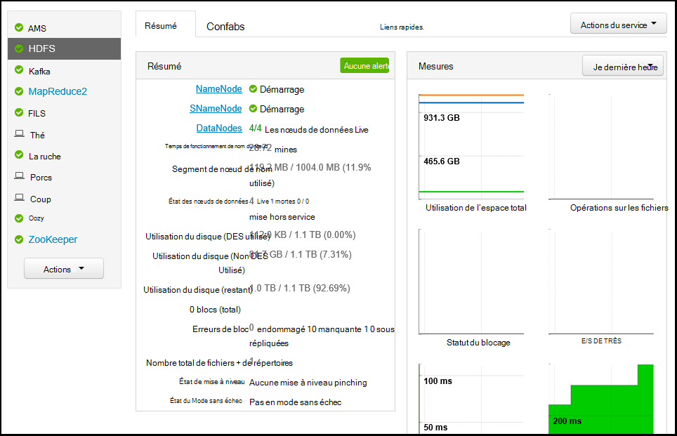

####Liens rapides

Certains services affichent un lien de **Liens rapides** dans la partie supérieure de la page. Cela peut servir à accéder spécifique au service web interfaces utilisateur, telles que :

* **L’historique des travaux** - MapReduce l’historique du travail.

* **Gestionnaire de ressources** - fils ResourceManager UI.

* **NameNode** - Hadoop distribués NameNode interface utilisateur (très) de système de fichiers.

* **Interface utilisateur Web de Oozie** - Oozie l’interface utilisateur.

Sélectionnez un de ces liens pour ouvrir un nouvel onglet dans votre navigateur, qui affiche la page sélectionnée.

> [AZURE.NOTE] Sélection d’un lien de **Liens rapides** pour tout service entraînera une erreur « serveur introuvable », sauf si vous utilisez un tunnel Secure Sockets Layer (SSL) pour le trafic web de proxy pour le cluster. C’est parce que les applications web permettant d’afficher ces informations ne sont pas exposées sur internet.
>
> Pour plus d’informations sur l’utilisation d’un tunnel SSL avec HDInsight, reportez-vous à la section [Utiliser SSH Tunneling pour accéder à l’interface utilisateur web de Ambari, ResourceManager, JobHistory, NameNode, Oozie et autre web, l’interface utilisateur](hdinsight-linux-ambari-ssh-tunnel.md)

##Gestion des

###Ambari utilisateurs, des groupes et des autorisations

Gestion des utilisateurs, des groupes et des autorisations ne doivent pas être utilisée avec les clusters HDInsight.

###Hôtes

La page **hôtes** répertorie tous les hôtes du cluster. Pour gérer les hôtes, procédez comme suit.

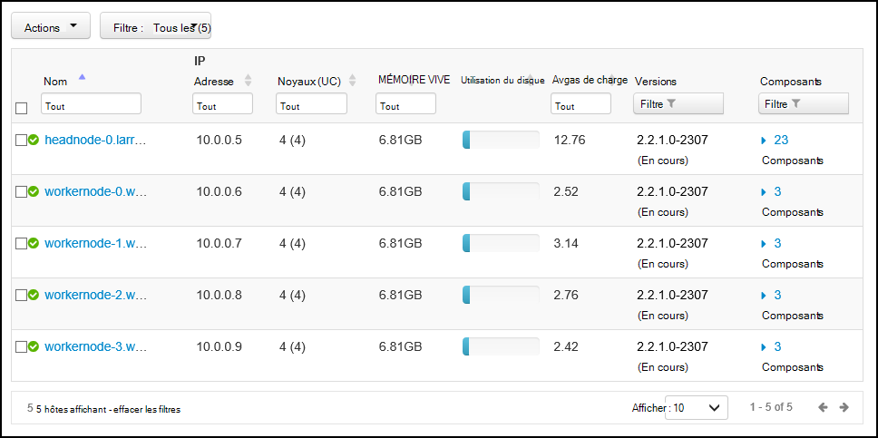

> [AZURE.NOTE] Ajout, désactivation ou recommissioning un hôte ne doit pas être utilisée avec les clusters HDInsight.

1. Sélectionnez l’ou les hôtes que vous souhaitez gérer.

2. Utilisez le menu **Actions** pour sélectionner l’action que vous souhaitez effectuer :

    * **Démarrer tous les composants** - début de tous les composants sur l’hôte.

    * **Arrêter tous les composants** - arrêter tous les composants sur l’hôte.

    * **Redémarrez tous les composants** - arrêt et le démarrage de tous les composants sur l’hôte.

    * **Activer le mode de maintenance** - supprime les alertes pour l’hôte. Il doit être activé si vous effectuez des actions qui vont générer des alertes, telles que le redémarrage d’un service qui dépendent des services en cours d’exécution.

    * **Désactiver le mode de maintenance** - renvoie l’hôte d’alerte normale.

    * **Arrêter** : arrête DataNode ou NodeManagers sur l’hôte.

    * **Démarrer** - démarre la DataNode ou NodeManagers sur l’hôte.

    * **Redémarrer** - arrêts et démarrages DataNode ou NodeManagers sur l’hôte.

    * **Mise hors service** - supprime un hôte du cluster.

        > [AZURE.NOTE] N’utilisez pas cette action sur les clusters de HDInsight.

    * **Recommission** - ajoute un hôte déjà mis hors service au cluster.

        > [AZURE.NOTE] N’utilisez pas cette action sur les clusters de HDInsight.

###Services

À partir de la page de **tableau de bord** ou les **Services** , utilisez le bouton **Actions** au bas de la liste des services pour arrêter et démarrer tous les services.

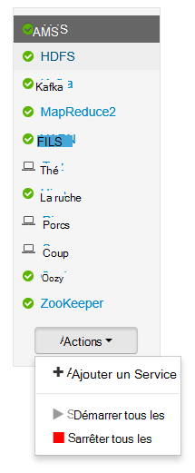

> [AZURE.WARNING] Lors de __l’Ajout de Service__ est répertorié dans ce menu, il ne doit pas servir à ajouter des services à la HDInsight cluster. Nouveaux services doivent être ajoutés à l’aide d’une Action de Script lors de la configuration du cluster. Pour plus d’informations sur l’utilisation des Actions de Script, voir [clusters de HDInsight de personnaliser à l’aide des Actions de Script](hdinsight-hadoop-customize-cluster-linux.md).

Alors que le bouton **Actions** peut redémarrer tous les services, souvent vous souhaitez démarrer, arrêter ou redémarrer un service spécifique. Pour effectuer des actions sur un service individuel, utilisez les étapes suivantes :

1. Dans la page **tableau de bord** ou de **Services** , sélectionnez un service.

2. À partir du haut de l’onglet **Résumé** , cliquez sur le bouton **Actions de Service** et sélectionnez l’action à effectuer. Cela va redémarrer le service sur tous les nœuds.

    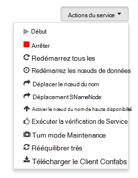

    > [AZURE.NOTE] Redémarrer certains services alors que le cluster est en cours d’exécution peut générer des alertes. Pour éviter ce problème, vous pouvez utiliser le bouton **Actions de Service** pour activer le **mode de Maintenance** pour le service avant d’effectuer le redémarrage.

3. Lorsqu’une action a été sélectionnée, l’entrée de **op de #** en haut de la page va augmenter pour indiquer qu’une opération d’arrière-plan est en cours. Si configuré pour afficher, la liste des opérations d’arrière-plan s’affiche.

    > [AZURE.NOTE] Si vous avez activé le **mode Maintenance** pour le service, pensez à désactiver en utilisant le bouton **Actions de Service** une fois l’opération terminée.

Pour configurer un service, procédez comme suit :

1. Dans la page **tableau de bord** ou de **Services** , sélectionnez un service.

2. Sélectionnez l’onglet **configurations** . La configuration actuelle s’affiche. Une liste des configurations précédentes s’affiche également.

    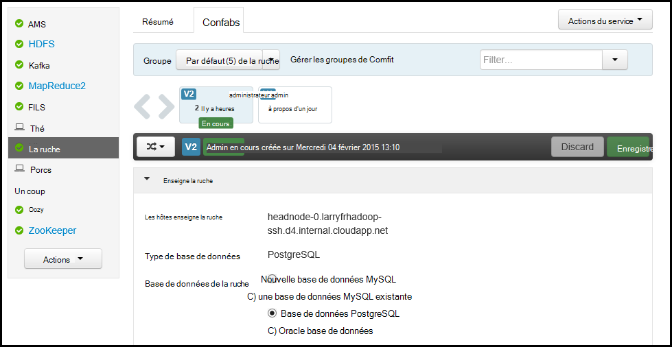

3. Utilisez les champs affichés pour modifier la configuration et sélectionnez **Enregistrer**. Ou sélectionnez une configuration précédente, puis **rendre actif** pour restaurer les paramètres précédents.

##Vues Ambari

Les vues Ambari permettent aux développeurs Branchez des éléments d’interface utilisateur dans l’interface utilisateur Web de Ambari à l’aide de l' [Infrastructure de vues Ambari](https://cwiki.apache.org/confluence/display/AMBARI/Views). HDInsight offre les vues suivantes avec les types de cluster Hadoop :

* Gestionnaire de file d’attente de fils : le Gestionnaire de file d’attente fournit une interface utilisateur simple pour afficher et modifier les files d’attente de fils.
* Ruche affichage : La vue de la ruche vous permet d’exécuter des requêtes de ruche directement à partir de votre navigateur web. Vous pouvez enregistrer des requêtes, afficher les résultats, enregistrer les résultats dans le stockage de cluster ou télécharger les résultats sur votre système local. Pour plus d’informations sur l’utilisation des vues de la ruche, consultez [Utilisation des vues de la ruche avec HDInsight](hdinsight-hadoop-use-hive-ambari-view.md).
* Tez affichage : La vue de Tez vous permet pour mieux comprendre et optimiser les tâches en affichant des informations sur l’exécution des travaux de Tez et quelles ressources sont utilisées par la tâche.
