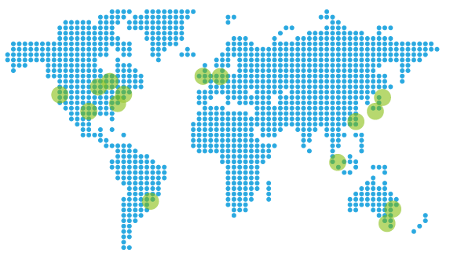

<properties
    pageTitle="Créer des clusters Hadoop, HBase, tempête ou étincelle sur Linux dans HDInsight | Microsoft Azure"
    description="Apprenez à créer des Hadoop, HBase, tempête, ou au service de clusters sous Linux pour HDInsight à l’aide d’un navigateur, la CLI d’Azure, Azure PowerShell, reste, ou via un kit de développement."
    services="hdinsight"
    documentationCenter=""
    authors="mumian"
    manager="jhubbard"
    editor="cgronlun"
    tags="azure-portal"/>

<tags
    ms.service="hdinsight"
    ms.devlang="na"
    ms.topic="article"
    ms.tgt_pltfrm="na"
    ms.workload="big-data"
    ms.date="10/18/2016"
    ms.author="jgao"/>

# Créer les clusters basés sur Linux de Hadoop dans HDInsight

[AZURE.INCLUDE [selector](../../includes/hdinsight-selector-create-clusters.md)]

Un cluster d’Hadoop se compose de plusieurs machines virtuelles (nœuds) qui sont utilisés pour le traitement distribué des tâches sur le cluster. Azure isole les détails d’implémentation de l’installation et la configuration des nœuds individuels, afin que vous ne devrez pas fournir des informations de configuration générales. Dans cet article, vous en savoir plus sur ces paramètres de configuration.

## Exigences de contrôle d’accès

[AZURE.INCLUDE [access-control](../../includes/hdinsight-access-control-requirements.md)]

## Types de cluster

Actuellement, HDInsight d’Azure propose cinq différents types de clusters, chacun avec un ensemble de composants pour fournir certaines fonctionnalités.

| Type de cluster | Fonctionnalités |
| ------------ | ----------------------------- |
| Hadoop       | Requête et analyse (traitements par lots)     |
| HBase        | Stockage de données NoSQL            |
| Orage        | Traitement des événements en temps réel |
| Allumage        | Traitement en mémoire, les requêtes interactives, traitement des flux de micro-lot |
| [Ruche interactive (aperçu)](hdinsight-hadoop-use-interactive-hive.md) | En mémoire cache pour les requêtes de ruche interactifs et plus rapides|
| Serveur R allumage (aperçu) | Une variété de données statistiques, modélisation prédictive et apprentissage des fonctionnalités de l’ordinateur |

Chaque type de cluster possède son propre numéro de nœuds dans le cluster, terminologie pour les nœuds du cluster et la taille de mémoire virtuelle par défaut pour chaque type de nœud. Dans le tableau suivant, le nombre de nœuds pour chaque type de nœud est entre parenthèses.

| Type de| Nœuds | Diagramme|
|-----|------|--------|
|Hadoop| Nœud principal (2), le nœud de données (+ 1)||
|HBase|Tête serveur (2), région (+ 1), le nœud maître/soigneur (3)||
|Orage|Nimbus nœud (2), serveur de superviseur (+ 1), soigneur (3)||
|Allumage|Tête nœud (2), noeud de travail (+ 1), soigneur (3) (disponible pour la taille de mémoire virtuelle d’envieront A1)||

Le tableau suivant répertorie les tailles de la machine virtuelle par défaut pour HDInsight :

- Les prises en charge de régions, à l’exception du sud du Brésil et à l’ouest du Japon :

  	|Type de cluster                     | Hadoop               | HBase                | Orage                | Allumage                                                                 | Serveur de R |
  	|---------------------------------|----------------------|----------------------|----------------------|-----------------------------------------------------------------------|-----------------------------------------------------------------------|
  	|Tête – par défaut taille de mémoire virtuelle           | D3 v2                | D3 v2                | A3                   | D12 v2                                                                | D12 v2                                                                |
  	|Tête – recommandée de machine virtuelle      | V2 de D3, D4 v2, D12 v2 | V2 de D3, D4 v2, D12 v2 | A3, A4, A5           | D12 v2, v2 de D13, D14 v2                                                | D12 v2, v2 de D13, D14 v2                                                |
  	|Travailleur – par défaut taille de mémoire virtuelle         | D3 v2                | D3 v2                | D3 v2                | Windows : D12 v2 ; Linux : D4 v2                                         | Windows : D12 v2 ; Linux : D4 v2                                         |
  	|Travailleur – recommandée de machine virtuelle    | V2 de D3, D4 v2, D12 v2 | V2 de D3, D4 v2, D12 v2 | V2 de D3, D4 v2, D12 v2 | Windows : D12 v2, v2 de D13, D14, v2 ; Linux : D4 v2, D12 v2, v2 de D13, D14 v2 | Windows : D12 v2, v2 de D13, D14, v2 ; Linux : D4 v2, D12 v2, v2 de D13, D14 v2 |
  	|Soigneur – par défaut taille de mémoire virtuelle      |                      | A3                   | A2                   |                                                                       |
  	|Soigneur – recommandée de machine virtuelle |                      | A3, A4, A5           | A2, A3, A4           |                                                                       |
  	|Contour - par défaut taille de mémoire virtuelle           |                      |                      |                      |                                                                       | Windows : D12 v2 ; Linux : D4 v2                                         |
  	|Bord - VM taille recommandée       |                      |                      |                      |                                                                       | Windows : D12 v2, v2 de D13, D14, v2 ; Linux : D4 v2, D12 v2, v2 de D13, D14 v2 |

- Sud du Brésil et à l’ouest du Japon uniquement (aucun v2 tailles ici) :

  	|Type de cluster                     | Hadoop      | HBase       | Orage      | Allumage                                          |Serveur de R|
  	|---------------------------------|-------------|-------------|------------|------------------------------------------------|--------|
  	|Tête – par défaut taille de mémoire virtuelle           | D3          | D3          | A3         | D12                                            | D12|
  	|Tête – recommandée de machine virtuelle      | D3, D4, D12 | D3, D4, D12 | A3, A4, A5 | D12, D13, D14                                  | D12, D13, D14|
  	|Travailleur – par défaut taille de mémoire virtuelle         | D3          | D3          | D3         | Windows :, D12 ; Linux : D4                        | Windows :, D12 ; Linux : D4|
  	|Travailleur – recommandée de machine virtuelle    | D3, D4, D12 | D3, D4, D12 | D3, D4, D12| Windows : D14 de D12, D13, Linux : D4, D12, D13, D14| Windows : D14 de D12, D13, Linux : D4, D12, D13, D14|
  	|Soigneur – par défaut taille de mémoire virtuelle      |             | A2          | A2         |                                                | |
  	|Soigneur – recommandée de machine virtuelle |             | A2, A3, A4  | A2, A3, A4 |                                                | |
  	|Edge – par défaut les tailles de machine virtuelle          |             |             |            |                                                | Windows :, D12 ; Linux : D4 |
  	|Bord – recommandée de machine virtuelle      |             |             |            |                                                | Windows : D14 de D12, D13, Linux : D4, D12, D13, D14 |

Notez que tête *Nimbus* est appelée pour le type de cluster tempête. Travailleur est connu en tant que *région* pour le type de cluster HBase et le *maître d’oeuvre* pour le type de cluster tempête.

> [AZURE.IMPORTANT] Si vous prévoyez d’avoir plus de 32 nœuds de travailleur, à la création d’un cluster ou en redimensionnant le cluster après la création, vous devez sélectionner une taille de nœud de tête au moins 8 cœurs et 14 Go de RAM.

Vous pouvez ajouter d’autres composants tels que la teinte ou R pour ces types de base à l’aide des [Actions de Script](#customize-clusters-using-script-action).

> [AZURE.IMPORTANT] HDInsight clusters sont dotés de types qui correspondent à la charge de travail ou de la technologie de cluster est réglé pour. Il n’existe aucune méthode prise en charge pour créer un cluster qui combine plusieurs types, tels que tempête et HBase sur un cluster. 

Si votre solution requiert des technologies qui sont réparties sur plusieurs types de cluster HDInsight, vous créez un réseau virtuel Azure et créer les types de cluster requis au sein du réseau virtuel. Ainsi, les clusters et tout code que vous déployez sur eux, à communiquer directement entre eux.

Pour plus d’informations sur l’utilisation d’un réseau virtuel Azure avec HDInsight, reportez-vous à [Étendre la HDInsight avec les réseaux virtuels Azure](hdinsight-extend-hadoop-virtual-network.md).

Pour obtenir un exemple d’utilisation de deux types de cluster au sein d’un réseau virtuel d’Azure, consultez [analyse des données de capteur avec tempête et HBase](hdinsight-storm-sensor-data-analysis.md).

## Niveaux de cluster

HDInsight Azure fournit les offres de nuage de données volumineuses dans deux catégories : Standard et [Premium](hdinsight-component-versioning.md#hdinsight-standard-and-hdinsight-premium). HDInsight Premium inclut R et autres composants. HDInsight prime est pris en charge uniquement sur les HDInsight version 3.4.

Le tableau suivant répertorie le type de cluster de HDInsight et de la matrice de support Premium de HDInsight.

| Type de cluster | Standard | Premium  |
|--------------|---------------|--------------|
| Hadoop       | Oui           | Oui          |
| Allumage        | Oui           | Oui          |
| HBase        | Oui           | N°           |
| Orage        | Oui           | N°           |
| Serveur R sur l’allumage | N° | Oui |

Cette table sera mis à jour comme plusieurs types de cluster sont inclus dans la prime de HDInsight. La capture d’écran suivante affiche les informations de portail Azure pour choisir les types de cluster.

## Options de configuration de base

Voici les options de configuration de base utilisées pour créer un cluster de HDInsight.

### Nom du cluster ###

Nom de cluster est utilisé pour identifier un cluster. Nom de cluster doit être globalement unique, et il doit respecter les instructions d’affectation de noms suivantes :

- Le champ doit être une chaîne qui contient entre 3 et 63 caractères.
- Le champ peut contenir uniquement des lettres, des chiffres et des traits d’union.

### Type de cluster###

Reportez-vous à la section [types de Cluster](#cluster-types) et les [niveaux de Cluster](#cluster-tiers).

### Système d'exploitation ###

Vous pouvez créer des clusters de HDInsight sur l’un des deux systèmes d’exploitation suivants :

- HDInsight sous Linux.  HDInsight offre la possibilité de configurer des clusters Linux sur Azure. Configurer un cluster Linux si vous êtes familiarisé avec Linux ou Unix, la migration à partir d’une solution basée sur Linux de Hadoop existante, ou souhaitez une intégration facile avec les composants écosystème Hadoop pour Linux. Pour plus d’informations, consultez [mise en route de Hadoop sur Linux dans HDInsight](hdinsight-hadoop-linux-tutorial-get-started.md).
- HDInsight de Windows (Windows Server 2012 R2 Datacenter).

### Version de HDInsight###

Cela est utilisé pour déterminer la version de HDInsight nécessaire pour ce cluster. Pour plus d’informations, consultez [versions de cluster Hadoop et composants dans HDInsight](https://go.microsoft.com/fwLink/?LinkID=320896&clcid=0x409).

### Nom de l’abonnement###

Chaque cluster HDInsight est liée à un abonnement Azure.

### Nom du groupe de ressources ###

[Azure Resource Manager](../azure-resource-manager/resource-group-overview.md) vous permet de travailler avec les ressources de votre application en tant que groupe, appelés par un groupe de ressources Azure. Vous pouvez déployer, mettre à jour, contrôler ou supprimer toutes les ressources de votre application en une seule opération coordonnée.

### Informations d’identification###

Avec des clusters de HDInsight, vous pouvez configurer deux comptes d’utilisateur lors de la création du cluster :

- Utilisateur HTTP. Le nom d’utilisateur par défaut est *admin* à l’aide de la configuration de base sur le portail Azure. Parfois, il est appelé « Utilisateur du Cluster ».
- Utilisateur SSH (les clusters Linux). Cela permet de se connecter au cluster à l’aide de SSH. Vous pouvez créer des comptes d’utilisateur SSH supplémentaires après la création du cluster en suivant la procédure décrite dans [Utiliser SSH avec basé sur Linux d’Hadoop sur HDInsight de Linux, Unix ou de OS X](hdinsight-hadoop-linux-use-ssh-unix.md) ou [Utiliser SSH avec basé sur Linux d’Hadoop sur HDInsight à partir de Windows](hdinsight-hadoop-linux-use-ssh-unix.md).

    >[AZURE.NOTE] Pour les clusters basés sur Windows, vous pouvez créer un utilisateur RDP pour se connecter au cluster à l’aide de RDP.

### Source de données###

Le système de fichiers distribué de Hadoop d’origine (très) utilise de nombreux disques locaux sur le cluster. HDInsight utilise le stockage Azure Blob pour le stockage de données. Stockage de Blob Azure est une solution de stockage fiable, à usage général qui s’intègre en toute transparence avec HDInsight. Grâce à une interface très, l’ensemble des composants de HDInsight peut fonctionner directement sur les données structurées ou non structurées dans le stockage Blob. Stockage des données dans le stockage Blob vous permet de supprimer en toute sécurité les clusters HDInsight qui sont utilisés pour le calcul sans perdre de données utilisateur.

Lors de la configuration, vous devez spécifier un compte de stockage Azure et un conteneur de stockage Azure Blob sur le compte de stockage Azure. Le stockage Azure et le conteneur de stockage Blob à créer au préalable requièrent par certains processus de création. Le conteneur de stockage Blob est utilisé comme emplacement de stockage par défaut par le cluster. Si vous le souhaitez, vous pouvez spécifier les autres comptes Azure Storage (stockage) qui seront accessibles par le cluster. Le cluster peut également accéder à des conteneurs de stockage Blob qui sont configurés avec un accès en lecture complet public ou public un accès en lecture pour les objets BLOB uniquement.  Pour plus d’informations, consultez [Gérer l’accès aux ressources de stockage Azure](../storage/storage-manage-access-to-resources.md).

>[AZURE.NOTE] Un conteneur de stockage Blob fournit un regroupement d’un ensemble d’objets BLOB, comme illustré dans l’image suivante.

Nous ne recommandons pas à l’aide du conteneur de stockage Blob par défaut pour le stockage des données d’entreprise. Supprimer le conteneur de stockage Blob par défaut après que chaque utilisation, réduire les coûts de stockage est une bonne pratique. Notez que le conteneur par défaut contienne des applications et du système les journaux. Veillez à récupérer les journaux avant de supprimer le conteneur.

>[AZURE.WARNING] Un seul conteneur de stockage Blob pour plusieurs clusters de partage n’est pas pris en charge.

Pour plus d’informations sur l’utilisation du stockage Blob secondaire, reportez-vous à la section [Utilisation du stockage Blob Azure avec HDInsight](hdinsight-hadoop-use-blob-storage.md).

En plus du stockage de Blob d’Azure, vous pouvez également utiliser [Le lac Azure Data Store](../data-lake-store/data-lake-store-overview.md) , comme un compte de stockage par défaut pour le cluster de HBase dans HDInsight et stockage pour les quatre types de cluster HDInsight. Pour plus d’informations, reportez-vous [à l’aide de créer un cluster de HDInsight avec le magasin de données lac Azure portal](../data-lake-store/data-lake-store-hdinsight-hadoop-use-portal.md).

### Emplacement (région) ###

Le cluster de HDInsight et de son compte de stockage par défaut doivent se trouver au même emplacement Azure.

Pour obtenir la liste des régions prises en charge, cliquez sur la **zone de** liste déroulante, sur [HDInsight prix](https://go.microsoft.com/fwLink/?LinkID=282635&clcid=0x409).

### Nœud de niveaux de prix###

Les clients sont facturés pour l’utilisation de ces nœuds pendant la durée de la durée de vie du cluster. Facturation démarre lorsqu’un cluster est créé et s’arrête lorsque le cluster est supprimé. Clusters ne peuvent pas être annulées ou mettre en attente.

Les types de cluster différents ont différents types de nœuds, nombre de nœuds et de tailles de nœud. Par exemple, un type de cluster Hadoop a deux _nœuds de tête_ et une valeur par défaut de quatre _nœuds de données_, alors qu’un type de cluster tempête a deux _nœuds de nimbus_, trois _nœuds de soigneur_et une valeur par défaut de quatre _nœuds du maître d’oeuvre_. Le coût des HDInsight clusters est déterminé par le nombre de nœuds et la taille des ordinateurs virtuels pour les nœuds. Par exemple, si vous savez que vous exécutez des opérations qui ont besoin de beaucoup de mémoire, vous souhaiterez sélectionner une ressource de calcul avec davantage de mémoire. À des fins pédagogiques, il est recommandé d’utiliser un nœud de données. Pour plus d’informations sur HDInsight prix, consultez [tarification de HDInsight](https://go.microsoft.com/fwLink/?LinkID=282635&clcid=0x409).

>[AZURE.NOTE] La limite de taille de cluster varie selon les abonnements Azure. Contactez le support de facturation pour augmenter la limite.

>Les nœuds de votre cluster ne comptent pas comme des machines virtuelles, car les images de machine virtuelle utilisées pour les nœuds sont un détail d’implémentation du service HDInsight. Les cœurs de calcul utilisés par les nœuds ne sont pas sur le nombre total de cœurs de calcul disponibles à votre abonnement. Vous pouvez voir le nombre de cœurs disponibles et les brins qui seront utilisés par le cluster dans la section Résumé de la lame de niveaux de prix de nœud lors de la création d’un cluster de HDInsight.

Lorsque vous utilisez le portail Azure pour configurer le cluster, la taille du nœud est disponible par le biais de la lame de __Niveau de prix de nœud__ . Vous pouvez également voir le coût associé à la taille de l’autre nœud. La capture d’écran suivante montre les choix pour un cluster de base Linux Hadoop.

Les tableaux suivants indiquent les formats pris en charge par les clusters de HDInsight et les capacités qu’ils fournissent.

#### Couche standard : A-series####

Dans le modèle de déploiement classique, certaines tailles VM sont légèrement différentes dans PowerShell et CLI.
* Standard_A3 est de grande taille
* Standard_A4 est ExtraLarge

|Taille |Coeurs de processeur|Mémoire|Cartes réseau (Max.)|Max. taille du disque|Max. disques de données (1023 Go)|Max. Ops ES/s (500 par disque)|
|---|---|---|---|---|---|---|
|Standard_A3\Large|4|7 GO|2|Temporaire = 285 Go |8|8 x 500|
|Standard_A4\ExtraLarge|8|14 GO|4|Temporaire = 605 Go |16|16 x 500|
|Standard_A6|4|28 GO|2|Temporaire = 285 Go |8|8 x 500|
|Standard_A7|8|56 GO|4|Temporaire = 605 Go |16|16 x 500|

#### Couche standard : série D####

|Taille |Coeurs de processeur|Mémoire|Cartes réseau (Max.)|Max. taille du disque|Max. disques de données (1023 Go)|Max. Ops ES/s (500 par disque)|
|---|---|---|---|---|---|---|
|Standard_D3 |4|14 GO|4|Temporaire (SSD) = 200 Go |8|8 x 500|
|Standard_D4 |8|28 GO|8|Temporaire (SSD) = 400 Go |16|16 x 500|
|Standard_D12 |4|28 GO|4|Temporaire (SSD) = 200 Go |8|8 x 500|
|Standard_D13 |8|56 GO|8|Temporaire (SSD) = 400 Go |16|16 x 500|
|Standard_D14 |16|112 GO|8|Temporaire (SSD) = 800 Go |32|32 x 500|

#### Couche standard : Dv2-series####

|Taille |Coeurs de processeur|Mémoire|Cartes réseau (Max.)|Max. taille du disque|Max. disques de données (1023 Go)|Max. Ops ES/s (500 par disque)|
|---|---|---|---|---|---|---|
|Standard_D3_v2 |4|14 GO|4|Temporaire (SSD) = 200 Go |8|8 x 500|
|Standard_D4_v2 |8|28 GO|8|Temporaire (SSD) = 400 Go |16|16 x 500|
|Standard_D12_v2 |4|28 GO|4|Temporaire (SSD) = 200 Go |8|8 x 500|
|Standard_D13_v2 |8|56 GO|8|Temporaire (SSD) = 400 Go |16|16 x 500|
|Standard_D14_v2 |16|112 GO|8|Temporaire (SSD) = 800 Go |32|32 x 500|    

Pour les considérations sur le déploiement en tenir compte lorsque vous envisagez d’utiliser ces ressources, consultez [les tailles pour les machines virtuelles](../virtual-machines/virtual-machines-windows-sizes.md). Pour plus d’informations sur la tarification des tailles différentes, consultez [HDInsight de tarification](https://azure.microsoft.com/pricing/details/hdinsight).   

> [AZURE.IMPORTANT] Si vous prévoyez d’avoir plus de 32 nœuds de travailleur, à la création d’un cluster ou en redimensionnant le cluster après la création, vous devez sélectionner une taille de nœud de tête au moins 8 cœurs et 14 Go de RAM.

Facturation démarre lorsqu’un cluster est créé et s’arrête lorsque le cluster est supprimé. Pour plus d’informations sur la tarification, voir [les détails de tarification HDInsight](https://azure.microsoft.com/pricing/details/hdinsight/).

## Utiliser l’espace de stockage supplémentaire

Dans certains cas, vous souhaiterez peut-être ajouter un stockage supplémentaire au cluster. Par exemple, vous pouvez avoir plusieurs comptes de stockage Azure pour différentes régions géographiques ou des services différents, mais vous souhaitez les analyser avec HDInsight.

Vous pouvez ajouter des comptes de stockage lorsque vous créez un cluster HDInsight ou après la création d’un cluster.  Voir [clusters basés sur Linux de personnaliser la HDInsight à l’aide des actions de Script](hdinsight-hadoop-customize-cluster-linux.md).

Pour plus d’informations sur le stockage Blob secondaire, consultez [stockage à l’aide d’un Blob Azure avec HDInsight](hdinsight-hadoop-use-blob-storage.md). Pour plus d’informations sur le stockage secondaire lac, voir [clusters de HDInsight de créer avec magasin lac de données à l’aide d’Azure portal](../data-lake-store/data-lake-store-hdinsight-hadoop-use-portal.md).

## Utilisez la ruche/Oozie metastore

Nous recommandons vivement que vous utilisez un metastore personnalisé si vous souhaitez conserver vos tables de ruche après avoir supprimé de votre cluster de HDInsight. Vous ne pourrez pas joindre ce metastore à un autre cluster HDInsight.

> [AZURE.IMPORTANT] Metastore HDInsight créé pour une version de cluster HDInsight, ne peut pas être partagé entre les différentes versions de cluster HDInsight. Pour obtenir une liste des versions de HDInsight, reportez-vous à la section [HDInsight de prise en charge des versions](hdinsight-component-versioning.md#supported-hdinsight-versions).

La metastore contient des métadonnées de ruche et Oozie, tels que les tables de la ruche, des partitions, des schémas et des colonnes. Le metastore vous aide à conserver vos métadonnées ruche et Oozie, afin que vous n’avez pas besoin de recréer des tables de ruche ou de travaux de Oozie lorsque vous créez un nouveau cluster. Par défaut, ruche utilise une base de données Azure SQL incorporé pour stocker ces informations. La base de données incorporé ne peut pas conserver les métadonnées lorsque le cluster est supprimé. Lorsque vous créez un tableau de ruche dans un cluster HDInsight avec un metastore de ruche configuré, ces tables sont conservés lors de la recréation du cluster à l’aide de la même metastore de ruche.

Configuration de Metastore n’est pas disponible pour les types de cluster HBase.

> [AZURE.IMPORTANT] Lors de la création d’un metastore personnalisé, n’utilisez pas un nom de base de données qui contient des traits d’union ou des tirets. Cela peut entraîner l’échec du processus de création cluster.

## Utiliser des réseaux virtuels Azure

Avec un [Azure réseau virtuel](https://azure.microsoft.com/documentation/services/virtual-network/), vous pouvez créer un réseau sécurisé et permanent contenant les ressources que vous avez besoin pour votre solution. Avec un réseau virtuel, vous pouvez :

* Connexion des ressources de cloud dans un réseau privé (cloud uniquement).

    

* Se connecter à vos ressources de cloud à votre réseau de centre de données local (site-à-site ou site-à-point) à l’aide d’un réseau privé virtuel (VPN).

| Configuration de site à site | Configuration de point-à-site |
| -------------------------- | --------------------------- |
| Avec la configuration de site à site, vous pouvez connecter plusieurs ressources à partir de votre centre de données sur le réseau virtuel Azure à l’aide d’un VPN de matériel ou le routage et le Service d’accès distant.  | Avec la configuration de point-à-site, vous pouvez connecter à une ressource spécifique au réseau virtuel Azure à l’aide d’un logiciel VPN.  |

Clusters basés sur Windows nécessitent un v1 réseau virtuel (Classic), tandis que les clusters basés sur Linux nécessitent un réseau virtuel de v2 (Azure Resource Manager). Si vous n’avez pas le type de réseau correct, il ne sera pas utilisable lors de la création du cluster.

Pour plus d’informations sur l’utilisation de HDInsight avec un réseau virtuel, y compris la configuration spécifique requise pour le réseau virtuel, voir [HDInsight d’étendre les fonctionnalités à l’aide d’un réseau virtuel Azure](hdinsight-extend-hadoop-virtual-network.md).

## Personnaliser des clusters à l’aide de la personnalisation de cluster HDInsight (bootstrap)

Parfois, vous souhaitez configurer les fichiers de configuration suivants :

- clusterIdentity.xml
- noyau-site.xml
- Gateway.Xml
- hbase-env.xml
- hbase-site.xml
- très-site.xml
- env.xml de la ruche
- ruche-site.xml
- mapred-site
- oozie-site.xml
- oozie-env.xml
- tempête-site.xml
- tez-site.xml
- webhcat-site.xml
- fils-site.xml

Pour conserver les modifications apportées à la durée de vie d’un cluster, vous pouvez utiliser personnalisation de cluster HDInsight pendant le processus de création, ou vous pouvez utiliser Ambari dans les clusters basés sur Linux. Pour plus d’informations, voir [clusters de HDInsight de personnaliser à l’aide des données d’amorçage](hdinsight-hadoop-customize-cluster-bootstrap.md).

>[AZURE.NOTE] Les clusters basés sur Windows ne peut pas conserver les modifications en raison de la nouvelle image. Pour plus d’informations, reportez-vous à la section [Rôle Instance redémarre en raison de mises à niveau du système d’exploitation](http://blogs.msdn.com/b/kwill/archive/2012/09/19/role-instance-restarts-due-to-os-upgrades.aspx).  Pour conserver les modifications apportées à la durée de vie des clusters, vous devez utiliser la personnalisation de cluster de HDInsight pendant le processus de création.

## Personnaliser des clusters à l’aide des actions de Script

Vous pouvez installer des composants supplémentaires ou personnaliser la configuration de cluster lors de la création à l’aide de scripts. Ces scripts sont appelées par une **Action de Script**, qui est une option de configuration qui peut être utilisée à partir du portail Azure, les applets de commande de Windows PowerShell HDInsight ou le Kit de développement .NET HDInsight. Pour plus d’informations, reportez-vous à la section [cluster HDInsight de personnaliser à l’aide des actions de Script](hdinsight-hadoop-customize-cluster-linux.md).

Certains composants Java natifs, tels que Mahout et en cascade, peuvent être exécutés sur le cluster en tant que fichiers d’Archive Java (JAR). Ces fichiers JAR peuvent être distribués pour le stockage des objets Blob Azure et soumis à HDInsight clusters par le biais de mécanismes de soumission de projet Hadoop. Pour plus d’informations, reportez-vous à la section [Hadoop de soumettre des travaux par programme](hdinsight-submit-hadoop-jobs-programmatically.md).

>[AZURE.NOTE] Si vous avez des problèmes de déploiement des fichiers JAR à HDInsight clusters ou appeler des fichiers JAR sur des clusters de HDInsight, contactez le [Support technique de Microsoft](https://azure.microsoft.com/support/options/).

> Montage en cascade n’est pas pris en charge par HDInsight et n’est pas éligible pour le Support Microsoft. Pour les listes de composants pris en charge, reportez-vous à la section [Nouveautés dans les versions de cluster fournies par HDInsight ?](hdinsight-component-versioning.md)

## Utilisez le nœud de bord

 Un nœud vide est une machine virtuelle de Linux avec les mêmes outils client installé et configuré comme dans le headnodes. Vous pouvez utiliser le nœud de bord pour accéder au cluster, testez vos applications client et l’hébergement de vos applications clientes. Pour plus d’informations, consultez [utilisation de nœuds de bord vide dans HDInsight](hdinsight-apps-use-edge-node.md).
 
## Méthodes de création de cluster

Dans cet article, vous avez appris des informations de base sur la création d’un cluster basé sur Linux de HDInsight. Le tableau suivant permet de rechercher des informations spécifiques sur la création d’un cluster à l’aide d’une méthode qui correspond le mieux à vos besoins.

| Créé à l’aide de clusters | Navigateur Web | Ligne de commande | API REST | KIT DE DÉVELOPPEMENT LOGICIEL | Unix, Linux et Mac OS X | Windows |
| ------------------------------- |:----------------------:|:--------------------:|:------------------:|:------------:|:-----------------------------:|:------------:|
| [Le portail Azure](hdinsight-hadoop-create-linux-clusters-portal.md) | ✔     | &nbsp; | &nbsp; | &nbsp; | ✔      | ✔ |
| [Usine de données Azure](hdinsight-hadoop-create-linux-clusters-adf.md) | ✔     | ✔  | ✔  |✔  | ✔      | ✔ |
| [CLI Azure](hdinsight-hadoop-create-linux-clusters-azure-cli.md)         | &nbsp; | ✔     | &nbsp; | &nbsp; | ✔      | ✔ |
| [PowerShell Azure](hdinsight-hadoop-create-linux-clusters-azure-powershell.md) | &nbsp; | ✔     | &nbsp; | &nbsp; | ✔ | ✔ |
| [cURL](hdinsight-hadoop-create-linux-clusters-curl-rest.md) | &nbsp; | ✔     | ✔ | &nbsp; | ✔      | ✔ |
| [KIT DE DÉVELOPPEMENT .NET](hdinsight-hadoop-create-linux-clusters-dotnet-sdk.md) | &nbsp; | &nbsp; | &nbsp; | ✔ | ✔      | ✔ |
| [Modèles de gestionnaire de ressources Azure](hdinsight-hadoop-create-linux-clusters-arm-templates.md) | &nbsp; | ✔     | &nbsp; | &nbsp; | ✔      | ✔ |
