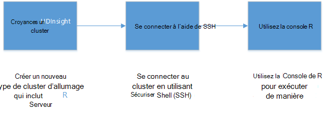
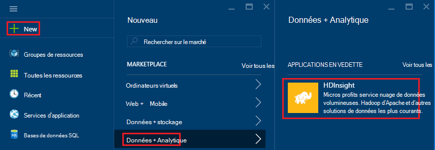
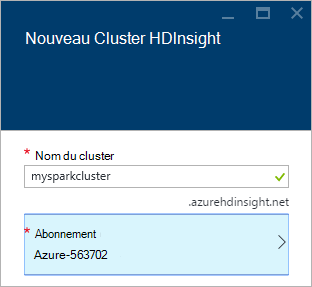
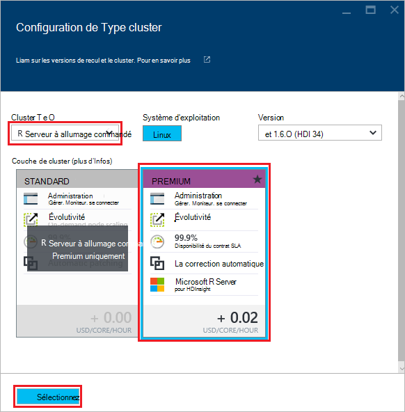
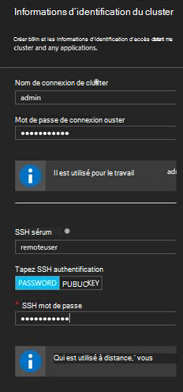
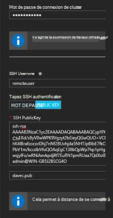
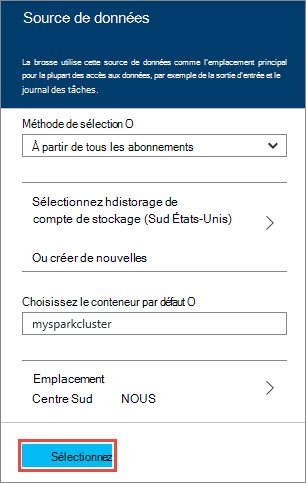
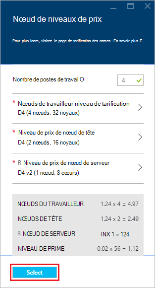
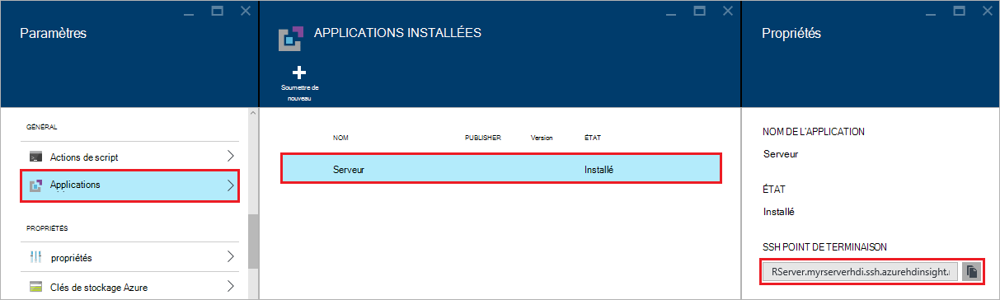
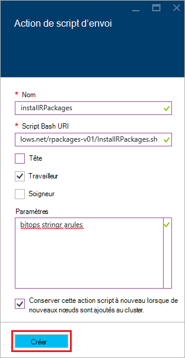

<properties
   pageTitle="Mise en route du serveur R HDInsight (aperçu) | Azure"
   description="Apprenez à créer une étincelle Apache sur cluster HDInsight (Hadoop) qui comprend le serveur R (aperçu), puis soumettez un script R sur le cluster."
   services="HDInsight"
   documentationCenter=""
   authors="jeffstokes72"
   manager="jhubbard"
   editor="cgronlun"
/>

<tags
   ms.service="HDInsight"
   ms.devlang="R"
   ms.topic="article"
   ms.tgt_pltfrm="na"
   ms.workload="data-services"
   ms.date="08/19/2016"
   ms.author="jeffstok"
/>

# Mise en route à l’aide du serveur de R sur HDInsight (aperçu)

Le niveau de prime pour HDInsight inclut un serveur R dans le cadre de votre cluster HDInsight (aperçu). Cela permet aux scripts R permet d’exécuter des traitements distribués MapReduce et à allumage commandé. Dans ce document, vous apprendrez comment créer un nouveau serveur de R sur HDInsight, puis exécuter un script R qui illustre l’utilisation d’allumage pour les calculs de R distribués.

## Conditions préalables

* __Abonnement d’un Azure__: avant de commencer ce didacticiel, vous devez avoir un abonnement Azure. Pour plus d’informations, reportez-vous à la section [Azure d’obtenir la version d’évaluation gratuite](https://azure.microsoft.com/documentation/videos/get-azure-free-trial-for-testing-hadoop-in-hdinsight/) .

* __Client d’un SSH (Secure Shell)__: un SSH client est utilisé pour se connecter au cluster HDInsight à distance et d’exécuter des commandes directement sur le cluster. Les systèmes Linux, Unix et OS X fournissent un client SSH par l’intermédiaire de la `ssh` commande. Pour les systèmes Windows, nous vous recommandons de [PuTTY](http://www.chiark.greenend.org.uk/~sgtatham/putty/download.html).

    * __Clés SSH (facultatifs)__: vous pouvez sécuriser le compte SSH utilisé pour se connecter au cluster à l’aide d’un mot de passe ou une clé publique. À l’aide d’un mot de passe est plus facile et vous permet de démarrer sans avoir à créer une paire de clés publique/privée ; Toutefois, il est plus sûr d’à l’aide d’une clé.
    
        Ce document suppose que vous utilisez un mot de passe. Pour plus d’informations sur comment créer et utiliser des clés SSH avec HDInsight, consultez les documents suivants :
        
        * [Utiliser le protocole SSH avec HDInsight à partir de clients OS X, Unix ou Linux](hdinsight-hadoop-linux-use-ssh-unix.md)
        
        * [Utiliser le protocole SSH avec HDInsight à partir de clients Windows](hdinsight-hadoop-linux-use-ssh-windows.md)

### Exigences de contrôle d’accès

[AZURE.INCLUDE [access-control](../../includes/hdinsight-access-control-requirements.md)]

## Créer le cluster

> [AZURE.NOTE] Les étapes décrites dans ce document créent un serveur R sur HDInsight à l’aide des informations de configuration de base. Pour les autres paramètres de configuration de cluster (par exemple, l’ajout de comptes d’espace de stockage supplémentaire, à l’aide d’un réseau virtuel d’Azure ou la création d’un metastore pour la ruche), consultez [les clusters basés sur Linux de créer un HDInsight](hdinsight-hadoop-provision-linux-clusters.md).

1. Connectez-vous au [portail Azure](https://portal.azure.com).

2. Sélectionnez __Nouveau__, __données + Analytique__, puis __HDInsight__.

    

3. Entrez un nom pour le cluster dans le champ __Nom du Cluster__ . Si vous avez plusieurs abonnements d’Azure, utilisez l’entrée __d’abonnement__ pour sélectionner celle que vous souhaitez utiliser.

    

4. Sélectionner le __Type de Cluster__. Sur la lame de __Type de Cluster__ , sélectionnez les options suivantes :

    * __Type de cluster__: serveur R sur l’allumage
    
    * __Cluster de niveau__: prime

    Conservez les valeurs par défaut des autres options, puis utilisez le bouton __Sélectionner__ pour enregistrer le type de cluster.
    
    
    
    > [AZURE.NOTE] Vous pouvez également ajouter des R Server à d’autres types de cluster HDInsight (comme Hadoop ou HBase,) en sélectionnant le type de cluster, puis en sélectionnant __Premium__.

5. Sélectionnez le **Groupe de ressources** pour afficher la liste des groupes de ressources existants puis sélectionnez celui pour créer le cluster dans. Ou bien, vous pouvez sélectionner **Créer un nouveau** et entrez le nom du nouveau groupe de ressources. Une coche verte apparaît pour indiquer que le nouveau nom de groupe est disponible.

    > [AZURE.NOTE] Cette entrée par défaut dans l’un de vos groupes de ressource existants, si elles sont disponibles.
    
    Utilisez le bouton __Sélectionner__ pour enregistrer le groupe de ressources.

6. Sélectionnez les **informations d’identification**, puis entrez un **Nom de connexion de Cluster** et d’un **Mot de passe de connexion de Cluster**.

    Entrez un __nom d’utilisateur SSH__.  SSH est utilisé pour se connecter à distance au cluster à l’aide d’un client __SSH (Secure Shell)__ . Vous pouvez spécifier l’utilisateur SSH dans cette boîte de dialogue ou une fois que le cluster a été créé (onglet Configuration du cluster). Serveur de R est configuré pour attendre un __nom d’utilisateur SSH__ de « UtilisateurDistant ».  Si vous utilisez un nom d’utilisateur différent, vous devrez effectuer une étape supplémentaire après la création du cluster.
    
    

    __Type d’authentification SSH__: sélectionnez le __mot de passe__ comme type d’authentification, sauf si vous préférez l’utilisation d’une clé publique.  Vous aurez besoin une paire de clés publique/privée si vous souhaitez accéder R Server sur le cluster via un client distant ou, par exemple RTV, RStudio un autre bureau IDE.   

    Pour créer et utiliser une clé publique/privée paire de sélectionner « Clé publique » et procédez comme suit.  Ces instructions supposent que vous avez Cygwin avec ssh keygen ou équivalent installé.

    -    Générer une paire de clés publique/privée à partir de l’invite de commande sur votre ordinateur portable :
      
            SSH keygen - t rsa -b 2048 – f < nom de la clé privée >
      
    -    Cela créera un fichier de clé privée et un fichier de clé publique sous le nom < nom de la clé privée > .pub, par exemple :  davec et davec.pub.  Spécifiez le fichier de clé publique (* .pub) lors de l’attribution des informations d’identification du cluster HDI :
      
          
      
    -    Modifier les autorisations sur le fichier de clé privée sur votre ordinateur portable
      
            chmod 600 < nom de la clé privée >
      
    -    Utilisez le fichier de clé privée avec SSH pour la connexion d’accès à distance, par exemple
      
            SSH – i < nom de la clé privée >remoteuser@<hostname public ip>
      
      ou dans la définition de votre contexte de calcul Hadoop Spark R serveur sur le client (voir à l’aide de Microsoft R Server comme un Client d’Hadoop dans la section [Création d’un contexte de calcul pour l’allumage](https://msdn.microsoft.com/microsoft-r/scaler-spark-getting-started#creating-a-compute-context-for-spark) du [RevoScaleR Hadoop étincelle route](https://msdn.microsoft.com/microsoft-r/scaler-spark-getting-started)en ligne).

7. Sélectionnez la **Source de données** pour sélectionner une source de données pour le cluster. Sélectionnez un compte de stockage existant en sélectionnant __Sélectionnez compte de stockage__ , puis le compte ou créer un nouveau compte à l’aide de la liaison de __Nouveau__ dans la section __sélectionner de compte de stockage__ .

    Si vous sélectionnez __Nouveau__, vous devez entrer un nom pour le nouveau compte de stockage. Une coche verte s’affiche si le nom est accepté.

    Le __Conteneur par défaut__ le nom du cluster par défaut. Laissez cette option la valeur.
    
    Sélectionnez l' __emplacement__ pour sélectionner la zone de création du compte de stockage dans.
    
    > [AZURE.IMPORTANT] Sélection de l’emplacement de la source de données par défaut sera permet également de définir l’emplacement du cluster HDInsight. La source de données par défaut et le cluster doit se trouver dans la même région.

    Utilisez **le bouton** enregistrer la configuration de source de données.
    
    

8. Sélectionnez les **Niveaux de prix de nœud** pour afficher les informations sur les nœuds qui va être créé pour ce cluster. Sauf si vous savez que vous aurez besoin d’un plus grand cluster, conservez le nombre de nœuds de travail par défaut de `4`. Le coût estimé du cluster est affiché au sein de la lame.

    > [AZURE.NOTE] Si nécessaire, vous pouvez redimensionner votre cluster ultérieurement par le biais du portail (Cluster -> Paramètres -> échelle de Cluster) pour augmenter ou diminuer le nombre de nœuds du travailleur.  Cela peut être utile de ralenti vers le bas le cluster en cas d’inutilisation, ou pour l’ajout de capacité à répondre aux besoins des plus grandes tâches.

    Certains facteurs à prendre en compte lors du dimensionnement de votre cluster, les nœuds de données et le nœud de bord sont les suivantes :  
   
    - Les performances des analyses de R serveur distribuées sur étincelle sont proportionnelle au nombre de nœuds de traitement lorsque les données sont volumineuses.  
    - Les performances des analyses du serveur de R sont linéaire dans la taille des données en cours d’analyse. Par exemple :  
        - Pour données petites à petit, les performances seront meilleures que lors de l’analyse dans un contexte de calcul local sur le nœud du bord.  Pour plus d’informations sur les scénarios qui sous lequel les locaux et les contextes de calcul étincelle mieux voir options de contexte du calcul pour R serveur sur HDInsight. 
        - Si vous ouvrez une session dans le nœud de bord et exécutez votre script de R Il puis tous les mais les ScaleR rx-fonctions seront exécute <strong>localement</strong> sur le nœud de bord ainsi la mémoire et le nombre de cœurs du nœud bord doivent être dimensionnées en conséquence. Ces conditions s’appliquent si vous utilisez des R Server sur HDI sous la forme d’un contexte de calcul à distance à partir de votre ordinateur portable.
    
    

    Utilisez le bouton **Sélectionner** pour enregistrer le nœud configuration de tarification.
    
9. Sur la **Nouveau HDInsight Cluster** blade, assurez-vous que le **code confidentiel pour Startboard** est sélectionnée et sélectionnez **créer**. Cela crée le cluster et ajouter une mosaïque pour elle à la Startboard de votre portail d’Azure. L’icône indique que le cluster consiste à créer et change pour afficher l’icône de HDInsight une fois la création terminée.

  	| Lors de la création | Création terminée |
  	| ------------------ | --------------------- |
  	|  |  |

    > [AZURE.NOTE] Il prend un certain temps pour le cluster doit être créée, généralement environ 15 minutes. Utilisez la mosaïque sur le Startboard ou l’entrée de **Notifications** sur la gauche de la page pour vérifier sur le processus de création.

## Connectez-vous au nœud R serveur edge

Se connecter à un nœud de bord R Server du cluster HDInsight à l’aide de SSH :

    ssh USERNAME@r-server.CLUSTERNAME-ssh.azurehdinsight.net
    
> [AZURE.NOTE] Vous pouvez également trouver la `R-Server.CLUSTERNAME-ssh.azurehdinsight.net` adresse dans Azure portal en sélectionnant votre cluster, puis __Tous les paramètres__, __les applications__et __RServer__. Les informations de point de terminaison SSH pour le nœud de bord s’affiche.
>
> 
    
Si vous avez utilisé un mot de passe pour votre compte d’utilisateur SSH, vous êtes invité à l’entrer. Si vous avez utilisé une clé publique, il se peut que vous deviez utiliser la `-i` paramètre pour spécifier la clé privée correspondante. Par exemple, `ssh -i ~/.ssh/id_rsa USERNAME@R-Server.CLUSTERNAME-ssh.azurehdinsight.net`.
    
Pour plus d’informations sur l’utilisation de SSH avec HDInsight de basé sur Linux, consultez les articles suivants :

* [Utiliser le protocole SSH avec basé sur Linux d’Hadoop sur HDInsight à partir d’OS X, Unix ou Linux](hdinsight-hadoop-linux-use-ssh-unix.md)

* [Utiliser le protocole SSH avec basé sur Linux d’Hadoop sur HDInsight à partir de Windows](hdinsight-hadoop-linux-use-ssh-windows.md)

Une fois connecté, vous arrivera à une invite de commandes semblable à la suivante.

    username@ed00-myrser:~$

## Utilisez la console R

1. À partir de la session SSH, utilisez la commande suivante pour démarrer la console de R.

        R
    
    Vous verrez une sortie semblable à la suivante.
    
        R version 3.2.2 (2015-08-14) -- "Fire Safety"
        Copyright (C) 2015 The R Foundation for Statistical Computing
        Platform: x86_64-pc-linux-gnu (64-bit)

        R is free software and comes with ABSOLUTELY NO WARRANTY.
        You are welcome to redistribute it under certain conditions.
        Type 'license()' or 'licence()' for distribution details.

        Natural language support but running in an English locale

        R is a collaborative project with many contributors.
        Type 'contributors()' for more information and
        'citation()' on how to cite R or R packages in publications.

        Type 'demo()' for some demos, 'help()' for on-line help, or
        'help.start()' for an HTML browser interface to help.
        Type 'q()' to quit R.

        Microsoft R Server version 8.0: an enhanced distribution of R
        Microsoft packages Copyright (C) 2016 Microsoft Corporation

        Type 'readme()' for release notes.

        >

2. À partir de la `>` invite de commandes, vous pouvez saisir le code de R. Serveur de R inclut les packages qui vous permettent de facilement interagir avec Hadoop et exécuter des traitements distribués. Par exemple, utiliser la commande suivante pour afficher la racine du système de fichiers par défaut pour l’HDInsight du cluster.

        rxHadoopListFiles("/")
    
    Vous pouvez également utiliser l’adressage de style WASB.
    
        rxHadoopListFiles("wasbs:///")

## À l’aide du serveur de R sur HDI à partir d’une instance distante de Microsoft R serveur ou Client de Microsoft R

Par la section ci-dessus concernant l’utilisation de paires de clés publique/privée pour accéder au cluster, il est possible d’installer access dans le contexte du calcul HDI Hadoop allumage à partir d’une instance distante de Microsoft R serveur ou Client de R Microsoft en cours d’exécution sur un ordinateur de bureau ou un ordinateur portable (voir l’à l’aide de Microsoft R Server comme un Client d’Hadoop dans la section [Création d’un contexte de calcul pour l’allumage](https://msdn.microsoft.com/microsoft-r/scaler-spark-getting-started#creating-a-compute-context-for-spark) du [RevoScaleR Hadoop étincelle route](https://msdn.microsoft.com/microsoft-r/scaler-spark-getting-started)en ligne).  Pour cela, vous devez spécifier les options suivantes lors de la définition de la RxSpark calculent le contexte sur votre ordinateur portable : hdfsShareDir, shareDir, sshUsername, sshHostname, sshSwitches et sshProfileScript. Par exemple :

    
    myNameNode <- "default"
    myPort <- 0 
 
    mySshHostname  <- 'rkrrehdi1-ssh.azurehdinsight.net'  # HDI secure shell hostname
    mySshUsername  <- 'remoteuser'# HDI SSH username
    mySshSwitches  <- '-i /cygdrive/c/Data/R/davec'   # HDI SSH private key
 
    myhdfsShareDir <- paste("/user/RevoShare", mySshUsername, sep="/")
    myShareDir <- paste("/var/RevoShare" , mySshUsername, sep="/")
 
    mySparkCluster <- RxSpark(
      hdfsShareDir = myhdfsShareDir,
      shareDir     = myShareDir,
      sshUsername  = mySshUsername,
      sshHostname  = mySshHostname,
      sshSwitches  = mySshSwitches,
      sshProfileScript = '/etc/profile',
      nameNode     = myNameNode,
      port         = myPort,
      consoleOutput= TRUE
    )

    
 
## Utiliser un contexte de calcul

Un contexte de calcul vous permet de contrôler si calcul sera exécuté localement sur le nœud du bord, ou si elle est réparti sur les nœuds du cluster HDInsight.
        
1. À partir de la console R, utilisez les éléments suivants pour charger des données dans le stockage par défaut pour HDInsight.

        # Set the HDFS (WASB) location of example data
        bigDataDirRoot <- "/example/data"
        # create a local folder for storaging data temporarily
        source <- "/tmp/AirOnTimeCSV2012"
        dir.create(source)
        # Download data to the tmp folder
        remoteDir <- "http://packages.revolutionanalytics.com/datasets/AirOnTimeCSV2012"
        download.file(file.path(remoteDir, "airOT201201.csv"), file.path(source, "airOT201201.csv"))
        download.file(file.path(remoteDir, "airOT201202.csv"), file.path(source, "airOT201202.csv"))
        download.file(file.path(remoteDir, "airOT201203.csv"), file.path(source, "airOT201203.csv"))
        download.file(file.path(remoteDir, "airOT201204.csv"), file.path(source, "airOT201204.csv"))
        download.file(file.path(remoteDir, "airOT201205.csv"), file.path(source, "airOT201205.csv"))
        download.file(file.path(remoteDir, "airOT201206.csv"), file.path(source, "airOT201206.csv"))
        download.file(file.path(remoteDir, "airOT201207.csv"), file.path(source, "airOT201207.csv"))
        download.file(file.path(remoteDir, "airOT201208.csv"), file.path(source, "airOT201208.csv"))
        download.file(file.path(remoteDir, "airOT201209.csv"), file.path(source, "airOT201209.csv"))
        download.file(file.path(remoteDir, "airOT201210.csv"), file.path(source, "airOT201210.csv"))
        download.file(file.path(remoteDir, "airOT201211.csv"), file.path(source, "airOT201211.csv"))
        download.file(file.path(remoteDir, "airOT201212.csv"), file.path(source, "airOT201212.csv"))
        # Set directory in bigDataDirRoot to load the data into
        inputDir <- file.path(bigDataDirRoot,"AirOnTimeCSV2012") 
        # Make the directory
        rxHadoopMakeDir(inputDir)
        # Copy the data from source to input
        rxHadoopCopyFromLocal(source, bigDataDirRoot)

2. Ensuite, nous allons créer des informations de données et définir deux sources de données de sorte que nous pouvons travailler avec les données.

        # Define the HDFS (WASB) file system
        hdfsFS <- RxHdfsFileSystem()
        # Create info list for the airline data
        airlineColInfo <- list(
            DAY_OF_WEEK = list(type = "factor"),
            ORIGIN = list(type = "factor"),
            DEST = list(type = "factor"),
            DEP_TIME = list(type = "integer"),
            ARR_DEL15 = list(type = "logical"))

        # get all the column names
        varNames <- names(airlineColInfo)

        # Define the text data source in hdfs
        airOnTimeData <- RxTextData(inputDir, colInfo = airlineColInfo, varsToKeep = varNames, fileSystem = hdfsFS)
        # Define the text data source in local system
        airOnTimeDataLocal <- RxTextData(source, colInfo = airlineColInfo, varsToKeep = varNames)

        # formula to use
        formula = "ARR_DEL15 ~ ORIGIN + DAY_OF_WEEK + DEP_TIME + DEST"

3. Nous allons exécuter une régression logistique sur l’ordinateur local à l’aide de compute contexte.

        # Set a local compute context
        rxSetComputeContext("local")
        # Run a logistic regression
        system.time(
            modelLocal <- rxLogit(formula, data = airOnTimeDataLocal)
        )
        # Display a summary 
        summary(modelLocal)

    Vous devez voir la sortie qui se termine avec des lignes similaires à la suivante.

        Data: airOnTimeDataLocal (RxTextData Data Source)
        File name: /tmp/AirOnTimeCSV2012
        Dependent variable(s): ARR_DEL15
        Total independent variables: 634 (Including number dropped: 3)
        Number of valid observations: 6005381
        Number of missing observations: 91381
        -2*LogLikelihood: 5143814.1504 (Residual deviance on 6004750 degrees of freedom)

        Coefficients:
                        Estimate Std. Error z value Pr(>|z|)
        (Intercept)   -3.370e+00  1.051e+00  -3.208  0.00134 **
        ORIGIN=JFK     4.549e-01  7.915e-01   0.575  0.56548
        ORIGIN=LAX     5.265e-01  7.915e-01   0.665  0.50590
        ......
        DEST=SHD       5.975e-01  9.371e-01   0.638  0.52377
        DEST=TTN       4.563e-01  9.520e-01   0.479  0.63172
        DEST=LAR      -1.270e+00  7.575e-01  -1.676  0.09364 .
        DEST=BPT         Dropped    Dropped Dropped  Dropped
        ---
        Signif. codes:  0 ‘***’ 0.001 ‘**’ 0.01 ‘*’ 0.05 ‘.’ 0.1 ‘ ’ 1

        Condition number of final variance-covariance matrix: 11904202
        Number of iterations: 7

4. Ensuite, exécutons la régression logistique même en utilisant le contexte de l’explosion. Le contexte de l’allumage répartit le traitement sur tous les nœuds du cluster HDInsight travail.

        # Define the Spark compute context 
        mySparkCluster <- RxSpark()
        # Set the compute context 
        rxSetComputeContext(mySparkCluster)
        # Run a logistic regression 
        system.time(  
            modelSpark <- rxLogit(formula, data = airOnTimeData)
        )
        # Display a summary
        summary(modelSpark)

    > [AZURE.NOTE] Vous pouvez également utiliser MapReduce pour distribuer un calcul sur les nœuds de cluster. Pour plus d’informations sur le contexte de calcul, voir [calculer les options de contexte du serveur R HDInsight prime](hdinsight-hadoop-r-server-compute-contexts.md).

## Distribuer le code R à plusieurs nœuds

Avec serveur de R, vous pouvez facilement prendre le code R existant et exécuter sur plusieurs nœuds dans le cluster en utilisant `rxExec`. Cela est utile lorsque vous effectuez un balayage de paramètre ou simulations. Voici un exemple de l’utilisation de `rxExec`.

    rxExec( function() {Sys.info()["nodename"]}, timesToRun = 4 )
    
Si vous continuez d’utiliser le contexte de l’allumage ou MapReduce, cela renvoie la valeur nodename pour les nœuds de traitement que le code (`Sys.info()["nodename"]`) est exécuté. Par exemple, sur un cluster à quatre nœuds, vous pouvez recevoir une sortie similaire à ce qui suit.

    $rxElem1
        nodename
    "wn3-myrser"

    $rxElem2
        nodename
    "wn0-myrser"

    $rxElem3
        nodename
    "wn3-myrser"

    $rxElem4
        nodename
    "wn3-myrser"

## Installez les packages R

Si vous souhaitez installer des packages supplémentaires de R sur le nœud de bord, vous pouvez utiliser `install.packages()` directement à partir de la R de la console lors de la connexion pour le nœud de bord via SSH. Toutefois, si vous avez besoin installer des packages de R sur les nœuds du cluster du travailleur, vous devez utiliser une Action de Script.

Actions de script sont des scripts Bash sont utilisés pour modifier la configuration du cluster HDInsight, ou pour installer des logiciels supplémentaires. Dans ce cas, installer R d’autres packages. Pour installer des packages supplémentaires à l’aide d’une Action de Script, procédez comme suit.

> [AZURE.IMPORTANT] À l’aide des Actions de Script pour installer des packages supplémentaires R peut être utilisé uniquement une fois que le cluster a été créé. Il ne doit pas être utilisé lors de la création du cluster, car le script dépend de R serveur est entièrement installé et configuré.

1. À partir du [portail Azure](https://portal.azure.com), sélectionnez votre serveur R HDInsight cluster.

2. À partir de la blade de cluster, sélectionnez __Tous les paramètres__, puis sur __Actions de Script__. À partir de la blade __d’Actions de Script__ , sélectionnez __Soumettre de nouveau__ pour soumettre une nouvelle Action de Script.

    

3. À partir de la blade __d’action script d’envoi__ , fournissez les informations suivantes.

  - __Nom__: un nom convivial pour identifier ce script
  - __Bash script URI__:`http://mrsactionscripts.blob.core.windows.net/rpackages-v01/InstallRPackages.sh`
  - __Tête__: cela doit être __désactivée__
  - __Travailleur__: il doit être __vérifié__
  - __Soigneur__: il doit être __désactivée__
  - __Paramètres__: packages de la R doit être installé. Par exemple,`bitops stringr arules`
  - __Maintenir ce script...__: il doit être __activé__  

    > [AZURE.NOTE] 1. par défaut, tous les packages de R sont installés à partir d’une capture instantanée du référentiel Microsoft MRAN cohérent avec la version de serveur R qui a été installé.  Si vous souhaitez installer des versions plus récentes des packages, il y a des risques d’incompatibilité, cependant cela est possible en spécifiant `useCRAN` comme le premier élément du package de liste, par exemple :  `useCRAN bitops, stringr, arules`.  
    > 2. Certains packages R nécessitera des bibliothèques supplémentaires du système Linux. Pour plus de commodité, nous avons installée sur les dépendances requises par les 100 premiers packages R les plus populaires. Toutefois, si vous installez l’ou les modules R exigent des bibliothèques au-delà de ces, vous devez télécharger le script de base utilisé ici et ajouter des étapes pour installer les bibliothèques système. Vous devez ensuite télécharger le script modifié à un conteneur public blob dans le stockage Azure et utilisez le script modifié pour installer les packages.
    > Pour plus d’informations sur le développement d’Actions de Script, consultez [développement de l’Action du Script](hdinsight-hadoop-script-actions-linux.md).  

    

4. Sélectionnez __créer__ pour exécuter le script. Une fois le script terminé, les packages R sera disponibles sur tous les nœuds du travailleur.
    
## Étapes suivantes

Maintenant que vous comprenez comment créer un nouveau cluster HDInsight qui comprend R et l’utilisation de la console R à partir d’une session SSH, utilisez ce qui suit pour découvrir d’autres méthodes de travail avec le serveur R sur HDInsight.

- [Ajouter les serveur de RStudio à HDInsight prime](hdinsight-hadoop-r-server-install-r-studio.md)

- [Calculer les options de contexte pour le serveur de R sur HDInsight prime](hdinsight-hadoop-r-server-compute-contexts.md)

- [Options de stockage Azure pour R Server sur HDInsight prime](hdinsight-hadoop-r-server-storage.md)

### Modèles de gestionnaire de ressources Azure

Si vous êtes intéressé par l’automatisation de la création du serveur R sur HDInsight à l’aide des modèles du Gestionnaire de ressources Azure, consultez les modèles de l’exemple suivant.

* [Créer un serveur R sur cluster de HDInsight à l’aide d’une clé publique SSH](http://go.microsoft.com/fwlink/p/?LinkID=780809)
* [Créer un serveur R sur cluster de HDInsight à l’aide d’un mot de passe SSH](http://go.microsoft.com/fwlink/p/?LinkID=780810)

Les deux modèles de créer un nouveau cluster de HDInsight et d’un compte de stockage associée et peuvent être utilisés à partir de la CLI d’Azure, Azure PowerShell ou le portail Azure.

Pour des informations générales sur l’utilisation des modèles du Gestionnaire de ressources Azure, consultez [Hadoop de basé sur Linux de créer des clusters dans HDInsight à l’aide des modèles du Gestionnaire de ressources Azure](hdinsight-hadoop-create-linux-clusters-arm-templates.md).
