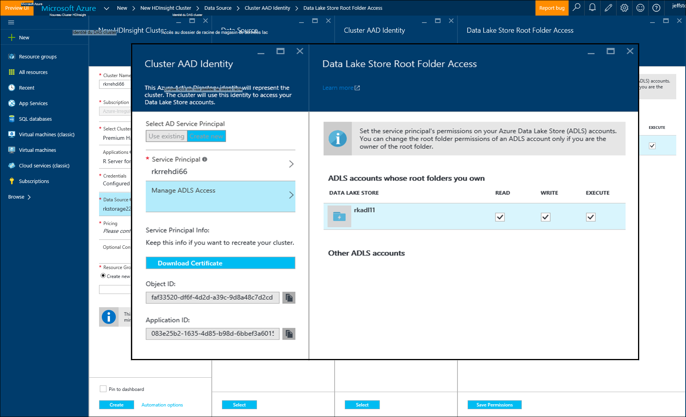

<properties
   pageTitle="Options de stockage Azure pour R Server sur HDInsight (aperçu) | Microsoft Azure"
   description="En savoir plus sur les différentes options de stockage disponibles pour les utilisateurs avec un serveur de R sur HDInsight (aperçu)"
   services="HDInsight"
   documentationCenter=""
   authors="jeffstokes72"
   manager="jhubbard"
   editor="cgronlun"
/>

<tags
   ms.service="HDInsight"
   ms.devlang="R"
   ms.topic="article"
   ms.tgt_pltfrm="na"
   ms.workload="data-services"
   ms.date="09/01/2016"
   ms.author="jeffstok"
/>

# <a name="azure-storage-options-for-r-server-on-hdinsight-preview"></a>Options de stockage Azure pour R Server sur HDInsight (aperçu)

Microsoft R Server sur HDInsight (aperçu) a accès à deux Blob Azure et [Stockage Azure lac](https://azure.microsoft.com/services/data-lake-store/), comme un moyen de conserver les données, le code, les objets d’analyse de résultats et ainsi de suite.

Lorsque vous créez un cluster Hadoop dans HDInsight, vous spécifiez un compte de stockage Azure. Un conteneur de stockage Blob spécifique à partir de ce compte conserve le système de fichiers du cluster que vous créez (par exemple, le système de fichiers distribués Hadoop). Pour des raisons de performances, le cluster HDInsight est créé dans le même centre de données en tant que le compte de stockage principal que vous spécifiez. Pour plus d’informations, consultez [stockage Blob Azure d’utilisation avec HDInsight](hdinsight-hadoop-use-blob-storage.md "stockage Blob Azure d’utiliser avec HDInsight").   


## <a name="use-multiple-azure-blob-storage-accounts"></a>Utiliser plusieurs comptes de stockage Azure Blob

Si nécessaire, vous pouvez accéder à plusieurs comptes de stockage Azure ou conteneurs avec votre cluster HDI. Pour ce faire, vous devez spécifier les comptes de stockage supplémentaire dans l’interface utilisateur lorsque vous créez le cluster, puis procédez comme suit pour les utiliser dans R.  

1.  Créer un cluster de HDInsight avec un nom de compte de stockage **stockage1** et un conteneur par défaut appelé **Conteneur1**.
2. Spécifiez un compte de stockage supplémentaire appelé **stockage2**.  
3. Copiez le fichier mycsv.csv dans le répertoire /share et effectuer une analyse sur ce fichier.  

    ````
    hadoop fs –mkdir /share
    hadoop fs –copyFromLocal myscsv.scv /share  
    ````

3.  Dans le code de R, la valeur **par défaut,** le nœud name et définir votre répertoire et le fichier à traiter.  

    ````
    myNameNode <- "default"
    myPort <- 0
    ````

  Emplacement des données :  

    bigDataDirRoot <-« / partage »  

  Définir le contexte de calcul d’allumage :

    mySparkCluster <-RxSpark(consoleOutput=TRUE)

  Définir le contexte de calcul :

    rxSetComputeContext(mySparkCluster)

  Définir le système de fichiers du système de fichier distribué (très) Hadoop :

    hdfsFS <-RxHdfsFileSystem (nom d’hôte = myNameNode, port = myPort)

  Spécifier le fichier d’entrée à analyser dans très :

    fichier d’entrée <-file.path(bigDataDirRoot,"mycsv.csv")

Toutes les références de répertoire et de fichier point sur le compte de stockage wasbs://container1@storage1.blob.core.windows.net. Il s’agit du **compte de stockage par défaut** qui est associée à la HDInsight cluster.

Maintenant, supposons que vous souhaitez traiter un fichier appelé mySpecial.csv qui se trouve dans le /private de **container2** de **stockage2**.

Dans votre code R, pointez la référence de nom de nœud pour le compte de stockage **stockage2** .

    myNameNode <- "wasbs://container2@storage2.blob.core.windows.net"
    myPort <- 0

  Emplacement des données :

    bigDataDirRoot <- "/private"

  Définir le contexte de calcul d’allumage :

    mySparkCluster <- RxSpark(consoleOutput=TRUE, nameNode=myNameNode, port=myPort)

  Définir le contexte de calcul :

    rxSetComputeContext(mySparkCluster)

  Définir le système de fichiers très :

    hdfsFS <- RxHdfsFileSystem(hostName=myNameNode, port=myPort)

  Spécifier le fichier d’entrée à analyser dans très :

    inputFile <-file.path(bigDataDirRoot,"mySpecial.csv")

Toutes les références de répertoire et de fichier point maintenant sur le compte de stockage wasbs://container2@storage2.blob.core.windows.net. Il s’agit du **Nom de nœud** que vous avez spécifiés.

Notez que vous devrez configurer la base de données/User/RevoShare/<SSH username> répertoire **stockage2** comme suit :

    hadoop fs -mkdir wasbs://container2@storage2.blob.core.windows.net/user
    hadoop fs -mkdir wasbs://container2@storage2.blob.core.windows.net/user/RevoShare
    hadoop fs -mkdir wasbs://container2@storage2.blob.core.windows.net/user/RevoShare/<RDP username>

## <a name="use-an-azure-data-lake-store"></a>Utiliser un magasin de LAC de données Azure

Pour utiliser des magasins de données LAC avec votre compte HDInsight, vous devez accéder votre cluster à chaque magasin du lac de données Azure que vous souhaitez utiliser. Vous utilisez le magasin dans votre script de R bien comme vous utilisez un compte de stockage secondaire (comme décrit dans la procédure précédente).

## <a name="add-cluster-access-to-your-azure-data-lake-stores"></a>Ajouter l’accès au cluster à vos banques de LAC de données Azure

Accéder à un magasin de données lac, à l’aide d’une entité de sécurité du Service Azure Active Directory (AD Azure) qui est associé à votre cluster HDInsight.

### <a name="to-add-a-service-principal"></a>Pour ajouter une entité de sécurité du Service
1. Lorsque vous créez votre cluster HDInsight, sélectionnez **Identité DAS de Cluster** à partir de l’onglet **Source de données** .
2. Dans la boîte de dialogue **Identité DAS de Cluster** , sous **Sélectionnez Principal du Service Active Directory**, sélectionnez **Créer nouveau**.

Une fois que vous donnez un nom à l’entité du Service et il créez un mot de passe, un nouvel onglet s’ouvre, où vous pouvez associer l’entité Service vos magasins de données lac.

Notez que vous pouvez également ajouter l’accès à un magasin de données lac ultérieurement en ouvrant le magasin de données lac dans Azure portal et en allant à **l’Explorateur de données** > **accès**.  Voici un exemple d’une boîte de dialogue qui montre comment créer un Service Principal et l’associer à la banque de données lac « rkadl11 ».




## <a name="use-the-data-lake-store-with-r-server"></a>Utiliser le magasin de données LAC avec serveur de R
Une fois que vous avez donné accès à un magasin de données lac, vous pouvez utiliser la banque dans le serveur de R HDInsight comme vous le feriez un compte secondaire de stockage Azure. La seule différence est que le préfixe **wasb : / /** devient **adl : / /** comme suit :

````
# Point to the ADL store (e.g. ADLtest)
myNameNode <- "adl://rkadl1.azuredatalakestore.net"
myPort <- 0

# Location of the data (assumes a /share directory on the ADL account)
bigDataDirRoot <- "/share"  

# Define Spark compute context
mySparkCluster <- RxSpark(consoleOutput=TRUE, nameNode=myNameNode, port=myPort)

# Set compute context
rxSetComputeContext(mySparkCluster)

# Define HDFS file system
hdfsFS <- RxHdfsFileSystem(hostName=myNameNode, port=myPort)

# Specify the input file in HDFS to analyze
inputFile <-file.path(bigDataDirRoot,"AirlineDemoSmall.csv")

# Create factors for days of the week
colInfo <- list(DayOfWeek = list(type = "factor",
               levels = c("Monday", "Tuesday", "Wednesday", "Thursday",
                          "Friday", "Saturday", "Sunday")))

# Define the data source
airDS <- RxTextData(file = inputFile, missingValueString = "M",
                    colInfo  = colInfo, fileSystem = hdfsFS)

# Run a linear regression
model <- rxLinMod(ArrDelay~CRSDepTime+DayOfWeek, data = airDS)
````

Voici les commandes qui sont utilisées pour configurer le compte de stockage de données LAC avec le répertoire RevoShare et ajoutez l’exemple de fichier .csv à partir de l’exemple précédent :

````
hadoop fs -mkdir adl://rkadl1.azuredatalakestore.net/user
hadoop fs -mkdir adl://rkadl1.azuredatalakestore.net/user/RevoShare
hadoop fs -mkdir adl://rkadl1.azuredatalakestore.net/user/RevoShare/<user>

hadoop fs -mkdir adl://rkadl1.azuredatalakestore.net/share

hadoop fs -copyFromLocal /usr/lib64/R Server-7.4.1/library/RevoScaleR/SampleData/AirlineDemoSmall.csv adl://rkadl1.azuredatalakestore.net/share

hadoop fs –ls adl://rkadl1.azuredatalakestore.net/share
````

## <a name="use-azure-files-on-the-edge-node"></a>Utiliser des fichiers Azure sur le nœud de bord

Il existe également une option de stockage de données pratique pour une utilisation sur le nœud de bord appelé [Fichiers d’Azure](../storage/storage-how-to-use-files-linux.md "Azure fichiers"). Il vous permet de monter un partage de fichiers de stockage Azure pour le système de fichiers Linux. Ceci peut être pratique pour le stockage des fichiers de données, les scripts de R et des objets de résultats qui peuvent être nécessaires au plus tard lorsqu’il est logique d’utiliser le système de fichiers natif sur le nœud de bord plutôt que de très.

Le principal avantage des fichiers d’Azure est que les partages de fichiers peuvent être montées et utilisées par tout système disposant d’une prise en charge du système d’exploitation comme Windows ou Linux. Par exemple, il peut être utilisé par un autre cluster HDInsight que vous ou un membre de votre équipe a, par un Azure VM ou même par un système local.


## <a name="next-steps"></a>Étapes suivantes

Maintenant que vous comprenez les notions de base de l’utilisation de la console R à partir d’une session SSH et comment créer un nouveau cluster HDInsight comprenant R Server, utilisez les liens suivants pour découvrir d’autres méthodes de travail avec le serveur R sur HDInsight.

- [Vue d’ensemble du serveur R sur HDInsight](hdinsight-hadoop-r-server-overview.md)
- [Mise en route du serveur R sur Hadoop](hdinsight-hadoop-r-server-get-started.md)
- [Ajouter les serveur de RStudio à HDInsight prime](hdinsight-hadoop-r-server-install-r-studio.md)
- [Calculer les options de contexte pour R Server sur HDInsight](hdinsight-hadoop-r-server-compute-contexts.md)
