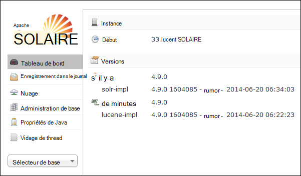
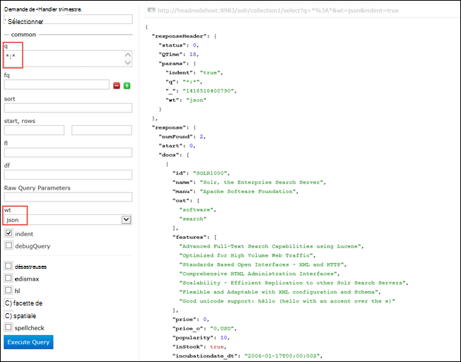

<properties
    pageTitle="Action de Script permet d’installer le mode série sur LAN.r sur basé sur Linux de HDInsight | Microsoft Azure"
    description="Découvrez comment installer le mode série sur LAN.r sur les clusters basés sur Linux le HDInsight Hadoop à l’aide des Actions de Script."
    services="hdinsight"
    documentationCenter=""
    authors="Blackmist"
    manager="jhubbard"
    editor="cgronlun"
    tags="azure-portal"/>

<tags
    ms.service="hdinsight"
    ms.workload="big-data"
    ms.tgt_pltfrm="na"
    ms.devlang="na"
    ms.topic="article"
    ms.date="10/03/2016"
    ms.author="larryfr"/>

# Installer et utiliser le mode série sur LAN.r sur des clusters de HDInsight Hadoop

Dans cette rubrique, vous apprendrez comment installer le mode série sur LAN.r sur Azure HDInsight à l’aide des actions de Script. Mode série sur LAN.r est une plate-forme de recherche puissant et offre des fonctionnalités de recherche au niveau de l’entreprise sur des données gérées par Hadoop. Une fois que vous avez installé le mode série sur LAN.r sur cluster de HDInsight, vous apprendrez également comment rechercher des données à l’aide du mode série sur LAN.r.

> [AZURE.NOTE] Les étapes de ce document requièrent un cluster basé sur Linux de HDInsight. Pour plus d’informations sur l’utilisation du mode série sur LAN.r avec un cluster Windows, voir [installer et utiliser le mode série sur LAN.r sur HDinsight Hadoop clusters (Windows)](hdinsight-hadoop-solr-install.md)

L’exemple de script utilisé dans cette rubrique crée un cluster mode série sur LAN.r avec une configuration spécifique. Si vous souhaitez configurer le cluster du mode série sur LAN.r avec différentes collections, milieu des fragments, schémas, duplications, etc., vous devez modifier le script et les fichiers binaires du mode série sur LAN.r en conséquence.

## Quel est le mode série sur LAN.r ?

[Le mode série sur LAN.r Apache](http://lucene.apache.org/solr/features.html) est une plate-forme de recherche d’entreprise qui permet de puissante recherche de texte intégral sur des données. Tandis que Hadoop permet le stockage et la gestion d’importants volumes de données, le mode série sur LAN.r Apache fournit les fonctionnalités de recherche pour récupérer rapidement les données. Cette rubrique fournit des instructions sur la façon de personnaliser un cluster HDInsight pour installer le mode série sur LAN.r.

> [AZURE.WARNING] Les composants fournis avec le cluster HDInsight sont entièrement gérés et Support de Microsoft vous permet d’isoler et de résoudre les problèmes liés à ces composants.
>
> Les composants personnalisés, comme le mode série sur LAN.r, assistance commercialement raisonnables pour vous aider à résoudre le problème. Cela peut provoquer de résolution du problème ni à vous demander d’engager les canaux disponibles pour les technologies open source où se trouve une grande expertise pour cette technologie. Par exemple, de nombreux sites de la Communauté qui peuvent être utilisés, comme : [forum MSDN pour HDInsight](https://social.msdn.microsoft.com/Forums/azure/en-US/home?forum=hdinsight), [http://stackoverflow.com](http://stackoverflow.com). Également les projets Apache ont des sites de projets sur [http://apache.org](http://apache.org), par exemple : [Hadoop](http://hadoop.apache.org/).

## Ce que fait le script

Ce script effectue les modifications suivantes au cluster HDInsight :

* Installe le mode série sur LAN.r dans`/usr/hdp/current/solr`
* Crée un nouvel utilisateur, __solrusr__, qui est utilisé pour exécuter le service du mode série sur LAN.r
* Définit __solruser__ comme propriétaire de`/usr/hdp/current/solr`
* Ajoute une configuration [Upstart](http://upstart.ubuntu.com/) qui démarrera le mode série sur LAN.r si un nœud de cluster redémarre. Mode série sur LAN.r également démarre automatiquement sur les nœuds de cluster après l’installation

## Installer le mode série sur LAN.r à l’aide des Actions de Script

Un exemple de script pour installer le mode série sur LAN.r sur un cluster HDInsight est disponible à l’emplacement suivant.

    https://hdiconfigactions.blob.core.windows.net/linuxsolrconfigactionv01/solr-installer-v01.sh

Cette section fournit des instructions sur l’utilisation de l’exemple de script lors de la création d’un nouveau cluster en utilisant le portail Azure. 

> [AZURE.NOTE] PowerShell Azure, la CLI d’Azure, le Kit de développement .NET HDInsight ou modèles d’Azure le Gestionnaire de ressources peuvent également être utilisés pour appliquer des actions de script. Vous pouvez également appliquer des actions de script pour les clusters en cours d’exécution. Pour plus d’informations, voir [clusters de personnaliser la HDInsight avec les Actions de Script](hdinsight-hadoop-customize-cluster-linux.md).

1. Démarrer la mise en service d’un cluster à l’aide de la procédure dans [les clusters basés sur Linux de fourniture de HDInsight](hdinsight-hadoop-create-linux-clusters-portal.md), mais n’effectuez pas de mise en service.

2. Sélectionnez les **Actions de Script**sur la lame de **Configuration facultatives** et fournir les informations ci-dessous :

    * __Nom__: entrez un nom convivial pour l’action du script.
    * __URI du SCRIPT__: https://hdiconfigactions.blob.core.windows.net/linuxsolrconfigactionv01/solr-installer-v01.sh
    * __Tête__: Activez cette case à cocher
    * __Travailleur__: Activez cette case à cocher
    * __SOIGNEUR__: Activez cette option pour installer sur le nœud de soigneur
    * __Paramètres__: laissez ce champ vide

3. Au bas des **Actions de Script**, utilisez **le bouton** enregistrer la configuration. Enfin, utilisez le bouton **Sélectionner** en bas de la lame de **Configuration facultative** pour enregistrer les informations de configuration facultatives.

4. Continuer la mise en service du cluster, comme décrit dans [les clusters basés sur Linux de fourniture de HDInsight](hdinsight-hadoop-create-linux-clusters-portal.md).

## Comment utiliser le mode série sur LAN.r dans HDInsight ?

### L’indexation des données

Vous devez démarrer avec une indexation de mode série sur LAN.r avec certains fichiers de données. Vous pouvez ensuite utiliser le mode série sur LAN.r pour exécuter des requêtes de recherche sur les données indexées. Utilisez les étapes suivantes pour ajouter des données d’exemple pour le mode série sur LAN.r et ensuite de la requête :

1. Connectez-vous au cluster de HDInsight à l’aide de SSH :

        ssh USERNAME@CLUSTERNAME-ssh.azurehdinsight.net

    Pour plus d’informations sur l’utilisation de SSH avec HDInsight, consultez les rubriques suivantes :

    * [Utiliser le protocole SSH avec basé sur Linux d’Hadoop sur HDInsight à partir d’OS X, Unix ou Linux](hdinsight-hadoop-linux-use-ssh-unix.md)

    * [Utiliser le protocole SSH avec basé sur Linux d’Hadoop sur HDInsight à partir de Windows](hdinsight-hadoop-linux-use-ssh-windows.md)

    > [AZURE.IMPORTANT] Étapes plus loin dans la création de ce document utilisent un tunnel SSL pour se connecter à l’interface utilisateur du mode série sur LAN.r web. Pour l’utiliser, vous devez établir un tunnel SSL et ensuite configurer votre navigateur pour l’utiliser.
    >
    > Pour plus d’informations, consultez [Utiliser SSH Tunneling pour accéder à l’interface utilisateur web de Ambari, ResourceManager, JobHistory, NameNode, Oozie et autre web, l’interface utilisateur](hdinsight-linux-ambari-ssh-tunnel.md)

2. Pour des exemples de données mode série sur LAN.r index, utilisez les commandes suivantes :

        cd /usr/hdp/current/solr/example/exampledocs
        java -jar post.jar solr.xml monitor.xml

    Vous verrez la sortie suivante sur la console :

        POSTing file solr.xml
        POSTing file monitor.xml
        2 files indexed.
        COMMITting Solr index changes to http://localhost:8983/solr/update..
        Time spent: 0:00:01.624

    L’utilitaire post.jar indexe le mode série sur LAN.r avec deux exemples de documents, **solr.xml** et **monitor.xml**. Elles seront stockées dans __collection1__ dans le mode série sur LAN.r.

3. Pour interroger l’API REST exposés en mode série sur LAN.r, utilisez ce qui suit :

        curl "http://localhost:8983/solr/collection1/select?q=*%3A*&wt=json&indent=true"

    Il émet une requête contre __collection1__ les documents correspondant à __ \*:\* __ (codés en tant que \*% 3\* dans la chaîne de requête) et que la réponse doit être retournée au format JSON. La réponse doit ressembler à ce qui suit :

            "response": {
                "numFound": 2,
                "start": 0,
                "maxScore": 1,
                "docs": [
                  {
                    "id": "SOLR1000",
                    "name": "Solr, the Enterprise Search Server",
                    "manu": "Apache Software Foundation",
                    "cat": [
                      "software",
                      "search"
                    ],
                    "features": [
                      "Advanced Full-Text Search Capabilities using Lucene",
                      "Optimized for High Volume Web Traffic",
                      "Standards Based Open Interfaces - XML and HTTP",
                      "Comprehensive HTML Administration Interfaces",
                      "Scalability - Efficient Replication to other Solr Search Servers",
                      "Flexible and Adaptable with XML configuration and Schema",
                      "Good unicode support: héllo (hello with an accent over the e)"
                    ],
                    "price": 0,
                    "price_c": "0,USD",
                    "popularity": 10,
                    "inStock": true,
                    "incubationdate_dt": "2006-01-17T00:00:00Z",
                    "_version_": 1486960636996878300
                  },
                  {
                    "id": "3007WFP",
                    "name": "Dell Widescreen UltraSharp 3007WFP",
                    "manu": "Dell, Inc.",
                    "manu_id_s": "dell",
                    "cat": [
                      "electronics and computer1"
                    ],
                    "features": [
                      "30\" TFT active matrix LCD, 2560 x 1600, .25mm dot pitch, 700:1 contrast"
                    ],
                    "includes": "USB cable",
                    "weight": 401.6,
                    "price": 2199,
                    "price_c": "2199,USD",
                    "popularity": 6,
                    "inStock": true,
                    "store": "43.17614,-90.57341",
                    "_version_": 1486960637584081000
                  }
                ]
              }

### En utilisant le tableau de bord du mode série sur LAN.r

Le tableau de bord du mode série sur LAN.r est une interface utilisateur qui permet de travailler avec le mode série sur LAN.r par le biais de votre navigateur web. Le tableau de bord du mode série sur LAN.r n’est pas exposé directement sur Internet à partir de votre cluster de HDInsight, mais il doit être accessible à l’aide d’un tunnel SSH. Pour plus d’informations sur l’utilisation d’un tunnel SSH, consultez [Utiliser SSH Tunneling pour accéder à l’interface utilisateur web de Ambari, ResourceManager, JobHistory, NameNode, Oozie et autre web, l’interface utilisateur](hdinsight-linux-ambari-ssh-tunnel.md)

Une fois que vous avez établi un tunnel SSH, procédez comme suit pour utiliser le mode série sur LAN.r du tableau de bord :

1. Déterminer le nom d’hôte de l’headnode primaire :

    1. Utiliser le protocole SSH pour la connexion au cluster sur le port 22. Par exemple, `ssh USERNAME@CLUSTERNAME-ssh.azurehdinsight.net` où __nom_utilisateur__ est votre nom d’utilisateur SSH et __CLUSTERNAME__ est le nom de votre cluster.

        Pour plus d’informations sur l’utilisation du protocole SSH, consultez les documents suivants :

        * [Utiliser le protocole SSH avec basé sur Linux de HDInsight à partir d’un client Mac OS X, Unix ou Linux](hdinsight-hadoop-linux-use-ssh-unix.md)

        * [Utiliser le protocole SSH avec basé sur Linux de HDInsight à partir d’un client Windows](hdinsight-hadoop-linux-use-ssh-windows.md)
    
    3. Pour obtenir le nom d’hôte qualifié complet, utilisez la commande suivante :

            hostname -f

        Ceci renverra un nom semblable au suivant :

            hn0-myhdi-nfebtpfdv1nubcidphpap2eq2b.ex.internal.cloudapp.net
    
        C’est le nom d’hôte qui doit être utilisé dans les étapes suivantes.
    
1. Dans votre navigateur, connectez-vous à __http://HOSTNAME:8983/mode série sur LAN.r / #/__, où le __nom d’hôte__ est le nom que vous avez déterminé dans les étapes précédentes. 

    La demande doit être routée à travers le tunnel SSH pour le nœud de votre cluster d’HDInsight de tête. Vous devriez voir une page semblable à la suivante :

    

2. Dans le volet de gauche, permet du **Sélecteur de base** déroulante pour sélectionner **collection1**. Plusieurs entrées doivent apparaître les ci-dessous __collection1__.

3. Dans les entrées ci-dessous __collection1__, sélectionnez __requête__. Utilisez les valeurs suivantes pour remplir la page de recherche :

    * Dans la zone de texte **q** , entrez ** \*:**\*. Ceci renvoie tous les documents sont indexés en mode série sur LAN.r. Si vous souhaitez rechercher une chaîne spécifique dans les documents, vous pouvez entrer cette chaîne ici.

    * Dans la zone de texte **wt** , sélectionnez le format de sortie. Valeur par défaut est **json**.

    Enfin, sélectionnez le bouton **Exécuter la requête** en bas de la pate de recherche.

    

    La sortie renvoie les deux documents que nous avons utilisé pour l’indexation du mode série sur LAN.r. La sortie ressemble à ceci :

            "response": {
                "numFound": 2,
                "start": 0,
                "maxScore": 1,
                "docs": [
                  {
                    "id": "SOLR1000",
                    "name": "Solr, the Enterprise Search Server",
                    "manu": "Apache Software Foundation",
                    "cat": [
                      "software",
                      "search"
                    ],
                    "features": [
                      "Advanced Full-Text Search Capabilities using Lucene",
                      "Optimized for High Volume Web Traffic",
                      "Standards Based Open Interfaces - XML and HTTP",
                      "Comprehensive HTML Administration Interfaces",
                      "Scalability - Efficient Replication to other Solr Search Servers",
                      "Flexible and Adaptable with XML configuration and Schema",
                      "Good unicode support: héllo (hello with an accent over the e)"
                    ],
                    "price": 0,
                    "price_c": "0,USD",
                    "popularity": 10,
                    "inStock": true,
                    "incubationdate_dt": "2006-01-17T00:00:00Z",
                    "_version_": 1486960636996878300
                  },
                  {
                    "id": "3007WFP",
                    "name": "Dell Widescreen UltraSharp 3007WFP",
                    "manu": "Dell, Inc.",
                    "manu_id_s": "dell",
                    "cat": [
                      "electronics and computer1"
                    ],
                    "features": [
                      "30\" TFT active matrix LCD, 2560 x 1600, .25mm dot pitch, 700:1 contrast"
                    ],
                    "includes": "USB cable",
                    "weight": 401.6,
                    "price": 2199,
                    "price_c": "2199,USD",
                    "popularity": 6,
                    "inStock": true,
                    "store": "43.17614,-90.57341",
                    "_version_": 1486960637584081000
                  }
                ]
              }

### Démarrage et arrêt du mode série sur LAN.r

Si vous avez besoin d’arrêter ou de démarrer SOLAIRE manuellement, utilisez les commandes suivantes :

    sudo stop solr

    sudo start solr

## Sauvegarde de données indexées

Comme une bonne pratique, vous devez sauvegarder les données indexées mode série sur LAN.r des nœuds de cluster sur le stockage des objets Blob Azure. Effectuez les étapes suivantes pour effectuer cette opération :

1. Se connecter au cluster à l’aide de SSH, puis utilisez la commande suivante pour obtenir le nom d’hôte pour le nœud de tête :

        hostname -f
        
2. Utilisez ce qui suit pour créer une capture instantanée des données indexées. Remplacez le __nom d’hôte__ avec le nom retourné à partir de la commande précédente :

        curl http://HOSTNAME:8983/solr/replication?command=backup

    Vous devez voir une réponse comme suit :

        <?xml version="1.0" encoding="UTF-8"?>
        <response>
          <lst name="responseHeader">
            <int name="status">0</int>
            <int name="QTime">9</int>
          </lst>
          <str name="status">OK</str>
        </response>

2. Ensuite, accédez à __/usr/hdp/current/solr/example/solr__. Il y a un sous-répertoire ici pour chaque collection. Chaque répertoire de la collection contient un répertoire de __données__ , qui est où la capture instantanée de cette collection est situé.

    Par exemple, si vous avez utilisé les étapes précédemment pour indexer les exemples de documents, le répertoire __/usr/hdp/current/solr/example/solr/collection1/data__ doit maintenant contenir un répertoire nommé __instantané. ###__ où le # de sont la date et l’heure de la capture instantanée.

3. Créer une archive compressée du dossier de capture instantanée à l’aide d’une commande semblable à la suivante :

        tar -zcf snapshot.20150806185338855.tgz snapshot.20150806185338855

    Cela créera une nouvelle archive nommée __snapshot.20150806185338855.tgz__, qui contient le contenu du répertoire __snapshot.20150806185338855__ .

3. Vous pouvez ensuite stocker l’archivage vers un stockage primaire du cluster à l’aide de la commande suivante :

    Hadoop fs - copyFromLocal snapshot.20150806185338855.tgz/exemple et de données

    > [AZURE.NOTE] Vous souhaiterez peut-être créer un annuaire dédié au stockage des instantanés du mode série sur LAN.r. Par exemple, `hadoop fs -mkdir /solrbackup`.

Pour plus d’informations sur l’utilisation du mode série sur LAN.r sauvegardes et les restaurations, voir [Création et restauration de sauvegardes de SolrCores](https://cwiki.apache.org/confluence/display/solr/Making+and+Restoring+Backups+of+SolrCores).

## Voir aussi

- [L’installation et l’utilisation des clusters de teinte sur HDInsight](hdinsight-hadoop-hue-linux.md). La nuance est une interface utilisateur qui permet de facilement créer, exécuter et enregistrer des travaux de porc et de la ruche, ainsi que de la parcourir le stockage par défaut pour votre HDInsight de cluster web.

- [Installation de R sur les clusters de HDInsight][hdinsight-install-r]. Personnalisation de cluster permet d’installer des R sur des clusters de HDInsight Hadoop. R est un langage open-source et un environnement pour le calcul statistique. Il fournit des centaines de fonctions statistiques intégrées et son propre langage de programmation qui combine des aspects de la programmation fonctionnelle et orientée objet. Il fournit également des fonctionnalités graphiques complètes.

- [Installation de Giraph sur des clusters de HDInsight](hdinsight-hadoop-giraph-install-linux.md). Personnalisation de cluster permet d’installer Giraph sur les clusters de HDInsight Hadoop. Giraph, vous pouvez exécuter le traitement à l’aide d’Hadoop de graphique et peut être utilisé avec HDInsight d’Azure.

- [Installer la teinte sur des clusters de HDInsight](hdinsight-hadoop-hue-linux.md). Personnalisation de cluster permet d’installer la teinte sur des clusters de HDInsight Hadoop. La nuance est un ensemble d’applications Web permettant d’interagir avec un cluster Hadoop.

[hdinsight-install-r]: hdinsight-hadoop-r-scripts-linux.md
[hdinsight-cluster-customize]: hdinsight-hadoop-customize-cluster-linux.md
