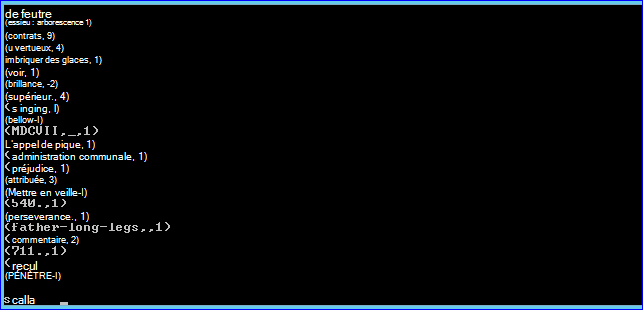
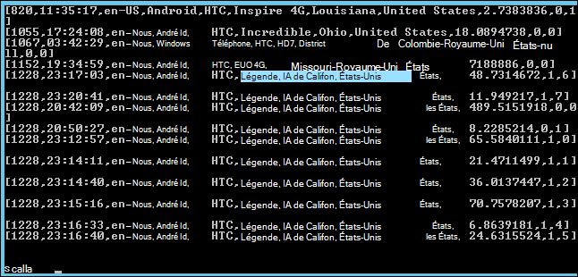

<properties
    pageTitle="Action de Script permet d’installer étincelle sur Hadoop cluster | Microsoft Azure"
    description="Apprenez à personnaliser un cluster HDInsight avec allumage à l’aide des actions de Script."
    services="hdinsight"
    documentationCenter=""
    authors="nitinme"
    manager="jhubbard"
    editor="cgronlun"/>

<tags
    ms.service="hdinsight"
    ms.workload="big-data"
    ms.tgt_pltfrm="na"
    ms.devlang="na"
    ms.topic="article"
    ms.date="02/05/2016"
    ms.author="nitinme"/>

# Installer et utiliser l’allumage sur des clusters HDInsight Hadoop à l’aide des actions de Script

> [AZURE.IMPORTANT] Cet article est maintenant désapprouvé. HDInsight propose désormais étincelle sous la forme d’un type de cluster de première classe pour les clusters basés sur Windows, qui signifie que vous pouvez directement créer un cluster d’allumage sans modifier un cluster Hadoop à l’aide des actions de Script. En utilisant le type de cluster d’allumage, vous obtenez un cluster de version 3.2 HDInsight avec allumage version 1.3.1.  Pour installer des versions différentes de l’allumage, vous pouvez utiliser l’action du Script. HDInsight fournit un exemple de script d’Action de Script.

Découvrez comment installer allumage sous Windows en fonction HDInsight à l’aide des actions de Script, et comment exécuter des requêtes d’allumage sur HDInsight clusters.

**Articles connexes**

- [Hadoop de créer des clusters dans HDInsight](hdinsight-provision-clusters.md): informations générales sur la création de clusters de HDInsight.

- [Mise en route de l’allumage d’Apache sur HDInsight](hdinsight-apache-spark-jupyter-spark-sql.md): créer un cluster HDInsight Spark.

- [Personnaliser le cluster HDInsight à l’aide de Script Action][hdinsight-cluster-customize]: informations générales sur la personnalisation de clusters HDInsight à l’aide des actions de Script.

- [Action de Script développer des scripts pour HDInsight](hdinsight-hadoop-script-actions.md).

## Nouveautés d’allumage ?

<a href="http://spark.apache.org/docs/latest/index.html" target="_blank">Allumage de Apache</a> est un framework qui prend en charge le traitement en mémoire pour augmenter les performances des applications analytiques de données volumineuses de traitement en parallèle open source. En mémoire calcul fonctionnalités d’allumage rendre un bon choix pour les algorithmes itératifs dans les calculs de formation et graphique de machine.

Allumage peut également servir à exécuter sur disque classique de traitement de données. Allumage améliore l’infrastructure MapReduce traditionnel en évitant les écritures sur le disque dans les étapes intermédiaires. Allumage est également compatible avec le système de fichier distribué (très) Hadoop et Azure Blob le stockage les données existantes peuvent facilement être traitées via l’allumage.

Cette rubrique fournit des instructions sur la personnalisation d’un cluster d’HDInsight pour installer l’allumage.

## Installer l’allumage via le portail Azure

Un exemple de script pour installer étincelle sur un cluster HDInsight est disponible à partir d’un blob en lecture seule de stockage Azure à [https://hdiconfigactions.blob.core.windows.net/sparkconfigactionv03/spark-installer-v03.ps1](https://hdiconfigactions.blob.core.windows.net/sparkconfigactionv03/spark-installer-v03.ps1). Ce script peut installer étincelle 1.2.0 ou étincelle 1.0.2 selon la version du cluster HDInsight que vous créez.

- Si vous utilisez le script lors de la création d’un cluster **3.2 de HDInsight** , il installe **étincelle 1.2.0**.
- Si vous utilisez le script lors de la création d’un cluster **HDInsight 3.1** , il installe **étincelle 1.0.2**.

Vous pouvez modifier ce script ou créer votre propre script pour installer d’autres versions d’allumage.

> [AZURE.NOTE] L’exemple de script ne fonctionne qu’avec les HDInsight 3.1 et 3.2 clusters. Pour plus d’informations sur les versions de cluster HDInsight, consultez [versions de cluster HDInsight](hdinsight-component-versioning.md).

1. Démarrer la création d’un cluster à l’aide de l’option **Créer un personnalisé** , comme décrit sur [Hadoop de créer des clusters dans HDInsight](hdinsight-provision-clusters.md#portal). Choisissez la version de cluster selon les éléments suivants :

    - Si vous souhaitez installer **l’allumage 1.2.0**, créer un cluster 3.2 de HDInsight.
    - Si vous souhaitez installer **l’allumage 1.0.2**, créer un cluster 3.1 de HDInsight.

2. Dans la page **Actions de Script** de l’Assistant, cliquez sur **Ajouter une action de script** pour fournir plus d’informations sur l’action du script, comme indiqué ci-dessous :

    ![Action de Script utilisé pour personnaliser un cluster] (./media/hdinsight-hadoop-spark-install/HDI.CustomProvision.Page6.png "Action de Script utilisé pour personnaliser un cluster")

    <table border='1'>
        <tr><th>Propriété</th><th>Valeur</th></tr>
        <tr><td>Nom</td>
            <td>Spécifiez un nom pour l’action du script. Par exemple, <b>Installer l’allumage</b>.</td></tr>
        <tr><td>URI de script</td>
            <td>Spécifiez l’identificateur URI (Uniform Resource) pour le script qui est appelé pour personnaliser le cluster. Par exemple, <i>https://hdiconfigactions.blob.core.windows.net/sparkconfigactionv03/spark-installer-v03.ps1</i></td></tr>
        <tr><td>Type de nœud</td>
            <td>Spécifiez les nœuds sur lesquels le script de personnalisation est exécuté. Vous pouvez choisir <b>tous les noeuds</b>, les <b>noeuds de tête uniquement</b>ou <b>uniquement les nœuds de traitement</b>.
        <tr><td>Paramètres</td>
            <td>Spécifiez les paramètres, si nécessaire par le script. Le script pour installer le moteur ne nécessite pas de tous les paramètres afin de vous laissez cette zone vide.</td></tr>
    </table>

    Vous pouvez ajouter plus d’une action de script pour installer plusieurs composants sur le cluster. Après avoir ajouté les scripts, cliquez sur la coche pour commencer à créer le cluster.

Vous pouvez également utiliser le script pour installer étincelle sur HDInsight à l’aide de PowerShell d’Azure ou le Kit de développement .NET HDInsight. Instructions pour ces procédures sont fournies plus loin dans cette rubrique.

## Utilisez étincelle dans HDInsight
Allumage fournit des API Java, Python et Scala. Vous pouvez également utiliser le shell interactif allumage pour exécuter des requêtes d’allumage. Cette section fournit des instructions sur comment utiliser les différentes approches pour travailler avec allumage :

- [Le shell d’allumage permet d’exécuter des requêtes interactives](#sparkshell)
- [Utilisation d’allumage shell pour exécuter des requêtes SQL d’allumage](#sparksql)
- [Utilisez un programme de Scala autonome](#standalone)

###Le shell d’allumage permet d’exécuter des requêtes interactives
Effectuez les opérations suivantes pour exécuter des requêtes d’allumage à partir d’un shell d’allumage interactif. Dans cette section, nous exécutons une requête d’allumage sur un exemple de fichier de données (/ example/data/gutenberg/davinci.txt) qui est disponible sur les clusters HDInsight par défaut.

1. À partir du portail Azure, activez le Bureau à distance pour le cluster que vous avez créé avec allumage installé et à distance puis dans le cluster. Pour obtenir des instructions, voir [se connecter à des clusters HDInsight utilisant le protocole RDP](hdinsight-administer-use-management-portal.md#rdp).

2. Dans la session du protocole RDP (Remote Desktop), à partir du bureau, ouvrez la ligne de commande Hadoop (à partir d’un raccourci sur le bureau) et accédez à l’emplacement où l’allumage est installé ; par exemple, **C:\apps\dist\spark-1.2.0**.

3. Exécutez la commande suivante pour démarrer l’interface de l’allumage :

         .\bin\spark-shell --master yarn

    Une fois la commande terminée, vous devez obtenir un Scala invite :

         scala>

5. À l’invite Scala, entrez la requête d’étincelle indiquée ci-dessous. Cette requête compte les occurrences de chaque mot dans le fichier davinci.txt qui est disponible à l’exemple / / / gutenberg/emplacement des données sur le stockage Azure Blob associé au cluster.

        val file = sc.textFile("/example/data/gutenberg/davinci.txt")
        val counts = file.flatMap(line => line.split(" ")).map(word => (word, 1)).reduceByKey(_ + _)
        counts.toArray().foreach(println)

6. La sortie doit ressembler à ceci :

    

7. Entrez : q pour quitter l’invite Scala.

        :q

###Utilisation d’allumage shell pour exécuter des requêtes SQL d’allumage

Allumage SQL vous permet d’utiliser allumage pour exécuter des requêtes relationnelles exprimées en Scala, HiveQL ou du langage SQL (SQL). Dans cette section, nous examinons l’utilisation d’allumage pour exécuter une requête de ruche sur un exemple de table de ruche. La table de ruche utilisée dans cette section (appelée **hivesampletable**) est disponible par défaut lorsque vous créez un cluster.

>[AZURE.NOTE] L’exemple ci-dessous a été créé sur **1.2.0 au service**, qui est installé si vous exécutez l’action de script lors de la création du cluster de HDInsight 3.2.

1. À partir du portail Azure, activez le Bureau à distance pour le cluster que vous avez créé avec allumage installé et à distance puis dans le cluster. Pour obtenir des instructions, voir [se connecter à des clusters HDInsight utilisant le protocole RDP](hdinsight-administer-use-management-portal.md#rdp).

2. Dans la session RDP, à partir du bureau, ouvrez la ligne de commande Hadoop (à partir d’un raccourci sur le bureau) et accédez à l’emplacement où l’allumage est installé ; par exemple, **C:\apps\dist\spark-1.2.0**.

3. Exécutez la commande suivante pour démarrer l’interface de l’allumage :

         .\bin\spark-shell --master yarn

    Une fois la commande terminée, vous devez obtenir un Scala invite :

         scala>

4. À l’invite Scala, définir le contexte de la ruche. Cela est nécessaire pour travailler avec des requêtes de la ruche à l’aide d’allumage.

        val hiveContext = new org.apache.spark.sql.hive.HiveContext(sc)

    Notez que **sc** est le contexte d’allumage par défaut qui est défini lorsque vous démarrez le shell d’allumage.

5. Exécuter une requête de la ruche en utilisant le contexte de la ruche et imprimer le résultat sur la console. La requête extrait des données sur les périphériques d’une marque spécifique et limite le nombre d’enregistrements récupérés à 20.

        hiveContext.sql("""SELECT * FROM hivesampletable WHERE devicemake LIKE "HTC%" LIMIT 20""").collect().foreach(println)

6. Vous devez voir une sortie comme suit :

    

7. Entrez : q pour quitter l’invite Scala.

        :q

### Utilisez un programme de Scala autonome

Dans cette section, nous écrire une application de Scala qui compte le nombre de lignes qui contiennent les lettres 'a' et 'b' dans un exemple de fichier de données (/ example/data/gutenberg/davinci.txt) qui est disponible sur les clusters HDInsight par défaut. Pour écrire et utiliser un programme de Scala autonome avec un cluster personnalisé avec installation d’allumage, vous devez effectuer les étapes suivantes :

- Écrire un programme Scala
- Créer le programme Scala pour obtenir le fichier .jar
- Exécuter la tâche sur le cluster

#### Écrire un programme Scala
Dans cette section, vous écrivez un programme de Scala qui compte le nombre de lignes qui contiennent des 'a' et 'b' dans l’exemple de fichier de données.

1. Ouvrez un éditeur de texte et collez le code suivant :

        /* SimpleApp.scala */
        import org.apache.spark.SparkContext
        import org.apache.spark.SparkContext._
        import org.apache.spark.SparkConf

        object SimpleApp {
          def main(args: Array[String]) {
            val logFile = "/example/data/gutenberg/davinci.txt"         //Location of the sample data file on Azure Blob storage
            val conf = new SparkConf().setAppName("SimpleApplication")
            val sc = new SparkContext(conf)
            val logData = sc.textFile(logFile, 2).cache()
            val numAs = logData.filter(line => line.contains("a")).count()
            val numBs = logData.filter(line => line.contains("b")).count()
            println("Lines with a: %s, Lines with b: %s".format(numAs, numBs))
          }
        }

2. Enregistrez le fichier sous le nom **SimpleApp.scala**.

#### Créer le programme Scala
Dans cette section, vous utilisez <a href="http://www.scala-sbt.org/0.13/docs/index.html" target="_blank">l’Outil de génération Simple</a> (ou sbt) pour générer le programme Scala. SBT requiert Java 1.6 ou une version ultérieure, assurez-vous que vous disposez de la bonne version de Java installée avant de continuer avec cette section.

1. Installez sbt à partir de http://www.scala-sbt.org/0.13/tutorial/Installing-sbt-on-Windows.html.
2. Créez un dossier nommé **SimpleScalaApp**et dans ce dossier, créez un fichier appelé **simple.sbt**. Il s’agit d’un fichier de configuration qui contient des informations sur la version de Scala, bibliothèque des dépendances, etc.. Collez ce qui suit dans le fichier simple.sbt et enregistrez-le :

        name := "SimpleApp"

        version := "1.0"

        scalaVersion := "2.10.4"

        libraryDependencies += "org.apache.spark" %% "spark-core" % "1.2.0"

    >[AZURE.NOTE] Assurez-vous de que conserver les lignes vides dans le fichier.

3. Sous le dossier **SimpleScalaApp** , créez une structure de répertoire **\src\main\scala** et collez le programme Scala (**SimpleApp.scala**) que vous avez créé précédemment dans le dossier \src\main\scala.
4. Ouvrez une invite de commandes, accédez au répertoire SimpleScalaApp et entrez la commande suivante :

        sbt package

    Une fois que l’application est compilée, vous verrez un fichier **simpleapp_2.10-1.0.jar** créé sous le répertoire **\target\scala-2.10** dans le dossier racine du SimpleScalaApp.

#### Exécuter la tâche sur le cluster
Dans cette section, vous à distance dans le cluster qui a allumage installé et puis copiez le dossier de destination du projet SimpleScalaApp. Puis, vous utilisez la commande de **soumettre d’allumage** pour soumettre le travail sur le cluster.

1. À distance dans le cluster qui a allumage installé. À partir de l’ordinateur où vous avez écrit et créé le programme SimpleApp.scala, copiez le dossier **SimpleScalaApp\target** et collez-le à l’emplacement sur le cluster.
2. Dans la session RDP, à partir du bureau, ouvrez la ligne de commande Hadoop et naviguez jusqu'à l’emplacement où vous avez collé le dossier **cible** .
3. Entrez la commande suivante pour exécuter le programme SimpleApp.scala :

        C:\apps\dist\spark-1.2.0\bin\spark-submit --class "SimpleApp" --master local target/scala-2.10/simpleapp_2.10-1.0.jar

4. Une fois le programme en cours d’exécution, la sortie est affichée sur la console.

        Lines with a: 21374, Lines with b: 11430

## Installation d’allumage à l’aide de PowerShell d’Azure

Dans cette section, nous utilisons la cmdlet **<a href = "http://msdn.microsoft.com/library/dn858088.aspx" target="_blank">Add-AzureHDInsightScriptAction</a>** à appeler des scripts en utilisant l’Action de Script pour personnaliser un cluster. Avant de continuer, assurez-vous que vous avez installé et configuré Azure PowerShell. Pour plus d’informations sur la configuration d’une station de travail pour exécuter des applets de commande PowerShell de Azure pour HDInsight, consultez [installer et configurer Azure PowerShell](../powershell-install-configure.md).

Effectuez les opérations suivantes :

1. Ouvrez une fenêtre PowerShell d’Azure et déclarez les variables suivantes :

        # Provide values for these variables
        $subscriptionName = "<SubscriptionName>"        # Name of the Azure subscription
        $clusterName = "<HDInsightClusterName>"         # HDInsight cluster name
        $storageAccountName = "<StorageAccountName>"    # Azure Storage account that hosts the default container
        $storageAccountKey = "<StorageAccountKey>"      # Key for the Storage account
        $containerName = $clusterName
        $location = "<MicrosoftDataCenter>"             # Location of the HDInsight cluster. It must be in the same data center as the Storage account.
        $clusterNodes = <ClusterSizeInNumbers>          # Number of nodes in the HDInsight cluster
        $version = "<HDInsightClusterVersion>"          # For example, "3.2"

2. Spécifiez les valeurs de configuration tels que les nœuds du cluster et le stockage par défaut à utiliser.

        # Specify the configuration options
        Select-AzureSubscription $subscriptionName
        $config = New-AzureHDInsightClusterConfig -ClusterSizeInNodes $clusterNodes
        $config.DefaultStorageAccount.StorageAccountName="$storageAccountName.blob.core.windows.net"
        $config.DefaultStorageAccount.StorageAccountKey=$storageAccountKey
        $config.DefaultStorageAccount.StorageContainerName=$containerName

3. Utilisez l’applet de commande **Add-AzureHDInsightScriptAction** pour ajouter une action de script de configuration du cluster. Ultérieurement, lorsque le cluster est en cours de création, l’action de script est exécutée.

        # Add a script action to the cluster configuration
        $config = Add-AzureHDInsightScriptAction -Config $config -Name "Install Spark" -ClusterRoleCollection HeadNode -Uri https://hdiconfigactions.blob.core.windows.net/sparkconfigactionv03/spark-installer-v03.ps1

    Applet de commande **Add-AzureHDInsightScriptAction** accepte les paramètres suivants :

    <table style="border-color: #c6c6c6; border-width: 2px; border-style: solid; border-collapse: collapse;">
    <tr>
    <th style="border-color: #c6c6c6; border-width: 2px; border-style: solid; border-collapse: collapse; width:90px; padding-left:5px; padding-right:5px;">Paramètre</th>
    <th style="border-color: #c6c6c6; border-width: 2px; border-style: solid; border-collapse: collapse; width:550px; padding-left:5px; padding-right:5px;">Définition</th></tr>
    <tr>
    <td style="border-color: #c6c6c6; border-width: 2px; border-style: solid; border-collapse: collapse; padding-left:5px;">Config</td>
    <td style="border-color: #c6c6c6; border-width: 2px; border-style: solid; border-collapse: collapse; padding-left:5px; padding-right:5px;">L’objet de configuration pour le script d’informations sur l’action sont ajoutées.</td></tr>
    <tr>
    <td style="border-color: #c6c6c6; border-width: 2px; border-style: solid; border-collapse: collapse; padding-left:5px;">Nom</td>
    <td style="border-color: #c6c6c6; border-width: 2px; border-style: solid; border-collapse: collapse; padding-left:5px;">Nom de l’action du script.</td></tr>
    <tr>
    <td style="border-color: #c6c6c6; border-width: 2px; border-style: solid; border-collapse: collapse; padding-left:5px;">ClusterRoleCollection</td>
    <td style="border-color: #c6c6c6; border-width: 2px; border-style: solid; border-collapse: collapse; padding-left:5px;">Spécifie les nœuds sur lesquels le script de personnalisation est exécuté. Les valeurs valides sont HeadNode (pour une installation sur le nœud de tête) ou DataNode (pour une installation sur tous les nœuds de données). Vous pouvez utiliser une ou les deux valeurs.</td></tr>
    <tr>
    <td style="border-color: #c6c6c6; border-width: 2px; border-style: solid; border-collapse: collapse; padding-left:5px;">URI</td>
    <td style="border-color: #c6c6c6; border-width: 2px; border-style: solid; border-collapse: collapse; padding-left:5px;">Spécifie l’URI du script qui est exécuté.</td></tr>
    <tr>
    <td style="border-color: #c6c6c6; border-width: 2px; border-style: solid; border-collapse: collapse; padding-left:5px;">Paramètres</td>
    <td style="border-color: #c6c6c6; border-width: 2px; border-style: solid; border-collapse: collapse; padding-left:5px;">Paramètres requis par le script. L’exemple de script utilisé dans cette rubrique ne nécessite pas de paramètres, et par conséquent, vous ne voyez pas ce paramètre dans l’extrait de code ci-dessus.
    </td></tr>
    </table>

4. Enfin, démarrez la création d’un cluster personnalisé avec allumage installé.  

        # Start creating a cluster with Spark installed
        New-AzureHDInsightCluster -Config $config -Name $clusterName -Location $location -Version $version

Lorsque vous y êtes invité, entrez les informations d’identification pour le cluster. Elle peut prendre plusieurs minutes avant que le cluster est créé.

## Installation d’allumage à l’aide de PowerShell

Voir [clusters HDInsight de personnaliser à l’aide des actions de Script](hdinsight-hadoop-customize-cluster.md#call_scripts_using_powershell).

## Installation d’allumage à l’aide du Kit de développement .NET

Voir [clusters HDInsight de personnaliser à l’aide des actions de Script](hdinsight-hadoop-customize-cluster.md#call_scripts_using_azure_powershell).

## Voir aussi

- [Hadoop de créer des clusters dans HDInsight](hdinsight-provision-clusters.md): créer des clusters de HDInsight.
- [Mise en route de l’allumage d’Apache sur HDInsight](hdinsight-apache-spark-jupyter-spark-sql.md): mise en route de l’allumage sur HDInsight.
- [Personnaliser le cluster HDInsight à l’aide de Script Action][hdinsight-cluster-customize]: personnaliser des clusters HDInsight à l’aide des actions de Script.
- [Action de Script développer des scripts pour HDInsight](hdinsight-hadoop-script-actions.md): développement de scripts d’Action de Script.
- [Installation de R sur les clusters de HDInsight] [ hdinsight-install-r] fournit des instructions sur l’utilisation de personnalisation de cluster pour installer et utiliser R sur les clusters de HDInsight Hadoop. R est un langage open-source et un environnement pour le calcul statistique. Il fournit des centaines de fonctions statistiques intégrées et son propre langage de programmation qui combine des aspects de la programmation fonctionnelle et orientée objet. Il fournit également des fonctionnalités graphiques complètes.
- [Installation de Giraph sur des clusters de HDInsight](hdinsight-hadoop-giraph-install.md). Personnalisation de cluster permet d’installer Giraph sur les clusters de HDInsight Hadoop. Giraph, vous pouvez exécuter le traitement à l’aide d’Hadoop de graphique et peut être utilisé avec HDInsight d’Azure.
- [Mode série sur LAN.r installer sur des clusters de HDInsight](hdinsight-hadoop-solr-install.md). Personnalisation de cluster permet d’installer le mode série sur LAN.r sur HDInsight Hadoop clusters. Mode série sur LAN.r vous permet d’effectuer des opérations de recherche puissants sur les données stockées.

[hdinsight-provision]: hdinsight-provision-clusters.md
[hdinsight-install-r]: hdinsight-hadoop-r-scripts.md
[hdinsight-cluster-customize]: hdinsight-hadoop-customize-cluster.md
[powershell-install-configure]: powershell-install-configure.md
