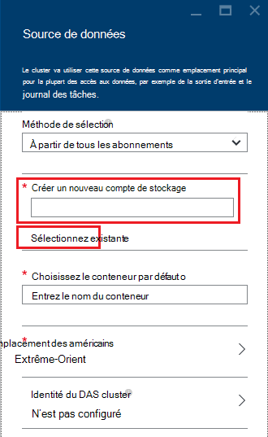

<properties
    pageTitle="Interroger les données depuis le stockage Blob de très compatible | Microsoft Azure"
    description="HDInsight le stockage Blob Azure utilise comme magasin des données de très. Découvrez comment interroger des données depuis le stockage Blob et stocker les résultats de votre analyse."
    keywords="BLOB de stockage, très, des données structurées, données non structurées"
    services="hdinsight,storage"
    documentationCenter=""
    tags="azure-portal"
    authors="mumian"
    manager="jhubbard"
    editor="cgronlun"/>

<tags
    ms.service="hdinsight"
    ms.workload="big-data"
    ms.tgt_pltfrm="na"
    ms.devlang="na"
    ms.topic="get-started-article"
    ms.date="09/06/2016"
    ms.author="jgao"/>

# Utiliser le stockage des objets Blob Azure très compatibles avec Hadoop dans HDInsight

Apprenez à utiliser le stockage Azure Blob de faible coût avec HDInsight, créer de compte de stockage Azure et conteneur de stockage Blob, puis traiter les données à l’intérieur.

Stockage de Blob Azure est une solution de stockage fiable, à usage général qui s’intègre en toute transparence avec HDInsight. Via une interface (très) de système de fichiers distribués Hadoop, l’ensemble des composants de HDInsight peut fonctionner directement sur les données structurées ou non structurées dans le stockage Blob.

Stockage des données dans le stockage Blob vous permet de supprimer en toute sécurité les clusters HDInsight qui sont utilisés pour le calcul sans perdre de données utilisateur.

> [AZURE.IMPORTANT] HDInsight prend uniquement en charge les objets BLOB de bloc. Il ne prend en charge la page ni ajouter des objets BLOB.

Pour plus d’informations sur la création d’un cluster d’HDInsight, reportez-vous à la section [Mise en route de HDInsight] [ hdinsight-get-started] ou [HDInsight de créer des clusters][hdinsight-creation].

## Architecture de stockage de HDInsight
Le diagramme suivant fournit une vue abstraite de l’architecture de stockage de HDInsight :

![Hadoop clusters utilisent l’API très pour accéder et stocker des données structurées et non structurées dans le stockage Blob.] (./media/hdinsight-hadoop-use-blob-storage/HDI.WASB.Arch.png "Architecture de stockage de HDInsight")

HDInsight fournit l’accès au système de fichiers distribué qui est relié localement aux nœuds de calcul. Ce système de fichiers sont accessibles à l’aide de l’URI complet, par exemple :

    hdfs://<namenodehost>/<path>

De plus, HDInsight permet d’accéder aux données stockées dans le stockage des objets Blob Azure. La syntaxe est la suivante :

    wasb[s]://<containername>@<accountname>.blob.core.windows.net/<path>

> [AZURE.NOTE] Dans les versions antérieures à la version3.0, de HDInsight `asv://` a été utilisé à la place de `wasb://`. `asv://`n’a pas doit être utilisé avec des clusters HDInsight 3.0 ou version ultérieure, car elle entraîne une erreur.

Hadoop prend en charge une notion du système de fichiers par défaut. Le système de fichiers par défaut implique une autorité et schéma par défaut. Il peut également être utilisé pour résoudre des chemins d’accès relatifs. Pendant le processus de création de HDInsight, un compte de stockage Azure et un stockage Azure Blob conteneur à partir de ce compte est désigné comme le système de fichiers par défaut.

En plus de ce compte de stockage, vous pouvez ajouter des comptes de stockage supplémentaires à partir du même abonnement Azure ou les différents abonnements Azure pendant le processus de création ou après la création d’un cluster. Pour obtenir des instructions sur l’ajout de comptes d’espace de stockage supplémentaire, [HDInsight de créer des clusters], voir[hdinsight-creation].

- **Conteneurs dans les comptes de stockage qui sont connectés à un cluster :** Car le nom de compte et la clé sont associées avec le cluster lors de la création, vous avez un accès total pour les objets BLOB dans ces conteneurs.

- **Des conteneurs publics ou publics BLOB dans les comptes de stockage qui ne sont pas connectés à un cluster :** Vous disposez d’une autorisation en lecture seule pour les objets BLOB dans les conteneurs.

    > [AZURE.NOTE]
        > Conteneurs publics vous permettent de vous permet d’obtenir une liste de tous les objets BLOB qui sont disponibles dans ce conteneur et d’obtenir des métadonnées de conteneur. Les blobs publics permettent d’accéder les BLOB que si vous connaissez l’URL exacte à. Pour plus d’informations, voir <a href="http://msdn.microsoft.com/library/windowsazure/dd179354.aspx">restreindre l’accès à des conteneurs et des objets BLOB</a>.

- **Des conteneurs privés dans les comptes de stockage qui ne sont pas connectés à un cluster :** Vous ne pouvez accéder les blobs dans les conteneurs sauf si vous définissez le compte de stockage lorsque vous envoyez les tâches WebHCat. Cela est expliqué plus loin dans cet article.

Les comptes de stockage qui sont définies dans le processus de création et les clés sont stockées dans %HADOOP_HOME%/conf/core-site.xml sur les nœuds du cluster. Le comportement par défaut de HDInsight est d’utiliser les comptes de stockage définis dans le fichier core-site.xml. Il n’est pas recommandé de modifier le fichier core-site.xml parce que le node(master) de tête du cluster peut être reconfiguration ou migrer à tout moment, et toute modification apportée à ces fichiers seront perdues.

Pour exécuter plusieurs tâches WebHCat, y compris la ruche, MapReduce, Hadoop de diffusion en continu et porc, une description des comptes de stockage et de métadonnées avec les. (Il travaille actuellement pour porcs avec des comptes de stockage, mais pas pour les métadonnées.) Dans la section [objets BLOB d’accès à l’aide de PowerShell d’Azure](#powershell) de cet article, est un exemple de cette fonctionnalité. Pour plus d’informations, reportez-vous [à l’aide d’un HDInsight Cluster avec d’autres comptes de stockage et Metastores](http://social.technet.microsoft.com/wiki/contents/articles/23256.using-an-hdinsight-cluster-with-alternate-storage-accounts-and-metastores.aspx).

Stockage de BLOB peut être utilisé pour les données structurées et non structurées. Conteneurs de stockage BLOB stockent les données sous forme de paires clé/valeur, et qu’il n’y a aucune hiérarchie de répertoire. Toutefois le caractère de barre oblique (/) peut servir dans le nom de la clé pour le faire apparaître comme si un fichier est stocké dans une structure de répertoire. Par exemple, clé d’un blob peut être *input/log1.txt*. Aucun répertoire réel *d’entrée* n’existe, mais en raison de la présence de la barre oblique dans le nom de clé, il a l’apparence d’un chemin d’accès du fichier.

###Avantages du stockage de Blob
Le coût des performances implicite de ne pas cohabiter compute clusters et ressources de stockage est atténuée par la manière dont les compute clusters sont créés près les ressources du compte de stockage à l’intérieur de la région d’Azure, où le réseau à grande vitesse rend très efficace pour les nœuds de calcul à accéder aux données à l’intérieur de stockage des objets Blob Azure.

Il existe plusieurs avantages associés au stockage des données dans le stockage Blob d’Azure au lieu de très :

* **Partage et la réutilisation des données :** Les données de très se trouve à l’intérieur du cluster de calcul. Seules les applications qui ont accès au compute cluster peuvent utiliser les données à l’aide des API de très. Les données dans le stockage Azure Blob sont accessibles via les API très ou via les [API de reste de stockage Blob][blob-storage-restAPI]. Par conséquent, un ensemble plus grand d’outils et les applications (y compris les autres clusters HDInsight) peut servir à produire et consommer les données.
* **Archivage des données :** Stockage de données dans le stockage des objets Blob Azure permet les clusters HDInsight utilisées pour le calcul à supprimer en toute sécurité sans perdre de données utilisateur.
* **Les coûts de stockage de données :** Stockage des données dans DFS sur le long terme est plus coûteux que le stockage des données dans le stockage Azure Blob étant donné que le coût d’un cluster de calcul est plus élevé que le coût d’un conteneur de stockage Azure Blob. En outre, étant donné que les données ne doivent pas être rechargé pour chaque génération de cluster de calcul, vous enregistrez également les coûts de chargement des données.
* **Horizontale élastique :** Bien que très vous fournit un système de fichiers de mise à l’échelle à la sortie, l’échelle est déterminée par le nombre de nœuds que vous créez pour votre cluster. Modification de l’échelle, un processus plus complexe que l’élastique mise à l’échelle des fonctionnalités que vous obtenez automatiquement dans le stockage Azure Blob peut devenir.
* **Géo-réplication :** Vos conteneurs de stockage Azure Blob peuvent être répliquée geo. Bien que cela vous donne de récupération géographique et la redondance des données, un basculement sur incident à l’emplacement de réplication géographique grandement les performances de votre, et il peut entraîner des coûts supplémentaires. Notre recommandation est de choisir la réplication géographique judicieusement et uniquement si la valeur des données vaut le coût supplémentaire.

Certains packages et MapReduce travaux peuvent créer des résultats intermédiaires que vous ne souhaitez stocker dans le stockage des objets Blob Azure. Dans ce cas, vous pouvez choisir de stocker les données dans le très local. En fait, HDInsight utilise DFS pour plusieurs de ces résultats intermédiaires dans la ruche de tâches et d’autres processus.

> [AZURE.NOTE] La plupart des commandes de très (par exemple, <b>!</b>, <b>copyFromLocal</b> et <b>mkdir</b>) fonctionne toujours comme prévu. Seules les commandes qui sont spécifiques à la très implémentation native (qui est appelée DFS), tels que <b>fschk</b> et <b>dfsadmin</b>, affiche un comportement différent dans le stockage des objets Blob Azure.

## Créer des conteneurs de Blob

Pour utiliser les objets BLOB, vous créez un [compte de stockage Azure][azure-storage-create]. Dans le cadre de cette, vous spécifiez une zone Azure qui stockera les objets que vous créez à l’aide de ce compte. Le cluster et le compte de stockage doivent être hébergés dans la même région. La base de données SQL Server de ruche metastore et Oozie metastore de SQL Server doivent également se trouver dans la même région.

Partout où il réside, chaque objet blob que vous créez appartient à un conteneur dans votre compte de stockage Azure. Ce conteneur peut être un blob existant qui a été créé en dehors de la HDInsight, ou il peut être un conteneur qui est créé pour un cluster de HDInsight.

Le conteneur de Blob par défaut stocke les informations de spécifique de cluster, tels que les journaux et l’historique des travaux. Ne partagent pas un conteneur de Blob par défaut avec plusieurs clusters HDInsight. Cela peut endommager l’historique des travaux, et que le cluster sera sont peu consciencieux. Il est recommandé d’utiliser un conteneur différent pour chaque cluster et de placer des données partagées sur un compte de stockage spécifié dans le déploiement de tous les clusters pertinentes plutôt que le compte de stockage par défaut. Pour plus d’informations sur la configuration des comptes de stockage, voir [clusters de créer de HDInsight][hdinsight-creation]. Toutefois, vous pouvez réutiliser un conteneur de stockage par défaut après que le cluster HDInsight d’origine a été supprimé. Pour les clusters de HBase, vous pouvez de conserver le schéma de table HBase réellement et données en créer un nouveau cluster HBase utilise le conteneur de stockage blob par défaut qui est utilisé par un cluster HBase qui a été supprimé.

### L’utilisation du portail Azure

Lors de la création d’un cluster de HDInsight à partir du portail, vous avez la possibilité d’utiliser un compte de stockage existant ou en créer un nouveau compte de stockage :

###À l’aide de la CLI Azure

[AZURE.INCLUDE [use-latest-version](../../includes/hdinsight-use-latest-cli.md)]

Si vous avez [installé et configuré la CLI d’Azure](../xplat-cli-install.md), la commande suivante peut être utilisé pour un compte de stockage et un conteneur.

    azure storage account create <storageaccountname> --type LRS

> [AZURE.NOTE] Le `--type` paramètre indique comment le compte de stockage sera répliqué. Pour plus d’informations, consultez [Réplication du stockage Azure](../storage/storage-redundancy.md). N’utilisez pas ZRS que le ZRS ne prend en charge les blob de page, de fichier, de table ou de file d’attente.

Vous devrez spécifier la région géographique qui se trouvent dans le compte de stockage. Vous devez créer le compte de stockage dans la même région que vous envisagez de créer votre cluster HDInsight.

Une fois le compte de stockage est créé, utilisez la commande suivante pour récupérer les clés de compte de stockage :

    azure storage account keys list <storageaccountname>

Pour créer un conteneur, utilisez la commande suivante :

    azure storage container create <containername> --account-name <storageaccountname> --account-key <storageaccountkey>

### À l’aide de PowerShell Azure

Si vous avez [installé et configuré Azure PowerShell][powershell-install], vous pouvez utiliser à partir de l’invite de PowerShell d’Azure pour créer un compte de stockage et d’un conteneur :

[AZURE.INCLUDE [upgrade-powershell](../../includes/hdinsight-use-latest-powershell.md)]

    $SubscriptionID = "<Your Azure Subscription ID>"
    $ResourceGroupName = "<New Azure Resource Group Name>"
    $Location = "EAST US 2"
    
    $StorageAccountName = "<New Azure Storage Account Name>"
    $containerName = "<New Azure Blob Container Name>"
    
    Add-AzureRmAccount
    Select-AzureRmSubscription -SubscriptionId $SubscriptionID
    
    # Create resource group
    New-AzureRmResourceGroup -name $ResourceGroupName -Location $Location
    
    # Create default storage account
    New-AzureRmStorageAccount -ResourceGroupName $ResourceGroupName -Name $StorageAccountName -Location $Location -Type Standard_LRS 
    
    # Create default blob containers
    $storageAccountKey = (Get-AzureRmStorageAccountKey -ResourceGroupName $resourceGroupName -StorageAccountName $StorageAccountName)[0].Value
    $destContext = New-AzureStorageContext -StorageAccountName $storageAccountName -StorageAccountKey $storageAccountKey  
    New-AzureStorageContainer -Name $containerName -Context $destContext

## Fichiers d’adresses dans le stockage Blob

Le schéma d’URI pour l’accès aux fichiers dans le stockage Blob à partir de HDInsight est :

    wasb[s]://<BlobStorageContainerName>@<StorageAccountName>.blob.core.windows.net/<path>

Le modèle URI fournit un accès non crypté (avec la *wasb :* préfixe) et SSL crypté accès (avec *wasbs*). Nous recommandons l’utilisation de *wasbs* lorsque cela est possible, même lors de l’accès aux données qui résident à l’intérieur de la même région dans Azure.

La &lt;BlobStorageContainerName&gt; identifie le nom du conteneur de stockage des objets Blob Azure.
La &lt;StorageAccountName&gt; identifie le nom de compte de stockage Azure. Un nom de domaine pleinement qualifié (FQDN) est requis.

Si ni &lt;BlobStorageContainerName&gt; , ni &lt;StorageAccountName&gt; a été spécifié, le système de fichiers par défaut est utilisé. Les fichiers sur le système de fichiers par défaut, vous pouvez utiliser un chemin d’accès relatif ou un chemin d’accès absolu. Par exemple, le fichier *hadoop-mapreduce-examples.jar* qui est fourni avec les clusters HDInsight peut correspondre à en utilisant l’une des opérations suivantes :

    wasbs://mycontainer@myaccount.blob.core.windows.net/example/jars/hadoop-mapreduce-examples.jar
    wasbs:///example/jars/hadoop-mapreduce-examples.jar
    /example/jars/hadoop-mapreduce-examples.jar

> [AZURE.NOTE] Le nom de fichier est <i>hadoop-examples.jar</i> dans les clusters de versions 2.1 et 1,6 HDInsight.

Le &lt;chemin d’accès&gt; est le nom de chemin d’accès au fichier ou au répertoire très. Étant donné que les conteneurs de stockage des objets Blob Azure sont simplement clé-valeur de stockage, il est pas true hiérarchique. Un caractère de barre oblique (/) à l’intérieur d’une clé de l’objet blob est interprété comme un séparateur de répertoire. Par exemple, le nom de l’objet blob de *hadoop-mapreduce-examples.jar* est la suivante :

    example/jars/hadoop-mapreduce-examples.jar

> [AZURE.NOTE] Lorsque vous travaillez avec des objets BLOB en dehors de la HDInsight, la plupart des utilitaires ne reconnaît pas le format WASB et plutôt attendre un format de chemin d’accès de base, telles que `example/jars/hadoop-mapreduce-examples.jar`.

## BLOB d’accès à l’aide de la CLI d’Azure

Utilisez la commande suivante pour répertorier les commandes liées au blob :

    azure storage blob

**Exemple d’utilisation de CLI d’Azure pour télécharger un fichier**

    azure storage blob upload <sourcefilename> <containername> <blobname> --account-name <storageaccountname> --account-key <storageaccountkey>

**Exemple de télécharger un fichier à l’aide de la CLI d’Azure**

    azure storage blob download <containername> <blobname> <destinationfilename> --account-name <storageaccountname> --account-key <storageaccountkey>

**Exemple d’utilisation d’Azure CLI pour supprimer un fichier**

    azure storage blob delete <containername> <blobname> --account-name <storageaccountname> --account-key <storageaccountkey>

**Exemple d’utilisation de CLI d’Azure pour répertorier les fichiers**

    azure storage blob list <containername> <blobname|prefix> --account-name <storageaccountname> --account-key <storageaccountkey>

## BLOB d’accès à l’aide de PowerShell d’Azure

> [AZURE.NOTE] Les commandes de cette section fournissent un exemple de base de l’utilisation de PowerShell pour accéder aux données stockées dans les objets BLOB. Pour un exemple plus complet qui est personnalisé pour l’utilisation de HDInsight, consultez les [Outils de HDInsight](https://github.com/Blackmist/hdinsight-tools).

Utilisez la commande suivante pour répertorier les applets de commande d’objet blob :

    Get-Command *blob*

![Liste des applets de commande PowerShell relatives blob.][img-hdi-powershell-blobcommands]

###Télécharger des fichiers

Voir [télécharger les données pour HDInsight][hdinsight-upload-data].

###Télécharger des fichiers

Le script suivant télécharge un blob de bloc dans le dossier en cours. Avant d’exécuter le script, modifiez le répertoire d’un dossier où vous avez des autorisations d’écriture.

    $resourceGroupName = "<AzureResourceGroupName>"
    $storageAccountName = "<AzureStorageAccountName>"   # The storage account used for the default file system specified at creation.
    $containerName = "<BlobStorageContainerName>"  # The default file system container has the same name as the cluster.
    $blob = "example/data/sample.log" # The name of the blob to be downloaded.
    
    # Use Add-AzureAccount if you haven't connected to your Azure subscription
    Login-AzureRmAccount 
    Select-AzureRmSubscription -SubscriptionID "<Your Azure Subscription ID>"
    
    Write-Host "Create a context object ... " -ForegroundColor Green
    $storageAccountKey = (Get-AzureRmStorageAccountKey -ResourceGroupName $resourceGroupName -Name $storageAccountName)[0].Value
    $storageContext = New-AzureStorageContext -StorageAccountName $storageAccountName -StorageAccountKey $storageAccountKey  
    
    Write-Host "Download the blob ..." -ForegroundColor Green
    Get-AzureStorageBlobContent -Container $ContainerName -Blob $blob -Context $storageContext -Force
    
    Write-Host "List the downloaded file ..." -ForegroundColor Green
    cat "./$blob"

Fournir le nom de groupe de ressources et le nom du cluster, vous pouvez utiliser le code suivant :

    $resourceGroupName = "<AzureResourceGroupName>"
    $clusterName = "<HDInsightClusterName>"
    $blob = "example/data/sample.log" # The name of the blob to be downloaded.
    
    $cluster = Get-AzureRmHDInsightCluster -ResourceGroupName $resourceGroupName -ClusterName $clusterName
    $defaultStorageAccount = $cluster.DefaultStorageAccount -replace '.blob.core.windows.net'
    $defaultStorageAccountKey = (Get-AzureRmStorageAccountKey -ResourceGroupName $resourceGroupName -Name $defaultStorageAccount)[0].Value
    $defaultStorageContainer = $cluster.DefaultStorageContainer
    $storageContext = New-AzureStorageContext -StorageAccountName $defaultStorageAccount -StorageAccountKey $defaultStorageAccountKey 
    
    Write-Host "Download the blob ..." -ForegroundColor Green
    Get-AzureStorageBlobContent -Container $defaultStorageContainer -Blob $blob -Context $storageContext -Force

###Supprimer les fichiers

    Remove-AzureStorageBlob -Container $containerName -Context $storageContext -blob $blob

###Liste des fichiers

    Get-AzureStorageBlob -Container $containerName -Context $storageContext -prefix "example/data/"

###Exécuter des requêtes de ruche à l’aide d’un compte de stockage non défini

Cet exemple montre comment répertorier un dossier à partir du compte de stockage qui n’est pas défini au cours du processus de création.
$clusterName = "<HDInsightClusterName>"

    $undefinedStorageAccount = "<UnboundedStorageAccountUnderTheSameSubscription>"
    $undefinedContainer = "<UnboundedBlobContainerAssociatedWithTheStorageAccount>"

    $undefinedStorageKey = Get-AzureStorageKey $undefinedStorageAccount | %{ $_.Primary }

    Use-AzureRmHDInsightCluster $clusterName

    $defines = @{}
    $defines.Add("fs.azure.account.key.$undefinedStorageAccount.blob.core.windows.net", $undefinedStorageKey)

    Invoke-AzureRmHDInsightHiveJob -Defines $defines -Query "dfs -ls wasbs://$undefinedContainer@$undefinedStorageAccount.blob.core.windows.net/;"

## Étapes suivantes

Dans cet article, vous avez appris comment utiliser le stockage des objets Blob Azure très compatibles avec HDInsight, et vous avez appris que le stockage des objets Blob Azure est un composant fondamental de HDInsight. Cela vous permet de créer des solutions d’acquisition de données évolutif, à long terme et d’archivage avec le stockage des objets Blob Azure et utiliser HDInsight pour déverrouiller les informations contenues dans les données structurées et non structurées stockées.

Pour plus d’informations, voir :

* [Mise en route de HDInsight Azure][hdinsight-get-started]
* [Téléchargement des données vers HDInsight][hdinsight-upload-data]
* [Utilisez la ruche avec HDInsight][hdinsight-use-hive]
* [Utilisez des porcs avec HDInsight][hdinsight-use-pig]
* [Signatures de Azure stockage partagés accès permet de restreindre l’accès aux données avec HDInsight][hdinsight-use-sas]

[hdinsight-use-sas]: hdinsight-storage-sharedaccesssignature-permissions.md
[powershell-install]: ../powershell-install-configure.md
[hdinsight-creation]: hdinsight-provision-clusters.md
[hdinsight-get-started]: hdinsight-hadoop-tutorial-get-started-windows.md
[hdinsight-upload-data]: hdinsight-upload-data.md
[hdinsight-use-hive]: hdinsight-use-hive.md
[hdinsight-use-pig]: hdinsight-use-pig.md

[blob-storage-restAPI]: http://msdn.microsoft.com/library/windowsazure/dd135733.aspx
[azure-storage-create]: ../storage/storage-create-storage-account.md

[img-hdi-powershell-blobcommands]: ./media/hdinsight-hadoop-use-blob-storage/HDI.PowerShell.BlobCommands.png
[img-hdi-quick-create]: ./media/hdinsight-hadoop-use-blob-storage/HDI.QuickCreateCluster.png
[img-hdi-custom-create-storage-account]: ./media/hdinsight-hadoop-use-blob-storage/HDI.CustomCreateStorageAccount.png  
