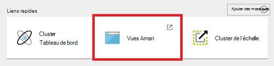
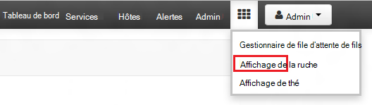
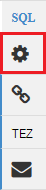
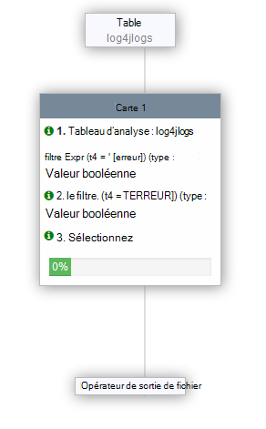

<properties
   pageTitle="Utiliser les vues Ambari avec une ruche sur HDInsight (Hadoop) | Microsoft Azure"
   description="Apprenez à utiliser la vue de la ruche à partir de votre navigateur web pour soumettre des requêtes de la ruche. La vue de la ruche fait partie de l’interface utilisateur Web Ambari fourni avec votre cluster HDInsight de fonctionnant sous Linux."
   services="hdinsight"
   documentationCenter=""
   authors="Blackmist"
   manager="jhubbard"
   editor="cgronlun"
    tags="azure-portal"/>

<tags
   ms.service="hdinsight"
   ms.devlang="na"
   ms.topic="article"
   ms.tgt_pltfrm="na"
   ms.workload="big-data"
   ms.date="10/28/2016"
   ms.author="larryfr"/>

#Utilisez l’affichage de la ruche avec Hadoop dans HDInsight

[AZURE.INCLUDE [hive-selector](../../includes/hdinsight-selector-use-hive.md)]

Ambari est une gestion et un utilitaire de surveillance fournis avec les clusters basés sur Linux de HDInsight. L’une des fonctionnalités fournies par le biais de Ambari est une interface utilisateur Web qui peut être utilisé pour exécuter des requêtes de la ruche. Il s’agit de la __Vue de la ruche__, partie des affichages Ambari fourni avec votre cluster HDInsight.

> [AZURE.NOTE] Ambari a un grand nombre de fonctionnalités qui ne seront pas traités dans ce document. Pour plus d’informations, reportez-vous à la section [HDInsight de gérer les clusters à l’aide de l’interface utilisateur Web de Ambari](hdinsight-hadoop-manage-ambari.md).

##Conditions préalables

- Un cluster basé sur Linux de HDInsight. Pour plus d’informations sur la création d’un nouveau cluster, reportez-vous à la section [mise en route de HDInsight de fonctionnant sous Linux](hdinsight-hadoop-linux-tutorial-get-started.md).

##Ouvrir l’affichage de la ruche

Vous pouvez Ambari des vues à partir du portail Azure ; Sélectionnez votre cluster HDInsight, puis __Ambari les vues__ dans la section __Liens rapides__ .

Vous pouvez également accéder directement à Ambari à partir de https://CLUSTERNAME.azurehdinsight.net dans un navigateur web (dans laquelle __CLUSTERNAME__ est le nom de votre cluster HDInsight) et puis sélectionnez l’ensemble des carrés dans la page menu (le lien __d’administration__ et le bouton gauche de la page,) pour les affichages de listes disponibles. Sélectionnez la __vue de la ruche__.

.

> [AZURE.NOTE] Lorsque vous accédez à Ambari, le système vous demandera à s’authentifier sur le site. Entrez l’administrateur (par défaut `admin`,) nom de compte et mot de passe utilisé lors de la création du cluster.

Vous devriez voir une page semblable à la suivante :

##Afficher les tables

Dans la section __Explorateur de base de données__ de la page, sélectionnez l’entrée __par défaut__ dans l’onglet __bases de données__ . Ceci affichera une liste de tables dans la base de données par défaut. Pour un nouveau cluster HDInsight, qu’une seule table doit exister ; __hivesampletable__.

Comme les nouvelles tables sont ajoutées par le biais de la procédure décrite dans ce document, vous pouvez utiliser l’icône d’actualisation dans le coin supérieur droit de l’Explorateur de base de données pour actualiser la liste des tables disponibles.

##Éditeur de requête

Pour exécuter une requête de ruche par rapport aux données incluses avec le cluster, utilisez les étapes suivantes à partir de la vue de la ruche.

1. Dans la section __Éditeur de requête__ de la page, collez les instructions HiveQL suivantes dans la feuille de calcul :

        DROP TABLE log4jLogs;
        CREATE EXTERNAL TABLE log4jLogs(t1 string, t2 string, t3 string, t4 string, t5 string, t6 string, t7 string)
        ROW FORMAT DELIMITED FIELDS TERMINATED BY ' '
        STORED AS TEXTFILE LOCATION 'wasbs:///example/data/';
        SELECT t4 AS sev, COUNT(*) AS cnt FROM log4jLogs WHERE t4 = '[ERROR]' GROUP BY t4;

    Ces instructions effectuent les actions suivantes :

    - **DROP TABLE** - supprime la table et le fichier de données, si la table existe déjà.
    - **Créer une TABLE externe** - crée une nouvelle table « externe » dans la ruche. Tables externes stockent uniquement la définition de table dans la ruche ; les données restent dans leur emplacement d’origine.
    - **FORMAT de ligne** indique la façon dont les données sont formatées ruche. Dans ce cas, les champs dans chaque journal sont séparés par un espace.
    - **Emplacement de fichier texte en tant que stockage** - indique la ruche où les données sont stockées (le répertoire de données d’exemple) et qu’il est stocké en tant que texte.
    - **Sélectionnez** - sélectionne un décompte de toutes les lignes où la colonne t4 contient la valeur [erreur].

    >[AZURE.NOTE] Tables externes doivent être utilisées lorsque vous pensez que les données sous-jacentes afin d’être mis à jour par une source externe, tel qu’un processus de téléchargement automatique des données, ou par une autre opération MapReduce, mais vous souhaitez que les requêtes de ruche à utiliser les données les plus récentes. Suppression d’une table externe est *pas* supprimer les données, seule la définition de la table.

2. Pour démarrer la requête, utilisez le bouton __exécuter__ en bas de l’éditeur de requête. Elle doit devenir orange, et le texte est modifié pour __Arrêter l’exécution__. Une section de __Requête du processus__ doit s’affichent en dessous de l’éditeur de requête et afficher des informations sur la tâche.

    > [AZURE.IMPORTANT] Certains navigateurs peuvent actualiser pas correctement les informations de journal ou les résultats. Si vous exécutez une tâche et qu’il semble s’exécuter indéfiniment sans mettre à jour l’enregistrement ou essayez de renvoyer les résultats, à l’aide de Mozilla FireFox ou Google Chrome à la place.

3. Une fois la requête terminée, la section des __Résultats du processus de requête__ affiche les résultats de l’opération. Le bouton __Arrêter l’exécution__ sera également rétablir un bouton vert __d’exécution__ . L’onglet __résultats__ doit contenir les informations suivantes :

        sev       cnt
        [ERROR]   3

    L’onglet __journaux__ peut être utilisé pour afficher les informations de connexion créées par la tâche. Vous pouvez utiliser cette fonction pour la résolution des problèmes s’il y a des problèmes avec une requête.

    > [AZURE.TIP] Remarque la boîte de dialogue déroulante __Enregistrer les résultats__ dans le coin supérieur gauche de la section des __Résultats du processus de requête__ ; Vous pouvez utiliser ceci pour télécharger les résultats, ou les enregistrer sur le stockage de HDInsight dans un fichier CSV.

3. Sélectionnez les quatre premières lignes de cette requête, puis cliquez sur __exécuter__. Notez qu’il n’y a aucun résultat lorsque le travail est terminé. Cela est dû en utilisant le bouton __exécuter__ lorsque la partie de la requête sélectionnée ne s’exécute que les relevés sélectionnés. Dans ce cas, la sélection n’a pas inclure l’instruction finale qui Récupère les lignes de la table. Si vous sélectionnez simplement cette ligne et utilisez __Execute__, vous devriez voir les résultats attendus.

3. Utilisez le bouton de la __Nouvelle feuille de calcul__ au bas de l' __Éditeur de requête__ pour créer une nouvelle feuille de calcul. Dans la nouvelle feuille de calcul, entrez les instructions HiveQL suivantes :

        CREATE TABLE IF NOT EXISTS errorLogs (t1 string, t2 string, t3 string, t4 string, t5 string, t6 string, t7 string) STORED AS ORC;
        INSERT OVERWRITE TABLE errorLogs SELECT t1, t2, t3, t4, t5, t6, t7 FROM log4jLogs WHERE t4 = '[ERROR]';

    Ces instructions effectuent les actions suivantes :

    - **Créer TABLE IF NOT EXISTS** - crée une table, il n’existe pas déjà. Dans la mesure où le mot clé **externe** n’est pas utilisé, il s’agit d’une table interne, qui est stockée dans le magasin de données de ruche et est gérée complètement par ruche. À la différence des tables externes, la suppression d’une table interne supprimera les données sous-jacent ainsi.
    - **Stockées des ORC comme** - stocke les données au format d’optimisé ligne en colonnes (ORC). Il s’agit d’un format hautement efficace et optimisé pour le stockage des données de la ruche.
    - REMPLACEMENT de **INSERT... Sélectionnez** - sélectionne les lignes dans la table **log4jLogs** qui contiennent [erreur] et puis insère les données dans la table des **journaux d’erreurs** .

    Utilisez le bouton __exécuter__ pour exécuter cette requête. L’onglet __résultats__ ne contiendra pas toutes les informations sans lignes sont renvoyées par cette requête, mais l’état doit afficher en tant que __a réussi__.

###Paramètres de la ruche

Sélectionnez l’icône __paramètres__ à droite de l’éditeur.

Paramètres peuvent servir à MapReduce pour modifier différents paramètres de ruche, tels que le moteur d’exécution pour la ruche Tez (par défaut).

###Expliquez de Visual

Sélectionnez l’icône __Expliquer Visual__ à droite de l’éditeur.

Il s’agit de la vue __Expliquer Visual__ de la requête, ce qui peut s’avérer utile dans la compréhension du flux de requêtes complexes. Vous pouvez afficher un équivalent textuel de cet affichage en utilisant le bouton __expliquer__ dans l’éditeur de requête.

###Tez

Sélectionnez l’icône __Tez__ à droite de l’éditeur.

S’affiche le dirigé acycliques graphique (DAG) utilisé par Tez pour cette requête, si elle est disponible. Si vous souhaitez afficher le DAG pour les requêtes vous avez exécuté dans l’utilisation du passé ou déboguer le processus Tez, la [Vue de Tez](hdinsight-debug-ambari-tez-view.md) à la place.

###Notifications

Sélectionnez l’icône à droite de l’éditeur de __Notifications__ .

Les notifications sont des messages qui sont générés lors de l’exécution des requêtes. Par exemple, vous recevrez une notification lorsqu’une requête est soumise, ou lorsqu’une erreur se produit.

##Requêtes enregistrées

1. À partir de l’éditeur de requête, créez une nouvelle feuille de calcul et entrez la requête suivante :

        SELECT * from errorLogs;

    Exécutez la requête pour vérifier qu’il fonctionne. Les résultats seront les suivants :

        errorlogs.t1    errorlogs.t2    errorlogs.t3    errorlogs.t4    errorlogs.t5    errorlogs.t6    errorlogs.t7
        2012-02-03  18:35:34    SampleClass0    [ERROR]     incorrect   id  
        2012-02-03  18:55:54    SampleClass1    [ERROR]     incorrect   id  
        2012-02-03  19:25:27    SampleClass4    [ERROR]     incorrect   id

2. Utilisez le bouton __Enregistrer sous__ en bas de l’éditeur. __Journaux d’erreurs de__ requête de nom, puis sélectionnez __OK__. Notez que le nom de la feuille de calcul change de __journaux d’erreurs__.

3. Sélectionnez l’onglet __Requêtes enregistrées__ en haut de la page d’affichage de la ruche. Notez que les __journaux d’erreurs__ apparaît maintenant sous la forme d’une requête enregistrée. Il va rester dans cette liste jusqu'à ce que vous les supprimiez. Sélectionnez le nom pour ouvrir la requête dans l’éditeur de requête.

##Historique des requêtes

Le bouton __historique__ dans la partie supérieure de l’affichage de la ruche permet de vous permet d’afficher les requêtes vous avez exécutez précédemment. L’utiliser maintenant et sélectionnez parmi les requêtes que vous avez exécuté précédemment. Lorsque vous sélectionnez une requête, il l’ouvre dans l’éditeur de requête.

##Défini par l’utilisateur (UDF) de fonctions

Ruche peut également être étendu par le biais de **fonctions définies par l’utilisateur (UDF)**. Un fichier UDF vous permet d’implémenter des fonctionnalités ou la logique qui n’est pas facilement être modelée dans HiveQL.

Vous pouvez ajouter un fichier UDF dans le cadre des instructions HiveQL dans votre requête, l’onglet UDF en haut de la vue de la ruche vous permet de déclarer et d’enregistrer un ensemble de fichiers UDF qui peut être utilisé avec l' __Éditeur de requête__.

Une fois que vous avez ajouté un fichier UDF à l’affichage de la ruche, un bouton __Insérer la FDU__ s’affiche en bas de l' __Éditeur de requête__. Cette option affiche une liste déroulante des FDU définie dans la vue de la ruche. Sélection d’un fichier UDF ajoutera HiveQL instructions à votre requête pour permettre la FDU.

Par exemple, si vous avez défini une FDU avec les propriétés suivantes :

* Nom de la ressource : myudfs
* Chemin d’accès de la ressource : wasbs:///myudfs.jar
* Nom du fichier UDF : myawesomeudf
* Nom de la classe UDF : com.myudfs.Awesome

L’aide du bouton __Insérer UDF__ affiche une entrée appelée __myudfs__, avec une autre liste déroulante pour chaque FDU définie pour cette ressource. Dans ce cas, il s’agit de __myawesomeudf__. En sélectionnant cette entrée ajoutera les éléments suivants au début de la requête :

    add jar wasbs:///myudfs.jar;

    create temporary function myawesomeudf as 'com.myudfs.Awesome';

Vous pouvez ensuite utiliser la FDU dans votre requête. Par exemple, `SELECT myawesomeudf(name) FROM people;`.

Pour plus d’informations sur l’utilisation de fichiers UDF avec ruche sur HDInsight, consultez les rubriques suivantes :

* [À l’aide de Python avec la ruche et de HDInsight de porc](hdinsight-python.md)

* [L’ajout d’un fichier UDF personnalisé de la ruche à HDInsight](http://blogs.msdn.com/b/bigdatasupport/archive/2014/01/14/how-to-add-custom-hive-udfs-to-hdinsight.aspx)

##Étapes suivantes

Pour obtenir des informations générales sur la ruche dans HDInsight :

* [Utilisez la ruche avec Hadoop sur HDInsight](hdinsight-use-hive.md)

Pour plus d’informations sur d’autres méthodes, vous pouvez travailler avec Hadoop sur HDInsight :

* [Utilisez des porcs avec Hadoop sur HDInsight](hdinsight-use-pig.md)

* [Utilisez MapReduce avec Hadoop sur HDInsight](hdinsight-use-mapreduce.md)
