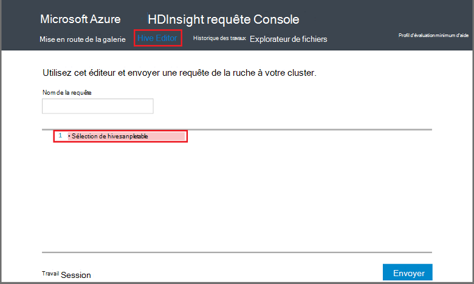

<properties
   pageTitle="Utiliser Hadoop ruche dans la Console de la requête en HDInsight | Microsoft Azure"
   description="Apprenez à utiliser la Console de requête sur le web à exécuter des requêtes de ruche sur un cluster HDInsight Hadoop à partir de votre navigateur."
   services="hdinsight"
   documentationCenter=""
   authors="Blackmist"
   manager="jhubbard"
   editor="cgronlun"
    tags="azure-portal"/>

<tags
   ms.service="hdinsight"
   ms.devlang="na"
   ms.topic="article"
   ms.tgt_pltfrm="na"
   ms.workload="big-data"
   ms.date="09/20/2016"
   ms.author="larryfr"/>

# Exécuter des requêtes de ruche à l’aide de la Console de la requête

[AZURE.INCLUDE [hive-selector](../../includes/hdinsight-selector-use-hive.md)]

Dans cet article, vous allez apprendre à utiliser la Console de la requête HDInsight pour exécuter des requêtes de ruche sur un cluster HDInsight Hadoop à partir de votre navigateur.

> [AZURE.IMPORTANT] La Console de la requête HDInsight est disponible uniquement sur les clusters basés sur Windows de HDInsight. Si vous utilisez un cluster basé sur Linux de HDInsight, consultez [la ruche exécuter des requêtes à l’aide de la vue de la ruche](hdinsight-hadoop-use-hive-ambari-view.md).

##Conditions préalables

Pour terminer la procédure décrite dans cet article, vous devrez les éléments suivants.

* Un cluster basé sur Windows le HDInsight Hadoop

* Un navigateur web moderne

##Exécuter des requêtes de ruche à l’aide de la Console de la requête

1. Ouvrez un navigateur web et accédez à __https://CLUSTERNAME.azurehdinsight.net__, dans laquelle __CLUSTERNAME__ est le nom de votre cluster de HDInsight. Si vous y êtes invité, entrez le nom d’utilisateur et le mot de passe que vous avez utilisé lors de la création du cluster.

2. Dans les liens en haut de la page, sélectionnez **Éditeur de la ruche**. Affiche un formulaire qui peut être utilisé pour entrer les instructions HiveQL que vous souhaitez exécuter dans le cluster de HDInsight.

    

    Remplacez le texte `Select * from hivesampletable` avec les instructions HiveQL suivantes :

        set hive.execution.engine=tez;
        DROP TABLE log4jLogs;
        CREATE EXTERNAL TABLE log4jLogs (t1 string, t2 string, t3 string, t4 string, t5 string, t6 string, t7 string)
        ROW FORMAT DELIMITED FIELDS TERMINATED BY ' '
        STORED AS TEXTFILE LOCATION 'wasbs:///example/data/';
        SELECT t4 AS sev, COUNT(*) AS count FROM log4jLogs WHERE t4 = '[ERROR]' AND INPUT__FILE__NAME LIKE '%.log' GROUP BY t4;

    Ces instructions effectuent les actions suivantes :

    * **DROP TABLE**: supprime le fichier de données et de la table si la table existe déjà.
    * **Créer une TABLE externe**: crée une nouvelle table « externe » dans la ruche. Tables externes stockent uniquement la définition de table dans la ruche ; les données restent dans leur emplacement d’origine.

    > [AZURE.NOTE] Tables externes doivent être utilisées lorsque vous pensez que les données sous-jacentes afin d’être mis à jour par une source externe (par exemple, un processus de téléchargement automatique des données) ou par une autre opération MapReduce, mais vous souhaitez que les requêtes de ruche à utiliser les données les plus récentes.
    >
    > Suppression d’une table externe est **pas** supprimer les données, seule la définition de la table.

    * **FORMAT de ligne**: indique la façon dont les données sont formatées ruche. Dans ce cas, les champs dans chaque journal sont séparés par un espace.
    * **Emplacement de fichier texte en tant que stocké**: indique la ruche où les données sont stockées (le répertoire de données d’exemple) et qu’il est stocké en tant que texte
    * **Sélectionner**: sélectionner un nombre de toutes les lignes où la colonne **t4** contiennent la valeur **[erreur]**. Cela doit retourner une valeur de **3** , car il y a trois lignes contenant cette valeur.
    * **INPUT__FILE__NAME comme '%.log'** - indique la ruche que nous devons uniquement renvoyer des données à partir de fichiers se terminant par. journal. Cela limite la recherche au fichier exemple.log qui contient les données et empêche de renvoyer des données à partir de l’autre exemple de fichiers de données qui ne correspondent pas le schéma que nous avons défini.

2. Cliquez sur **Envoyer**. La **Session de travail** en bas de la page Détails de la tâche doit s’afficher.

3. Lorsque le champ **état** passe à **terminé**, sélectionnez **Afficher les détails** de la tâche. Sur la page Détails, la **Sortie de la tâche** contient `[ERROR]   3`. Le bouton **Télécharger** sous ce champ vous permet de télécharger un fichier qui contient la sortie de la tâche.

##Résumé

Comme vous pouvez le voir, la Console de requête fournit un moyen simple pour exécuter des requêtes de la ruche dans un cluster de HDInsight, surveiller l’état du travail et récupérer la sortie.

Pour en savoir plus sur l’utilisation de la Console de requête de la ruche pour exécuter des travaux de la ruche, sélectionnez la **Mise en route** en haut de la Console de la requête, puis utilisez les exemples fournis. Chaque exemple explique le processus d’utilisation de ruche pour analyser les données, y compris les explications sur les instructions de HiveQL utilisées dans l’exemple.

##Étapes suivantes

Pour obtenir des informations générales sur la ruche dans HDInsight :

* [Utilisez la ruche avec Hadoop sur HDInsight](hdinsight-use-hive.md)

Pour plus d’informations sur les autres méthodes, vous pouvez travailler avec Hadoop sur HDInsight :

* [Utilisez des porcs avec Hadoop sur HDInsight](hdinsight-use-pig.md)

* [Utilisez MapReduce avec Hadoop sur HDInsight](hdinsight-use-mapreduce.md)

Si vous utilisez Tez avec ruche, consultez les documents suivants pour les informations de débogage :

* [Utiliser l’interface utilisateur de Tez basée sur Windows la HDInsight](hdinsight-debug-tez-ui.md)

* [Utilisez l’affichage Ambari Tez sur HDInsight de basé sur Linux](hdinsight-debug-ambari-tez-view.md)

[1]: ../HDInsight/hdinsight-hadoop-visual-studio-tools-get-started.md

[hdinsight-sdk-documentation]: http://msdnstage.redmond.corp.microsoft.com/library/dn479185.aspx

[azure-purchase-options]: http://azure.microsoft.com/pricing/purchase-options/
[azure-member-offers]: http://azure.microsoft.com/pricing/member-offers/
[azure-free-trial]: http://azure.microsoft.com/pricing/free-trial/

[apache-tez]: http://tez.apache.org
[apache-hive]: http://hive.apache.org/
[apache-log4j]: http://en.wikipedia.org/wiki/Log4j
[hive-on-tez-wiki]: https://cwiki.apache.org/confluence/display/Hive/Hive+on+Tez
[import-to-excel]: http://azure.microsoft.com/documentation/articles/hdinsight-connect-excel-power-query/

[hdinsight-use-oozie]: hdinsight-use-oozie.md
[hdinsight-analyze-flight-data]: hdinsight-analyze-flight-delay-data.md

[hdinsight-storage]: hdinsight-hadoop-use-blob-storage.md

[hdinsight-provision]: hdinsight-provision-clusters.md
[hdinsight-submit-jobs]: hdinsight-submit-hadoop-jobs-programmatically.md
[hdinsight-upload-data]: hdinsight-upload-data.md
[hdinsight-get-started]: hdinsight-hadoop-linux-tutorial-get-started.md

[Powershell-install-configure]: powershell-install-configure.md
[powershell-here-strings]: http://technet.microsoft.com/library/ee692792.aspx

[img-hdi-hive-powershell-output]: ./media/hdinsight-use-hive/HDI.Hive.PowerShell.Output.png
