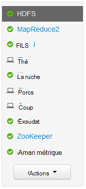
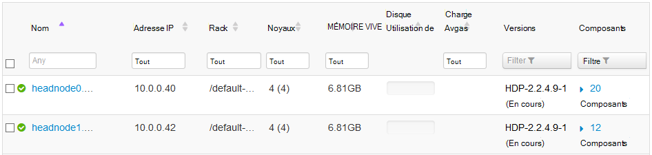
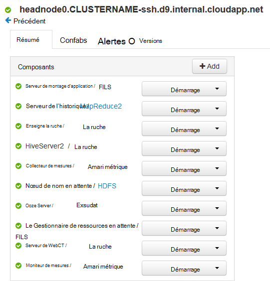
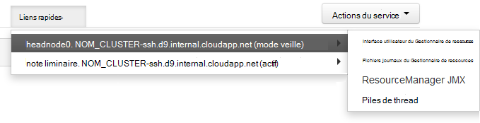
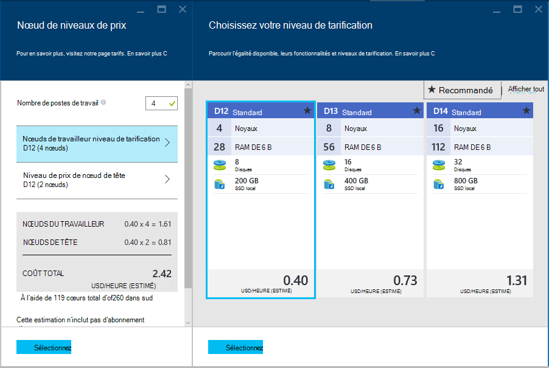

<properties
    pageTitle="Fonctions de haute disponibilité de basé sur Linux HDInsight (Hadoop) | Microsoft Azure"
    description="Découvrez comment basé sur Linux de HDInsight clusters améliorent la fiabilité et la disponibilité à l’aide d’un nœud de tête supplémentaire. Vous apprendrez à leur impact sur les services de Hadoop tels que Ambari et de la ruche, ainsi que comme se pour connecter individuellement à chaque nœud de tête à l’aide de SSH."
    services="hdinsight"
    editor="cgronlun"
    manager="jhubbard"
    authors="Blackmist"
    documentationCenter=""
    tags="azure-portal"/>

<tags
    ms.service="hdinsight"
    ms.workload="big-data"
    ms.tgt_pltfrm="na"
    ms.devlang="multiple"
    ms.topic="article"
    ms.date="09/13/2016"
    ms.author="larryfr"/>

#Disponibilité et la fiabilité des clusters Hadoop dans HDInsight

Hadoop garantit la haute disponibilité et la fiabilité en distribuant des copies redondantes des données et des services sur les nœuds d’un cluster. Cependant les distributions standard d’Hadoop ont généralement qu’un seul nœud de tête. Toute panne du nœud principal unique peut provoquer l’arrêt du cluster.

Pour résoudre ce problème potentiel, les clusters basés sur Linux de HDInsight sur Azure fournissent deux nœuds têtes pour augmenter la disponibilité et la fiabilité des services d’Hadoop et travaux en cours.

> [AZURE.NOTE] Les étapes utilisées dans ce document sont spécifiques aux clusters de HDInsight de fonctionnant sous Linux. Si vous utilisez un cluster Windows, consultez la [disponibilité et la fiabilité des clusters basés sur Windows de Hadoop HDInsight](hdinsight-high-availability.md) des informations propres à Windows.

##Comprendre les nœuds

Nœuds d’un cluster d’HDInsight sont implémentées à l’aide d’ordinateurs virtuels Azure. Dans le cas où un nœud tombe en panne, il est mis hors connexion et un nouveau nœud est créé pour remplacer le nœud défaillant. Tandis que le nœud est en mode hors connexion, un autre nœud du même type sera utilisé jusqu'à ce que le nouveau nœud est remis en ligne.

> [AZURE.NOTE] Si le nœud est analyse des données en cas d’échec, la progression de la tâche est perdue. La tâche de fonctionnement sur le nœud défaillant sera à nouveau soumise à un autre nœud.

Les sections suivantes décrivent les types de nœud utilisés avec HDInsight. Pas tous les types de nœuds sont utilisés pour un type de cluster. Par exemple, un type de cluster Hadoop n’auront pas tous les nœuds Nimbus. Pour plus d’informations sur les nœuds utilisés par des types de cluster HDInsight, consultez la section types de Cluster des [clusters basés sur Linux de créer les Hadoop dans HDInsight](hdinsight-hadoop-provision-linux-clusters.md#cluster-types).

###Nœuds de tête

Certaines implémentations de Hadoop ont un seul nœud de tête qui héberge les services et les composants qui gèrent la défaillance des nœuds de travail facilement. Mais les risques d’arrêt des services maîtres en cours d’exécution sur le nœud de tête provoque le cluster cessent de fonctionner.

HDInsight clusters fournissent un nœud de tête secondaire, ce qui permet des principaux services et composants pour continuer à exécuter le nœud secondaire en cas de panne du serveur primaire.

> [AZURE.IMPORTANT] Les deux nœuds en tête sont actifs et en cours d’exécution dans le cluster simultanément. Certains services, tels que les fils, ou de très ne sont « actifs » sur un nœud principal à la fois donné (et « en attente » sur l’autre nœud de tête). Autres services tels que HiveServer2 ou MetaStore de la ruche sont actifs sur les deux nœuds de tête en même temps.

Nœuds de tête (et autres nœuds dans HDInsight,) a une valeur numérique en tant que partie du nom d’hôte du nœud. Par exemple, `hn0-CLUSTERNAME` ou `hn4-CLUSTERNAME`. 

> [AZURE.IMPORTANT] N’associez pas la valeur numérique indique si un nœud est principal ou secondaire ; la valeur numérique est uniquement présente afin de fournir un nom unique pour chaque nœud.

###Nœuds Nimbus

Pour les clusters de tempête, les nœuds Nimbus fournissent des fonctionnalités semblables à la Hadoop JobTracker par la distribution et la surveillance de traitement sur les nœuds du travailleur. HDInsight fournit 2 nœuds Nimbus a pour le type de cluster de tempête.

###Nœuds de soigneur

Nœuds de [soigneur](http://zookeeper.apache.org/ ) (ZKs) sont utilisés pour l’élection de leader de services maîtres sur des nœuds de tête, et pour s’assurer que les services, les nœuds de données (travail) et les passerelles savent quel nœud principal, un service principal est actif sur. Par défaut, HDInsight fournit 3 nœuds soigneur.

###Nœuds du travailleur

Nœuds de travailleur effectuent l’analyse des données réelles lorsqu’un travail est soumis au cluster. En cas de défaillance d’un nœud de travailleur, la tâche qu’il effectuait transmettra à un autre nœud du travailleur. Par défaut, HDInsight va créer 4 nœuds du travailleur ; Toutefois, vous pouvez modifier ce nombre en fonction de vos besoins à la fois lors de la création du cluster et après la création du cluster.

###Nœud de bord

Un nœud ne participe pas activement analyse des données au sein du cluster, mais elle est plutôt utilisé par les développeurs ou les scientifiques de données lorsque vous travaillez avec Hadoop. Le nœud de bord réside dans le même réseau virtuel Azure que les autres nœuds du cluster et peut accéder directement à tous les autres nœuds. Dans la mesure où il n’est pas impliqué dans l’analyse des données pour le cluster, il peut être utilisé sans toute préoccupation de ressources des services Hadoop critiques ou les tâches d’analyse.

Actuellement, le serveur R HDInsight est le seul type de cluster fournissant un nœud par défaut. Serveur de R sur HDInsight, le nœud de bord est utilisé code test R localement sur le nœud avant de l’envoyer au cluster de traitement distribué.

[Créer un cluster basé sur Linux de HDInsight avec la nuance sur un nœud](https://azure.microsoft.com/documentation/templates/hdinsight-linux-with-hue-on-edge-node/) est un exemple de modèle qui peut être utilisé pour créer un type de cluster d’Hadoop qui a un nœud.

## L’accès à des nœuds

L’accès au cluster via internet est fourni via une passerelle publique et est limité à la connexion aux nœuds de tête et (dans le cas d’un serveur HDInsight cluster, R) du nœud du bord. Accès aux services qui s’exécutent sur les nœuds du siège n’est pas concerné par comprenant plusieurs nœuds de tête, comme la passerelle publique achemine les demandes vers le nœud principal qui héberge le service demandé. Par exemple, si Ambari est actuellement hébergé sur le nœud secondaire de la tête, la passerelle acheminera les demandes entrantes pour Ambari à ce nœud.

Lors de l’accès au cluster à l’aide de SSH, connexion via le port 22 (la valeur par défaut de SSH,) se connecte au nœud principal primaire ; connexion via le port 23 se connecte au nœud principal secondaire. Par exemple, `ssh username@mycluster-ssh.azurehdinsight.net` se connecte au nœud principal primaire du cluster nommé __mycluster__.

> [AZURE.NOTE] Cela s’applique également aux protocoles basés sur SSH, par exemple le SSH SFTP File Transfer Protocol ().

Le nœud de bord fourni avec R Server sur des clusters de HDInsight est également directement accessibles à l’aide de SSH à la voie 22. Par exemple, `ssh username@RServer.mycluster.ssh.azurehdinsight.net` se connectera le nœud de bord pour un serveur R sur cluster HDInsight nommé __mycluster__. 

### Noms internes de domaine pleinement qualifié (FQDN)

Les nœuds dans un cluster HDInsight ont une adresse IP interne et le nom de domaine complet est accessible à partir du cluster (par exemple, une session SSH à la tâche en cours d’exécution sur le cluster ou le nœud de tête.) Lorsque vous accédez aux services sur le cluster à l’aide de l’adresse IP ou le nom de domaine complet interne, vous devez utiliser Ambari pour vérifier l’adresse IP ou le nom de domaine complet à utiliser lors de l’accès au service.

Par exemple, le service Oozie peut s’exécuter uniquement sur un nœud de tête et à l’aide de la `oozie` commande à partir d’une session SSH exige l’URL du service. Il peut être récupéré à partir de Ambari à l’aide de la commande suivante :

    curl -u admin:PASSWORD "https://CLUSTERNAME.azurehdinsight.net/api/v1/clusters/CLUSTERNAME/configurations?type=oozie-site&tag=TOPOLOGY_RESOLVED" | grep oozie.base.url

Ceci renverra une valeur semblable à la suivante, qui contient l’URL d’interne à utiliser avec le `oozie` commande :

    "oozie.base.url": "http://hn0-CLUSTERNAME-randomcharacters.cx.internal.cloudapp.net:11000/oozie"

### L’accès à d’autres types de nœuds

Vous pouvez vous connecter à des nœuds qui ne sont pas directement accessibles sur internet à l’aide des méthodes suivantes.

* __SSH__: une fois connecté à un nœud de tête à l’aide de SSH, vous pouvez ensuite utiliser SSH du nœud de tête pour se connecter à d’autres nœuds dans le cluster.
* __Tunnel SSH__: Si vous devez accéder à un service web hébergé sur un des nœuds qui n’est pas exposé à internet, vous devez [utiliser un tunnel SSH](hdinsight-linux-ambari-ssh-tunnel.md).
* __Réseau virtuel d’Azure__: Si votre cluster HDInsight fait partie d’un réseau virtuel d’Azure, toutes les ressources sur le même réseau virtuel peuvent accéder directement à tous les nœuds du cluster.

## Comment vérifier un état de service

L’interface utilisateur Web de Ambari ou de l’API REST de Ambari permet de vérifier l’état des services qui s’exécutent sur les nœuds de tête.

###Interface utilisateur Web de Ambari

L’interface utilisateur Web de Ambari est affichable à https://CLUSTERNAME.azurehdinsight.net. Remplacez **NOM_CLUSTER** par le nom de votre cluster. Si vous y êtes invité, entrez les informations d’identification utilisateur HTTP pour votre cluster. Le nom d’utilisateur HTTP par défaut est **admin** et le mot de passe est le mot de passe que vous avez entré lors de la création du cluster.

Lorsque vous arrivez sur la page Ambari, les services installés apparaît sur la gauche de la page.

Il existe une série d’icônes qui s’affichent en regard d’un service pour indiquer l’état. Toutes les alertes liées à un service peuvent être affichés à l’aide de la liaison **d’alertes** en haut de la page. Vous pouvez sélectionner chaque service pour afficher plus d’informations sur celui-ci.

Alors que la page du service fournit des informations sur l’état et la configuration de chaque service, il ne fournit pas d’informations sur le nœud principal, le service s’exécute sur. Pour afficher ces informations, cliquez sur le lien **d’hôtes** en haut de la page. Cela affichera des hôtes du cluster, y compris les nœuds de tête.

Activer le lien d’un des nœuds du siège permet d’afficher les services et les composants qui s’exécutent sur ce nœud.

###API REST de Ambari

L’API REST de Ambari sont disponible sur l’internet, et de la passerelle public gère le routage des demandes au nœud principal qui héberge actuellement l’API REST.

Vous pouvez utiliser la commande suivante pour vérifier l’état d’un service par le biais de l’API REST de Ambari :

    curl -u admin:PASSWORD https://CLUSTERNAME.azurehdinsight.net/api/v1/clusters/CLUSTERNAME/services/SERVICENAME?fields=ServiceInfo/state

* Remplacer le **mot de passe** de l’utilisateur HTTP (admin), mot de passe de compte

* Remplacez **NOM_CLUSTER** avec le nom du cluster

* Remplacer **SERVICENAME** avec le nom du service pour vérifier l’état de

Par exemple, pour vérifier l’état du service **très** sur un cluster nommé **mon_cluster**, avec un mot de passe **mot de passe**, vous utilisez les éléments suivants :

    curl -u admin:password https://mycluster.azurehdinsight.net/api/v1/clusters/mycluster/services/HDFS?fields=ServiceInfo/state

La réponse sera semblable au suivant :

    {
      "href" : "http://hn0-CLUSTERNAME.randomcharacters.cx.internal.cloudapp.net:8080/api/v1/clusters/mycluster/services/HDFS?fields=ServiceInfo/state",
      "ServiceInfo" : {
        "cluster_name" : "mycluster",
        "service_name" : "HDFS",
        "state" : "STARTED"
      }
    }

L’URL indique que le service est en cours d’exécution sur un nœud principal nommé __Hn0-NOM_CLUSTER__.

L’état indique si nous que le service est en cours d’exécution, ou **démarré**.

Si vous ne connaissez pas quels services sont installés sur le cluster, vous pouvez utiliser les éléments suivants pour récupérer une liste :

    curl -u admin:PASSWORD https://CLUSTERNAME.azurehdinsight.net/api/v1/clusters/CLUSTERNAME/services

####Composants de service

Services peuvent inclure des composants que vous souhaitez vérifier le statut d’individuellement. Par exemple, très contient le composant NameNode. Pour afficher des informations sur un composant, la commande serait :

    curl -u admin:PASSWORD https://CLUSTERNAME.azurehdinsight.net/api/v1/clusters/CLUSTERNAME/services/SERVICE/components/component

Si vous ne savez pas quels sont les composants fournis par un service, vous pouvez utiliser les éléments suivants pour récupérer une liste :

    curl -u admin:PASSWORD https://CLUSTERNAME.azurehdinsight.net/api/v1/clusters/CLUSTERNAME/services/SERVICE/components/component
    
## Comment faire pour accéder aux fichiers journaux sur les nœuds de tête

###SSH

Lorsque vous êtes connecté à un nœud de tête via SSH, vous pouvez trouver les fichiers journaux sous **var**. Par exemple, **/var/log/hadoop-yarn/yarn** contient les journaux de fils.

Chaque nœud de tête peut avoir des entrées de journal unique, vérifiez donc les journaux sur les deux.

###SFTP

Vous pouvez également vous connecter au nœud principal à l’aide du SSH File Transfer Protocol ou Secure protocole SFTP (File Transfer) et télécharger directement les fichiers journaux.

Similaire à l’utilisation d’un client SSH, lors de la connexion au cluster, vous devez fournir le nom du compte utilisateur SSH et l’adresse SSH du cluster. Par exemple, `sftp username@mycluster-ssh.azurehdinsight.net`. Vous devez également fournir le mot de passe du compte lorsque vous y êtes invité, ou fournir une clé publique à l’aide du `-i` paramètre.

Une fois connecté, vous voyez un `sftp>` invite. À partir de cette invite, vous pouvez modifier les répertoires, télécharger des fichiers. Par exemple, les commandes suivantes changez les répertoires pour le répertoire **/var/log/hadoop/hdfs** et téléchargement tous les fichiers dans le répertoire.

    cd /var/log/hadoop/hdfs
    get *

Pour obtenir une liste des commandes disponibles, tapez `help` à la `sftp>` invite.

> [AZURE.NOTE] Il existe également des interfaces graphiques qui vous permettent de visualiser le système de fichiers lorsque vous êtes connecté à l’aide de SFTP. Par exemple, [MobaXTerm](http://mobaxterm.mobatek.net/) vous permet de parcourir le système de fichiers à l’aide d’une interface semblable à l’Explorateur Windows.

###Ambari

> [AZURE.NOTE] L’accès aux fichiers journaux par le biais de Ambari nécessite un tunnel SSH, les sites web pour les services individuels ne sont pas exposées publiquement sur Internet. Pour plus d’informations sur l’utilisation d’un tunnel SSH, consultez [Utiliser SSH Tunneling pour accéder à l’interface utilisateur web de Ambari, ResourceManager, JobHistory, NameNode, Oozie et autre web, l’interface utilisateur](hdinsight-linux-ambari-ssh-tunnel.md).

À partir de l’interface utilisateur Web de Ambari, sélectionnez le service que vous souhaitez afficher les journaux pour (par exemple, fils), puis utiliser les **Liens rapides** permet de sélectionner le nœud principal pour afficher les journaux pour.

## Comment faire pour configurer la taille du nœud ##

La taille de l’un nœud ne peut être sélectionné lors de la création du cluster. Vous trouverez une liste des différentes tailles de mémoire virtuelle disponibles pour les HDInsight, y compris le principal, la mémoire et le stockage local pour chacun, dans la [page tarification de HDInsight](https://azure.microsoft.com/pricing/details/hdinsight/).

Lorsque vous créez un nouveau cluster, vous pouvez spécifier la taille des nœuds. Les éléments suivants fournissent des informations sur la façon de spécifier la taille à l’aide du [Portail Azure][preview-portal], [Azure PowerShell][azure-powershell]et l' [Infrastructure du langage commun Azure][azure-cli]:

* **Azure Portal**: lors de la création d’un nouveau cluster, vous disposez de la possibilité de définir la taille (niveau de tarification) de la tête, de travailleur et (s’il est utilisé par le type de cluster) pour le cluster, les nœuds de soigneur :

    

* **Azure CLI**: lorsque vous utilisez la `azure hdinsight cluster create` de commande, vous pouvez définir la taille de la tête, travailleur et les nœuds de soigneur à l’aide de la `--headNodeSize`, `--workerNodeSize`, et `--zookeeperNodeSize` paramètres.

* **Azure PowerShell**: lorsque vous utilisez la `New-AzureRmHDInsightCluster` applet de commande, vous pouvez définir la taille de la tête, travailleur et les nœuds de soigneur à l’aide de la `-HeadNodeVMSize`, `-WorkerNodeSize`, et `-ZookeeperNodeSize` paramètres.

##Étapes suivantes

Dans ce document, vous avez appris comment Azure HDInsight fournit une haute disponibilité pour Hadoop. Utilisez ce qui suit pour en savoir plus sur les opérations mentionnées dans ce document.

- [Référence d’autres Ambari](https://github.com/apache/ambari/blob/trunk/ambari-server/docs/api/v1/index.md)

- [Installer et configurer l’infrastructure du langage commun Azure](../xplat-cli-install.md)

- [Installer et configurer Azure PowerShell](../powershell-install-configure.md)

- [Gérer les HDInsight à l’aide de Ambari](hdinsight-hadoop-manage-ambari.md)

- [Configurer les clusters basés sur Linux de HDInsight](hdinsight-hadoop-provision-linux-clusters.md)

[preview-portal]: https://portal.azure.com/
[azure-powershell]: ../powershell-install-configure.md
[azure-cli]: ../xplat-cli-install.md
