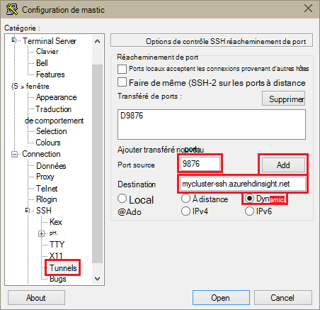
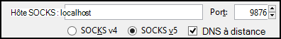

<properties
pageTitle="Utiliser le Tunneling SSH pour accéder à l’interface utilisateur web de Ambari, ResourceManager, JobHistory, NameNode, Oozie et autre web interface utilisateur"
description="Apprenez à utiliser un tunnel SSH pour naviguer de manière sécurisée les ressources web hébergées sur vos nœuds de HDInsight de fonctionnant sous Linux."
services="hdinsight"
documentationCenter=""
authors="Blackmist"
manager="jhubbard"
editor="cgronlun"/>

<tags
ms.service="hdinsight"
ms.devlang="na"
ms.topic="article"
ms.tgt_pltfrm="na"
ms.workload="big-data"
ms.date="10/17/2016"
ms.author="larryfr"/>

# Utiliser le Tunneling SSH pour accéder à l’interface utilisateur web de Ambari, JobHistory, NameNode, Oozie et autre web interface utilisateur

Linux HDInsight grappes de serveurs permettent d’accéder à l’interface utilisateur de Ambari web sur Internet, mais certaines fonctionnalités de l’interface utilisateur ne le sont pas. Par exemple, l’interface utilisateur web pour d’autres services qui sont fournies par des Ambari. Pour toutes les fonctionnalités de l’interface utilisateur du web Ambari, vous devez utiliser un tunnel SSH à la tête du cluster.

## Ce qui exige un tunnel SSH ?

Plusieurs menus de Ambari pas entièrement remplira sans un tunnel SSH, car ils s’appuient sur des sites web et des services exposés par d’autres services d’Hadoop s’exécutant sur le cluster. Souvent, ces sites web ne sont pas sécurisés, il n’est pas possible sans les exposer directement sur internet. Parfois, le service exécute le site web sur un autre nœud de cluster comme un nœud soigneur.

Services utilisés par l’interface utilisateur web de Ambari, et qui ne sont pas accessibles sans un tunnel SSH sont les suivantes :

* JobHistory,
* NameNode,
* Piles de threads,
* Interface utilisateur web de Oozie
* Masque de HBase et de journaux d’interface utilisateur

Si vous utilisez des Actions de Script pour personnaliser votre cluster, tous les services ou les utilitaires que vous installez et qui exposent une interface utilisateur web nécessitera un tunnel SSH. Par exemple, si vous installez teinte à l’aide d’une Action de Script, vous devez utiliser un tunnel SSH pour accéder à l’interface utilisateur du web de teinte.

## En quoi consiste un tunnel SSH ?

[SSH (Secure Shell) tunneling](https://en.wikipedia.org/wiki/Tunneling_protocol#Secure_Shell_tunneling) achemine le trafic envoyé à un port sur votre station de travail locale, via une connexion SSH pour votre nœud principal de cluster HDInsight, où la demande est alors résolue comme si elle a été créée sur le nœud principal. La réponse est ensuite acheminée via le tunnel vers votre station de travail.

## Conditions préalables

Lorsque vous utilisez un tunnel SSH pour le trafic web, vous devez disposer des éléments suivants :

* Un client SSH. Pour les distributions de Linux et Unix ou Macintosh OS X, la `ssh` commande est fourni avec le système d’exploitation. Pour Windows, nous vous recommandons de [PuTTY](http://www.chiark.greenend.org.uk/~sgtatham/putty/download.html)

    > [AZURE.NOTE] Si vous souhaitez utiliser un client SSH autres que `ssh` ou PuTTY, veuillez consulter la documentation de votre client sur la façon d’établir un tunnel SSH.

* Un navigateur web qui peut être configuré pour utiliser un proxy SOCKS

## Créer un tunnel à l’aide de la commande SSH

Utilisez la commande suivante pour créer un SSH du tunnel à l’aide de la `ssh` commande. Remplacez le __nom d’utilisateur__ avec un utilisateur SSH pour votre cluster HDInsight et __NOM_CLUSTER__ avec le nom de votre cluster HDInsight

    ssh -C2qTnNf -D 9876 USERNAME@CLUSTERNAME-ssh.azurehdinsight.net

Cette opération crée une connexion qui achemine le trafic vers un port local 9876 au cluster via SSH. Les options sont les suivantes :

* **D 9876** - le port local qui achemine le trafic via le tunnel.

* **C** - compresser toutes les données, car le trafic web est principalement du texte.

* **2** - force SSH pour essayer la version 2 du protocole.

* **q** - mode silencieux.

* **T** - allocation de pseudo-tty désactiver, dans la mesure où nous transmettons vos simplement d’un port.

* **n** - empêcher la lecture de STDIN, étant donné que nous transmettons vos simplement d’un port.

* **N** - ne s’exécutent pas une commande à distance, dans la mesure où nous transmettons vos simplement d’un port.

* **f** - exécuter en arrière-plan.

Si vous avez configuré le cluster avec un code SSH, vous devrez peut-être utiliser le `-i` paramètre et spécifiez le chemin d’accès à la clé privée de SSH.

Une fois la commande terminée, le trafic envoyé à port 9876 sur l’ordinateur local sera routée via SSL Secure Sockets Layer () sur le cluster nœud de tête et semblent provenir il.

## Créer un tunnel à l’aide de PuTTY

Utilisez les étapes suivantes pour créer un tunnel SSH à l’aide de PuTTY.

1. Ouvrez PuTTY et entrez vos informations de connexion. Si vous n’êtes pas familiarisé avec PuTTY, consultez [Utiliser SSH avec basé sur Linux d’Hadoop sur HDInsight à partir de Windows](hdinsight-hadoop-linux-use-ssh-windows.md) pour plus d’informations sur la façon de l’utiliser avec HDInsight.

2. Dans la section **catégories** , à gauche de la boîte de dialogue, développez la **connexion**et développez le **SSH**puis sélectionnez **Tunnels**.

3. Sur l’écran des **Options de contrôle de réacheminement de port SSH** , fournissez les informations suivantes :

    * **Port source** : le port sur le client que vous souhaitez transférer. Par exemple, **9876**.

    * Adresse de **destination** - le SSH pour le cluster HDInsight de fonctionnant sous Linux. Par exemple, **mon_cluster-ssh.azurehdinsight.net**.

    * **Dynamique** - proxy SOCKS dynamique permet le routage.

    

4. Cliquez sur **Ajouter** pour ajouter les paramètres, puis cliquez sur **Ouvrir** pour ouvrir une connexion SSH.

5. Lorsque vous y êtes invité, ouvrez une session sur le serveur. Vous établissez une session SSH et activer le tunnel.

## Utiliser le tunnel à partir de votre navigateur

> [AZURE.NOTE] Les étapes de cette section utilisent le navigateur FireFox, comme il est disponible gratuitement pour les systèmes Linux, Unix, Macintosh OS X et Windows. Autres navigateurs modernes prenant en charge à l’aide d’un proxy SOCKS fonctionnera également.

1. Configurer le navigateur pour utiliser **localhost:9876** comme un proxy **SOCKS v5** . Voici à quoi ressemblent les paramètres Firefox. Si vous avez utilisé un port autre que 9876, modifiez le port à celui que vous avez utilisé :

    

    > [AZURE.NOTE] Sélection **à distance DNS** résout les demandes de système de nom de domaine (DNS) en utilisant le cluster HDInsight. Si ce n’est pas cochée, DNS seront résolues localement.

2. Vérifiez que le trafic est routé via le tunnel en vising un site tel que [http://www.whatismyip.com/](http://www.whatismyip.com/) avec les paramètres de proxy activé et désactivé dans Firefox. Alors que les paramètres sont activés, l’adresse IP sera pour un ordinateur dans le centre de données Microsoft Azure.

##Vérifiez auprès de l’interface utilisateur web de Ambari

Une fois que le cluster a été établi, procédez comme suit pour vérifier que vous pouvez accéder à web de service interfaces utilisateur à partir du Web de Ambari :

1. Dans votre navigateur, accédez à http://headnodehost:8080. Le `headnodehost` adresse sera envoyé via le tunnel au cluster et résoudre à la headnode Ambari est en cours d’exécution. Lorsque vous y êtes invité, entrez le nom d’utilisateur admin (admin) et un mot de passe pour votre cluster. Vous pouvez être invité à une seconde fois par l’interface utilisateur du web Ambari. Si tel est le cas, entrez à nouveau les informations.
    
    > [AZURE.NOTE] Lorsque vous utilisez l’adresse de http://headnodehost:8080 pour se connecter au cluster, vous vous connectez directement via le tunnel vers le nœud de tête Ambari est en cours d’exécution utilisant HTTP et la communication est sécurisée à l’aide de SSH tunnel. Lorsque vous vous connectez sur internet sans l’utilisation d’un tunnel, les communications sont sécurisées à l’aide de HTTPS. Pour vous connecter via internet à l’aide de HTTPS, utilisez https://CLUSTERNAME.azurehdinsight.net, où __CLUSTERNAME__ est le nom du cluster.

2. À partir de l’interface utilisateur Web de Ambari, sélectionnez très dans la liste située à gauche de la page.

    

3. Lorsque les informations de service très s’affiche, sélectionnez les __Liens rapides__. Une liste des nœuds de cluster principal s’affiche. Sélectionnez un des nœuds de tête et sélectionnez __L’interface utilisateur de NameNode__.

    

    > [AZURE.NOTE] Si vous avez une connexion internet lente, ou si le nœud principal est très occupé, vous pouvez obtenir un indicateur d’attente au lieu d’un menu lorsque vous sélectionnez __Des liens rapides__. Si tel est le cas, attendez une minute ou deux pour les données à être reçus à partir du serveur, puis essayez à nouveau de la liste.
    >
    > Si vous avez un moniteur de résolution inférieur ou la fenêtre de votre navigateur n’est pas agrandie, certaines entrées dans le menu de __Liens rapides__ peuvent être coupées par le côté droit de l’écran. Dans ce cas, développez le menu à l’aide de la souris, puis utilisez la touche flèche droite pour faire défiler l’écran vers la droite pour voir le reste du menu.

4. Une page semblable à celui-ci doit apparaître :

    

    > [AZURE.NOTE] Notez l’URL de cette page ; Il doit être semblable à __http://hn1-CLUSTERNAME.randomcharacters.cx.internal.cloudapp.net:8088/cluster__. Il utilise le nom interne de domaine pleinement qualifié (FQDN) du nœud et n’est pas accessible sans l’aide d’un tunnel SSH.

## Étapes suivantes

Maintenant que vous avez appris à créer et utiliser un tunnel SSH, consultez la rubrique suivante pour plus d’informations sur la surveillance et la gestion de votre cluster à l’aide de Ambari :

* [Gérer les clusters HDInsight à l’aide de Ambari](hdinsight-hadoop-manage-ambari.md)

Pour plus d’informations sur l’utilisation de SSH avec HDInsight, consultez les rubriques suivantes :

* [Utiliser le protocole SSH avec basé sur Linux d’Hadoop sur HDInsight à partir d’OS X, Unix ou Linux](hdinsight-hadoop-linux-use-ssh-unix.md)

* [Utiliser le protocole SSH avec basé sur Linux d’Hadoop sur HDInsight à partir de Windows](hdinsight-hadoop-linux-use-ssh-windows.md)
