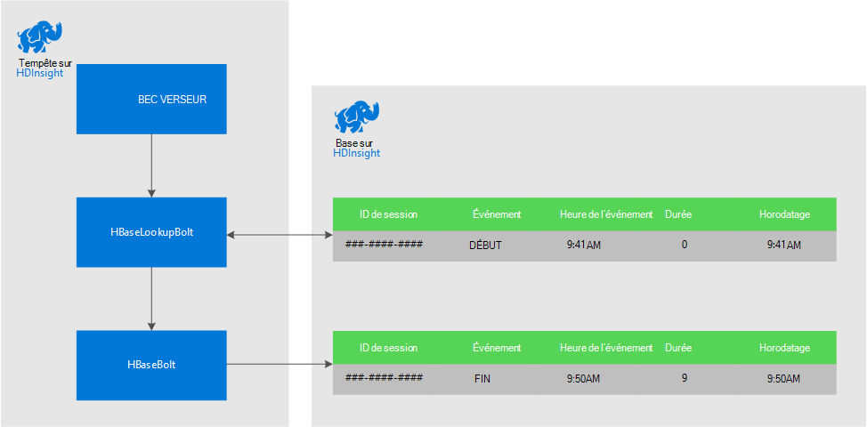
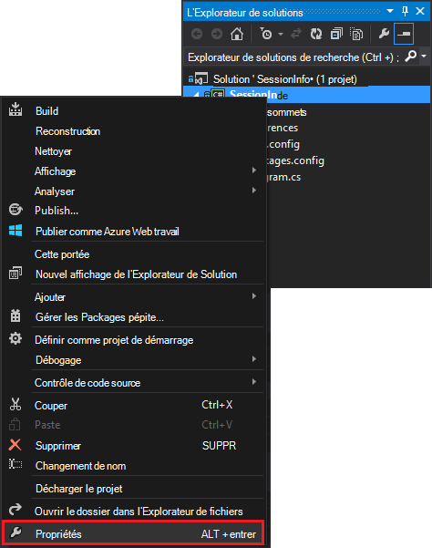
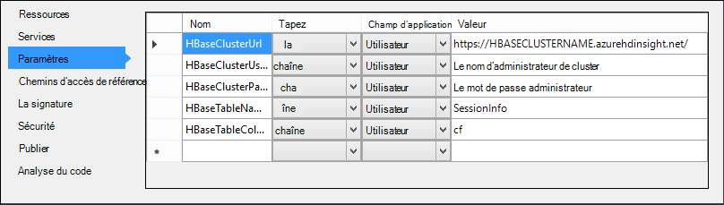

<properties
 pageTitle="Corrélation des événements dans le temps avec tempête et HBase sur HDInsight"
 description="Apprenez à mettre en corrélation les événements qui arrivent à des moments différents à l’aide de la tempête et HBase sur HDInsight."
 services="hdinsight"
 documentationCenter=""
 authors="Blackmist"
 manager="jhubbard"
 editor="cgronlun"
 tags="azure-portal"/>

<tags
 ms.service="hdinsight"
 ms.devlang="dotnet"
 ms.topic="article"
 ms.tgt_pltfrm="na"
 ms.workload="big-data"
 ms.date="10/27/2016"
 ms.author="larryfr"/>

# Corrélation des événements dans le temps avec tempête et HBase sur HDInsight

À l’aide d’un magasin de données permanentes avec Apache tempête, vous pouvez corréler les entrées de données qui arrivent à des moments différents. Par exemple, lier des événements de connexion et de déconnexion d’une session de l’utilisateur calculer combien de temps a une durée de la session.

Dans ce document, vous apprendrez comment créer une topologie de tempête C# de base qui effectue le suivi des événements de connexion et de déconnexion des sessions de l’utilisateur et calcule la durée de la session. La topologie utilise HBase comme un magasin de données permanentes. HBase vous permet également d’effectuer des requêtes par lots sur les données historiques pour produire des analyses supplémentaires, telles que le nombre de sessions utilisateur ont été démarré ou a pris fin au cours d’une période de temps spécifique.

## Conditions préalables

- Visual Studio et les outils de HDInsight pour Visual Studio : reportez-vous à la section [mise en route à l’aide des outils HDInsight pour Visual Studio](../HDInsight/hdinsight-hadoop-visual-studio-tools-get-started.md) pour l’installation.

- Tempête de Apache sur HDInsight de cluster (basé sur Windows). Cette commande exécute la topologie de la tempête, qui traite les données entrantes et la stocke dans HBase.

    > [AZURE.IMPORTANT] Alors que les topologies SCP.NET sont pris en charge sur les clusters basés sur Linux une tempête créés après le 28/10/2016, le SDK HBase pour le package .NET disponible à partir du 28/10/2016 ne fonctionne pas correctement sous Linux.

- HBase Apache sur cluster de HDInsight (Linux ou Windows). Il s’agit de la banque de données pour cet exemple.

## Architecture

Mise en corrélation des événements de requiert un identificateur courant pour la source d’événements. Par exemple, un ID d’utilisateur, ID de session ou autre élément de données qui sont un) unique et b) inclus dans toutes les données envoyées à la tempête. Cet exemple utilise une valeur GUID pour représenter un identificateur de session.

Cet exemple se compose de deux clusters de HDInsight :

-   HBase : stockage de données permanent les données d’historique

-   Storm : utilisé pour recevoir les données entrantes

Les données sont générées aléatoirement par la topologie de la tempête et se compose des éléments suivants :

-   ID de session : un GUID qui identifie de manière unique chaque session

-   : Un début ou fin d’événement. Pour cet exemple, démarrer se produit toujours avant la fin

-   : L’heure de l’événement.

Ces données sont traitées et stockées dans HBase.

### Topologie de tempête

Lorsqu’une session démarre, un événement de **début** est reçu par la topologie et connecté à HBase. Lorsqu’un événement de **fin** est reçu, la topologie récupère l’événement de **début** et calcule la durée entre les deux événements. Cette **durée de** valeur est alors stockée dans HBase ainsi que les informations d’événement de **fin** .

> [AZURE.IMPORTANT] Alors que cette topologie illustre le modèle de base, une solution de production doit effectuer la conception pour les scénarios suivants :
>
> - Événements arrivant de commande
> - Événements en double
> - Événements ignorés

L’exemple de topologie est composé des éléments suivants :

-   Session.cs : simule une session de l’utilisateur en créant un ID de session aléatoire, début, temps et combien de temps dure la session

-   Spout.cs : crée 100 sessions, émet un événement de début, attend le délai aléatoire pour chaque session et puis émet un événement de fin. Recyclages terminé pour générer de nouvelles sessions.

-   HBaseLookupBolt.cs : utilise l’ID de session pour rechercher des informations de session à partir de HBase. Lorsqu’un événement de fin est traité, elle détecte l’événement de début correspondant et calcule la durée de la session.

-   HBaseBolt.cs : Stocke les informations dans HBase.

-   TypeHelper.cs : Aide à la conversion de type lors de la lecture / écriture à HBase.

### Schéma de HBase

Dans HBase, les données sont stockées dans une table comportant les schéma/paramètres suivants :

-   Clé de ligne : la session ID est utilisé comme clé pour les lignes de la table

-   Famille de colonnes : le nom de famille est « cf ». Colonnes stockées dans cette famille sont les suivantes :

    -   événement : début ou fin

    -   temps : la durée en millisecondes pendant laquelle l’événement s’est produit

    -   Durée : la longueur entre les événements de début et de fin

-   VERSIONS : la famille 'cf' est définie pour conserver les 5 versions de chaque ligne.

    > [AZURE.NOTE] Les versions sont un journal des valeurs précédentes stocké une clé spécifique de ligne. Par défaut, HBase renvoie uniquement la valeur de la version la plus récente d’une ligne. Dans ce cas, la même ligne est utilisée pour tous les événements (début, fin.), que chaque version d’une ligne est identifiée par la valeur d’horodatage. Cela fournit une vue historique des événements consignés pour un ID spécifique.

## Télécharger le projet

L’exemple de projet peut être téléchargé à partir de [https://github.com/Azure-Samples/hdinsight-storm-dotnet-event-correlation](https://github.com/Azure-Samples/hdinsight-storm-dotnet-event-correlation).

Ce téléchargement contient les projets C# suivants :

-   CorrelationTopology : Topologie tempête C# qui émet au hasard des événements de début et de fin pour les sessions utilisateur. Chaque session dure entre 1 et 5 minutes.

-   SessionInfo : L’application de console C# qui crée la table HBase et fournit des exemples de requêtes pour renvoyer des informations sur stockées les données de session.

## Créer la table

1. Dans Visual Studio, ouvrez le projet **SessionInfo** .

2. Dans l' **Explorateur de solutions**, cliquez sur le projet **SessionInfo** et sélectionnez **Propriétés**.

    

3. Sélectionnez **paramètres**, puis définissez les valeurs suivantes :

    -   HBaseClusterURL : l’URL à votre cluster HBase. Par exemple, https://myhbasecluster.azurehdinsight.net

    -   HBaseClusterUserName : l’administrateur/utilisateur compte HTTP pour votre cluster

    -   HBaseClusterPassword : le mot de passe pour le compte d’utilisateur admin/HTTP

    -   HBaseTableName : le nom de la table à utiliser avec cet exemple

    -   HBaseTableColumnFamily : Le nom de famille de colonne

    

5. Exécutez la solution. Lorsque vous y êtes invité, sélectionnez la clé « c » pour créer la table sur votre cluster HBase.

## Générer et déployer la topologie d’orage

1.  Dans Visual Studio, ouvrez la solution **CorrelationTopology** .

2.  Dans l' **Explorateur de solutions**, cliquez avec le bouton droit sur le projet **CorrelationTopology** et sélectionnez Propriétés.

3.  Dans la fenêtre Propriétés, sélectionnez les **paramètres** et fournir les informations suivantes. Les 5 premiers doivent être les mêmes valeurs que celui utilisés par le projet **SessionInfo** :

    -   HBaseClusterURL : l’URL à votre cluster HBase. Par exemple, https://myhbasecluster.azurehdinsight.net

    -   HBaseClusterUserName : l’administrateur/utilisateur compte HTTP pour votre cluster

    -   HBaseClusterPassword : le mot de passe pour le compte d’utilisateur admin/HTTP

    -   HBaseTableName : le nom de la table à utiliser avec cet exemple. Ce groupe doit contenir le même nom de table que celui utilisé dans le projet SessionInfo

    -   HBaseTableColumnFamily : La colonne nom de famille. Ce groupe doit contenir le même nom de famille de colonne que celle utilisée dans le projet SessionInfo

    > [AZURE.IMPORTANT] Ne modifiez pas la HBaseTableColumnNames, comme les valeurs par défaut sont les noms utilisés par **SessionInfo** pour extraire des données.

4.  Enregistrer les propriétés, puis générez le projet.

5.  Dans l' **Explorateur de solutions**, cliquez avec le bouton droit sur le projet, puis sélectionnez **Envoyer à tempête sur HDInsight**. Si vous y êtes invité, entrez les informations d’identification pour votre abonnement Azure.

    

6.  Dans la boîte de dialogue **Envoyer une topologie** , sélectionnez le cluster tempête qui exécutera cette topologie.

    > [AZURE.NOTE] La première fois que vous soumettez une topologie, il peut prendre quelques secondes pour récupérer le nom de vos clusters HDInsight.

7.  Une fois la topologie a été téléchargée et présentée au cluster, la **Vue topologique de tempête** s’ouvre et affiche la topologie en cours d’exécution. Sélectionnez le **CorrelationTopology** et utilisez le bouton Actualiser en haut à droite de la page pour actualiser les informations de topologie.

    

    Lorsque la topologie commence à générer des données, la valeur de la colonne **EMISE** s’incrémente.

    > [AZURE.NOTE] Si l' **Affichage de la topologie tempête** ne s’ouvre pas automatiquement, procédez comme suit pour l’ouvrir :
    >
    > 1. Dans l' **Explorateur de solutions**, puis développez **Azure**et **HDInsight**.
    >
    > 2. Cliquez avec le bouton droit sur le cluster tempête fonctionnant sur la topologie et sélectionnez **Affichage bourrasque de Topologies**

## Les données de requête

Une fois que les données a été émises, procédez comme suit pour interroger les données.

1. Retournez sur le projet de **SessionInfo** . Si ne pas en cours d’exécution, démarrez une nouvelle instance de celui-ci.

2. Lorsque vous y êtes invité, sélectionnez **s** pour rechercher des événements de début. Vous serez invité à entrer une heure de début et de fin pour définir une plage de temps - seuls les événements entre ces deux heures seront retournés.

    Utilisez le format suivant lorsque vous entrez les heures de début et de fin : hh : mm et le « am » ou « pm ». Par exemple, 11 h 20.

    Dans la mesure où la topologie vient de démarrer, utilisez un début du temps d’avant qu’il a été déployé et une heure de fin de maintenant. Cela doit capturer la plupart des événements de démarrage qui ont été générés lors de son démarrage. Lorsque la requête s’exécute, vous devez voir une liste d’entrées semblables à la suivante :

        Session e6992b3e-79be-4991-afcf-5cb47dd1c81c started at 6/5/2015 6:10:15 PM. Timestamp = 1433527820737

Recherche d’événements de fin fonctionne comme des événements de début. Toutefois, les événements de fin sont générés de manière aléatoire entre 1 et 5 minutes après l’événement de démarrage. Ainsi, il se peut que vous deviez essayer plusieurs plages de temps pour trouver les événements de fin. Événements de fin contient également la durée de la session - la différence entre l’événement heure début et heure fin de l’événement. Voici un exemple de données pour les événements de fin :

    Session fc9fa8e6-6892-4073-93b3-a587040d892e lasted 2 minutes, and ended at 6/5/2015 6:12:15 PM

> [AZURE.NOTE] Lorsque vous entrez les valeurs d’heure sont en heure locale, l’heure retournée par la requête seront UTC.

##Arrêter la topologie

Lorsque vous êtes prêt à arrêter la topologie, retournez au projet dans Visual Studio **CorrelationTopology** . Dans la **Vue topologique de tempête**, sélectionnez la topologie et utilisez le bouton **Supprimer** en haut de l’affichage de la topologie.

##Supprimer de votre cluster.

[AZURE.INCLUDE [delete-cluster-warning](../../includes/hdinsight-delete-cluster-warning.md)]

##Étapes suivantes

Pour obtenir d’autres exemples de tempête, consultez [exemples de topologies pour tempête sur HDInsight](hdinsight-storm-example-topology.md).
 
