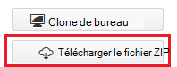
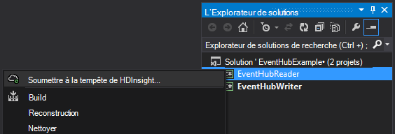
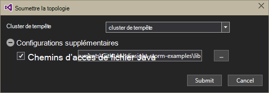
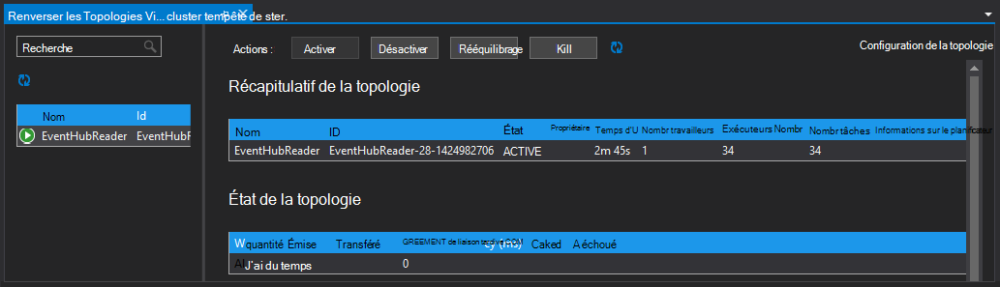

<properties
   pageTitle="Traiter les événements de concentrateurs d’événement avec la tempête sur HDInsight | Microsoft Azure"
   description="Découvrez comment traiter les données d’événement concentrateurs avec une topologie de tempête C# créée dans Visual Studio à l’aide des outils HDInsight pour Visual Studio."
   services="hdinsight,notification hubs"
   documentationCenter=""
   authors="Blackmist"
   manager="jhubbard"
   editor="cgronlun"/>

<tags
   ms.service="hdinsight"
   ms.devlang="dotnet"
   ms.topic="article"
   ms.tgt_pltfrm="na"
   ms.workload="big-data"
   ms.date="10/27/2016"
   ms.author="larryfr"/>

# Traiter les événements de concentrateurs d’événement Azure avec tempête sur HDInsight (C#)

Azure concentrateurs d’événements vous permet de traiter des volumes considérables de données à partir de sites Web, des applications et des périphériques. Bec de concentrateurs d’événement rend facile à utiliser Apache tempête sur HDInsight pour analyser ces données en temps réel. Vous pouvez également écrire des données à des concentrateurs d’événement à partir de la tempête à l’aide du boulon de concentrateurs de l’événement.

Dans ce didacticiel, vous allez apprendre à utiliser les modèles Visual Studio installés avec les outils de HDInsight pour Visual Studio pour créer des topologies qui fonctionnent avec les concentrateurs d’événement Azure.

* **EventHubWriter**: génère des données au hasard et l’écrit dans les concentrateurs d’événement

* **EventHubReader**: lit les données d’événement concentrateurs et enregistre les données dans les journaux de tempête

> [AZURE.NOTE] Tandis que les étapes décrites dans ce document se basent sur un environnement de développement Windows avec Visual Studio, le projet compilé peut être soumis à un cluster d’un HDInsight de fonctionnant sous Windows ou Linux. Ne clusters basés sur Linux créés après le 28/10/2016 prise en charge de topologies SCP.NET.
>
> Pour utiliser une topologie C# avec un cluster Linux, vous devez mettre à jour le package NuGet de Microsoft.SCP.Net.SDK utilisé par votre projet vers la version 0.10.0.6 ou ultérieure. La version du package doit correspondre également à la version principale de la tempête installé sur HDInsight. Par exemple, tempête sur HDInsight les versions 3.3 et 3.4 utiliser tempête 0.10.x, tandis que HDInsight 3.5 utilise tempête 1.0.x.
> 
> Topologies C# sur les clusters basés sur Linux doivent utiliser .NET 4.5 et Mono permet d’exécuter sur le cluster de HDInsight. La plupart des choses fonctionnent, cependant, vous devez vérifier la [Compatibilité de Mono](http://www.mono-project.com/docs/about-mono/compatibility/) document pour identifier les éventuelles incompatibilités.
>
> Pour obtenir une version Java de ce projet, qui fonctionne également sur un cluster basé sur Windows ou Linux, consultez [événements de processus de concentrateurs d’événement Azure avec tempête sur HDInsight (Java)](hdinsight-storm-develop-java-event-hub-topology.md).

## Conditions préalables

* Une [Tempête d’Apache sur cluster de HDInsight](hdinsight-apache-storm-tutorial-get-started.md)

* Un [concentrateur d’événements Azure](../event-hubs/event-hubs-csharp-ephcs-getstarted.md)

* Le [Kit de développement .NET Azure](http://azure.microsoft.com/downloads/)

* Les [Outils de HDInsight pour Visual Studio](hdinsight-hadoop-visual-studio-tools-get-started.md)

## Projet terminé

Vous pouvez télécharger une version complète du projet créé dans ce didacticiel à partir de GitHub : [eventhub-tempête-hybride](https://github.com/Azure-Samples/hdinsight-dotnet-java-storm-eventhub). Toutefois, vous devez fournir les paramètres de configuration en suivant les étapes de ce didacticiel.

## Boulon et bec de concentrateurs d’événement

Les concentrateurs d’événement bec et boulon sont les composants Java qui vous permettent de travailler facilement avec les concentrateurs d’événement à partir d’Apache tempête. Bien que ces composants sont écrits en Java, les outils de HDInsight pour Visual Studio permettent de créer des topologies hybrides qui combinent les composants Java et C#.

Le bec et le boulon sont distribués sous la forme d’un fichier .jar (archive) Java nommé **eventhubs-storm-spout-#.#-jar-with-dependencies.jar**, où #. # est la version du fichier.

### Téléchargez le fichier .jar

La version la plus récente du fichier jar est incluse dans le projet [HDInsight tempête exemples](https://github.com/hdinsight/hdinsight-storm-examples) sous le dossier des **lib/eventhubs** . Pour télécharger le fichier, utilisez une des méthodes suivantes.

> [AZURE.NOTE] Le bec et boulon ont été introduites pour inclusion dans le projet de tempête d’Apache. Pour plus d’informations, consultez [583 STORM : initiale archiver pour des moyeux de tempête-événement](https://github.com/apache/storm/pull/336/files) dans GitHub.

* **Télécharger un fichier ZIP**: à partir du site [HDInsight tempête exemples](https://github.com/hdinsight/hdinsight-storm-examples) , sélectionnez **ZIP de téléchargement** dans le volet droit de télécharger un fichier .zip qui contient le projet.

    

    Une fois que le fichier est téléchargé, vous pouvez extraire l’archive et le fichier se trouve dans le répertoire **lib** .

* **Clone le projet**: Si vous avez installé le [Git](http://git-scm.com/) , utilisez la commande suivante pour cloner le référentiel localement, puis rechercher le fichier dans le répertoire **lib** .

        git clone https://github.com/hdinsight/hdinsight-storm-examples

## Configuration des concentrateurs de l’événement

Concentrateurs de l’événement est la source de données pour cet exemple. Utilisez les informations dans la section __créer un concentrateur d’événements__ du document [mise en route de concentrateurs de l’événement](../event-hubs/event-hubs-csharp-ephcs-getstarted.md) .

3. Une fois que le concentrateur d’événements a été créé, afficher la lame de EventHub dans le portail Azure et sélectionnez les __stratégies à l’accès partagé__. L’entrée __+ Ajouter__ permet d’ajouter les stratégies suivantes :

  	| Nom | Autorisations |
  	| ----- | ----- |
  	| writer | Envoyer |
  	| lecteur | Écouter |

    

5. Sélectionnez les __lecteur__ et __writer__ de stratégies. Copier et d’enregistrer la valeur de __Clé primaire__ pour les deux stratégies, elles seront utilisées ultérieurement.

## Configurer la EventHubWriter

1. Si vous n’avez pas déjà installé la dernière version des outils HDInsight pour Visual Studio, reportez-vous à la section [mise en route à l’aide des outils HDInsight pour Visual Studio](hdinsight-hadoop-visual-studio-tools-get-started.md).

2. Téléchargement de la solution de [eventhub-tempête-hybride](https://github.com/Azure-Samples/hdinsight-dotnet-java-storm-eventhub). Ouvrez la solution et prendre un certain temps pour examiner le code pour le projet __EventHubWriter__ .

4. Dans le projet __EventHubWriter__ , ouvrez le fichier __App.config__ . Utilisez les informations du concentrateur d’événement que vous avez configurée précédemment pour renseigner la valeur pour les clés suivantes :

  	| Clé | Valeur |
  	| ----- | ----- |
  	| EventHubPolicyName | Rédacteur (si vous avez utilisé un nom différent pour la stratégie avec l’autorisation _Envoyer_ , utilisez-le à la place.) |
  	| EventHubPolicyKey | La clé de la stratégie de writer |
  	| EventHubNamespace | L’espace de noms qui contient votre concentrateur d’événements |
  	| EventHubName | Nom de votre événement concentrateur |
  	| EventHubPartitionCount | Le nombre de partitions dans votre concentrateur d’événements |

4. Enregistrez et fermez le fichier **App.config** .

## Configurer la EventHubReader

1. Ouvrez le projet __EventHubReader__ et momoents quelques pour examiner le code.

2. Ouvrir l' __App.config__ pour __EventHubWriter__. Utilisez les informations du concentrateur d’événement que vous avez configurée précédemment pour renseigner la valeur pour les clés suivantes :

  	| Clé | Valeur |
  	| ----- | ----- |
  	| EventHubPolicyName | lecteur (si vous avez utilisé un nom différent pour la stratégie avec l’autorisation _d’écouter_ , utilisez-le à la place.) |
  	| EventHubPolicyKey | La clé de la stratégie de lecture |
  	| EventHubNamespace | L’espace de noms qui contient votre concentrateur d’événements |
  	| EventHubName | Nom de votre événement concentrateur |
  	| EventHubPartitionCount | Le nombre de partitions dans votre concentrateur d’événements |

3. Enregistrez et fermez le fichier **App.config** .

## Déployer les topologies

1. À partir **L’Explorateur de solutions**, droit sur le projet **EventHubReader** et sélectionnez **Envoyer à tempête sur HDInsight**.

    

2. Sur l’écran de **Soumettre la topologie** , sélectionnez votre **Cluster de tempête**. Développer les **Configurations supplémentaires** **Des chemins de fichiers Java**, sélectionnez **...** et sélectionnez le répertoire qui contient le fichier **eventhubs-storm-spout-0.9-jar-with-dependencies.jar** que vous avez téléchargé précédemment. Enfin, cliquez sur **Envoyer**.

    

3. Lorsque la topologie a été soumise, la **Tempête Topologies Viewer** s’affiche. Sélectionnez la topologie **EventHubReader** dans le volet gauche pour afficher les statistiques de la topologie. Actuellement, rien ne doit pas se produire car aucun événement n’ont été écrites à des concentrateurs d’événements encore.

    

4. À partir **L’Explorateur de solutions**, droit sur le projet **EventHubWriter** et sélectionnez **Envoyer à tempête sur HDInsight**.

2. Sur l’écran de **Soumettre la topologie** , sélectionnez votre **Cluster de tempête**. Développer les **Configurations supplémentaires** **Des chemins de fichiers Java**, sélectionnez **...** et sélectionnez le répertoire qui contient le fichier **eventhubs-storm-spout-0.9-jar-with-dependencies.jar** que vous avez téléchargé précédemment. Enfin, cliquez sur **Envoyer**.

5. Lorsque la topologie a été soumise, actualiser la liste de topologie dans la **Visionneuse de Topologies de Storm** pour vérifier que les deux topologies sont exécutés sur le cluster.

6. Dans la **Visionneuse de Topologies de tempête**, sélectionnez la topologie **EventHubReader** .

4. Dans la vue graphique, double-cliquez sur le composant __LogBolt__ . Ceci ouvrira la page de __Résumé__ pour le boulon.

3. Dans la section __les exécuteurs__ , sélectionnez un des liens dans la colonne __Port__ . Cela affichera des informations consignées par le composant. Les informations enregistrées sont semblables à la suivante :

        2016-10-20 13:26:44.186 m.s.s.b.ScpNetBolt [INFO] Processing tuple: source: com.microsoft.eventhubs.spout.EventHubSpout:7, stream: default, id: {5769732396213255808=520853934697489134}, [{"deviceId":3,"deviceValue":1379915540}]
        2016-10-20 13:26:44.234 m.s.s.b.ScpNetBolt [INFO] Processing tuple: source: com.microsoft.eventhubs.spout.EventHubSpout:7, stream: default, id: {7154038361491319965=4543766486572976404}, [{"deviceId":3,"deviceValue":459399321}]
        2016-10-20 13:26:44.335 m.s.s.b.ScpNetBolt [INFO] Processing tuple: source: com.microsoft.eventhubs.spout.EventHubSpout:6, stream: default, id: {513308780877039680=-7571211415704099042}, [{"deviceId":5,"deviceValue":845561159}]
        2016-10-20 13:26:44.445 m.s.s.b.ScpNetBolt [INFO] Processing tuple: source: com.microsoft.eventhubs.spout.EventHubSpout:7, stream: default, id: {-2409895457033895206=5479027861202203517}, [{"deviceId":8,"deviceValue":2105860655}]

## Arrêter les topologies

Pour arrêter les topologies, sélectionnez chaque topologie dans la **Visionneuse de topologie de tempête**, puis cliquez sur **Supprimer**.

## Supprimer de votre cluster.

[AZURE.INCLUDE [delete-cluster-warning](../../includes/hdinsight-delete-cluster-warning.md)]

## Notes

### Script de vérification

Le EventHubSpout les points de contrôle son état pour le nœud de soigneur, qui enregistre le décalage en cours pour les messages lire régulièrement à partir de la file d’attente. Ainsi, le composant recevoir des messages à l’offset enregistré dans les scénarios suivants :

* L’instance de composant échoue et est redémarrée.

* Vous développer ou réduisez le cluster en ajoutant ou en supprimant des nœuds.

* La topologie est mis à mort et redémarré **avec le même nom**.

Vous pouvez également exporter et importer les points de contrôle persistants à WASB (le stockage Azure utilisé par votre cluster HDInsight). Les scripts pour cela sont situés sur la tempête sur cluster de HDInsight, à **c:\apps\dist\storm-0.9.3.2.2.1.0-2340\zkdatatool-1.0\bin**.

>[AZURE.NOTE] Le numéro de version dans le chemin d’accès peut être différent, comme la version de Storm installé sur le cluster peut changer à l’avenir.

Les scripts dans ce répertoire sont les suivants :

* **stormmeta_import.cmd**: importer toutes les métadonnées de tempête à partir du conteneur de stockage de cluster par défaut dans soigneur.

* **stormmeta_export.cmd**: exporter toutes les métadonnées de tempête de soigneur pour le conteneur de stockage de cluster par défaut.

* **stormmeta_delete.cmd**: supprimer toutes les métadonnées de tempête à partir de soigneur.

Exportation de qu'une importation vous permet de faire persister les données de point de contrôle lorsque vous devez supprimer le cluster, mais souhaitez reprendre le traitement à partir de l’offset actuel dans le concentrateur lorsque vous mettez un nouveau cluster en ligne.

> [AZURE.NOTE] Dans la mesure où les données sont persistantes pour le conteneur de stockage par défaut, le de cluster nouveau **doivent** utiliser le même compte de stockage et le conteneur que le cluster précédent.

## Étapes suivantes

Dans ce document, vous avez appris comment utiliser Java événement concentrateurs bec et boulon d’une topologie de C# pour travailler avec des données dans le concentrateur d’événements Azure. Pour en savoir plus sur la création de topologies de C#, consultez les rubriques suivantes.

* [Développer des topologies de C# pour tempête Apache sur HDInsight à l’aide de Visual Studio](hdinsight-storm-develop-csharp-visual-studio-topology.md)

* [Guide de programmation SCP](hdinsight-storm-scp-programming-guide.md)

* [Exemples de topologies pour tempête sur HDInsight](hdinsight-storm-example-topology.md)
 
