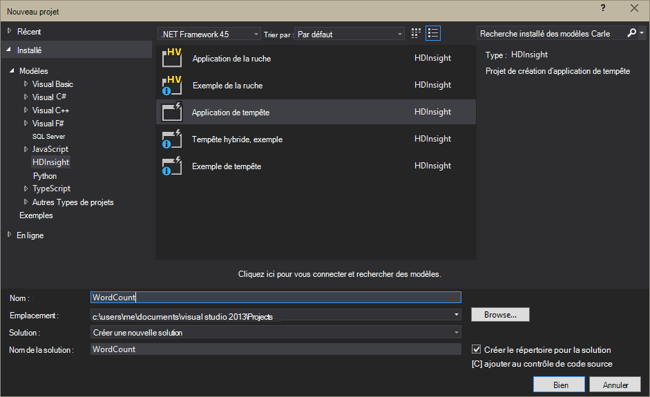

<properties
    pageTitle="Introduction à la tempête Apache sur HDInsight | Microsoft Azure"
    description="Introduction à Apache tempête et découvrez comment vous pouvez utiliser la tempête sur HDInsight pour créer des solutions d’analytique de données en temps réel dans le nuage."
    services="hdinsight"
    documentationCenter=""
    authors="Blackmist"
    manager="jhubbard"
    editor="cgronlun"
    tags="azure-portal"/>

<tags
   ms.service="hdinsight"
   ms.devlang="na"
   ms.topic="get-started-article"
   ms.tgt_pltfrm="na"
   ms.workload="big-data"
   ms.date="10/11/2016"
   ms.author="larryfr"/>

#Introduction à la tempête Apache sur HDInsight : analytique en temps réel pour Hadoop

Vous permet de créer des solutions d’analytique distribuée, en temps réel dans l’environnement Azure à l’aide de [Apache Hadoop](http://hadoop.apache.org)permet de tempête Apache sur HDInsight.

##Quelle est la tempête de Apache ?

Tempête de Apache est un système de calcul distribué, à tolérance de pannes, open source qui permet de traiter les données en temps réel avec Hadoop. Tempête peut proposent également garanti de traitement des données, avec la possibilité de relire les données qui n’a pas été traitées de la première fois.

##Pourquoi utiliser tempête sur HDInsight ?

Tempête de Apache sur HDInsight est un cluster managé intégré dans l’environnement Azure. Il offre les avantages suivants :

* Exécute un service géré avec un contrat SLA de 99,9 % le temps

* Utiliser la langue de votre choix : prend en charge les composants de tempête écrits en **Java**, **C#**et **Python**

    * Prend en charge d’un mélange de langages de programmation : lire des données à l’aide de Java, puis les traiter à l’aide de C#
    
        > [AZURE.NOTE] Topologies de C# sont uniquement pris en charge sur les clusters basés sur Windows de HDInsight.

    * Utilisez l’interface Java de **Trident** créer des topologies de tempête qui prennent en charge les « une seule fois » traitement des messages, de persistance du magasin de données « transactionnel » et d’un ensemble d’opérations d’analytique flux courant

* Comprend des fonctionnalités intégrées d’échelle et réduction : faire évoluer un cluster HDInsight sans impact à l’exécution de topologies de tempête

* Intégration avec d’autres services Azure, y compris le concentrateur d’événements réseau virtuel d’Azure, SQL de base de données, stockage des objets Blob et DocumentDB

    * Combiner les fonctionnalités de plusieurs clusters de HDInsight à l’aide de réseau virtuel d’Azure : créer des pipelines analytiques qui utilisent des clusters Hadoop, HBase ou HDInsight

Pour une liste de sociétés qui sont à l’aide de Apache Storm pour leurs solutions d’analytique en temps réel, consultez [Tempête de Apache à l’aide de sociétés](https://storm.apache.org/documentation/Powered-By.html).

Pour démarrer à l’aide de la tempête, reportez-vous à la section [mise en route de la tempête sur HDInsight][gettingstarted].

###Facilité de provisionnement

Vous pouvez prévoir une bourrasque de nouveau sur cluster de HDInsight en quelques minutes. Spécifiez le nom du cluster, taille, compte d’administrateur et le compte de stockage. Azure créera le cluster, y compris des exemples de topologies et un tableau de bord de gestion web.

> [AZURE.NOTE] Vous pouvez également prévoir des clusters de tempête à l’aide de la [CLI d’Azure](../xplat-cli-install.md) ou [Azure PowerShell](../powershell-install-configure.md).

En 15 minutes de la soumission de la demande, vous aura un nouveau cluster tempête en cours d’exécution et prêt pour votre premier pipeline d’analytique en temps réel.

###Facilité d’utilisation

__Tempête de base pour Linux sur les clusters de HDInsight__, vous pouvez vous connecter au cluster à l’aide de SSH et utilisation de la `storm` commande pour démarrer et gérer les topologies. En outre, vous pouvez utiliser Ambari pour surveiller le service tempête et l’interface utilisateur de Storm pour surveiller et gérer des topologies en cours d’exécution.

Pour plus d’informations sur l’utilisation des clusters de tempête de basé sur Linux, consultez [mise en route de tempête Apache sur HDInsight de fonctionnant sous Linux](hdinsight-apache-storm-tutorial-get-started-linux.md).

__Tempête de base pour Windows sur les clusters de HDInsight__, les outils de HDInsight pour Visual Studio permettent de créer C# et hybride C# / topologies de Java et pour les envoyer à votre tempête sur cluster de HDInsight.  

Outils d’HDInsight pour Visual Studio fournit également une interface qui permet de surveiller et de gérer des topologies de tempête sur un cluster.

Pour obtenir un exemple de l’utilisation des outils HDInsight pour créer une application de tempête, consultez [topologies de développement C# tempête avec les outils de HDInsight pour Visual Studio](hdinsight-storm-develop-csharp-visual-studio-topology.md).

Pour plus d’informations sur les outils HDInsight pour Visual Studio, consultez [mise en route à l’aide des outils HDInsight pour Visual Studio](../HDInsight/hdinsight-hadoop-visual-studio-tools-get-started.md).

Chaque tempête sur cluster de HDInsight fournit également une bourrasque de tableau de bord web qui vous permet d’envoyer, de surveiller et de gérer des topologies de tempête s’exécutant sur le cluster.

Pour plus d’informations sur l’utilisation du tableau de bord de tempête, consultez [déployer et gérer des topologies de tempête de Apache sur HDInsight](hdinsight-storm-deploy-monitor-topology.md).

Tempête de HDInsight fournit également une intégration facile avec les concentrateurs d’événement Azure via l' **Événement bec de concentrateur**. La version la plus récente de ce composant est disponible à l’adresse [https://github.com/hdinsight/hdinsight-storm-examples/tree/master/lib/eventhubs](https://github.com/hdinsight/hdinsight-storm-examples/tree/master/lib/eventhubs). Pour plus d’informations sur l’utilisation de ce composant, consultez les documents suivants.

* [Développer une topologie C# qui utilise les concentrateurs d’événement Azure](hdinsight-storm-develop-csharp-event-hub-topology.md)

* [Développer une topologie Java qui utilise des concentrateurs d’événement Azure](hdinsight-storm-develop-java-event-hub-topology.md)

###Fiabilité

Tempête de Apache garantit toujours que chaque message entrant sera entièrement traité, même lorsque l’analyse de données est répartie sur des centaines de nœuds.

Le **nœud de Nimbus** fournit des fonctionnalités semblables à la Hadoop JobTracker, et il affecte des tâches à d’autres nœuds du cluster via **soigneur**. Nœuds de soigneur une coordination pour le cluster et facilitent la communication entre Nimbus et le processus de **superviseur** sur les nœuds du travailleur. Si un nœud de traitement tombe en panne, le nœud Nimbus est informé et elle affecte la tâche et les données associées à un autre nœud.

La configuration par défaut pour Apache tempête est d’avoir un seul nœud Nimbus. Tempête sur HDInsight exécute deux nœuds Nimbus. Si le nœud principal tombe en panne, le cluster HDInsight bascule vers le nœud secondaire tandis que le nœud principal est récupéré.

###Échelle

Vous pouvez spécifier le nombre de nœuds dans votre cluster lors de la création, vous souhaiterez peut-être agrandir ou réduire le cluster afin de correspondre à la charge de travail. Tous les clusters HDInsight permettent de modifier le nombre de nœuds dans le cluster, même lors du traitement des données.

> [AZURE.NOTE] Pour tirer parti des nouveaux nœuds ajoutés via la mise à l’échelle, vous devrez rééquilibrer les topologies démarrés avant que la taille de cluster a été augmentée.

###Prise en charge

Tempête de HDInsight est fourni avec la prise en charge complète de niveau entreprise 24 x 7. Tempête de HDInsight a également un SLA de 99,9 %. Cela signifie que nous garantit que le cluster ait connectivité externe au moins 99,9 % du temps.

##Scénarios d’utilisation courants pour analytique en temps réel

Voici quelques scénarios courants, pour lesquels vous pouvez utiliser tempête de Apache sur HDInsight. Pour plus d’informations sur des scénarios concrets, lisez [comment les entreprises utilisent tempête](https://storm.apache.org/documentation/Powered-By.html).

* Internet des objets (IoT)
* Détection des fraudes
* Analytique social
* Extraire, de transformer, de chargement (ETL)
* Surveillance du réseau
* Recherche
* Engagement mobile

##Mode de traitement de données dans une tempête de HDInsight ?

Tempête de Apache s’exécute au lieu des travaux MapReduce que vous connaissez dans HDInsight ou Hadoop peut-être les **topologies** . Une bourrasque de HDInsight cluster contient deux types de nœuds : tête de nœuds exécutant **Nimbus** et travailleur nœuds exécutant le **maître d’oeuvre**.

* **Nimbus**: similaire à la JobTracker de Hadoop, il est responsable de la distribution de code dans l’ensemble du cluster, affecter les tâches aux machines virtuelles et la surveillance de l’échec. HDInsight fournit deux nœuds Nimbus, afin qu’il n’y a aucun point unique de défaillance pour tempête sur HDInsight

* **Maître d’oeuvre**: le maître d’oeuvre pour chaque nœud du travailleur est responsable pour le démarrage et l’arrêt des **processus de travail** sur le nœud.

* **Processus de travail**: exécute un sous-ensemble d’une **topologie**. Une topologie en cours d’exécution est répartie entre plusieurs processus de travail dans l’ensemble du cluster.

* **Topologie**: définit un graphique de calcul qui traite les **flux** de données. Contrairement aux travaux de MapReduce, topologies de s’exécuter jusqu'à ce que vous les arrêtez.

* **Flux de données**: un ensemble indépendant de **tuples**. Les flux sont produites par **des becs verseurs amovibles** et **boulons**, et elles sont consommées par **boulons**.

* **Tuple**: une liste nommée des valeurs typées dynamiquement.

* **BEC VERSEUR**: utilise des données à partir d’une source de données et émet un ou plusieurs **flux de données**.

    > [AZURE.NOTE] Dans de nombreux cas, les données sont lues à partir d’une file d’attente, Kafka, files d’attente du Bus des services Azure ou concentrateurs de l’événement. La file d’attente permet de s’assurer que les données sont rendues persistantes s’il y a une panne.

* **Boulon**: consomme le **flux de données**, effectue le traitement sur des **tuples**et peuvent émettre des **flux de données**. Les boulons sont également responsables de l’écriture de données dans la mémoire de stockage externe, comme une file d’attente, HDInsight, HBase, un blob ou autre magasin de données.

* **Apache Thrift**: une infrastructure de logiciel pour le développement d’évolutive des services multilingues. Il vous permet de vous permet de créer des services qui fonctionnent entre le C++, Java, Python, PHP, Ruby, argument, Perl, Haskell, C#, cacao, JavaScript, Node.js, Smalltalk et autres langues.

    * **Nimbus** est un service Thrift et une **topologie** est une définition Thrift, il est possible de développer des topologies à l’aide d’une variété de langages de programmation.

Pour plus d’informations sur les composants de la tempête, consultez le [didacticiel de tempête] [ apachetutorial] sur le site apache.org.

##Les langages de programmation puis-je utiliser ?

La tempête sur HDInsight cluster prend en charge C#, Java et Python.

### C & #35 ;

Les outils de HDInsight pour Visual Studio permettent aux développeurs .NET de concevoir et d’implémenter une topologie dans C#. Vous pouvez également créer des topologies hybrides qui utilisent des composants Java et C#.

Pour plus d’informations, consultez [développement C# topologies de tempête Apache sur HDInsight à l’aide de Visual Studio](hdinsight-storm-develop-csharp-visual-studio-topology.md).

###Java

La plupart des exemples Java que vous rencontrez sera Java ordinaire ou Trident. Trident est une abstraction de haut niveau qui le rend plus facile à faire des choses telles que les jointures, les agrégations, de regroupement et de filtrage. Toutefois, Trident agit sur les lots de tuples, considérant qu’une solution Java brute traite un tuple d’un flux de données à la fois.

Pour plus d’informations sur Trident, consultez le [didacticiel de Trident](https://storm.apache.org/documentation/Trident-tutorial.html) sur le site apache.org.

Pour obtenir des exemples de topologies de Java et de Trident, consultez la [liste des exemples de topologies de tempête](hdinsight-storm-example-topology.md) ou les exemples de tempête-starter sur votre cluster de HDInsight.

Les exemples de tempête-starter sont situés dans le répertoire __/usr/hdp/current/storm-client/contrib/storm-starter__ sur les clusters basés sur Linux et le répertoire **%storm_home%\contrib\storm-starter** sur les clusters basés sur Windows.

##Que sont des modèles de développement communs ?

###Traitement des messages garantie

Tempête peut fournir différents niveaux de traitement de message garantie. Par exemple, une application de base tempête peut garantir le traitement d’au moins une et Trident peut garantit-traitement qu’une seule fois.

Pour plus d’informations, consultez les [garanties sur le traitement des données](https://storm.apache.org/about/guarantees-data-processing.html) sur le site apache.org.

###IBasicBolt

Le modèle de lecture d’un tuple d’entrée, émission de zéro ou plusieurs tuples, puis acking le tuple d’entrée immédiatement à la fin de la méthode execute est très courant et tempête fournit l’interface [IBasicBolt](https://storm.apache.org/apidocs/backtype/storm/topology/IBasicBolt.html) pour automatiser ce modèle.

###Jointures

Jonction de deux flux de données peut varier entre les applications. Par exemple, vous pouvez joindre chaque tuple à partir de plusieurs flux de données dans un nouveau flux de données, ou vous pouvez joindre uniquement les lots de tuples pour une fenêtre spécifique. Dans les deux cas, joindre est possible à l’aide de [fieldsGrouping](http://javadox.com/org.apache.storm/storm-core/0.9.1-incubating/backtype/storm/topology/InputDeclarer.html#fieldsGrouping%28java.lang.String,%20backtype.storm.tuple.Fields%29), qui est une manière de définir comment les tuples sont routées vers les boulons.

Dans l’exemple Java suivant, fieldsGrouping est utilisé pour router les tuples qui proviennent de composants « 1 », « 2 » et « 3 » pour le boulon de **MyJoiner** .

    builder.setBolt("join", new MyJoiner(), parallelism) .fieldsGrouping("1", new Fields("joinfield1", "joinfield2")) .fieldsGrouping("2", new Fields("joinfield1", "joinfield2")) .fieldsGrouping("3", new Fields("joinfield1", "joinfield2"));

###Le traitement par lots

Le traitement par lots peut être accompli plusieurs façons. Avec une topologie tempête Java de base, vous pourriez utiliser un compteur simple au numéro de lot X de tuples avant leur émission ou utiliser un mécanisme de minutage interne appelé un tuple « graduation » pour émettre un lot toutes les X secondes.

Pour obtenir un exemple d’utilisation de tuples de graduation, consultez [analyse des données de capteur avec tempête et HBase sur HDInsight](hdinsight-storm-sensor-data-analysis.md).

Si vous utilisez Trident, il est basé sur le traitement de lots de tuples.

###La mise en cache

La mise en cache en mémoire est souvent utilisée comme un mécanisme pour accélérer le traitement, car elle conserve fréquemment utilisé des actifs en mémoire. Car une topologie est distribuée sur plusieurs nœuds et que plusieurs processus au sein de chaque nœud, vous devez envisager d’utiliser [fieldsGrouping](http://javadox.com/org.apache.storm/storm-core/0.9.1-incubating/backtype/storm/topology/InputDeclarer.html#fieldsGrouping%28java.lang.String,%20backtype.storm.tuple.Fields%29) pour vous assurer que les tuples qui contient les champs qui sont utilisés pour la recherche de cache sont toujours routées vers le même processus. Cela permet d’éviter la duplication des entrées du cache entre les processus.

###N premiers de diffusion en continu

Lorsque votre topologie dépend du calcul d’une valeur de « top N », comme les 5 tendances sur Twitter, vous devez calculer la valeur top N en parallèle et puis fusionner les résultats de ces calculs en une valeur globale. Pour ce faire, vous pouvez à l’aide de [fieldsGrouping](http://javadox.com/org.apache.storm/storm-core/0.9.1-incubating/backtype/storm/topology/InputDeclarer.html#fieldsGrouping%28java.lang.String,%20backtype.storm.tuple.Fields%29) et itinéraire par champ pour les boulons parallèles (qui partitionne les données par valeur de champ), puis itinéraire en un boulon qui globalement détermine la valeur top N.

Pour obtenir un exemple, consultez l’exemple de [RollingTopWords](https://github.com/nathanmarz/storm-starter/blob/master/src/jvm/storm/starter/RollingTopWords.java) .

##Quel type de consignation renverser utilisation ?

Tempête utilise Apache Log4j pour enregistrer des informations. Par défaut, une grande quantité de données est consignée, et il peut être difficile à trier les informations. Vous pouvez inclure un fichier de configuration de la journalisation dans le cadre de votre topologie de Storm pour contrôler l’enregistrement de comportement.

Pour un exemple de topologie qui montre comment configurer la journalisation, consultez [basée sur Java de WordCount](hdinsight-storm-develop-java-topology.md) exemple de tempête sur HDInsight.

##Étapes suivantes

Pour en savoir plus sur les solutions d’analytique en temps réel avec la tempête Apache dans HDInsight :

* [Mise en route de la tempête sur HDInsight][gettingstarted]

* [Exemples de topologies pour tempête sur HDInsight](hdinsight-storm-example-topology.md)

[stormtrident]: https://storm.apache.org/documentation/Trident-API-Overview.html
[samoa]: http://yahooeng.tumblr.com/post/65453012905/introducing-samoa-an-open-source-platform-for-mining
[apachetutorial]: https://storm.apache.org/documentation/Tutorial.html
[gettingstarted]: hdinsight-apache-storm-tutorial-get-started-linux.md
