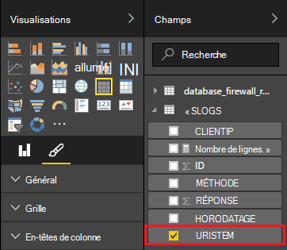

<properties
 pageTitle="Utilisez Apache tempête avec alimentation BI | Microsoft Azure"
 description="Créer un rapport de puissance BI à l’aide des données d’une topologie de C# s’exécutant sur un cluster Apache tempête dans HDInsight."
 services="hdinsight"
 documentationCenter=""
 authors="Blackmist"
 manager="jhubbard"
 editor="cgronlun"
    tags="azure-portal"/>

<tags
 ms.service="hdinsight"
 ms.devlang="dotnet"
 ms.topic="article"
 ms.tgt_pltfrm="na"
 ms.workload="big-data"
 ms.date="10/27/2016"
 ms.author="larryfr"/>

# Permet de visualiser des données à partir d’une topologie de Apache tempête BI de puissance

Alimentation BI vous permet d’afficher visuellement les données sous forme de rapports. Avec les modèles Visual Studio pour tempête sur HDInsight, vous pouvez facilement utiliser le magasin de données à partir d’une topologie en cours d’exécution sur une vague d’Apache sur cluster de HDInsight dans SQL Azure et ensuite visualiser les données à l’aide de BI de puissance.

Dans ce document, vous allez apprendre à utiliser la puissance BI pour créer un rapport à partir de données générées par une topologie Apache tempête et stockées dans la base de données de SQL Azure.

> [AZURE.NOTE] Tandis que les étapes décrites dans ce document se basent sur un environnement de développement Windows avec Visual Studio, le projet compilé peut être soumis à un cluster d’un HDInsight de fonctionnant sous Windows ou Linux. Ne clusters basés sur Linux créés après le 28/10/2016 prise en charge de topologies SCP.NET.
>
> Pour utiliser une topologie C# avec un cluster Linux, vous devez mettre à jour le package NuGet de Microsoft.SCP.Net.SDK utilisé par votre projet vers la version 0.10.0.6 ou ultérieure. La version du package doit correspondre également à la version principale de la tempête installé sur HDInsight. Par exemple, tempête sur HDInsight les versions 3.3 et 3.4 utiliser tempête 0.10.x, tandis que HDInsight 3.5 utilise tempête 1.0.x.
> 
> Topologies C# sur les clusters basés sur Linux doivent utiliser .NET 4.5 et Mono permet d’exécuter sur le cluster de HDInsight. La plupart des choses fonctionnent, cependant, vous devez vérifier la [Compatibilité de Mono](http://www.mono-project.com/docs/about-mono/compatibility/) document pour identifier les éventuelles incompatibilités.
>
> Pour obtenir une version Java de ce projet, qui fonctionne également sur un cluster basé sur Windows ou Linux, consultez [événements de processus de concentrateurs d’événement Azure avec tempête sur HDInsight (Java)](hdinsight-storm-develop-java-event-hub-topology.md).

## Conditions préalables

- Un abonnement Azure. Consultez [Azure d’obtenir la version d’évaluation gratuite](https://azure.microsoft.com/documentation/videos/get-azure-free-trial-for-testing-hadoop-in-hdinsight/).

* Un utilisateur Azure Active Directory avec accès de [Puissance BI](https://powerbi.com)

* Visual Studio (une des versions suivantes)

    * Visual Studio 2012 avec la [mise à jour 4](http://www.microsoft.com/download/details.aspx?id=39305)

    * Visual Studio 2013 avec la [Communauté de 2013 Visual Studio](http://go.microsoft.com/fwlink/?linkid=517284&clcid=0x409) ou de [mise à jour 4](http://www.microsoft.com/download/details.aspx?id=44921)

    * [Visual Studio 2015](https://www.visualstudio.com/downloads/download-visual-studio-vs.aspx)

* Les outils de HDInsight pour Visual Studio : reportez-vous à la section [mise en route à l’aide des outils HDInsight pour Visual Studio](../HDInsight/hdinsight-hadoop-visual-studio-tools-get-started.md) pour plus d’informations sur les informations d’installation.

## Mode de fonctionnement

Cet exemple contient une topologie tempête C# qui génère de façon aléatoire les données du journal Internet Information Services (IIS). Ces données seront ensuite écrites sur une base de données SQL, et à partir de là, il est utilisé pour générer des rapports BI d’alimentation.

Voici une liste des fichiers qui implémentent la fonctionnalité principale de cet exemple.

* **SqlAzureBolt.cs**: écrit les informations de produit dans la topologie de la tempête à SQL de base de données.

* **IISLogsTable.sql**: les instructions Transact-SQL de l’utilisé pour générer les données stockées dans la base de données.

> [AZURE.WARNING] Vous devez créer la table de base de données de SQL avant de démarrer la topologie sur votre cluster de HDInsight.

## Télécharger l’exemple

Télécharger l' [exemple d’alimentation HDInsight C# tempête BI](https://github.com/Azure-Samples/hdinsight-dotnet-storm-powerbi). Pour le télécharger, branche/clone à l’aide de [git](http://git-scm.com/), ou cliquez sur le lien **Télécharger** pour télécharger un fichier ZIP de l’archive.

## Créer une base de données

1. Procédez comme indiqué dans le document [de base de données SQL didacticiel](../sql-database/sql-database-get-started.md) pour créer une nouvelle base de données SQL.

2. Connexion à la base de données en suivant les étapes décrites dans le document de [se connecter à une base de données SQL avec Visual Studio](../sql-database/sql-database-connect-query.md) pour vous connecter à la base de données.

4. Cliquez avec le bouton droit sur la base de données dans l’Explorateur d’objets et créez une __Nouvelle requête__. Coller le contenu du fichier __IISLogsTable.sql__ inclus dans le projet téléchargé dans la fenêtre de requête et ensuite utiliser Ctrl + Maj + E pour exécuter la requête. Vous devriez recevoir un message que les commandes ont réussi.

    Une fois cette opération terminée, il y aura une nouvelle table nommée __IISLOGS__ dans la base de données.

## Configure l’exemple

1. À partir du [portail Azure](https://portal.azure.com), sélectionnez votre base de données SQL. À partir de la section __d’éducation__ de la lame de la base de données SQL, sélectionnez __Afficher les chaînes de connexion de base de données__. Dans la liste qui s’affiche, copiez les informations __ADO.NET (authentification SQL)__ .

1. Ouvrez l’exemple dans Visual Studio. À partir **L’Explorateur de solutions**, ouvrez le fichier **App.config** et recherchez l’entrée suivante :

        <add key="SqlAzureConnectionString" value="##TOBEFILLED##" />
    
    Remplacez la valeur __TOBEFILLED ## ##__ la chaîne de connexion de base de données copiée à l’étape précédente. Remplacer __{votre\_nom d’utilisateur}__ et __{votre\_mot de passe}__ avec le nom d’utilisateur et le mot de passe de la base de données.

2. Enregistrez et fermez les fichiers.

## Déployer l’exemple

1. À partir **L’Explorateur de solutions**, droit sur le projet **StormToSQL** et sélectionnez **Envoyer à tempête sur HDInsight**. Sélectionnez le cluster HDInsight à partir de la boîte de dialogue déroulante **Bourrasque de Cluster** .

    > [AZURE.NOTE] Il peut prendre quelques secondes pour la liste déroulante de **Storm Cluster** à remplir avec des noms de serveur.
    >
    > Si vous y êtes invité, entrez les informations d’identification de connexion pour votre abonnement Azure. Si vous avez plus d’un abonnement, connectez-vous à celui qui contient votre tempête sur cluster de HDInsight.

2. Lorsque la topologie a été envoyée avec succès, les Topologies de Storm pour le cluster doit apparaître. Sélectionnez l’entrée de SqlAzureWriterTopology à partir de la liste pour afficher des informations sur la topologie en cours d’exécution.

    

    Vous pouvez utiliser cette vue pour voir les informations sur la topologie, ou double-cliquez sur les entrées (telles que le SqlAzureBolt) pour afficher des informations spécifiques à un composant dans la topologie.

3. Une fois la topologie a exécuté pendant quelques minutes, retournez dans la fenêtre de requête SQL utilisée pour créer la base de données. Remplacez les instructions existantes par les éléments suivants.

        select * from iislogs;
    
    Utiliser Ctrl + Maj + E pour exécuter la requête et vous doit recevoir des résultats semblables à ce qui suit.
    
        1   2016-05-27 17:57:14.797 255.255.255.255 /bar    GET 200
        2   2016-05-27 17:57:14.843 127.0.0.1   /spam/eggs  POST    500
        3   2016-05-27 17:57:14.850 123.123.123.123 /eggs   DELETE  200
        4   2016-05-27 17:57:14.853 127.0.0.1   /foo    POST    404
        5   2016-05-27 17:57:14.853 10.9.8.7    /bar    GET 200
        6   2016-05-27 17:57:14.857 192.168.1.1 /spam   DELETE  200

    Il s’agit de données qui a été écrite dans la topologie de la tempête.

## Créer un rapport

1. Se connecter au [connecteur de base de données de SQL Azure](https://app.powerbi.com/getdata/bigdata/azure-sql-database-with-live-connect) pour alimentation BI.

2. Dans les __bases de données__, sélectionnez __obtenir__.

3. Sélectionnez la __Base de données de SQL Azure__et puis sélectionnez __connecter__.

4. Entrez les informations pour vous connecter à votre base de données de SQL Azure. Vous la trouverez en visitant le [portail Azure](https://portal.azure.com) et sélectionnez votre base de données SQL.

    > [AZURE.NOTE] Vous pouvez également définir l’intervalle d’actualisation et de filtres personnalisés à l’aide __d’Activer les Options avancées__ de la boîte de dialogue de connexion.

5. Une fois que vous êtes connecté, vous verrez un nouveau groupe de données portant le même nom que la base de données à que vous connecté. Sélectionnez le groupe de données pour commencer à concevoir un état.

3. À partir de __champs__, développez l’entrée __IISLOGS__ . Cochez la case pour __URISTEM__. Cela créera un rapport qui répertorie les URI de tiges (/ foo, /, etc.) enregistrés dans la base de données.

    

5. Ensuite, faites glisser de la __méthode__ pour le rapport. Le rapport met à jour pour répertorier les tiges et la méthode HTTP correspondante utilisé pour la requête HTTP.

    

4. Dans la colonne de __visualisations__ , cliquez sur l’icône de __champs__ et puis sélectionnez la flèche vers le bas en regard de la __méthode__ dans la section __valeurs__ . Dans la liste qui s’affiche, sélectionnez __nombre__. Cette opération modifie l’état de nombre de reprises le nombre a accédé à un URI spécifique.

    

6. Sélectionnez ensuite le __empilé__ pour modifier la façon dont les informations sont affichées.

    

7. Une fois le rapport que vous le souhaitez, suivre l’entrée __Enregistrer__ dans le menu pour entrer un nom et enregistrer le rapport.

## Arrêter la topologie

La topologie continue de s’exécuter jusqu'à ce que vous arrêtiez ou que vous supprimez la tempête sur cluster de HDInsight. Procédez comme suit pour arrêter la topologie.

1. Dans Visual Studio, revenir à la visionneuse de topologie et sélectionnez la topologie.

2. Cliquez sur le bouton **Arrêter** pour arrêter la topologie.

    

## Supprimer de votre cluster.

[AZURE.INCLUDE [delete-cluster-warning](../../includes/hdinsight-delete-cluster-warning.md)]

## Étapes suivantes

Dans ce document, vous avez appris comment envoyer des données à partir d’une topologie de tempête à SQL de base de données, puis visualiser les données à l’aide de BI de puissance. Pour plus d’informations sur la façon de travailler avec d’autres technologies Azure à l’aide de la tempête sur HDInsight, consultez les rubriques suivantes :

* [Exemples de topologies pour tempête sur HDInsight](hdinsight-storm-example-topology.md)
