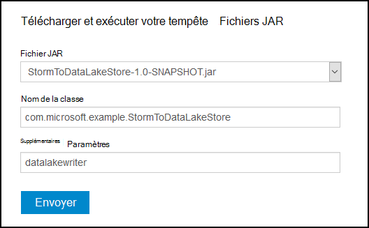
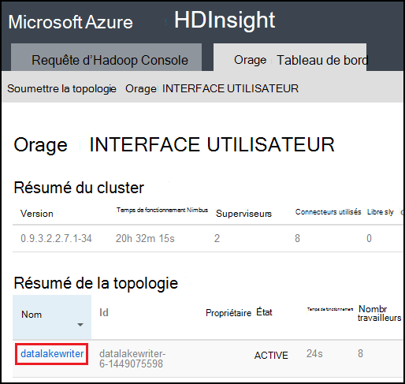

<properties
pageTitle="Utiliser le magasin de LAC de données Azure avec tempête Apache sur Azure HDInsight"
description="Apprenez à écrire des données au magasin de LAC de données Azure à partir d’une topologie de tempête de Apache sur HDInsight. Ce document et l’exemple associé, montrent comment le composant de la HdfsBolt peut être utilisé pour écrire dans le magasin de données lac."
services="hdinsight"
documentationCenter="na"
authors="Blackmist"
manager="jhubbard"
editor="cgronlun"/>

<tags
ms.service="hdinsight"
ms.devlang="na"
ms.topic="article"
ms.tgt_pltfrm="na"
ms.workload="big-data"
ms.date="09/06/2016"
ms.author="larryfr"/>

#Utiliser le magasin de LAC de données Azure avec tempête Apache avec HDInsight

Magasin de LAC de données Azure est un service de stockage cloud compatible très qui fournit un débit élevé, la disponibilité, la durabilité et la fiabilité de vos données. Dans ce document, vous allez apprendre à utiliser une topologie basée sur Java de Storm pour écrire des données dans le magasin de LAC de données Azure en utilisant le composant [HdfsBolt](http://storm.apache.org/javadoc/apidocs/org/apache/storm/hdfs/bolt/HdfsBolt.html) , qui est fourni dans le cadre de la vague d’Apache.

> [AZURE.IMPORTANT] L’exemple de topologie utilisé dans ce document repose sur les composants qui sont inclus avec la tempête sur les clusters de HDInsight et peuvent nécessiter des modifications pour pouvoir fonctionner avec magasin du lac de données Azure lorsqu’elle est utilisée avec les autres clusters Apache tempête.

##Conditions préalables

* [Java JDK 1.7](https://www.oracle.com/technetwork/java/javase/downloads/jdk7-downloads-1880260.html) ou supérieur
* [Maven 3.x](https://maven.apache.org/download.cgi)
* Un abonnement Azure
* Une bourrasque de HDInsight version de cluster 3.2. Pour créer une nouvelle tempête sur cluster de HDInsight, suivez les étapes dans le document [à l’aide de HDInsight d’utiliser avec le magasin de données lac Azure](../data-lake-store/data-lake-store-hdinsight-hadoop-use-portal.md) . Les étapes décrites dans ce document vous guidera dans la création d’un nouveau cluster de HDInsight et le lac Azure Data Store.  

    > [AZURE.IMPORTANT] Lorsque vous créez le cluster de HDInsight, vous devez sélectionner __tempête__ ainsi que le type de cluster, __3.2__ comme la version. Le système d’exploitation peut être Windows ou Linux.  

###Configurer les variables d’environnement

Les variables d’environnement peuvent être définies lors de l’installation de Java et du JDK sur votre station de travail de développement. Toutefois, vous devez vérifier qu’ils existent et qu’ils contiennent les valeurs correctes pour votre système.

* __JAVA_HOME__ - doit pointer vers le répertoire où est installé l’environnement d’exécution Java (JRE). Par exemple, dans une distribution Unix ou Linux, il doit avoir une valeur semblable à `/usr/lib/jvm/java-7-oracle`. Dans Windows, il aurait une valeur semblable à `c:\Program Files (x86)\Java\jre1.7`.

* __Chemin d’accès__ : doit contenir les chemins d’accès suivants :

    * __JAVA\_la maison__ (ou le chemin d’accès équivalent)
    
    * __JAVA\_HOME\bin__ (ou le chemin d’accès équivalent)
    
    * Le répertoire d’installation de Maven

##Mise en œuvre de la topologie

L’exemple utilisé dans ce document est écrit en Java et utilise les composants suivants :

* __TickSpout__: génère les données utilisées par d’autres composants de la topologie.

* __PartialCount__: nombre d’événements générés par TickSpout.

* __FinalCount__: agrégats comptent des données à partir de PartialCount.

* __ADLStoreBolt__: écrit des données dans le magasin de LAC de données Azure à l’aide du composant [HdfsBolt](http://storm.apache.org/javadoc/apidocs/org/apache/storm/hdfs/bolt/HdfsBolt.html) .

Le projet contenant cette topologie est disponible en téléchargement à partir de [https://github.com/Azure-Samples/hdinsight-storm-azure-data-lake-store](https://github.com/Azure-Samples/hdinsight-storm-azure-data-lake-store).

###Présentation ADLStoreBolt

Le ADLStoreBolt est le nom utilisé pour l’instance HdfsBolt de la topologie qui écrit dans Azure données lac. Il ne s’agit pas d’une version spéciale de HdfsBolt créé par Microsoft ; Toutefois, il ne repose pas sur les valeurs de configuration de site de la base, ainsi que les composants Hadoop inclus dans Azure HDInsight pour la communication avec les données lac.

En particulier, lorsque vous créez un cluster de HDInsight, vous pouvez l’associer à une banque de LAC de données Azure. Cela écrit des entrées dans le noyau-site pour le magasin du lac de données sélectionné, qui sont utilisées par les composants client hadoop et hadoop-très pour permettre la communication avec la banque de données lac.

> [AZURE.NOTE] Microsoft a contribué à code et projets de tempête Apache Hadoop qui permet la communication avec le stockage Azure Data lac Store et les Blob Azure, mais cette fonctionnalité ne peut pas être incluse par défaut dans autres distributions Hadoop et tempête.

La configuration de HdfsBolt de la topologie est la suivante :

    // 1. Create sync and rotation policies to control when data is synched
    //    (written) to the file system and when to roll over into a new file.
    SyncPolicy syncPolicy = new CountSyncPolicy(1000);
    FileRotationPolicy rotationPolicy = new FileSizeRotationPolicy(0.5f, Units.KB);
    // 2. Set the format. In this case, comma delimited
    RecordFormat recordFormat = new DelimitedRecordFormat().withFieldDelimiter(",");
    // 3. Set the directory name. In this case, '/stormdata/'
    FileNameFormat fileNameFormat = new DefaultFileNameFormat().withPath("/stormdata/");
    // 4. Create the bolt using the previously created settings,
    //    and also tell it the base URL to your Data Lake Store.
    // NOTE! Replace 'MYDATALAKE' below with the name of your data lake store.
    HdfsBolt adlsBolt = new HdfsBolt()
        .withFsUrl("adl://MYDATALAKE.azuredatalakestore.net/")
        .withRecordFormat(recordFormat)
        .withFileNameFormat(fileNameFormat)
        .withRotationPolicy(rotationPolicy)
        .withSyncPolicy(syncPolicy);
    // 4. Give it a name and wire it up to the bolt it accepts data
    //    from. NOTE: The name used here is also used as part of the
    //    file name for the files written to Data Lake Store.
    builder.setBolt("ADLStoreBolt", adlsBolt, 1)
      .globalGrouping("finalcount");
      
Si vous êtes familiarisé avec l’utilisation de HdfsBolt, vous remarquerez qu’il s’agit d’une configuration assez standard tous à l’exception de l’URL. L’URL ne fournit le chemin d’accès à la racine de votre magasin de LAC de données Azure.

Étant donné que l’écriture dans le magasin de données lac utilise HdfsBolt et est simplement un changement d’URL, vous devez être en mesure de prendre n’importe quelle topologie existante qui écrit à très ou WASB à l’aide de HdfsBolt et de modifier facilement pour utiliser le lac Azure Data Store.

##Générer et empaqueter la topologie

1. Téléchargez l’exemple de projet à partir de [https://github.com/Azure-Samples/hdinsight-storm-azure-data-lake-store](https://github.com/Azure-Samples/hdinsight-storm-azure-data-lake-store
) à votre environnement de développement.

2. Ouvrir le `StormToDataLake\src\main\java\com\microsoft\example\StormToDataLakeStore.java` dans un éditeur et rechercher la ligne qui contient `.withFsUrl("adl://MYDATALAKE.azuredatalakestore.net/")`. Modification __MYDATALAKE__ pour le nom de la banque de LAC de données Azure vous avez utilisé lors de la création de votre serveur HDInsight.

3. À partir d’une commande invite, Terminal Server ou session shell, modifiez les répertoires à la racine du projet téléchargé et exécutez les commandes suivantes pour générer et empaqueter la topologie.

        mvn compile
        mvn package
    
    Une fois la fin de la génération et l’emballage, il y aura un nouveau répertoire nommé `target`, qui contient un fichier nommé `StormToDataLakeStore-1.0-SNAPSHOT.jar`. Ce fichier contient la topologie compilée.

##Déployer et exécuter sur HDInsight de basé sur Linux

Si vous avez créé une tempête basé sur Linux sur HDInsight cluster, procédez comme suit pour déployer et exécuter la topologie.

1. Utilisez la commande suivante pour copier la topologie pour le cluster HDInsight. Remplacer __l’utilisateur__ avec le nom d’utilisateur SSH utilisé lors de la création du cluster. Remplacez __CLUSTERNAME__ par le nom du cluster.

        scp target\StormToDataLakeStore-1.0-SNAPSHOT.jar USER@CLUSTERNAME-ssh.azurehdinsight.net:StormToDataLakeStore-1.0-SNAPSHOT.jar
    
    Lorsque vous y êtes invité, entrez le mot de passe utilisé lors de la création de l’utilisateur SSH pour le cluster. Si vous avez utilisé une clé publique au lieu d’un mot de passe, vous devrez peut-être utiliser le `-i` paramètre pour spécifier le chemin d’accès à la clé privée correspondante.
    
    > [AZURE.NOTE] Si vous utilisez un client Windows pour le développement, vous ne pouvez pas avoir un `scp` commande. Si Oui, vous pouvez utiliser `pscp`, qui est disponible à partir de [http://www.chiark.greenend.org.uk/~sgtatham/putty/download.html](http://www.chiark.greenend.org.uk/~sgtatham/putty/download.html).

2. Une fois le téléchargement terminé, utilisez ce qui suit pour vous connecter au cluster HDInsight à l’aide de SSH. Remplacer __l’utilisateur__ avec le nom d’utilisateur SSH utilisé lors de la création du cluster. Remplacez __CLUSTERNAME__ par le nom du cluster.

        ssh USER@CLUSTERNAME-ssh.azurehdinsight.net

    Lorsque vous y êtes invité, entrez le mot de passe utilisé lors de la création de l’utilisateur SSH pour le cluster. Si vous avez utilisé une clé publique au lieu d’un mot de passe, vous devrez peut-être utiliser le `-i` paramètre pour spécifier le chemin d’accès à la clé privée correspondante.
    
    > [AZURE.NOTE] Si vous utilisez un client Windows pour le développement, suivez les informations [se connecter à la HDInsight de basé sur Linux avec SSH à partir de Windows](hdinsight-hadoop-linux-use-ssh-windows.md) pour plus d’informations l’aide le mastic client pour se connecter au cluster.
    
3. Une fois connecté, utilisez la suivante pour démarrer la topologie :

        storm jar StormToDataLakeStore-1.0-SNAPSHOT.jar com.microsoft.example.StormToDataLakeStore datalakewriter
    
    Cela permet de démarrer avec un nom convivial de la topologie de `datalakewriter`.

##Déployer et exécuter sur HDInsight de basées sur Windows

1. Ouvrez un navigateur web et accédez à HTTPS://CLUSTERNAME.azurehdinsight.net, dans laquelle __CLUSTERNAME__ est le nom de votre cluster de HDInsight. Lorsque vous y êtes invité, fournissez le nom d’utilisateur admin (`admin`) et le mot de passe que vous avez utilisé pour ce compte lorsque le cluster a été créé.

2. À partir du tableau de bord tempête, sélectionnez __Parcourir__ dans le menu déroulant __Fichier Jar__ , puis sélectionnez le fichier StormToDataLakeStore-1.0-SNAPSHOT.jar à partir de la `target` répertoire. Pour les autres entrées sur le formulaire, utilisez les valeurs suivantes :

    * Nom de classe : com.microsoft.example.StormToDataLakeStore
    * Paramètres supplémentaires : datalakewriter
    
    

3. Cliquez sur le bouton __Soumettre__ pour télécharger et démarrer la topologie. Le champ de résultat sous le bouton __Envoyer__ doit afficher des informations semblables à ce qui suit une fois la topologie a démarré :

        Process exit code: 0
        Currently running topologies:
        Topology_name        Status     Num_tasks  Num_workers  Uptime_secs
        -------------------------------------------------------------------
        datalakewriter       ACTIVE     68         8            10        

##Afficher les données de sortie

Il existe plusieurs façons de visualiser les données. Dans cette section, nous utilisons le portail Azure et la `hdfs` commande pour afficher les données.

> [AZURE.NOTE] Vous devez autoriser les topologies à exécuter pendant plusieurs minutes avant de vérifier les données de sortie, afin que les données a été synchronisée avec plusieurs fichiers de magasin de LAC de données Azure.

* __À partir du [Portail Azure](https://portal.azure.com)__: dans le portail, sélectionnez le magasin de LAC de données Azure que vous avez utilisé avec HDInsight.

    > [AZURE.NOTE] Si vous ne pas épingler le magasin du lac de données pour le tableau de bord de portail Azure, vous pouvez le trouver en sélectionnant __Parcourir__ au bas de la liste sur la gauche, puis de __Magasin de données lac__et enfin la banque d’informations.
    
    Dans les icônes dans la partie supérieure du lac de magasin de données, sélectionnez __Explorateur de données__.
    
    
    
    Ensuite, sélectionnez le dossier __stormdata__ . Une liste de fichiers de texte doit être affichée.
    
    
    
    Sélectionnez un des fichiers pour afficher son contenu.

* __À partir du cluster__: Si vous êtes connecté au cluster HDInsight à l’aide de SSH (cluster Linux), ou le Bureau à distance (cluster de Windows), vous pouvez utiliser les éléments suivants pour afficher les données. Remplacez __DATALAKE__ par le nom de votre Boutique de LAC de données

        hdfs dfs -cat adl://DATALAKE.azuredatalakestore.net/stormdata/*.txt

    Il concatène les fichiers texte stockés dans le répertoire et afficher des informations similaires à ce qui suit :
    
        406000000
        407000000
        408000000
        409000000
        410000000
        411000000
        412000000
        413000000
        414000000
        415000000
        
##Arrêter la topologie

Topologies de tempête seront exécutera jusqu'à l’arrêt, ou si le cluster est supprimé. Pour arrêter les topologies, utilisez les informations suivantes.

__Pour HDInsight de fonctionnant sous Linux__:

À partir d’une session SSH pour le cluster, utilisez la commande suivante :

    storm kill datalakewriter

__Pour HDInsight de basés sur Windows__:

1. À partir de la tempête du tableau de bord (https://CLUSTERNAME.azurehdinsight.net), sélectionnez le lien de __L’interface utilisateur de la tempête__ en haut de la page.

2. Une fois le chargement de l’interface utilisateur de tempête, sélectionnez le lien __datalakewriter__ .

    

3. Dans la section __Actions de la topologie__ , sélectionnez __Supprimer__ et sélectionnez OK dans la boîte de dialogue qui s’affiche.

    

## Supprimer de votre cluster.

[AZURE.INCLUDE [delete-cluster-warning](../../includes/hdinsight-delete-cluster-warning.md)]

##Étapes suivantes

Maintenant que vous avez appris comment utiliser tempête à écrire dans le magasin de LAC de données Azure, découvrez d’autres [exemples de Storm pour HDInsight](hdinsight-storm-example-topology.md).
