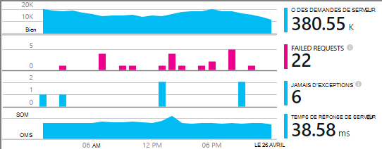

<properties
    pageTitle="Exemple de MyDriving Azure IoT : générer | Microsoft Azure"
    description="Créez une application qui est une démonstration complète de l’architecture d’un système IoT à l’aide de Microsoft Azure, y compris les flux Analytique, l’apprentissage de la Machine et concentrateurs d’événement."
    services=""
    documentationCenter=".net"
    suite=""
    authors="harikmenon"
    manager="douge"/>

<tags
    ms.service="multiple"
    ms.workload="tbd"
    ms.tgt_pltfrm="ibiza"
    ms.devlang="dotnet"
    ms.topic="article"
    ms.date="03/25/2016"
    ms.author="harikm"/>


# <a name="build-and-deploy-the-mydriving-solution-to-your-environment"></a>Générer et déployer la solution de MyDriving pour votre environnement

MyDriving est une solution de l’Internet des objets (IoT) qui rassemble des données à partir de votre voiture, il traite à l’aide d’apprentissage automatique et l’affiche sur votre téléphone portable. Le back-end se compose d’une variété de services fournis par Microsoft Azure. Les clients peuvent être des téléphones Windows 10, iOS ou Android.

Nous avons créé la solution de MyDriving afin de vous donner une installation jumpstart pour créer votre propre système IoT. À partir du [référentiel MyDriving sur GitHub](https://github.com/Azure-Samples/MyDriving), vous pouvez obtenir des scripts du Gestionnaire de ressources Azure pour déployer l’architecture back-end dans votre propre compte Azure. À partir de là, vous pouvez reconfigurer les différents services, modifier les requêtes pour les adapter à vos propres données et ainsi de suite. Vous trouverez ces scripts--ainsi que du code pour l’application mobile, le projet de l’API du Service application Azure, etc., dans le référentiel de MyDriving.

Si vous n’avez pas encore essayé l’application, consultez le [guide de Get](iot-solution-get-started.md).

Il existe un compte détaillé de l’architecture dans le [Guide de référence de MyDriving](http://aka.ms/mydrivingdocs). En résumé, il y a plusieurs éléments que nous avons configurés, et que vous définissez à créent un projet similaire :

* Une **application cliente** s’exécute sur les téléphones Android, iOS et Windows 10. La plate-forme de Xamarin nous permet de partager une grande partie du code, qui est stocké dans GitHub sous `src/MobileApp`. L’application effectue deux fonctions distinctes :
 * Il relaie télémétrie à partir du périphérique de systèmes de diagnostic embarqués (OBD) et à partir de son propre service de localisation pour nuage back-end du système.
 * Il s’agit d’une interface utilisateur dans laquelle les utilisateurs peuvent interroger sur leurs voyages route enregistrée.
* Un **service en nuage** ingests des données en temps réel-voyage et la traite. Le travail principal de la création de ce service est de choisir, de paramétrer et de rattacher les divers services Azure. Certaines pièces nécessitent des scripts pour filtrer et traiter les données entrantes. Un modèle de gestionnaire de ressources Azure nous permet de configurer toutes les parties.
* Une **application de services de téléphonie mobile** est le service web derrière la partie d’interface utilisateur de l’application de périphérique. Son rôle principal est d’interroger la base de données des données stockées, traitées. Le code se trouve sur GitHub sous `src/MobileAppService`.
* **Visual Studio avec Xamarin** est notre environnement de développement. Xamarin, qui se trouve à la fois en tant que composant de Visual Studio et un environnement autonome de développement intégré (IDE), est utilisé pour générer le code de périphérique de multiplates-formes. Pour générer le code des e/s, il est nécessaire de disposer d’une instance de Xamarin en cours d’exécution sur une machine de OS X. Si nécessaire, il peut être exécuté en tant qu’agent, géré à partir de Visual Studio.
* **Unité de test** des applications de périphérique est effectuée dans le nuage de Test Xamarin.
* **GitHub** est le référentiel dans lequel nous permet de stocker tout le code, les scripts et les modèles.
* **Visual Studio Team Services** est un service en nuage qui sert à gérer la build en continu et le test des applications web service et le périphérique.
* **HockeyApp** est utilisé pour distribuer des versions du code unité. Il collecte également des rapports d’incident et de l’utilisation et les commentaires des utilisateurs.
* **Idées d’Application Visual Studio** surveille le service web mobile.

Voyons donc comment nous configurer tout cela. Notez que la plupart des étapes sont facultatives.

## <a name="sign-up-for-accounts"></a>Inscrivez-vous pour les comptes

-   [Éducation de développement Visual Studio](https://www.visualstudio.com/products/visual-studio-dev-essentials-vs.aspx). Ce programme gratuit fournit un accès facile à de nombreux outils de développement et de services, y compris Visual Studio, Visual Studio Team Services et Azure. Il vous donne un crédit de 25 $par mois sur Azure pendant 12 mois. Il inclut également les abonnements à la formation de Pluralsight et l’Université de Xamarin. Vous pouvez également vous inscrire séparément pour les niveaux libres [d’Azure](https://azure.com) et [Visual Studio Team Services](https://www.visualstudio.com/products/visual-studio-team-services-vs.aspx), mais elles ne fournissent pas de crédits d’Azure.

-   [HockeyApp](https://rink.hockeyapp.net/) (facultatif), pour gérer la distribution des tests d’applications mobiles et de la collecte de télémétrie.

-   [Xamarin](https://xamarin.com/) (obligatoire), pour concevoir l’application mobile et l’exécution des tests et séries de débogage sur le [Nuage de Test Xamarin](https://xamarin.com/test-cloud).

-   [GitHub](https://github.com/Azure-Samples/MyDriving/) (facultatif), pour créer des référentiels publics gratuits pour votre propre code (référentiels privés sont payés). Vous pouvez également utiliser le plan de base dans Visual Studio Team Services pour les référentiels privés.

-   [Alimentation BI](https://powerbi.microsoft.com/) (facultatif), pour créer des visualisations de données dans l’ensemble du système.

> [AZURE.NOTE] Vous n’avez pas besoin un compte GitHub pour accéder au code de MyDriving dans [le référentiel de MyDriving de GitHub](https://github.com/Azure-Samples/MyDriving).

## <a name="install-development-tools"></a>Installer les outils de développement

La configuration suivante est pour le développement de la solution complète : une iOS, Android et Windows Mobile de 10 applications multiplates-formes, avec un Azure back-end.

Comme alternative, vous pouvez utiliser Xamarin Studio sur Mac ou Windows pour développer les applications mobiles, si vous ne travaillez sur l’Azure back-end.

Il existe une [description plus détaillée de ce programme d’installation](https://msdn.microsoft.com/library/mt613162.aspx).

### <a name="windows-development-machine"></a>Machine de développement Windows

L’outil central sous Windows est de Visual Studio, pour l’utilisation de l’application MyDriving pour Android et Windows, le projet de l’API de Service d’application et les extensions de microservice.

Xamarin, Git, émulateurs et autres composants utiles sont toutes intégrées avec Visual Studio.

Installation :

-   [Visual Studio 2015 avec Xamarin](https://www.visualstudio.com/products/visual-studio-community-vs) (toute édition--communautaire est gratuite).

-   [SQLite pour plate-forme Windows universel](https://visualstudiogallery.msdn.microsoft.com/4913e7d5-96c9-4dde-a1a1-69820d615936). Requis pour générer le code Windows 10 Mobile.

-   [Azure SDK pour Visual Studio 2015](https://go.microsoft.com/fwlink/?linkid=518003&clcid=0x409). Vous donne le Kit de développement pour l’exécution d’applications dans Azure, ainsi que des outils de ligne de commande pour la gestion d’Azure.

-   [Service azure Fabric SDK](http://www.microsoft.com/web/handlers/webpi.ashx?command=getinstallerredirect&appid=MicrosoftAzure-ServiceFabric). Requis pour générer l’extension [microservice](../service-fabric/service-fabric-get-started.md) .

Assurez-vous également que vous disposez du droite extensions de Visual Studio. Vérifiez que sous **Outils**, vous pouvez voir **Android, iOS, Xamarin...**. Dans le cas contraire, ouvrez le panneau de configuration et sélectionnez **programmes et fonctionnalités** > **Microsoft** > **Visual Studio 2015** > **Modifier**. En cours de **développement sur plusieurs plates-formes**, sélectionnez **C\#/.Net (Xamarin)**. Lorsque vous y êtes, vérifiez que **Git pour Windows** est installé.

### <a name="mac-development-machine"></a>Machine de développement Mac

Le Mac (Yosemite ou version ultérieure) est requis si vous souhaitez développer pour iOS. Bien que nous utilisons Visual Studio avec Xamarin sur Windows pour développer et gérer tout le code, Xamarin utilise un agent est installé sur un Mac pour générer et signer le code e/s.


(En guise d’alternative, vous pouvez utiliser Xamarin Studio directement sur le Mac pour développer les applications multiplates-formes.)

Vous n’avez pas besoin du Mac si vous ne souhaitez pas inclure les e/s en tant que plate-forme cible.

Installation :

-   [Xamarin Studio pour iOS](https://developer.xamarin.com/guides/ios/getting_started/installation/mac/). Vous pouvez également configurer Visual Studio et Xamarin sur un Mac sur une machine virtuelle Windows est en cours d’exécution. Consultez [le programme d’installation, installation et les vérifications pour les utilisateurs de Mac](https://msdn.microsoft.com/library/mt488770.aspx) sur MSDN.

-   [Outils de développement Azure](https://azure.microsoft.com/downloads/) (facultatif).

Activer la connexion d’accès distante sur le Mac. Ouvrez les **Préférences système** > **partage**et puis sélectionnez **Connexion distante**.

Lorsque vous ouvrez un projet iOS dans Visual Studio sous Windows, le plug-in de Xamarin vous demandera l’ID du Mac.

## <a name="fetch-the-github-repository"></a>Extraire le référentiel GitHub

Extraire une copie locale du [référentiel GitHub MyDriving](https://github.com/Azure-Samples/MyDriving) en utilisant le bouton **ZIP de téléchargement** GitHub, Visual Studio ou un autre client Git.

Décompressez le fichier dans un dossier avec un nom de chemin d’accès court, par exemple, C:\\code.

Ou bien, si vous souhaitez maintenir à jour avec ou contribuer à notre code, cloner le référentiel comme suit :

**GIT clone https://github.com/Azure-Samples/MyDriving.git**

## <a name="get-a-bing-maps-api-key"></a>Obtenir un Bing maps clé d’API

[Enregistrer une clé de l’API Bing Maps](https://msdn.microsoft.com/library/ff428642.aspx).

Vous devrez le remplacer dans ligne de 22 `src/MobileApps/MyDriving/MyDriving.Utils/Logger.cs`.


## <a name="build-the-demo-app"></a>Créer l’application de démonstration

Ouvrez ces solutions dans Visual Studio :

-   src\MobileApps\MyDriving.sln

-   src\MobileAppService\MyDrivingService.sln

-   src\Extensions\ServiceFabric\VINLookUpApplication\VINLookUpApplication.sln

Vous obtiendrez des invites pour :

-   Faire confiance à certains projets potentiellement non fiables. Cliquez sur Ouvrir si vous souhaitez continuer.

-   Si vous travaillez sur un ordinateur Windows 10 fraîche, définir le mode développeur.

-   Fournir vos informations d’identification de Xamarin.

-   Se connecter à un Mac Xamarin. Si vous n’avez pas un Mac, droit sur le projet d’e/s dans Visual Studio et puis sélectionnez **Décharger le projet**.

Régénérez la solution.

Si vous avez des difficultés à créer, essayez les solutions à EXCENTRIQUE que nous avons trouvé :

-   *VINLookupApplication de projet ne charge*: Assurez-vous que vous avez installé le [SDK Azure pour Visual Studio 2015](https://go.microsoft.com/fwlink/?linkid=518003&clcid=0x409).

-   *Projet de service de Fabric ne générer*: générez d’abord les projets de l’interface et assurez-vous que vous avez installé le Kit de développement logiciel de Service de Fabric.

-   *Application d’android ne générer*:

    -   Ouvrir les **Outils de** > **Android** > **Gestionnaire de SDK Android**et assurez-vous que 6 Android (API 23) / plate-forme de kit de développement logiciel est installé.

    -   Supprimer ce répertoire et puis reconstruire :<br/>
        `%LocalAppData%\Xamarin\zips`

## <a name="get-to-know-the-code"></a>Découvrir le code

Dans la solution, vous trouverez :

-   Extensions Azure : Service Fabric.

-   HDInsight Azure : Scripts de traitement de données de voyage dans Azure.

-   Les applications mobiles : Les applications de périphérique.

-   MobileAppsService/MyDrivingService : Le site web en fin.

-   BI de puissance : La définition de rapport.

-   Scripts :

    -   Le Gestionnaire de ressources : des modèles pour générer les ressources Azure.

    -   PowerShell : Les Scripts pour exécuter les Gestionnaire de ressources de modèles.

    -   Base de données SQL Azure : Débogage des bases de données.

-   Base de données SQL : CreateTables a : les définitions de schéma.

-   Analytique de flux Azure : Les requêtes qui transforment le flux de données entrant.

## <a name="run-the-apps-in-development-mode"></a>Exécutez les applications en mode développement

Entreprendre une action pour exécuter les applications, basées sur le périphérique que vous utilisez :

-  Back-end : MyDrivingService de définir comme projet de démarrage, appuyez sur F5 pour exécuter le service web de back-end. Il s’ouvre une vue de navigateur de la liste des API.

-  Les clients mobiles : les [applications mobiles sont développées dans Xamarin](https://developer.xamarin.com/guides/cross-platform/deployment,_testing,_and_metrics/debugging_with_xamarin/).
 -  Android : Pour plus d’informations, consultez [Débogage Android dans Xamarin](http://developer.xamarin.com/guides/android/deployment,_testing,_and_metrics/debugging_with_xamarin_android/).

 -  iOS : pour plus d’informations, consultez [débogage dans iOS](http://developer.xamarin.com/guides/ios/deployment,_testing,_and_metrics/debugging_in_xamarin_ios/).

 -  De Windows Phone : Pour plus d’informations, consultez [Xamarin + Windows Phone](https://developer.xamarin.com/guides/cross-platform/windows/phone/).

## <a name="upload-the-mobile-app-to-hockeyapp"></a>Télécharger l’application mobile pour HockeyApp

HockeyApp gère la distribution de votre application Windows, iOS ou Android pour tester des utilisateurs, de notifier les utilisateurs des nouvelles versions. Il collecte également des rapports d’incident utile, les commentaires des utilisateurs avec captures d’écran et les mesures d’utilisation.

[Commencez par télécharger](http://support.hockeyapp.net/kb/app-management-2/how-to-create-a-new-app) votre application de build. Puis connectez-vous à [HockeyApp](https://rink.hockeyapp.net) à partir de votre ordinateur de développement. Sur le tableau de bord du développeur, cliquez sur **Nouvelle application**, puis faites glisser les fichiers de build dans la fenêtre. (Une version ultérieure, vous pouvez automatiser votre service de build pour ce faire.)

Vous êtes maintenant dans votre tableau de bord app.


Répétez le processus pour que votre application s’exécute sur chaque plate-forme. Vous pouvez ensuite effectuer les opérations suivantes :

-  L' [ID de l’application](http://support.hockeyapp.net/kb/app-management-2/how-to-find-the-app-id) du tableau de bord permet d’envoyer les données de panne et les commentaires à partir de votre application. MyDriving, mettre à jour les numéros de src/MobileApps/MyDriving/MyDriving.Utils/Logger.cs.

-  [Invitez des utilisateurs de test](http://support.hockeyapp.net/kb/app-management-2/how-to-invite-beta-testers). Vous obtenez une URL pour recruter des utilisateurs de testeurs. Ils pourront inscrire pour votre équipe, télécharger l’application et vous envoyer des commentaires.

-  Si vous préférez une version bêta plus ouverte, définir la distribution au public. Cliquez sur **Gérer les App** > **Distribution** > **Télécharger = Public**. Maintenant tous les utilisateurs peuvent télécharger votre application et vous envoyer des commentaires, et ils verront une notification lors de la validation d’une nouvelle version. Vous pouvez obtenir des rapports d’incident à partir de ces trop.

    

-  [Rapports d’incident de liaison à Visual Studio Team Services](http://support.hockeyapp.net/kb/third-party-bug-trackers-services-and-webhooks/how-to-use-hockeyapp-with-visual-studio-team-services-vsts-or-team-foundation-server-tfs). Cliquez sur **Gérer les App** > **Visual Studio Team Services**. HockeyApp pouvez créer automatiquement des éléments de travail dans Team Services lorsqu’il existe des rapports d’incident ou lors de la réception retour.

Plus sur le [site de HockeyApp](https://hockeyapp.net).

## <a name="test-the-mobile-app-on-xamarin-test-cloud"></a>Tester l’application mobile sur le nuage de Test Xamarin

[Nuage de Test Xamarin](https://developer.xamarin.com/guides/testcloud/introduction-to-test-cloud/) automatise les tests d’interface utilisateur sur des périphériques réels dans le nuage. En utilisant le framework NUnit, vous écrivez des tests qui exécutent votre application par le biais de l’interface utilisateur.

Pour utiliser Xamarin, pour intégrer le Kit de développement logiciel [Xamarin.UITests](https://developer.xamarin.com/guides/testcloud/uitest/intro-to-uitest/) dans votre application, qui se présente sous la forme d’un package NuGet. Vous la trouverez dans l’application de démonstration, et il a inclus lors de la création de nouveaux projets de test avec les modèles de Xamarin.


Un exemple de projet de test est inclus dans l’application dans le référentiel. Dans [MyDriving](https://github.com/Azure-Samples/MyDriving/tree/master/src/MobileAppService), regardez sous [src](https://github.com/Azure-Samples/MyDriving/tree/master/src)/MobileApps/[MyDriving](https://github.com/Azure-Samples/MyDriving/tree/master/src/MobileApps/MyDriving)/MyDriving.UITests/.

Si vous utilisez une version de Visual Studio Team Services, il est facile d’écrire des tests unitaires Xamarin UI et de les exécuter dans le cadre de votre génération.

## <a name="deploy-azure-services"></a>Déployer des services Azure

Pour effectuer un déploiement automatique de services Azure et les services de build Team Services, consultez les instructions détaillées de **scripts/README.md**.

Microsoft Azure fournit une multitude de services différentes que vous pouvez utiliser pour créer des applications de cloud. Bien que la plupart peuvent être utilisées individuellement (comme les applications de Service/Web App), ils sont au mieux lorsqu’ils sont interconnectés à l’écran un système intégré comme que nous utilisons dans MyDriving.

Il est possible de créer et d’interconnexion des services Azure manuellement, mais il est beaucoup plus rapides et plus fiables d’utiliser le Gestionnaire de ressources Azure des modèles. [Le Gestionnaire de ressources](../azure-resource-manager/resource-group-overview.md) permet d’automatiser le déploiement de ressources et d’apporter les interconnexions entre eux une solution.

Vous trouverez le modèle pour le système de MyDriving dans le référentiel de GitHub sous [scripts/ARM](https://github.com/Azure-Samples/MyDriving/tree/master/scripts/ARM). Il fournit une vue complète et précise de la façon dont les différents services dans notre architecture sont interconnectés. Nous vous expliquerons toutes ces en détail dans le [Guide de référence de MyDriving](http://aka.ms/mydrivingdocs), mais vous pouvez apprendre beaucoup en lisant le modèle lui-même.

> [AZURE.NOTE] Plus Azure services ont un coût associé, en fonction du niveau de tarification. Si vous êtes nouveau sur Azure, vous pouvez [essayer gratuitement](https://azure.microsoft.com/free/). Toutefois, si vous n’envisagez pas d’utiliser certains composants dans le système MyDriving, veillez à les supprimer pour éviter de supporter des coûts. La section « D’estimer les coûts d’exploitation » plus loin dans cet article fournit un résumé des frais de service par défaut.

### <a name="edit-the-template"></a>Modifier le modèle

Pour personnaliser votre déploiement, par exemple, pour supprimer les composants inutiles ou en ajouter d’autres, d’abord faire une copie de scénario\_complete.params.json et scénario\_complete.json dans lequel vous souhaitez effectuer des modifications.

Vous pouvez utiliser le scénario de\_complete.params.json des fichiers pour substituer les valeurs par défaut différentes, telles que la référence SKU du service ou le type de réplication de stockage, comme décrit dans le tableau suivant. Les valeurs par défaut permet de sélectionner les options de coût le plus bas.

| **Paramètre**         | **Description**                | **Valeur par défaut** |
|--------|---------|-------|
| Concentrateur IoT SKU           | Niveau de service du Hub de IoT Azure | F1                |
| Type de compte de stockage  | Type de réplication de stockage       | LRS standard      |
| Objectif du Service SQL | Consommation d’emplacement d’accès concurrentiel   | DW100             |
| Plan de l’hébergement SKU      | Plan de service pour le Service d’application   | F1                |

Dans le scénario\_complete.json :

-   Rechercher « baseName » et le remplacer par un nom que vous préférez.

-   Recherche de « Créer ». Chacune de ces sections crée une ressource.

-   Jeu de sqlServerAdminLogin et sqlServerAdminPassword sur les valeurs appropriées.

-   Avant de supprimer une section qui crée une ressource, vérifiez s’il a des dépendances en recherchant son nom ailleurs dans le fichier. Notez que chaque section qui crée un service comprend une section *dependsOn* qui répertorie ses dépendances.

Voici ce que configure le modèle. Les détails sont dans le [Guide de référence](http://aka.ms/mydrivingdocs).

| **Service**                 | **Description et détails**  
|---|----
| Comptes de stockage            | Le modèle crée trois comptes :                                                                                                                                                                       
|| -Une base de données SQL qui reçoit télémétrie agrégée Analytique de flux de données et sert de magasin de stockage pour les tables de Service d’application Azure qui exposent des données par le biais de points de terminaison API.                      
|| -Stockage des objets blob qui accumule les données historiques d’un autre projet Analytique de flux, pour être traitées par HDInsight.                                                                                         
|| -Une base de données SQL qui reçoit les résultats traités par HDInsight à utiliser avec alimentation BI.                                                                                                                 
| Concentrateur de IoT Azure                     | Établit une connexion bidirectionnelle pour chaque périphérique connecté. Dans la solution MyDriving, l’application mobile fait Office de passerelle de champ pour envoyer des données à Azure IoT concentrateur. Azure IoT concentrateur sert alors d’entrée pour l’Analytique des flux de données. |
| Événement Azure concentrateurs                   | Une sortie d’un projet de flux Analytique la sortie aux extensions qui sont créés avec Azure Service Fabric en file d’attente.                                                                                               
| Entrepôt de données SQL Azure          |                                                                                                                                                                                                            
| Tâches de flux de données Analytique | Connecter les entrées et les sorties avec une requête, qui est utilisée pour regrouper les données historiques et en temps réel pour l’API de Service de l’application, Azure Machine Learning, extensions et alimentation BI.                               
| Espace de travail formation machine  | Inclut les expériences, code de R et service API.                                                                                                                                                              
| Usine de données Azure                | Planifiées de recyclage de formation de la Machine.                                                                                                                                                                     
| Plan d’hébergement service Fabric | Pour les extensions.                                                                                                                                                                                            
| Service d’application (« application Mobile »)  | Héberge le projet Mobile applications API qui fournit des points de terminaison pour l’application mobile. Le code de l’API doit être déployé au Service de l’application à partir de Visual Studio.                                                         
| Règles d’alerte                 | Envoie à que vous par e-mail si les réponses d’application indiquent des défaillances.                                                                                                                                            
| Aperçu de l’application        | Pour analyser les performances de l’API de Service de l’application. Vous devez configurer la connexion dans Visual Studio.                                                                                          
| Chambre forte de clé Azure                   | Pour enregistrer le certificat de cluster du service web.                                                                                                                                                                

### <a name="run-the-template"></a>Exécuter le modèle

Dans **scripts/README.md**, il existe des instructions détaillées sur le modèle en cours d’exécution.

Pour provisionner tous ces services dans votre propre compte Azure en utilisant le script, effectuez l’une des opérations suivantes :

-   Utilisation de PowerShell :

    ```

    cd scripts/PowerShell;
    deploy.ps1 *location* *resourceGroupName*
    ```

 -   *emplacement* est l' [emplacement d’Azure](https://azure.microsoft.com/regions/), tel que `North Europe` ou `West US`. Utilisez `Get-AzureLocation` pour obtenir une liste des emplacements disponibles.

 -   *resourceGroupName* est le nom que vous souhaitez donner au groupe qui appartiennent à toutes les ressources. Lorsque vous avez terminé avec les ressources, vous pouvez les supprimer ensemble par la suppression de ce groupe.

-   Exécutez DeploymentScripts/Bash/deploy.sh avec Bash.

-   Ouvrez et générez la solution Visual Studio DeploymentScripts/VS/DeployARM.sln.

Notez que chaque fois que le modèle est exécuté, il crée un nouveau jeu de ressources avec les nouveaux noms. Pour supprimer les ressources, accédez au portail et supprimer le groupe de ressources.

Si le script échoue pour une raison quelconque, vous pouvez réexécuter il.

Le script vous donne l’option de configuration de l’intégration continue dans Visual Studio Team Services. Si vous avez défini un projet de Services d’équipe, vous aurez une URL : https://yourAccountName.visualstudio.com. Entrez l’URL complète lorsque vous êtes invité. Vous pouvez lui donner un nom nouveau ou existant pour un projet d’équipe Services.

## <a name="set-up-build-and-test-definitions-in-visual-studio-team-services"></a>Configurer la génération et de tester des définitions dans Visual Studio Team Services

Nous utiliser les Services de l’équipe sur ce projet principalement pour sa génération et testez les fonctionnalités. Mais il fournit également la prise en charge excellente de collaboration, telles que la gestion de tâches avec les cartes Kanban, versions de révision du code intégré avec les tâches et le contrôle de code source et contrôlé. Il s’intègre également avec d’autres outils tels que GitHub, Xamarin, HockeyApp et bien entendu, Visual Studio. Vous pouvez y accéder par le biais de l’interface web ou par le biais de Visual Studio, selon ce qui est plus pratique à tout moment.

Les étapes décrites dans les définitions de build et de version utilisent un éventail de services de plug-in qui sont disponibles dans l' équipe Services [Marketplace](https://marketplace.visualstudio.com/VSTS). En plus des utilitaires de base pour exécuter des lignes de commande ou de copier des fichiers, il sont des services qui appeler des builds par Xamarin, Android et d’autres fournisseurs, et qui se connectent à HockeyApp.


### <a name="build-definitions"></a>Définitions de build

Nous avons des définitions de build pour chacune des principales cibles. Nous avons des variations de fonctionnalité et tests de régression. Qui nous donne :

-   MyDriving.Services (l’application web de back-end pour l’application mobile)

-   MyDriving.Xamarin.Android

    -   Fonction de MyDriving.Xamarin.Android

    -   Régression de la MyDriving.Xamarin.Android

-   MyDriving.Xamarin.iOS

    -   Fonction de MyDriving.Xamarin.iOS

    -   Régression de la MyDriving.Xamarin.iOS

-   MyDriving.Xamarin.UWP

    -   Fonction de MyDriving.Xamarin.UWP

    -   Régression de la MyDriving.Xamarin.UWP

Si vous souhaitez afficher les détails complets de notre configuration, voir le point 4.7 du [Guide de référence de MyDriving](http://aka.ms/mydrivingdocs), « Création et Configuration Release ». Ils suivent le même modèle général. Le script :

1.  Restaure le package NuGet. Nous ne pas conserver le code compilé dans le référentiel, afin que les premières étapes de chaque génération sont pour restaurer les packages NuGet requis.

2.  Active la licence. La génération est exécutée dans le nuage, dans le cas où nous avons besoin d’une licence, en particulier, pour que le service de build Xamarin--nous doivent activer notre licence sur l’ordinateur de build en cours. Puis nous désactiver immédiatement après, pour pouvoir être utilisé sur un autre ordinateur.

3.  Construit en utilisant le service approprié. Nous utilisons des builds de Xamarin pour les applications mobiles, et Visual Studio génère pour le service web de back-end.

4.  Génère des tests.

5.  Exécute les tests. Nous exécuter les tests de l’application mobile dans le nuage de Test Xamarin.

6.  Publie le résultat de build vers l’emplacement cible.

Le déclencheur pour les builds principales est défini pour l’intégration continue. Autrement dit, la génération est exécutée chaque fois que code est archivé dans la branche principale.


### <a name="release-definitions"></a>Définitions de version

Définitions de version sont définies en grande partie identique.

Pour le service web, nous définissons le déploiement comme une application web Azure :


Et nous le déclencheur de la version de déploiement continue. Autrement dit, chaque archiver suivie d’une génération réussie entraîne une mise à jour pour l’application web.


Pour les applications mobiles, nous déployons HockeyApp :


## <a name="explore-telemetry-by-using-application-insights"></a>Explorez la télémétrie à l’aide des informations d’Application

[Idées d’application](../application-insights/app-insights-overview.md) collecte télémétrie sur les performances et l’utilisation de vos services web. Le Kit de développement de perspectives Application envoie télémétrie à partir du service pour la ressource d’idées d’Application dans Azure.

Accédez à la ressource de conseils d’Application qui le modèle défini. Vous pouvez explorer les graphiques des performances de votre [projet de Service d’application Mobile](https://github.com/Azure-Samples/MyDriving/tree/master/src/MobileAppService). Ils montrent des requêtes du serveur et les temps de réponse, les échecs, et compte de l’exception. Il existe également des graphiques de dépendance des temps de réponse--en d’autres termes, les appels à la base de données et aux API reste comme apprentissage automatique. S’il existe des problèmes de performances, vous serez en mesure de voir quelle pièce de votre système est à l’origine les.



Si vous disposez d’un service web qui permet de paramétrer manuellement, il est facile d’obtenir les mêmes graphiques. Sur la lame de service web, cliquez sur **Outils** > **Extensions de** > **Ajouter**. Sélectionner les **perspectives de l’Application**.


La fonction fonctionne par l’instrumentation de votre application avec le SDK de perspectives d’Application.

Vous pouvez ajouter de télémétrie personnalisée (ou une application qui est exécuté en dehors d’Azure d’instrument) en [ajoutant le SDK de perspectives d’Application](../application-insights/app-insights-asp-net.md) au moment du développement. Cela est utile pour les métriques de journal qui dépendent de l’application, comme la longueur de moyenne de déplacement d’utilisateurs ou de kilométrage total. Dans Visual Studio, cliquez droit sur le projet et sélectionnez **Ajouter les perspectives sur l’Application**.


Idées d’application enverra des alertes électroniques s’il voit un nombre inhabituel de réponses d’échec. Vous pouvez également configurer vos propres alertes sur diverses métriques, par exemple des temps de réponse.

Juste pour être sûr que votre service web est toujours haut et en cours d’exécution, vous pouvez configurer [les tests de disponibilité](../application-insights/app-insights-monitor-web-app-availability.md). Ces tests ping toutes les 15 minutes à votre site à partir de différents emplacements dans le monde entier. Encore une fois, vous obtiendrez un e-mail si il semble y avoir un problème.

## <a name="estimate-operational-costs"></a>Estimer les coûts d’exploitation

Il est extrêmement peu coûteux exécuter une application comme celle-ci à petite échelle. La plupart des services ont des niveaux d’entrée de gamme libres, afin que le développement et l’exploitation à petite échelle de coûts très peu. Et, bien entendu, vos applications n’ont pas à utiliser toutes les fonctionnalités que cela est indiquées dans MyDriving.

Voici une estimation approximative de nos coûts du paramétrage de la configuration de développement pour MyDriving. Nous Notez également d’autres solutions que nous n’utilise *pas* . Ces informations peuvent être utiles lorsque vous estimez vos propres coûts.

Nous supposons que :

-   Une équipe de pas plus de cinq (plus en observant les parties prenantes).

-   En cours d’un mois.

-   100 utilisateurs avec quatre voyages par jour.

>[AZURE.NOTE] Si vous êtes novice dans Azure, il existe un [compte gratuit](https://azure.microsoft.com/free/).

| **Service/composant**  | **Notes** | **Coût par mois** |
|--------|--------|----------------|
| [Communauté de 2015 Visual Studio](https://www.visualstudio.com/products/visual-studio-community-vs) avec [Xamarin](https://visualstudiogallery.msdn.microsoft.com/dcd5b7bd-48f0-4245-80b6-002d22ea6eee) <br/>Environnement de développement de plusieurs plates-formes| Communauté de Visual Studio. (Besoin de [Visual Studio Professional](https://www.visualstudio.com/vs-2015-product-editions) pour [Xamarin.Forms](https://xamarin.com/forms), conception multiplate-forme à partir d’une base de code unique).  | $0   |
| [Concentrateur de IoT Azure](https://azure.microsoft.com/pricing/details/iot-hub/) <br/>Connexion de données bidirectionnelle pour les périphériques | 8 000 messages + 0,5 Ko/message libre. | $0             |
| [Analytique de flux](https://azure.microsoft.com/pricing/details/stream-analytics/)  <br/>   Traitement des données de flux de haut volume                                                                                                                                                              | Frais de $0.031 par diffusion en continu des unités par heure, tandis que l’activé. Vous choisissez le nombre d’unités de transmission en continu que vous le souhaitez ; plus d’évoluer. | $23            |
| [Apprentissage automatique](https://azure.microsoft.com/documentation/services/machine-learning/)<br/> Réponse adaptative                                                                                                                                                                              |  siège/10 $/ mois. <br/>                                                                                                                                                                                 + 3 heures expérience \* $1 / tester heure. <br/>                                                                                                                                                           + 3,5 heures API processeur \* 2 $ / heure de fabrication du processeur. <br/>                                                                                                                                                          Temps processeur de l’API suppose 5 min/jour de formation de reconversion, bien que cela augmenteront avec des données plus d’entrée.                   <br/>                                                                                                                                                                     + score pour traiter des voyages par jour 400 2 min. / jour.  | 20 euros            |
| [Service d’application](https://azure.microsoft.com/pricing/details/app-service/)  <br/> Hôte mobile back-end                                                                                                                                                                              | Niveau B1 : les applications web de production. | $56            |
| [Visual Studio Team Services](https://azure.microsoft.com/pricing/details/visual-studio-team-services/)  <br/> Build, test unitaire et la gestion de version ; gestion des tâches | Agents privés, cinq utilisateurs.| $0             |
| [Aperçu de l’application](https://azure.microsoft.com/pricing/details/application-insights/) <br/>Surveillance des performances et l’utilisation des services web et des sites| Couche libre.  | $0             |
| [HockeyApp](http://hockeyapp.net/pricing/) <br/> Distribution des applications de la version bêta, et la collection de commentaires et d’utilisation des données de blocage                                                                                                                                      | Deux des applications gratuites pour les nouveaux utilisateurs.<br/> 30 dollars par mois par la suite.  | $0    |
| [Xamarin](https://store.xamarin.com/)<br/> Code sur une plate-forme unifiée pour plusieurs appareils | Version d’évaluation gratuite. <br/>25 $par mois par la suite.| $0    |
| [Base de données SQL](https://azure.microsoft.com/pricing/details/sql-database/) Azure Application Service| Niveau de base ; modèle de base de données unique. | $5             |
| [Tissu de service](https://azure.microsoft.com/pricing/details/service-fabric/) (facultatif)  | Exécutez un cluster local. | $0             |
| [Alimentation BI](https://powerbi.microsoft.com/pricing/)<br/> Affiche polyvalent et enquête de données statiques et diffusé en continu| Couche libre : 1 Go, 10 000 lignes/heure, actualisation quotidienne. <br/> utilisateur/10 $/ mois pour les [limites supérieures](https://powerbi.microsoft.com/documentation/powerbi-power-bi-pro-content-what-is-it/), plusieurs options de connexion, d’une collaboration.    | $0             |
| [Stockage](https://azure.microsoft.com/pricing/details/storage/)   | L (localement redondant) &lt; G de 100 $0.024/go.  | $3             |
| [Fabrique de données](https://azure.microsoft.com/pricing/details/data-factory/)                                                                                                                       | 0,60 dollar par activité \* (8-5 produits gratuits).| $2             |
| [HDInsight](https://azure.microsoft.com/pricing/details/hdinsight/) <br/>  Cluster à la demande pour le recyclage de tous les jours   | Trois nœuds de A3 à 0,32 $/ heure pour 1 heure quotidienne * 31 jours. | $30            |
| [Concentrateurs d’événement](https://azure.microsoft.com/pricing/details/event-hubs/)  | Base avec unité de débit $11/ mois + pénétration de $0.028. | $11            |
| Clé du système OBD  || $12            |
| **Total**|    | **$157**       |

Pour plus d’informations, voir :

-   Résumé des [limites et des quotas du service Azure](../azure-subscription-service-limits.md#iot-hub-limits)

-   Azure [calculateur de prix](https://azure.microsoft.com/pricing/calculator/)

## <a name="send-us-your-feedback"></a>Envoyez-nous vos commentaires

Car nous avons créé MyDriving pour vous aider à démarrer votre propre systèmes IoT, nous voulons certainement vous entendre à propos de la façon dont il fonctionne. Faites-nous savoir si :

-  Vous rencontrez des difficultés ou des défis.

-  Il existe un point d’extension qui rendrait plus adapté à votre scénario.

-  Vous recherchez un moyen plus efficace pour accomplir certains besoins.

-  Vous disposez de vos suggestions d’amélioration de MyDriving ou cette documentation.

Pour envoyer des commentaires, fichiers [problème sur GitHub] ou laisser un commentaire ci-dessous (en-us édition).

Nous nous réjouissons à l’audition de vous !

## <a name="next-steps"></a>Étapes suivantes

Nous vous recommandons le [Guide de référence de MyDriving](http://aka.ms/mydrivingdocs), qui est une description complète de la conception du système et ses composants.
