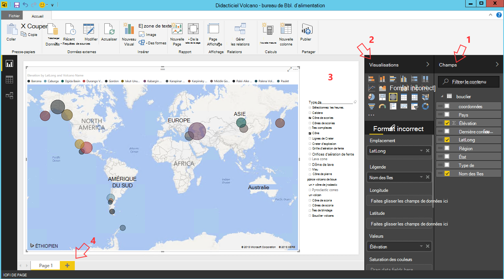

<properties
    pageTitle="Dix choses à faire sur la science de données Machine virtuelle | Microsoft Azure"
    description="Exécuter divers exploration de données et les tâches de modélisation sur la science de données Machine virtuelle."
    services="machine-learning"
    documentationCenter=""
    authors="bradsev"
    manager="jhubbard"
    editor="cgronlun"  />

<tags
    ms.service="machine-learning"
    ms.workload="data-services"
    ms.tgt_pltfrm="na"
    ms.devlang="na"
    ms.topic="article"
    ms.date="08/29/2016"
    ms.author="gokuma;weig;bradsev" />

# <a name="ten-things-you-can-do-on-the-data-science-virtual-machine"></a>Dix choses à que faire sur la science de données Machine virtuelle

La Machine virtuelle de Science des données de Microsoft (DSVM) est un environnement de développement de la science de données puissante qui vous permet d’effectuer différentes tâches de modélisation et d’exploration de données. L’environnement est déjà créé et livré avec plusieurs outils d’analytique des données les plus courants qui facilitent la mise en route rapidement votre analyse sur site, les déploiements de nuage ou hybride. Le DSVM travaille en étroite collaboration avec de nombreux services Azure et est en mesure de lire et de traiter les données déjà stockées sur Azure, dans l’entrepôt de données de SQL Azure, lac de données Azure, le stockage Azure, ou DocumentDB. Il peut également exploiter les autres outils d’analytique tels que de la formation de Machine d’Azure et d’Azure Data Factory.


Dans cet article nous vous guider dans l’utilisation de votre DSVM d’effectuer diverses tâches de science de données et d’interagir avec d’autres services Azure. Voici certaines des choses que vous pouvez effectuer sur le DSVM :

1. Explorer des données et de développer des modèles localement sur la DSVM à l’aide de Microsoft R Server, les Python
2. Permet de tester une version prêt d’entreprise conçu pour les performances et l’évolutivité de r vos données sur un navigateur à l’aide de 2 de Python, Python 3 Microsoft R un portable Jupyter
3. Effectuent des modèles créés à partir de R et les Python sur Azure Machine Learning afin que les applications clientes puissent accéder à vos modèles à l’aide d’une interface de services web simple
4. Administrer vos ressources Azure à l’aide d’Azure portal ou Powershell
5. Augmentez votre espace de stockage et de partager des groupes de données à grande échelle / de code au sein de votre équipe tout en créant un fichier de stockage Azure sous la forme d’un lecteur monté sur votre DSVM
6. Partager du code avec votre équipe à l’aide de Github et accéder à votre référentiel à l’aide de préinstallé Git clients - Git Bash, Git GUI.
7. Accéder aux différents Azure données et analytique services comme stockage de blob Azure, lac de données Azure, Azure HDInsight (Hadoop), DocumentDB d’Azure, entrepôt de données SQL Azure et les bases de données
8. Génération de rapports et tableau de bord à l’aide de bureau BI alimentation pré-installé sur le DSVM et les déployer sur le nuage
9. Échelle votre DSVM pour répondre aux besoins de votre projet de manière dynamique
10. Installer les outils supplémentaires sur votre machine virtuelle   


>[AZURE.NOTE] Frais d’utilisation supplémentaires seront appliquent pour la plupart des autres services de données analytique et de stockage répertoriés dans cet article. Reportez-vous à la page [Tarification d’Azure](https://azure.microsoft.com/pricing/) pour plus de détails.


**Conditions préalables**

- Vous aurez besoin d’un abonnement Azure. Vous pouvez vous inscrire pour un gratuit d’évaluation [ici](https://azure.microsoft.com/free/).

- Instructions pour la mise en service d’une Science Virtual Machine des données sur le portail Azure sont disponibles lors de la [Création d’une machine virtuelle](https://portal.azure.com/#create/microsoft-ads.standard-data-science-vmstandard-data-science-vm).

## <a name="1-explore-data-and-develop-models-using-microsoft-r-server-or-python"></a>1. Explorer des données et de développer des modèles à l’aide de Microsoft R Server ou les Python

Vous pouvez utiliser les langages tels que R et les Python pour effectuer votre analytique des données sur la DSVM.

Pour R, vous pouvez utiliser un IDE appelé « Révolution R Enterprise 8.0 » que vous trouverez sur le menu Démarrer ou du bureau. Microsoft a fourni des bibliothèques supplémentaires sur l’Open source/CRAN-R pour activer analytique évolutive et analyser les données plus importante que la taille de mémoire autorisée en effectuant l’analyse mémorisé en bloc parallèle. Vous pouvez également installer un IDE R de votre choix comme [RStudio](https://www.rstudio.com/products/rstudio-desktop/).

Pour les Python, vous pouvez utiliser un IDE comme Visual Studio Community Edition doté des outils Python pour l’extension de Visual Studio (PTVS) déjà installée. Par défaut, uniquement un 2.7 Python de base est configurée sur PTVS (sans aucune bibliothèque analytique, comme SciKit, Pandas). Pour activer la Anaconda Python 2.7 et 3.5, vous devez effectuer les opérations suivantes :

* Créer des environnements personnalisés pour chaque version, accédez à **Outils** -> **Outils de Python** -> **Les environnements Python** et puis en cliquant sur «**+ personnalisé**» dans l’édition de communauté Visual Studio 2015
* Donner une description et définir les chemins d’accès de préfixe environnement en tant que *c:\anaconda* de Anaconda Python 2.7 ou *c:\anaconda\envs\py35* pour Anaconda Python 3.5
* Cliquez sur **Détection automatique** , puis sur **Appliquer** pour enregistrer l’environnement.

Voici à quoi ressemble la configuration de l’environnement personnalisé dans Visual Studio.


Reportez-vous à la [documentation de PTVS](https://github.com/Microsoft/PTVS/wiki/Selecting-and-Installing-Python-Interpreters#hey-i-already-have-an-interpreter-on-my-machine-but-ptvs-doesnt-seem-to-know-about-it) pour plus de détails sur la façon de créer des environnements de Python.

Maintenant vous sont configurés pour créer un nouveau projet de Python. Naviguez jusqu’au **fichier** -> **Nouveau** -> **projet** -> **Python** et sélectionnez le type d’application que vous développez Python. Vous pouvez définir l’environnement Python pour le projet en cours vers la nouvelle version (Anaconda 2.7 ou 3.5) : droit de l' **environnement de Python**, sélectionnez **Ajouter/supprimer des environnements Python**et puis sélectionnez l’environnement souhaité à associer au projet. Vous trouverez plus d’informations sur l’utilisation de PTVS dans la page de la [documentation](https://github.com/Microsoft/PTVS/wiki) produit.

## <a name="2-using-a-jupyter-notebook-to-explore-and-model-your-data-with-python-or-r"></a>2. à l’aide d’un portable Jupyter pour découvrir et modéliser vos données avec les Python ou R

Le Jupyter est un environnement puissant qui fournit un navigateur IDE basé sur « » pour la modélisation et l’exploration de données. Vous pouvez utiliser les Python 2, les Python 3 ou R (ouvrir la Source et le serveur de R Microsoft) dans un ordinateur portable de Jupyter.

Pour lancer le clic Jupyter bloc-notes sur l’icône du menu Démarrer / de l’icône du bureau intitulé **Jupyter bloc-notes**. Sur le DSVM vous pouvez également localiser « https://localhost:9999 / » pour accéder à l’ordinateur portable de Jupiter. S’il vous demande un mot de passe, suivez les instructions fournies dans la section ***comment créer un mot de passe sur le serveur de carnet de Jupyter*** de la rubrique de [la Machine virtuelle Microsoft données Science de disposition](machine-learning-data-science-provision-vm.md) pour créer un mot de passe pour accéder à l’ordinateur portable de Jupyter. 

Une fois que vous avez ouvert le bloc-notes, vous verrez un répertoire qui contient quelques exemple les ordinateurs portables qui sont intégrées dans le DSVM. Vous pouvez maintenant :

- Cliquez sur dans le bloc-notes pour afficher le code.
- Exécutez chaque cellule en appuyant sur **MAJ + ENTRÉE**.
- Exécutez le bloc-notes en cliquant sur **cellule** -> **exécuter**
- créer un bloc-notes en cliquant sur l’icône de le Jupyter (angle supérieur gauche), puis en cliquant sur bouton de **Nouveau** sur la droite et puis en sélectionnant la langue de l’ordinateur portable (également connu sous le nom noyaux).   


>[AZURE.NOTE] Actuellement, nous prenons en charge Python 2.7, les Python 3.5 et R. Le noyau de R prend en charge la programmation dans Open source R ainsi que sur l’entreprise évolutive Microsoft R Server.   


Dès que vous êtes dans le bloc-notes, vous pouvez Explorer vos données, construire le modèle, de tester le modèle de bibliothèques de votre choix.


## <a name="3-build-models-using-r-or-python-and-operationalize-them-using-azure-machine-learning"></a>3. création de modèles à l’aide de R ou les Python et effectuent leur apprentissage automatique de Azure

Une fois que vous avez créé et validé votre modèle de l’étape suivante consiste généralement à le déployer en production. Cela permet à votre client applications appeler les prévisions de modèle sur un temps réel ou sur une base de mode de traitement par lots. Formation de Machine Azure fournit un mécanisme pour mettre un modèle intégré dans R ou Python.

Lorsque vous mettre votre modèle dans la formation de Machine d’Azure, qui permet aux clients d’effectuer des appels reste passent les paramètres d’entrée et de recevoir des prévisions à partir du modèle en tant que sorties est exposé par un service web.   


>[AZURE.NOTE] Si vous n’avez pas encore inscrit pour AzureML, vous pouvez obtenir un espace de travail disponible ou un espace de travail standard en visitant la page d’accueil [AzureML Studio](https://studio.azureml.net/) et en cliquant sur « Démarrer ».   


### <a name="build-and-operationalize-python-models"></a>Modèles de build et effectuent les Python

Voici un extrait de code de développé dans un ordinateur portable Jupyter Python qui génère un modèle simple à l’aide de la bibliothèque de SciKit-en savoir plus.

    #IRIS classification
    from sklearn import datasets
    from sklearn import svm
    clf = svm.SVC()
    iris = datasets.load_iris()
    X, y = iris.data, iris.target
    clf.fit(X, y)

La méthode utilisée pour déployer vos modèles de python à formation de Machine Azure encapsule la prédiction du modèle dans une fonction et il décore avec les attributs fournis par la bibliothèque de python Azure Machine Learning préinstallée qui désignent votre nom d’espace de travail formation de Machine d’Azure, clé d’API et l’entrée et retournent des paramètres.  

    from azureml import services
    @services.publish(workspaceid, auth_token)
    @services.types(sep_l = float, sep_w = float, pet_l=float, pet_w=float)
    @services.returns(int) #0, or 1, or 2
    def predictIris(sep_l, sep_w, pet_l, pet_w):
    inputArray = [sep_l, sep_w, pet_l, pet_w]
    return clf.predict(inputArray)

Un client peut désormais effectuer des appels au service web. Il existe des wrappers de commodité qui construisent des requêtes de l’API REST. Voici un exemple de code pour consommer le service web.

    # Consume through web service URL and keys
    from azureml import services
    @services.service(url, api_key)
    @services.types(sep_l = float, sep_w = float, pet_l=float, pet_w=float)
    @services.returns(float)
    def IrisPredictor(sep_l, sep_w, pet_l, pet_w):
    pass

    IrisPredictor(3,2,3,4)


>[AZURE.NOTE] La bibliothèque de formation de Machine Azure est seulement et actuellement pris en charge sur les Python 2.7.   


### <a name="build-and-operationalize-r-models"></a>Modèles de build et effectuent des R

Vous pouvez déployer des modèles de R générés sur la Machine virtuelle de données scientifiques ou ailleurs sur la formation de Machine Azure d’une manière semblable à la façon dont ceci est effectué pour les Python. Ses étapes :

- créer un fichier settings.json comme indiqué ci-dessous pour fournir votre ID de l’espace de travail et l’authentification de jeton.
- rédiger un wrapper pour le modèle prévision de fonction.
- Appelez ```publishWebService``` dans la bibliothèque de formation de Machine Azure pour passer dans le wrapper de fonction.  

Voici les extraits de code de procédure et le code qui peuvent être utilisés pour configurer, créer, publier et consommer un modèle sous la forme d’un service web dans la formation de Machine Azure.

#### <a name="setup"></a>Programme d’installation

1.  Installez le package AzureML R en tapant ```install.packages("AzureML")``` dans l’IDE de révolution R Enterprise 8.0 ou votre IDE R.
2.  Téléchargez RTools à partir [d’ici](https://cran.r-project.org/bin/windows/Rtools/). Vous avez besoin de l’utilitaire zip dans le chemin d’accès (et nommée zip.exe) pour mettre votre package R dans AzureML.
3.  Créer un fichier settings.json dans un répertoire appelé ```.azureml``` dans votre répertoire de base et entrez les paramètres de votre espace de travail Azure ML :

Settings.JSON structure de fichier :

    {"workspace":{
    "id"                  : "ENTER YOUR AZUREML WORKSPACE ID",
    "authorization_token" : "ENTER YOUR AZUREML AUTH TOKEN"
    }}


#### <a name="build-a-model-in-r-and-publish-it-in-azure-ml"></a>Créer un modèle de R et le publier dans Azure ML

    library(AzureML)
    ws <- workspace(config="~/.azureml/settings.json")

    if(!require("lme4")) install.packages("lme4")
    library(lme4)
    set.seed(1)
    train <- sleepstudy[sample(nrow(sleepstudy), 120),]
    m <- lm(Reaction ~ Days + Subject, data = train)

    # Define a prediction function to publish based on the model:
    sleepyPredict <- function(newdata){
        predict(m, newdata=newdata)
    }

    ep <- publishWebService(ws, fun = sleepyPredict, name="sleepy lm", inputSchema = sleepstudy, data.frame=TRUE)

#### <a name="consume-the-model-deployed-in-azure-ml"></a>Utiliser le modèle déployé dans Azure ML

Pour utiliser le modèle à partir d’une application cliente, nous utilisons la bibliothèque Azure Machine Learning pour rechercher le service web publié à l’aide de nom du `services` appel API pour déterminer le point de terminaison. Vous venez d’appeler le `consume` fonction et passer dans le cadre des données à prévoir.
Le code suivant permet de consommer le modèle publié sous la forme d’un service web de formation de Machine Azure.


    library(AzureML)
    library(lme4)
    ws <- workspace(config="~/.azureml/settings.json")

    s <-  services(ws, name = "sleepy lm")
    s <- tail(s, 1) # use the last published function, in case of duplicate function names

    ep <- endpoints(ws, s)

    # OK, try this out, and compare with raw data
    ans = consume(ep, sleepstudy)$ans

Vous trouverez plus d’informations sur la bibliothèque Azure Machine Learning R [ici](https://cran.r-project.org/web/packages/AzureML/AzureML.pdf).


## <a name="4-administer-your-azure-resources-using-azure-portal-or-powershell"></a>4. administrer vos ressources Azure à l’aide d’Azure portal ou Powershell

Le DSVM non seulement vous permet de générer votre solution analytique de localement sur l’ordinateur virtuel, mais vous permet également d’accéder aux services sur Azure cloud de Microsoft. Azure fournit plusieurs stockage, services d’analytique de données et autres services que vous pouvez administrer et y accéder à partir de votre DSVM.

Pour administrer les ressources de votre abonnement et nuage Azure, vous pouvez utiliser votre navigateur et pointez sur le [portail Azure](https://portal.azure.com). Vous pouvez également utiliser Azure Powershell pour administrer votre abonnement Azure et les ressources à l’aide d’un script.
Vous pouvez exécuter Azure Powershell à partir d’un raccourci sur le bureau ou dans le menu de démarrage intitulé « Microsoft Azure Powershell ». Pour plus d’informations sur la façon dont vous pouvez administrer votre abonnement Azure et les ressources à l’aide de scripts Windows Powershell, reportez-vous à la [documentation de Microsoft Azure Powershell](../powershell-azure-resource-manager.md) .


## <a name="5-extend-your-storage-space-with-a-shared-file-system"></a>5. d’étendre votre espace de stockage avec un système de fichiers partagés

Les scientifiques de données peuvent partager des grands ensembles de données, de code ou d’autres ressources au sein de l’équipe. Le DSVM lui-même a environ 70 Go d’espace disponible. Pour étendre votre système de stockage, vous pouvez utiliser le Service de fichiers Azure et soit le monter sur le DSVM ou y accéder via une API REST.   


>[AZURE.NOTE] L’espace maximal de la part du Service de fichiers Azure est 5 To et limite de taille de fichier est de 1 To.   


Vous pouvez utiliser Powershell d’Azure pour créer un partage de Service de fichiers Azure. Voici le script à s’exécuter sous PowerShell Azure pour créer un partage de fichier d’Azure service.

    # Authenticate to Azure.
    Login-AzureRmAccount
    # Select your subscription
    Get-AzureRmSubscription –SubscriptionName "<your subscription name>" | Select-AzureRmSubscription
    # Create a new resource group.
    New-AzureRmResourceGroup -Name <dsvmdatarg>
    # Create a new storage account. You can reuse existing storage account if you wish.
    New-AzureRmStorageAccount -Name <mydatadisk> -ResourceGroupName <dsvmdatarg> -Location "<Azure Data Center Name For eg. South Central US>" -Type "Standard_LRS"
    # Set your current working storage account
    Set-AzureRmCurrentStorageAccount –ResourceGroupName "<dsvmdatarg>" –StorageAccountName <mydatadisk>

    # Create a Azure File Service Share
    $s = New-AzureStorageShare <<teamsharename>>
    # Create a directory under the FIle share. You can give it any name
    New-AzureStorageDirectory -Share $s -Path <directory name>
    # List the share to confirm that everything worked
    Get-AzureStorageFile -Share $s


Maintenant que vous avez créé un partage de fichier Azure, vous pouvez le monter dans n’importe quelle machine virtuelle dans Azure. Il est fortement recommandé que l’ordinateur virtuel est dans le même centre de données Azure du compte de stockage pour éviter des frais de transfert de données et la latence. Voici les commandes à monter le lecteur sur le DSVM que vous pouvez exécuter sur Azure Powershell.


    # Get storage key of the storage account that has the Azure file share from Azure portal. Store it securely on the VM to avoid prompted in next command.
    cmdkey /add:<<mydatadisk>>.file.core.windows.net /user:<<mydatadisk>> /pass:<storage key>

    # Mount the Azure file share as Z: drive on the VM. You can chose another drive letter if you wish
    net use z:  \\<mydatadisk>.file.core.windows.net\<<teamsharename>>


Vous pouvez maintenant accéder à ce lecteur comme vous le feriez pour n’importe quel lecteur normal sur l’ordinateur virtuel.

## <a name="6-share-code-with-your-team-using-github"></a>6. partager du code avec votre équipe à l’aide de Github

Github est un référentiel de code où vous pouvez trouver un grand nombre d’exemples de code et de sources pour les différents outils à l’aide de différentes technologies partagées par la Communauté des développeurs. Il utilise Git comme technologie de suivre et de stocker les versions des fichiers de code. Github est également une plateforme où vous pouvez créer votre propre référentiel pour stocker le code partagé et la documentation de votre équipe, de mettre en œuvre le contrôle de version et de contrôler également qui ont accès à afficher et y contribuer de code. Visitez les [pages d’aide Github](https://help.github.com/) pour plus d’informations sur l’utilisation de Git. Vous pouvez utiliser Github comme l’une des façons de collaborer avec votre équipe, utilisez du code développé par la Communauté et contribuer de code vers la Communauté.

Le DSVM déjà est livré avec des outils clients sur les ligne de commande sous la forme d’une interface utilisateur graphique bien pour accéder aux référentiels de Github. L’outil de ligne de commande avec Git et Github est appelé Git Bash. Visual Studio installé sur le DSVM a les extensions Git. Vous pouvez trouver des icônes de démarrage pour ces outils dans le menu Démarrer et du bureau.

Pour télécharger le code à partir d’un référentiel de Github que vous allez utiliser le ```git clone``` commande. Par exemple pour télécharger un référentiel de données scientifiques publié par Microsoft dans le répertoire en cours, vous pouvez exécuter la commande suivante une fois que vous êtes dans ```git-bash```.

    git clone https://github.com/Azure/Azure-MachineLearning-DataScience.git

Dans Visual Studio, vous pouvez effectuer la même opération de clonage. L’écran ci-dessous indique comment accéder aux outils Git et Github dans Visual Studio.


Vous trouverez plus d’informations sur l’utilisation de Git pour travailler avec votre référentiel Github plusieurs ressources disponibles sur github.com. Le [mémento](https://training.github.com/kit/downloads/github-git-cheat-sheet.pdf) constitue une référence utile.


## <a name="7-access-various-azure-data-and-analytics-services"></a>7. d’accéder aux différents services de données et analytique Azure

### <a name="azure-blob"></a>Blob Azure

Blob Azure est un stockage en nuage fiable et économique pour les données de grandes et petites. Examinons comment vous pouvez déplacer des données Blob d’Azure et d’accéder aux données stockées dans un Blob Azure.

**Condition préalable**

- **Créez votre compte de stockage Azure Blob à partir du [portail Azure](https://portal.azure.com).**


- Vérifiez que l’outil AzCopy préinstallée de ligne de commande se trouve à ```C:\Program Files (x86)\Microsoft SDKs\Azure\AzCopy\azcopy.exe```. Vous pouvez ajouter le répertoire qui contient le azcopy.exe à votre variable d’environnement PATH pour éviter de taper le chemin d’accès de l’intégralité de la commande lors de l’exécution de cet outil. Pour plus d’informations sur l’outil de AzCopy reportez-vous à la [documentation de AzCopy](../storage/storage-use-azcopy.md)

- Démarrez l’outil Explorateur de stockage Azure. Il peut être téléchargé à partir de [l’Explorateur de stockage Microsoft Azure](http://storageexplorer.com/). 


**Déplacer les données à partir de la machine virtuelle vers Azure Blob : AzCopy**

Pour déplacer des données entre vos fichiers locaux et le stockage des objets blob, vous pouvez utiliser AzCopy dans la ligne de commande ou de PowerShell :

    AzCopy /Source:C:\myfolder /Dest:https://<mystorageaccount>.blob.core.windows.net/<mycontainer> /DestKey:<storage account key> /Pattern:abc.txt

Le chemin d’accès où se trouve votre fichier, **mystorageaccount** à votre nom de compte de stockage blob, **mycontainer** pour le nom du conteneur de **clé de compte de stockage** pour votre clé d’accès de stockage blob, remplacez **C:\MyFolder** . Vous pouvez trouver vos informations d’identification du compte de stockage [Azure portal](https://portal.azure.com).


Exécuter, commande AzCopy PowerShell ou à partir d’une invite de commande. Voici certains exemples d’utilisation de la commande de AzCopy :


    # Copy *.sql from local machine to a Azure Blob
    "C:\Program Files (x86)\Microsoft SDKs\Azure\AzCopy\azcopy" /Source:"c:\Aaqs\Data Science Scripts" /Dest:https://[ENTER STORAGE ACCOUNT].blob.core.windows.net/[ENTER CONTAINER] /DestKey:[ENTER STORAGE KEY] /S /Pattern:*.sql

    # Copy back all files from Azure Blob container to Local machine

    "C:\Program Files (x86)\Microsoft SDKs\Azure\AzCopy\azcopy" /Dest:"c:\Aaqs\Data Science Scripts\temp" /Source:https://[ENTER STORAGE ACCOUNT].blob.core.windows.net/[ENTER CONTAINER] /SourceKey:[ENTER STORAGE KEY] /S


Une fois que vous exécutez la commande AzCopy pour copier vers un blob Azure vous voir sous peu votre fichier s’affiche dans l’Explorateur de stockage Azure.


**Déplacer les données à partir de la machine virtuelle vers Azure Blob : Explorateur de stockage Azure**

Vous pouvez également télécharger des données à partir du fichier local de votre ordinateur virtuel à l’aide d’Explorateur de stockage Azure :

- Pour télécharger les données dans un conteneur, sélectionnez le conteneur cible, puis cliquez sur le bouton **Télécharger** .
- Cliquez sur le **...** à droite de la zone de **fichiers** , sélectionnez un ou plusieurs fichiers à télécharger à partir du système de fichier et cliquez sur **Télécharger** pour commencer à télécharger les fichiers.


**Lire les données d’objet Blob d’Azure : module de lecteur de fabricants agréés**

Dans un Studio de formation Azure Machine, vous pouvez utiliser un **module d’importation de données** pour lire les données à partir de votre objet.


**Lire les données d’objet Blob d’Azure : Python ODBC**

Bibliothèque de **BlobService** vous permet de lire directement les données blob dans un programme Jupyter bloc-notes ou les Python.

Tout d’abord, importation des packages requis :

    import pandas as pd
    from pandas import Series, DataFrame
    import numpy as np
    import matplotlib.pyplot as plt
    from time import time
    import pyodbc
    import os
    from azure.storage.blob import BlobService
    import tables
    import time
    import zipfile
    import random

Puis connectez vos informations d’identification du compte Azure Blob et lire les données d’objet Blob :

    CONTAINERNAME = 'xxx'
    STORAGEACCOUNTNAME = 'xxxx'
    STORAGEACCOUNTKEY = 'xxxxxxxxxxxxxxxx'
    BLOBNAME = 'nyctaxidataset/nyctaxitrip/trip_data_1.csv'
    localfilename = 'trip_data_1.csv'
    LOCALDIRECTORY = os.getcwd()
    LOCALFILE =  os.path.join(LOCALDIRECTORY, localfilename)

    #download from blob
    t1 = time.time()
    blob_service = BlobService(account_name=STORAGEACCOUNTNAME,account_key=STORAGEACCOUNTKEY)
    blob_service.get_blob_to_path(CONTAINERNAME,BLOBNAME,LOCALFILE)
    t2 = time.time()
    print(("It takes %s seconds to download "+BLOBNAME) % (t2 - t1))

    #unzipping downloaded files if needed
    #with zipfile.ZipFile(ZIPPEDLOCALFILE, "r") as z:
    #    z.extractall(LOCALDIRECTORY)

    df1 = pd.read_csv(LOCALFILE, header=0)
    df1.columns = ['medallion','hack_license','vendor_id','rate_code','store_and_fwd_flag','pickup_datetime','dropoff_datetime','passenger_count','trip_time_in_secs','trip_distance','pickup_longitude','pickup_latitude','dropoff_longitude','dropoff_latitude']
    print 'the size of the data is: %d rows and  %d columns' % df1.shape

Les données sont lues dans une trame de données sous la forme :


### <a name="azure-data-lake"></a>Lac de données Azure

Stockage Azure lac est un référentiel d’une évolutivité pour les charges de travail données analytique et compatible avec Hadoop Distributed fichier système très. Il fonctionne avec l’écosystème Hadoop et l’Analytique de LAC de données Azure. Nous montrent comment vous pouvez déplacer des données dans le magasin de LAC de données Azure et exécuter analytique à l’aide d’Azure données lac Analytique.

**Condition préalable**

- Créez votre Analytique de LAC de données Azure dans [Azure portal](https://portal.azure.com).


- Les **Outils de LAC de données Azure** dans **Visual Studio** , visitez ce [lien](https://www.microsoft.com/download/details.aspx?id=49504) est déjà installé sur l’édition de communauté de Visual Studio qui se trouve sur l’ordinateur virtuel. Après le démarrage de Visual Studio et l’ouverture de votre abonnement Azure, vous verrez votre compte d’Analytique de données Azure et leur stockage dans le panneau gauche de Visual Studio.


**Déplacer les données à partir de la machine virtuelle vers données lac : Explorateur de LAC de données Azure**

Vous pouvez utiliser **l’Explorateur de LAC de données Azure** pour télécharger des données à partir de fichiers locaux sur votre Machine virtuelle pour le stockage de données lac.


Vous pouvez également créer un pipeline de données pour productionize le déplacement des données vers ou à partir du lac de données Azure à l’aide de la [Factory(ADF) de données Azure](https://azure.microsoft.com/services/data-factory/). Nous vous consultez cet [article](https://azure.microsoft.com/blog/creating-big-data-pipelines-using-azure-data-lake-and-azure-data-factory/) pour vous guider à travers les étapes de génération les pipelines de données.

**Lire les données d’Azure Blob de données lac : U-SQL**

Si vos données résident dans le stockage Blob d’Azure, vous pouvez directement lire les données de blob de stockage Azure dans les requêtes SQL-U. Avant de composer votre requête SQL-U, assurez-vous que votre compte de stockage blob est lié à votre lac de données Azure. Accédez au **portail Azure**, trouver votre tableau de bord Azure données lac Analytique, cliquez sur **Ajouter une Source de données**, sélectionnez le type de stockage pour **Le stockage Azure** et branchez votre nom de compte de stockage Azure et la clé. Puis, vous serez en mesure de référencer les données stockées dans le compte de stockage.


Dans Visual Studio, vous pouvez lire les données depuis le stockage blob, effectuez la manipulation de certaines données, fonction d’ingénierie et les données résultantes pour Azure données lac ou de stockage des objets Blob Azure de sortie. Lorsque vous référencez les données dans le stockage blob, utilisez **wasb : / /**; Lorsque vous référencez les données de LAC de données Azure, utilisez **swbhdfs : / /**


Vous pouvez utiliser les requêtes suivantes de U-SQL dans Visual Studio :

    @a =
        EXTRACT medallion string,
                hack_license string,
                vendor_id string,
                rate_code string,
                store_and_fwd_flag string,
                pickup_datetime string,
                dropoff_datetime string,
                passenger_count int,
                trip_time_in_secs double,
                trip_distance double,
                pickup_longitude string,
                pickup_latitude string,
                dropoff_longitude string,
                dropoff_latitude string

        FROM "wasb://<Container name>@<Azure Blob Storage Account Name>.blob.core.windows.net/<Input Data File Name>"
        USING Extractors.Csv();

    @b =
        SELECT vendor_id,
        COUNT(medallion) AS cnt_medallion,
        SUM(passenger_count) AS cnt_passenger,
        AVG(trip_distance) AS avg_trip_dist,
        MIN(trip_distance) AS min_trip_dist,
        MAX(trip_distance) AS max_trip_dist,
        AVG(trip_time_in_secs) AS avg_trip_time
        FROM @a
        GROUP BY vendor_id;

    OUTPUT @b   
    TO "swebhdfs://<Azure Data Lake Storage Account Name>.azuredatalakestore.net/<Folder Name>/<Output Data File Name>"
    USING Outputters.Csv();

    OUTPUT @b   
    TO "wasb://<Container name>@<Azure Blob Storage Account Name>.blob.core.windows.net/<Output Data File Name>"
    USING Outputters.Csv();


Une fois votre requête est envoyée au serveur, un diagramme montrant le statut de votre travail s’affiche.


**Interroger des données situées données lac : U-SQL**

Une fois que le dataset est intégré dans le lac de données Azure, vous pouvez utiliser [U-SQL language](../data-lake-analytics/data-lake-analytics-u-sql-get-started.md) permet d’interroger et d’Explorer les données. Langue de U-SQL est similaire à T-SQL, mais il combine certaines fonctionnalités de C# afin que les utilisateurs puissent écrire des modules personnalisés, fonctions définies par l’utilisateur, etc.. Vous pouvez utiliser les scripts dans l’étape précédente.

Après la requête est soumise au serveur, tripdata_summary. CSV, vous pouvez trouver sous peu dans **l’Explorateur de LAC de données Azure**, vous pouvez afficher les données par le droit du fichier.


Pour afficher les informations du fichier :


### <a name="hdinsight-hadoop-clusters"></a>Clusters d’Hadoop HDInsight

HDInsight Azure est un service géré d’Apache Hadoop, étincelle, HBase et Storm sur le nuage. Vous pouvez travailler facilement avec les clusters Azure HDInsight à partir de la machine virtuelle de science données.

**Condition préalable**

- Créez votre compte de stockage Azure Blob à partir du [portail Azure](https://portal.azure.com). Ce compte de stockage est utilisé pour stocker des données pour les clusters de HDInsight.


- Personnaliser les Clusters Hadoop Azure HDInsight à partir du [portail Azure](machine-learning-data-science-customize-hadoop-cluster.md)

  - Vous devez lier le compte de stockage créé avec votre cluster HDInsight lorsqu’il est créé. Ce compte de stockage est utilisé pour accéder aux données qui peuvent être traitées au sein du cluster.


  - Vous devez activer **l’Accès distant** pour le nœud de tête du cluster après sa création. Gardez à l’esprit les informations d’identification d’accès distant vous spécifiez ici (diffère de celui spécifié pour le cluster lors de sa création) : vous en aurez besoin ci-dessous.


  - Créer un espace de travail Azure ML. Vos expériences d’apprentissage Machine seront stockés dans cet espace de travail de ML. Sélectionnez les options de mise en surbrillance dans le portail, comme illustré dans la capture d’écran ci-dessous.


  - Puis entrez les paramètres pour votre espace de travail Azure ML


  - Télécharger des données à l’aide du bloc-notes de IPython. Importation des packages requis tout d’abord, branchez les informations d’identification, créer une base de données de votre compte de stockage, puis charger les données dans les clusters HDI.


        #Import required Packages
        import pyodbc
        import time as time
        import json
        import os
        import urllib
        import urllib2
        import warnings
        import re
        import pandas as pd
        import matplotlib.pyplot as plt
        from azure.storage.blob import BlobService
        warnings.filterwarnings("ignore", category=UserWarning, module='urllib2')


        #Create the connection to Hive using ODBC
        SERVER_NAME='xxx.azurehdinsight.net'
        DATABASE_NAME='nyctaxidb'
        USERID='xxx'
        PASSWORD='xxxx'
        DB_DRIVER='Microsoft Hive ODBC Driver'
        driver = 'DRIVER={' + DB_DRIVER + '}'
        server = 'Host=' + SERVER_NAME + ';Port=443'
        database = 'Schema=' + DATABASE_NAME
        hiveserv = 'HiveServerType=2'
        auth = 'AuthMech=6'
        uid = 'UID=' + USERID
        pwd = 'PWD=' + PASSWORD
        CONNECTION_STRING = ';'.join([driver,server,database,hiveserv,auth,uid,pwd])
        connection = pyodbc.connect(CONNECTION_STRING, autocommit=True)
        cursor=connection.cursor()


        #Create Hive database and tables
        queryString = "create database if not exists nyctaxidb;"
        cursor.execute(queryString)

        queryString = """
                        create external table if not exists nyctaxidb.trip
                        (
                            medallion string,
                            hack_license string,
                            vendor_id string,
                            rate_code string,
                            store_and_fwd_flag string,
                            pickup_datetime string,
                            dropoff_datetime string,
                            passenger_count int,
                            trip_time_in_secs double,
                            trip_distance double,
                            pickup_longitude double,
                            pickup_latitude double,
                            dropoff_longitude double,
                            dropoff_latitude double)  
                        PARTITIONED BY (month int)
                        ROW FORMAT DELIMITED FIELDS TERMINATED BY ',' lines terminated by '\\n'
                        STORED AS TEXTFILE LOCATION 'wasb:///nyctaxidbdata/trip' TBLPROPERTIES('skip.header.line.count'='1');
                    """
        cursor.execute(queryString)

        queryString = """
                        create external table if not exists nyctaxidb.fare
                        (
                            medallion string,
                            hack_license string,
                            vendor_id string,
                            pickup_datetime string,
                            payment_type string,
                            fare_amount double,
                            surcharge double,
                            mta_tax double,
                            tip_amount double,
                            tolls_amount double,
                            total_amount double)
                        PARTITIONED BY (month int)
                        ROW FORMAT DELIMITED FIELDS TERMINATED BY ',' lines terminated by '\\n'
                        STORED AS TEXTFILE LOCATION 'wasb:///nyctaxidbdata/fare' TBLPROPERTIES('skip.header.line.count'='1');
                    """
        cursor.execute(queryString)


        #Upload data from blob storage to HDI cluster
        for i in range(1,13):
            queryString = "LOAD DATA INPATH 'wasb:///nyctaxitripraw2/trip_data_%d.csv' INTO TABLE nyctaxidb2.trip PARTITION (month=%d);"%(i,i)
            cursor.execute(queryString)
            queryString = "LOAD DATA INPATH 'wasb:///nyctaxifareraw2/trip_fare_%d.csv' INTO TABLE nyctaxidb2.fare PARTITION (month=%d);"%(i,i)  
            cursor.execute(queryString)


- Alternativement, vous pouvez suivre cette [procédure pas à pas](machine-learning-data-science-process-hive-walkthrough.md) pour charger des données de NYC Taxi sur cluster HDI. Étapes principales sont les suivantes :

    - AzCopy : téléchargement compressés de CSV à partir de l’objet blob public dans votre dossier local
    - AzCopy : télécharger unzipped CSV dossier local vers un cluster HDI
    - Ouvrez une session dans le nœud de tête du cluster d’Hadoop et préparer pour l’analyse exploratoire

Une fois les données chargées au cluster HDI, vous pouvez vérifier vos données dans l’Explorateur de stockage Azure. Et que vous disposez d’un nyctaxidb de la base de données créé dans HDI cluster.


**Exploration de données : requêtes de ruche dans les Python**

Dans la mesure où les données sont dans le cluster d’Hadoop, vous pouvez utiliser le package pyodbc pour se connecter à la base de données Hadoop Clusters et de requête à l’aide de la ruche à faire d’exploration et d’ingénierie. Vous pouvez afficher les tables existantes, que nous avons créés à l’étape préalable.

    queryString = """
        show tables in nyctaxidb2;
        """
    pd.read_sql(queryString,connection)


Examinons le nombre d’enregistrements dans chaque mois et la fréquence des pourboires ou pas dans la table de sortie :

    queryString = """
        select month, count(*) from nyctaxidb.trip group by month;
        """
    results = pd.read_sql(queryString,connection)

    %matplotlib inline

    results.columns = ['month', 'trip_count']
    df = results.copy()
    df.index = df['month']
    df['trip_count'].plot(kind='bar')


    queryString = """
        SELECT tipped, COUNT(*) AS tip_freq
        FROM
        (
            SELECT if(tip_amount > 0, 1, 0) as tipped, tip_amount
            FROM nyctaxidb.fare
        )tc
        GROUP BY tipped;
        """
    results = pd.read_sql(queryString,connection)

    results.columns = ['tipped', 'trip_count']
    df = results.copy()
    df.index = df['tipped']
    df['trip_count'].plot(kind='bar')


Nous pouvons également calculer la distance entre l’emplacement de prélèvement et de l’emplacement de cette chute et de la comparer à la distance de déplacement.

    queryString = """
                    select pickup_longitude, pickup_latitude, dropoff_longitude, dropoff_latitude, trip_distance, trip_time_in_secs,
                        3959*2*2*atan((1-sqrt(1-pow(sin((dropoff_latitude-pickup_latitude)
                        *radians(180)/180/2),2)-cos(pickup_latitude*radians(180)/180)
                        *cos(dropoff_latitude*radians(180)/180)*pow(sin((dropoff_longitude-pickup_longitude)*radians(180)/180/2),2)))
                        /sqrt(pow(sin((dropoff_latitude-pickup_latitude)*radians(180)/180/2),2)
                        +cos(pickup_latitude*radians(180)/180)*cos(dropoff_latitude*radians(180)/180)*
                        pow(sin((dropoff_longitude-pickup_longitude)*radians(180)/180/2),2))) as direct_distance
                        from nyctaxidb.trip
                        where month=1
                            and pickup_longitude between -90 and -30
                            and pickup_latitude between 30 and 90
                            and dropoff_longitude between -90 and -30
                            and dropoff_latitude between 30 and 90;
                """
    results = pd.read_sql(queryString,connection)
    results.head(5)


    results.columns = ['pickup_longitude', 'pickup_latitude', 'dropoff_longitude',
                       'dropoff_latitude', 'trip_distance', 'trip_time_in_secs', 'direct_distance']
    df = results.loc[results['trip_distance']<=100] #remove outliers
    df = df.loc[df['direct_distance']<=100] #remove outliers
    plt.scatter(df['direct_distance'], df['trip_distance'])


Maintenant nous allons préparer un jeu de (1 %) de sous-échantillonnée de données pour la modélisation. Nous pouvons utiliser ces données dans le module de lecteur de fabricants agréés.


        queryString = """
        create  table if not exists nyctaxi_downsampled_dataset_testNEW (
        medallion string,
        hack_license string,
        vendor_id string,
        rate_code string,
        store_and_fwd_flag string,
        pickup_datetime string,
        dropoff_datetime string,
        pickup_hour string,
        pickup_week string,
        weekday string,
        passenger_count int,
        trip_time_in_secs double,
        trip_distance double,
        pickup_longitude double,
        pickup_latitude double,
        dropoff_longitude double,
        dropoff_latitude double,
        direct_distance double,
        payment_type string,
        fare_amount double,
        surcharge double,
        mta_tax double,
        tip_amount double,
        tolls_amount double,
        total_amount double,
        tipped string,
        tip_class string
        )
        row format delimited fields terminated by ','
        lines terminated by '\\n'
        stored as textfile;
        """
        cursor.execute(queryString)

        --- now insert contents of the join into the above internal table

        queryString = """
        insert overwrite table nyctaxi_downsampled_dataset_testNEW
        select
        t.medallion,
        t.hack_license,
        t.vendor_id,
        t.rate_code,
        t.store_and_fwd_flag,
        t.pickup_datetime,
        t.dropoff_datetime,
        hour(t.pickup_datetime) as pickup_hour,
        weekofyear(t.pickup_datetime) as pickup_week,
        from_unixtime(unix_timestamp(t.pickup_datetime, 'yyyy-MM-dd HH:mm:ss'),'u') as weekday,
        t.passenger_count,
        t.trip_time_in_secs,
        t.trip_distance,
        t.pickup_longitude,
        t.pickup_latitude,
        t.dropoff_longitude,
        t.dropoff_latitude,
        t.direct_distance,
        f.payment_type,
        f.fare_amount,
        f.surcharge,
        f.mta_tax,
        f.tip_amount,
        f.tolls_amount,
        f.total_amount,
        if(tip_amount>0,1,0) as tipped,
        if(tip_amount=0,0,
        if(tip_amount>0 and tip_amount<=5,1,
        if(tip_amount>5 and tip_amount<=10,2,
        if(tip_amount>10 and tip_amount<=20,3,4)))) as tip_class
        from
        (
        select
        medallion,
        hack_license,
        vendor_id,
        rate_code,
        store_and_fwd_flag,
        pickup_datetime,
        dropoff_datetime,
        passenger_count,
        trip_time_in_secs,
        trip_distance,
        pickup_longitude,
        pickup_latitude,
        dropoff_longitude,
        dropoff_latitude,
        3959*2*2*atan((1-sqrt(1-pow(sin((dropoff_latitude-pickup_latitude)
        radians(180)/180/2),2)-cos(pickup_latitude*radians(180)/180)
        *cos(dropoff_latitude*radians(180)/180)*pow(sin((dropoff_longitude-pickup_longitude)*radians(180)/180/2),2)))
        /sqrt(pow(sin((dropoff_latitude-pickup_latitude)*radians(180)/180/2),2)
        +cos(pickup_latitude*radians(180)/180)*cos(dropoff_latitude*radians(180)/180)*pow(sin((dropoff_longitude-pickup_longitude)*radians(180)/180/2),2))) as direct_distance,
        rand() as sample_key

        from trip
        where pickup_latitude between 30 and 90
            and pickup_longitude between -90 and -30
            and dropoff_latitude between 30 and 90
            and dropoff_longitude between -90 and -30
        )t
        join
        (
        select
        medallion,
        hack_license,
        vendor_id,
        pickup_datetime,
        payment_type,
        fare_amount,
        surcharge,
        mta_tax,
        tip_amount,
        tolls_amount,
        total_amount
        from fare
        )f
        on t.medallion=f.medallion and t.hack_license=f.hack_license and t.pickup_datetime=f.pickup_datetime
        where t.sample_key<=0.01
        """
        cursor.execute(queryString)

Après un certain temps, vous pouvez voir que les données a été chargées dans les clusters Hadoop :

    queryString = """
        select * from nyctaxi_downsampled_dataset limit 10;
        """
    cursor.execute(queryString)
    pd.read_sql(queryString,connection)


**Lire des données à partir de HDI à l’aide de la liste d’articles fabricant : module de lecteur**

Vous pouvez également utiliser le module de **lecteur** de studio de fabricants agréés pour accéder à la base de données dans le cluster d’Hadoop. Branchez les informations d’identification de votre compte de stockage Azure et de HDI clusters et vous serez en mesure de construire des modèles d’apprentissage machine à l’aide de la base de données dans les clusters HDI.


Le groupe de données évaluée s’affichent alors :


### <a name="azure-sql-data-warehouse--databases"></a>Azure SQL Data Warehouse et les bases de données

Entrepôt de données SQL Azure est un entrepôt de données élastique en tant que service ayant une expérience de classe entreprise de SQL Server.

Vous pouvez configurer votre entrepôt de données de SQL Azure en suivant les instructions fournies dans cet [article](../sql-data-warehouse/sql-data-warehouse-get-started-provision.md). Une fois que vous mettez en service votre entrepôt de données de SQL Azure, vous pouvez utiliser cette [procédure pas à pas](machine-learning-data-science-process-sqldw-walkthrough.md) pour effectuer le téléchargement des données, l’exploration et la modélisation à l’aide de données dans l’entrepôt de données SQL.

#### <a name="azure-documentdb"></a>DocumentDB Azure

DocumentDB Azure est une base de données NoSQL dans le nuage. Il vous permet de travailler avec des documents, tels que JSON et vous permet de stocker et d’interroger des documents.

Vous devez procéder comme suit par-requis pour accéder à DocumentDB à partir de la DSVM.

1. Installer le Kit de développement de Python DocumentDB (exécuter ```pip install pydocumentdb``` à partir de l’invite de commande)
1. Créer le compte de DocumentDB et de la base de données de la base de données de Document à partir du [portail Azure](https://portal.azure.com)
1. Télécharger le « Outil de Migration de DocumentDB » à partir [d’ici](http://www.microsoft.com/downloads/details.aspx?FamilyID=cda7703a-2774-4c07-adcc-ad02ddc1a44d) et l’extraire vers un répertoire de votre choix.
1. Importer des données JSON (données volcano) stockées sur un [blob publique](https://cahandson.blob.core.windows.net/samples/volcano.json) en DocumentDB les suivantes des paramètres de commande pour l’outil de migration (dtui.exe à partir du répertoire où vous avez installé l’outil de Migration de DocumentDB). Entrez la source et cible les paramètres d’emplacement ci-dessous.

    /s:JsonFile /s.Files:https://cahandson.blob.core.windows.net/samples/volcano.json /t:DocumentDBBulk /t.ConnectionString:AccountEndpoint=https://[DocDBAccountName].documents.azure.com:443/ ; AccountKey = [[KEY] ; base de données = îles /t.Collection:volcano1

Une fois que vous importez des données, vous pouvez accéder à Jupyter et ouvrez le bloc-notes intitulé *DocumentDBSample* , qui contient le code python pour accéder à DocumentDB et effectuer des requêtes de base. Vous pouvez en savoir plus sur les DocumentDB en visitant la [page de la documentation](https://azure.microsoft.com/documentation/learning-paths/documentdb/) du service


## <a name="8-build-reports-and-dashboard-using-the-power-bi-desktop"></a>8. créer des rapports et tableaux de bord à l’aide de bureau BI d’alimentation

Nous visualiser le fichier Volcano JSON que nous l’avons vu dans l’exemple DocumentDB ci-dessus dans BI de puissance à comprendre visuel des données. Les étapes détaillées sont disponibles dans l' [article de puissance BI](../documentdb/documentdb-powerbi-visualize.md). Les étapes de haut niveau sont ci-dessous :

1. Ouvrir le bureau de BI de puissance et faire « Get Data ». Spécifiez l’URL sous la forme : https://cahandson.blob.core.windows.net/samples/volcano.json
2. Vous devez voir les enregistrements JSON importés sous forme de liste
3. Convertir la liste dans une table de sorte que PowerBI fonctionne avec le même
4. Développez les colonnes en cliquant sur l’icône de développement (celui avec l’icône « flèche gauche et flèche vers la droite » à droite de la colonne)
5. Notez qu’un champ « Enregistrement » emplacement. Développez l’enregistrement et sélectionnez uniquement les coordonnées. Coordonnée correspond à une colonne de liste
6. Ajouter une nouvelle colonne pour convertir la colonne de liste coordonnée dans une colonne LatLong distincte virgule concaténant deux éléments dans le champ de la liste des coordonnées à l’aide de la formule ```Text.From([coordinates]{1})&","&Text.From([coordinates]{0})```.
7. Convertissez le ```Elevation``` colonne Decimal et sélectionnez les **Fermer** et les **Appliquer**.

Au lieu de la procédure ci-dessus, vous pouvez coller le code suivant que le script des étapes ci-dessus dans l’éditeur avancé dans PowerBI qui vous permet d’écrire les transformations de données dans un langage de requête.


    let
        Source = Json.Document(Web.Contents("https://cahandson.blob.core.windows.net/samples/volcano.json")),
        #"Converted to Table" = Table.FromList(Source, Splitter.SplitByNothing(), null, null, ExtraValues.Error),
        #"Expanded Column1" = Table.ExpandRecordColumn(#"Converted to Table", "Column1", {"Volcano Name", "Country", "Region", "Location", "Elevation", "Type", "Status", "Last Known Eruption", "id"}, {"Volcano Name", "Country", "Region", "Location", "Elevation", "Type", "Status", "Last Known Eruption", "id"}),
        #"Expanded Location" = Table.ExpandRecordColumn(#"Expanded Column1", "Location", {"coordinates"}, {"coordinates"}),
        #"Added Custom" = Table.AddColumn(#"Expanded Location", "LatLong", each Text.From([coordinates]{1})&","&Text.From([coordinates]{0})),
        #"Changed Type" = Table.TransformColumnTypes(#"Added Custom",{{"Elevation", type number}})
    in
        #"Changed Type"


Vous avez maintenant les données dans votre modèle de données d’alimentation BI. Votre bureau d’alimentation BI doit se présenter comme illustré ci-dessous.


Vous pouvez commencer à créer des rapports et des visualisations en utilisant le modèle de données. Vous pouvez suivre les étapes décrites dans cet [article de puissance BI](../documentdb/documentdb-powerbi-visualize.md#build-the-reports) pour générer un rapport. Le résultat final sera un rapport qui ressemble à la suivante.



## <a name="9-dynamically-scale-your-dsvm-to-meet-your-project-needs"></a>9. dynamiquement échelle votre DSVM pour répondre aux besoins de votre projet

Vous pouvez mettre à l’échelle vers le DSVM afin de répondre aux besoins de votre projet. Si vous n’avez pas besoin d’utiliser la machine virtuelle dans la soirée ou le week-end, vous pouvez simplement arrêter la machine virtuelle à partir du [portail Azure](https://portal.azure.com).

>[AZURE.NOTE]  Vous implique des frais du calcul si vous utilisez simplement le bouton Arrêt de système d’exploitation sur l’ordinateur virtuel.  

Si vous avez besoin gérer une analyse à grande échelle et ont besoin de davantage de capacité du processeur et/ou de mémoire et de disque vous trouverez un grand choix de tailles de machine virtuelle en termes de cœurs de processeur, capacité de mémoire et types de disques (y compris les disques SSD) qui répondent à vos besoins budgétaires et le calcul. La liste complète des ordinateurs virtuels en même temps que leur horaire de calcul de tarification est disponible dans la page [Tarification des Machines virtuelles d’Azure](https://azure.microsoft.com/pricing/details/virtual-machines/) .

De même, si vos besoins de capacité de traitement de machine virtuelle réduit (par exemple : vous avez déplacé une importante charge de travail à un Hadoop ou un cluster d’allumage), vous pouvez mettre à l’échelle vers le bas du cluster à partir des cours et [Azure portal](https://portal.azure.com) pour les paramètres de votre instance de machine virtuelle. Voici une capture d’écran.


## <a name="10-install-additional-tools-on-your-virtual-machine"></a>10. installer les outils supplémentaires sur votre ordinateur virtuel

Nous avons empaqueté plusieurs outils qui nous pensons sera en mesure de résoudre une grande partie des données communes analytique a besoin et que doit gagner du temps en évitant d’avoir à l’installer et de configurer vos environnements un par un et d’économiser de l’argent en payant uniquement pour les ressources que vous utilisez.

Vous pouvez tirer parti des autres services de données et analytique Azure profilés dans cet article afin d’améliorer votre environnement analytique. Nous sommes conscients que, dans certains cas vos besoins peuvent nécessiter des outils supplémentaires, y compris des propriétaires des outils tiers. Vous avez accès administratif complet sur l’ordinateur virtuel pour installer de nouveaux outils dont vous avez besoin. Vous pouvez également installer des packages supplémentaires dans les Python et R qui ne sont pas déjà installés. Pour les Python, vous pouvez utiliser soit ```conda``` ou ```pip```. R vous pouvez utiliser la ```install.packages()``` dans le R de la console ou utiliser l’IDE et choisissez «**Packages** -> **Installer un package**».

## <a name="summary"></a>Résumé
Voici quelques-unes des choses que vous pouvez effectuer sur la Machine virtuelle Microsoft données scientifiques. Il existe beaucoup plus vaste que vous pouvez faire pour en faire un environnement analytique efficace.
