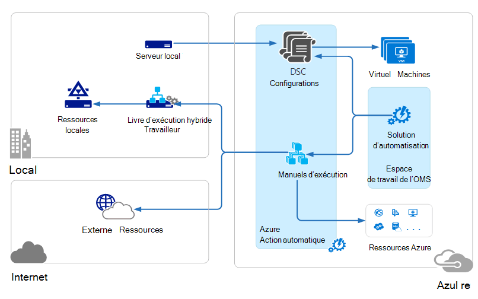

<properties 
   pageTitle="Architecture de gestion Suite (OMS) opérations | Microsoft Azure"
   description="Suite de gestion des opérations Microsoft (OMS) est en nuage solution de gestion informatique de Microsoft qui vous aide à gérer et protéger vos locaux et cloud d’infrastructure.  Cet article identifie les différents services inclus dans OMS et fournit des liens vers leur contenu détaillé."
   services="operations-management-suite"
   documentationCenter=""
   authors="bwren"
   manager="jwhit"
   editor="tysonn" />
<tags 
   ms.service="operations-management-suite"
   ms.devlang="na"
   ms.topic="get-started-article"
   ms.tgt_pltfrm="na"
   ms.workload="infrastructure-services"
   ms.date="10/27/2016"
   ms.author="bwren" />

# Architecture d’OMS

[Suite de gestion des opérations (OMS)](https://azure.microsoft.com/documentation/services/operations-management-suite/) est un ensemble de services en nuage pour la gestion de vos locaux et les environnements en nuage.  Cet article décrit les différents sur site et les composants de nuage de l’OMS et leur architecture informatique de nuage de niveau élevé.  Vous pouvez faire référence à la documentation pour chaque service pour plus de détails.

## Analytique de journal

Toutes les données collectées par [Analytique du journal](https://azure.microsoft.com/documentation/services/log-analytics/) est stocké dans le référentiel de l’OMS qui est hébergé dans Azure.  Sources connectées génèrent les données collectées dans le référentiel de l’OMS.  Il existe actuellement trois types de sources connectées pris en charge.

- Un agent est installé sur un ordinateur [Windows](../log-analytics/log-analytics-windows-agents.md) ou [Linux](../log-analytics/log-analytics-linux-agents.md) directement connecté à OMS.
- Un groupe gestion System Center Operations Manager (SCOM) [connecté au journal Analytique](../log-analytics/log-analytics-om-agents.md) .  Agents SCOM continuent de communiquer avec les serveurs d’administration que transférer des événements et des données de performances à Analytique du journal.
- Un [compte de stockage Azure](../log-analytics/log-analytics-azure-storage.md) qui collecte les données de [Diagnostic d’Azure](../cloud-services/cloud-services-dotnet-diagnostics.md) à partir d’un rôle de travail, du rôle web ou ordinateur virtuel dans Azure.

Sources de données permet de définir les données que collecte de journal Analytique à partir de sources connectées, y compris les journaux des événements et des compteurs de performance.  Solutions, ajoutent des fonctionnalités à OMS et peuvent facilement être ajoutées à votre espace de travail à partir de la [Galerie de Solutions OMS](../log-analytics/log-analytics-add-solutions.md).  Certaines solutions peuvent exiger une connexion directe au journal Analytique agents SCOM tandis que d’autres peuvent nécessiter un agent supplémentaire à installer.

Analytique de journal est un portail web qui vous permet de gérer les ressources de l’OMS, ajouter et configurer les solutions de l’OMS, afficher et analyser les données dans le référentiel de l’OMS.

## Automation Azure

[Procédures opérationnelles d’Azure Automation](http://azure.microsoft.com/documentation/services/automation) sont exécutées dans le nuage Azure et peuvent accéder aux ressources qui se trouvent dans Azure, dans d’autres services de nuage ou accessibles à partir de l’Internet public.  Vous pouvez également désigner les ordinateurs locaux dans votre centre de données local à l’aide de [Travailleur de procédure opérationnelle hybride](../automation/automation-hybrid-runbook-worker.md) afin que les procédures opérationnelles peuvent accéder aux ressources locales.

[Configurations de DSC](../automation/automation-dsc-overview.md) stockées dans Azure Automation peut être appliqué directement à des machines virtuelles Azure.  Autres machines physiques et virtuelles peuvent demander des configurations à partir du serveur d’extraction Azure Automation DSC.

Automation Azure dispose d’une solution OMS qui affiche les statistiques et les liens vers le portail Azure pour toutes les opérations de lancement.

## Sauvegarde Azure

Les données protégées dans [Azure sauvegarde](http://azure.microsoft.com/documentation/services/backup) sont stockées dans un coffre-fort de sauvegarde situé dans une zone géographique.  Les données sont répliquées dans la même région et, selon le type de stockage en chambre forte, peuvent également être répliquées vers une autre région pour davantage de redondance.

Sauvegarde Azure a trois scénarios fondamentaux.

- Machine de Windows avec l’agent de sauvegarde d’Azure.  Cela vous permet de sauvegarder des fichiers et des dossiers à partir de n’importe quel Windows client ou serveur directement à votre coffre-fort de sauvegarde Azure.  
- System Center Data Protection Manager (DPM) ou serveur de sauvegarde de Microsoft Azure. Cela vous permet d’exploiter DPM ou serveur de sauvegarde de Microsoft Azure pour sauvegarder des fichiers et des dossiers en plus des charges de travail applicatives tels que SQL et SharePoint sur le stockage local et ensuite répliquer pour sauvegarde vault Azure.
- Extensions d’Azure Virtual Machine.  Cela vous permet de sauvegarder des machines virtuelles Azure pour Azure vault sauvegarde.

Sauvegarde Azure dispose d’une solution OMS qui affiche les statistiques et les liens vers le portail Azure pour toutes les opérations de lancement.

## Récupération de Site Azure

[Récupération de Site Azure](http://azure.microsoft.com/documentation/services/site-recovery) orchestre la réplication, de basculement et de restauration de machines virtuelles et des serveurs physiques. Les données de réplication sont échangées entre les hôtes Hyper-V, les hyperviseurs VMware et des serveurs physiques dans des centres de données principal et secondaire, ou entre le centre de données et le stockage Azure.  Récupération de site stocke les métadonnées dans des coffres-forts que qui se trouve dans une zone géographique Azure. Aucune données répliquées ne sont stockées par le service de récupération de Site.

Récupération de Site Azure a trois scénarios de réplication fondamentaux.

**Réplication des ordinateurs virtuels Hyper-V**
- Si les ordinateurs virtuels Hyper-V sont gérés dans les nuages VMM, vous pouvez répliquer à un centre de données secondaire pour le stockage Azure.  La réplication vers Azure est une connexion internet sécurisée.  La réplication vers un centre de données secondaire est sur le réseau local.
- Si les ordinateurs virtuels Hyper-V ne sont pas gérés par VMM, vous pouvez répliquer vers le stockage Azure uniquement.  La réplication vers Azure est une connexion internet sécurisée.
 
**Réplication des machines virtuelles VMWare**
- Vous pouvez répliquer les machines virtuelles VMware pour un centre de données secondaire exécutant VMware ou stockage Azure.  Réplication vers Azure peut se produire sur un VPN de site à site ou ExpressRoute d’Azure, ou via une connexion Internet sécurisée. La réplication vers un centre de données secondaire se produit sur le canal de données InMage Scout.
 
**Réplication des serveurs physiques de Windows et Linux** 
- Vous pouvez répliquer les serveurs physiques pour un centre de données secondaire ou stockage Azure. Réplication vers Azure peut se produire sur un VPN de site à site ou ExpressRoute d’Azure, ou via une connexion Internet sécurisée. La réplication vers un centre de données secondaire se produit sur le canal de données InMage Scout.  Récupération de Site Azure dispose d’une solution OMS qui affiche des statistiques, mais vous devez utiliser le portail Azure pour toutes les opérations.

## Étapes suivantes

- Obtenir des informations sur le [journal Analytique](http://azure.microsoft.com/documentation/services/log-analytics).
- Obtenir des informations sur [l’Automation Azure](https://azure.microsoft.com/documentation/services/automation).
- Obtenir des informations sur la [sauvegarde d’Azure](http://azure.microsoft.com/documentation/services/backup).
- Obtenir des informations sur la [récupération de Site Azure](http://azure.microsoft.com/documentation/services/site-recovery).
