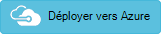

<properties 
    pageTitle="Fourniture Web App avec Redis de Cache" 
    description="Modèle de gestionnaire de ressources Azure permet de déployer l’application web avec Redis un Cache." 
    services="app-service" 
    documentationCenter="" 
    authors="steved0x" 
    manager="erickson-doug" 
    editor=""/>

<tags 
    ms.service="app-service" 
    ms.workload="web" 
    ms.tgt_pltfrm="na" 
    ms.devlang="na" 
    ms.topic="article" 
    ms.date="10/25/2016" 
    ms.author="sdanie"/>

# Créer une application Web plus le Cache de Redis à l’aide d’un modèle

Dans cette rubrique, vous apprendrez comment créer un modèle de gestionnaire de ressources Azure qui déploie une application Web de Azure avec cache de Redis. Vous apprendrez comment définir les ressources qui sont déployés et comment définir les paramètres qui sont spécifiés lors de l’exécution du déploiement. Vous pouvez utiliser ce modèle pour vos propres déploiements ou personnaliser pour répondre à vos besoins.

Pour plus d’informations sur la création de modèles, consultez [Création de modèles de gestionnaire de ressources Azure](../resource-group-authoring-templates.md).

Pour le modèle complet, reportez-vous à la section [Application Web avec un modèle Redis le Cache](https://github.com/Azure/azure-quickstart-templates/blob/master/201-web-app-with-redis-cache/azuredeploy.json).

## Ce que vous allez déployer

Dans ce modèle, vous allez déployer :

- Application Web Azure
- Azure Redis Cache.

Pour exécuter le déploiement automatique, cliquez sur le bouton suivant :

## Pour spécifier les paramètres

[AZURE.INCLUDE [app-service-web-deploy-web-parameters](../../includes/app-service-web-deploy-web-parameters.md)]

[AZURE.INCLUDE [cache-deploy-parameters](../../includes/cache-deploy-parameters.md)]

## Variables pour les noms

Ce modèle utilise des variables pour construire des noms pour les ressources. Il utilise la fonction [uniqueString](../resource-group-template-functions.md#uniquestring) pour construire une valeur basée sur l’id de groupe de ressources.

    "variables": {
      "hostingPlanName": "[concat('hostingplan', uniqueString(resourceGroup().id))]",
      "webSiteName": "[concat('webSite', uniqueString(resourceGroup().id))]",
      "cacheName": "[concat('cache', uniqueString(resourceGroup().id))]"
    },

## Ressources pour le déploiement

[AZURE.INCLUDE [app-service-web-deploy-web-host](../../includes/app-service-web-deploy-web-host.md)]

### Redis de Cache

Crée le Cache Azure Redis qui est utilisé avec l’application web. Le nom du cache est spécifié dans la variable **nom du cache** .

Le modèle crée le cache dans le même emplacement que le groupe de ressources. 

    {
      "name": "[variables('cacheName')]",
      "type": "Microsoft.Cache/Redis",
      "location": "[resourceGroup().location]",
      "apiVersion": "2015-08-01",
      "dependsOn": [ ],
      "tags": {
        "displayName": "cache"
      },
      "properties": {
        "sku": {
          "name": "[parameters('cacheSKUName')]",
          "family": "[parameters('cacheSKUFamily')]",
          "capacity": "[parameters('cacheSKUCapacity')]"
        }
      }
    }

### Application Web

Crée l’application web avec le nom spécifié dans la variable **nom du site Web** .

Notez que l’application web est configurée avec des propriétés de paramètre d’application qui lui permettent de fonctionner avec le Cache Redis. Cette application, les paramètres sont créés de façon dynamique en fonction des valeurs fournies au cours du déploiement.
        
    {
      "apiVersion": "2015-08-01",
      "name": "[variables('webSiteName')]",
      "type": "Microsoft.Web/sites",
      "location": "[resourceGroup().location]",
      "dependsOn": [
        "[concat('Microsoft.Web/serverFarms/', variables('hostingPlanName'))]",
        "[concat('Microsoft.Cache/Redis/', variables('cacheName'))]"
      ],
      "tags": {
        "[concat('hidden-related:', resourceGroup().id, '/providers/Microsoft.Web/serverfarms/', variables('hostingPlanName'))]": "empty",
        "displayName": "Website"
      },
      "properties": {
        "name": "[variables('webSiteName')]",
        "serverFarmId": "[resourceId('Microsoft.Web/serverfarms', variables('hostingPlanName'))]"
      },
      "resources": [
        {
          "apiVersion": "2015-08-01",
          "type": "config",
          "name": "appsettings",
          "dependsOn": [
            "[concat('Microsoft.Web/Sites/', variables('webSiteName'))]",
            "[concat('Microsoft.Cache/Redis/', variables('cacheName'))]"
          ],
          "properties": {
            "CacheConnection": "[concat(variables('cacheName'),'.redis.cache.windows.net,abortConnect=false,ssl=true,password=', listKeys(resourceId('Microsoft.Cache/Redis', variables('cacheName')), '2015-08-01').primaryKey)]"
          }
        }
      ]
    }

## Commandes à exécuter de déploiement

[AZURE.INCLUDE [app-service-deploy-commands](../../includes/app-service-deploy-commands.md)]

### PowerShell

    New-AzureRmResourceGroupDeployment -TemplateUri https://raw.githubusercontent.com/Azure/azure-quickstart-templates/master/201-web-app-with-redis-cache/azuredeploy.json -ResourceGroupName ExampleDeployGroup

### CLI Azure

    azure group deployment create --template-uri https://raw.githubusercontent.com/Azure/azure-quickstart-templates/master/201-web-app-with-redis-cache/azuredeploy.json -g ExampleDeployGroup

