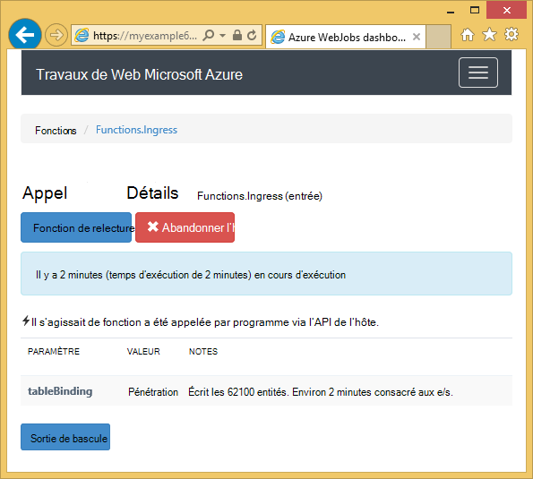
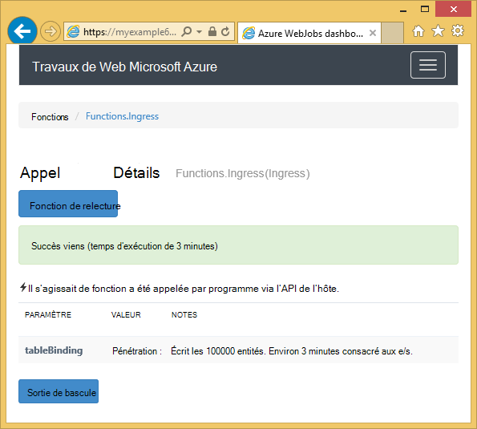

<properties
    pageTitle="Mise en route avec stockage Azure et Visual Studio connecté services (projets WebJob)"
    description="La mise en route à l’aide du stockage Azure Table dans un projet de WebJobs d’Azure dans Visual Studio après la connexion à un compte de stockage à l’aide de Visual Studio de services connectés"
    services="storage"
    documentationCenter=""
    authors="TomArcher"
    manager="douge"
    editor=""/>

<tags
    ms.service="storage"
    ms.workload="web"
    ms.tgt_pltfrm="vs-getting-started"
    ms.devlang="na"
    ms.topic="article"
    ms.date="07/18/2016"
    ms.author="tarcher"/>

# Mise en route avec Azure Storage (projets Azure WebJob)

[AZURE.INCLUDE [storage-try-azure-tools-tables](../../includes/storage-try-azure-tools-tables.md)]

## Vue d’ensemble

Cet article fournit des exemples de code C# qui montrent montrent comment utiliser la version du Kit de développement logiciel Azure WebJobs 1.x avec le service de stockage de table Azure. Les exemples de code utilisent la [Kit de développement logiciel WebJobs](../app-service-web/websites-dotnet-webjobs-sdk.md) version 1.x.

Le service de stockage Azure Table vous permet de stocker de grandes quantités de données structurées. Le service est un magasin de données NoSQL qui accepte des appels authentifiés, à l’intérieur et à l’extérieur du nuage Azure. Les tables Azure sont idéales pour le stockage des données structurées et non relationnelles.  Pour plus d’informations, consultez [mise en route de stockage Azure Table à l’aide de .NET](storage-dotnet-how-to-use-tables.md#create-a-table) .

Certains extraits de code affiche l’attribut de **Table** utilisé dans les fonctions qui sont appelées manuellement, autrement dit, ne pas en utilisant un des attributs de déclencheur.

## Comment faire pour ajouter des entités à un tableau

Pour ajouter des entités à une table, utilisez l’attribut **Table** avec une **ICollector<T> ** ou **IAsyncCollector<T> ** paramètre où **T** indique le schéma des entités que vous souhaitez ajouter. Le constructeur d’attribut a un paramètre de chaîne qui spécifie le nom de la table.

L’exemple de code suivant ajoute les entités de la **personne** dans une table nommée de *pénétration*.

        [NoAutomaticTrigger]
        public static void IngressDemo(
            [Table("Ingress")] ICollector<Person> tableBinding)
        {
            for (int i = 0; i < 100000; i++)
            {
                tableBinding.Add(
                    new Person() {
                        PartitionKey = "Test",
                        RowKey = i.ToString(),
                        Name = "Name" }
                    );
            }
        }

En général, le type que vous utilisez avec **ICollector** dérive de **TableEntity** ou implémente **ITableEntity**, mais il ne doit pas. Une des classes suivantes **personne** fonctionne avec le code de la méthode **d’entrée** précédente.

        public class Person : TableEntity
        {
            public string Name { get; set; }
        }

        public class Person
        {
            public string PartitionKey { get; set; }
            public string RowKey { get; set; }
            public string Name { get; set; }
        }

Si vous souhaitez travailler directement avec l’API de stockage Azure, vous pouvez ajouter un paramètre de **CloudStorageAccount** pour la signature de méthode.

## Surveillance en temps réel

Étant donné que les fonctions d’entrée de données traitent souvent d’importants volumes de données, le tableau de bord WebJobs SDK fournit des données de surveillance en temps réel. La section du **Journal d’appel** vous indique si la fonction est en cours d’exécution.

La page **Détails de l’appel** signale la progression de la fonction (nombre d’entités écrit) pendant qu’il est en cours d’exécution et vous donne la possibilité pour l’abandonner.

Lorsque la fonction est terminée, la page **Détails de l’appel** indique le nombre de lignes écrites.

## Comment faire pour lire plusieurs entités d’une table

Pour lire une table, utilisez l’attribut **Table** avec une **IQueryable<T> ** paramètre où le type **T** est dérivée de **TableEntity** ou implémente **ITableEntity**.

L’exemple de code suivant lit et enregistre toutes les lignes de la table **d’entrée** :

        public static void ReadTable(
            [Table("Ingress")] IQueryable<Person> tableBinding,
            TextWriter logger)
        {
            var query = from p in tableBinding select p;
            foreach (Person person in query)
            {
                logger.WriteLine("PK:{0}, RK:{1}, Name:{2}",
                    person.PartitionKey, person.RowKey, person.Name);
            }
        }

### Comment faire pour lire une entité unique d’une table

Il existe un constructeur d’attribut de **Table** avec deux paramètres supplémentaires qui vous permettent de spécifier la clé de partition et de la clé de ligne lorsque vous souhaitez lier à une entité de table unique.

L’exemple de code suivant lit une ligne de table pour une entité de **personne** basée sur partition clé et ligne clés valeurs reçues dans un message de la file d’attente :  

        public static void ReadTableEntity(
            [QueueTrigger("inputqueue")] Person personInQueue,
            [Table("persontable","{PartitionKey}", "{RowKey}")] Person personInTable,
            TextWriter logger)
        {
            if (personInTable == null)
            {
                logger.WriteLine("Person not found: PK:{0}, RK:{1}",
                        personInQueue.PartitionKey, personInQueue.RowKey);
            }
            else
            {
                logger.WriteLine("Person found: PK:{0}, RK:{1}, Name:{2}",
                        personInTable.PartitionKey, personInTable.RowKey, personInTable.Name);
            }
        }

Dans cet exemple, la classe de **personne** ne possède pas d’implémenter **ITableEntity**.

## Comment faire pour utiliser l’API de stockage .NET directement à une table de travail

Vous pouvez également utiliser l’attribut de la **Table** avec un objet **CloudTable** pour une plus grande souplesse dans l’utilisation d’une table.

L’exemple de code suivant utilise un objet **CloudTable** pour ajouter une seule entité à la table *d’entrée* .

        public static void UseStorageAPI(
            [Table("Ingress")] CloudTable tableBinding,
            TextWriter logger)
        {
            var person = new Person()
                {
                    PartitionKey = "Test",
                    RowKey = "100",
                    Name = "Name"
                };
            TableOperation insertOperation = TableOperation.Insert(person);
            tableBinding.Execute(insertOperation);
        }

Pour plus d’informations sur l’utilisation de l’objet **CloudTable** , reportez-vous à la section [mise en route de stockage Azure Table à l’aide de .NET](storage-dotnet-how-to-use-tables.md).

## Rubriques connexes couvertes par l’article d’apprentissage de files d’attente

Pour plus d’informations sur la gestion du traitement de table déclenchée par un message de la file d’attente, ou pour les scénarios de WebJobs SDK non spécifiques au traitement de table, reportez-vous à la section [que mise en route avec Visual Studio et de stockage de la file d’attente d’Azure services connectés (projets WebJob)](vs-storage-webjobs-getting-started-queues.md).

## Étapes suivantes

Cet article fournit des exemples de code qui montrent comment gérer des scénarios courants pour l’utilisation de tables Azure. Pour plus d’informations sur l’utilisation de WebJobs d’Azure et le SDK WebJobs, consultez [les ressources de documentation Azure WebJobs](http://go.microsoft.com/fwlink/?linkid=390226).
