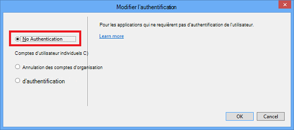

<properties
    pageTitle="Créer des images de démarque"
    description="Explique comment créer des images dans les promotions selon les orientations définies pour les référentiels Azure."
    services=""
    solutions=""
    documentationCenter=""
    authors="kenhoff"
    manager="ilanas"
    editor="tysonn"/>

<tags
    ms.service="contributor-guide"
    ms.devlang=""
    ms.topic="article"
    ms.tgt_pltfrm=""
    ms.workload=""
    ms.date="06/25/2015"
    ms.author="kenhoff" />

# <a name="create-images-in-markdown"></a>Créer des images de démarque

## <a name="image-folder-creation-and-link-syntax"></a>Syntaxe de création et de liaison du dossier image

Pour un nouvel article, vous devez créer un dossier à l’emplacement suivant :

    /articles/<service-directory>/media/<article-name>/

Par exemple :

    /articles/app-service/media/app-service-enterprise-multichannel-apps/

Après avoir créé les images ajoutées à ce dossier, utilisez la syntaxe suivante pour créer des images dans votre article :

```

```
Exemple :

Voir [le modèle de démarque](../markdown%20templates/markdown-template-for-new-articles.md) pour obtenir un exemple.  Les liens de référence d’image dans ce modèle de démarque sont conçus pour être au bas du modèle.

## <a name="guidelines-specific-to-azuremicrosoftcom"></a>Lignes directrices spécifiques à azure.microsoft.com

Captures d’écran sont actuellement invités s’il n’est pas possible d’inclure les étapes de reproduction. Écrire votre contenu en sorte que le contenu peut être sans les captures d’écran, si nécessaire.

Utilisez les instructions suivantes lorsque vous créez et y compris les fichiers de la bibliothèque :
- Ne pas partager les fichiers art dans tous les documents. Copiez le fichier que vous avez besoin et l’ajouter dans le dossier media sur votre sujet spécifique. Partage de fichiers n’est pas recommandée, car il est plus facile à supprimer déconseillé de contenu et les images qui conserve le mis en pension à nettoyer.

- Formats de fichier : utilisez les fichiers .png - elles sont d’une qualité supérieure et de maintenir leur qualité au cours du processus de localisation. Autres formats de fichier ne conservent pas leur qualité ainsi. Le format .jpeg est autorisé, mais pas par défaut.  Aucun des fichiers GIF animés.

- Utiliser des carrés rouges de la largeur par défaut fourni dans Paint (5 px) pour attirer l’attention sur des éléments particuliers dans les captures d’écran.  

    Exemple :

    

- Lorsqu’il s’avère utile, n’hésitez pas à rogner les images pour les éléments de l’interface utilisateur seront affiche dans sa taille maximale. Vérifiez que le contexte est clair pour les utilisateurs, cependant.

- Éviter les espaces blancs sur les bords des captures d’écran. Si vous rognez une capture d’écran d’une manière qui rend l’arrière-plan blanc sur les bords, ajouter une bordure de pixel unique gris autour de l’image.  Si l’aide de Paint, utilisez le gris plus clair dans la palette de couleurs par défaut (0xC3C3C3). Si vous utilisez une autre application graphique, la couleur RVB est R195, G195, 195. Vous pouvez facilement ajouter une bordure grise autour d’une image dans Visio : pour cela, sélectionnez l’image, sélectionnez la ligne et garantir le la couleur appropriée est définie, puis modifiez l’épaisseur de trait à 1 1/2 pt.  Captures d’écran doit avoir une bordure grise 1 pixels de large afin que les zones blanches de la capture d’écran de ne pas flou dans la page web.

    Exemple :

    
    
    Pour un outil automatiser le processus d’ajout de la bordure requise pour les images, consultez [outil de AddACOMBorder - comment faire pour automatiser le processus d’ajout de la bordure requis de 1 pixel gris aux images ACOM](https://github.com/Azure/Azure-CSI-Content-Tools/tree/master/Tools/AddACOMImageBorder).

- Images conceptuelles avec espace blanc n’est pas nécessaire une bordure grise.  

    Exemple :

    

- Essayez de ne pas créer une image trop large.  Images seront automatiquement redimensionnées si elles sont trop larges. Toutefois, le redimensionnement Parfois, tolérance, nous vous recommandons de limiter la largeur de vos images à 780 px, manuellement et redimensionnement des images avant l’envoi si nécessaire.

- Afficher les sorties de commande dans les captures d’écran.  Si votre article inclut des étapes dans lequel l’utilisateur travaille dans un shell, il est utile d’afficher le résultat de la commande dans les captures d’écran. Dans ce cas, la limitation de la largeur de votre shell à environ 72 caractères généralement garantit que votre image ne sera pas inclus dans la règle de largeur 780 px. Avant de prendre une capture d’écran de la sortie, redimensionnez la fenêtre afin que simplement la commande appropriée et la sortie est affichée (éventuellement avec une ligne vide de chaque côté).

- Prendre des captures d’écran entier de windows lorsque cela est possible. Lorsque vous prenez une capture d’écran d’une fenêtre de navigateur, redimensionnez la fenêtre de votre navigateur 780 px large ou moins et conserver la hauteur de la fenêtre du navigateur sous la forme abrégée que possible tels que la fenêtre est adaptée à votre application.

    Exemple :

    

- Soyez prudent avec les informations est révélé dans les captures d’écran.  Ne révélez pas les informations internes de l’entreprise ou des informations personnelles.

- Image conceptuelle ou des diagrammes, utilisez les icônes d’officiels dans le jeu de symboles et l’icône nuage et d’entreprise. Un jeu public est disponible à l’adresse http://aka.ms/CnESymbols.

- Remplacer des informations personnelles ou privées dans les captures d’écran texte d’espace réservé compris entouré crochets pointus. Cela inclut les noms d’utilisateur, ID d’abonnement et autres informations connexes. Les noms personnels peuvent être remplacés par une [approbation nom fictifs](https://aka.ms/ficticiousnames)(lien employé uniquement). N’utilisez pas la pointe de crayon de couleur ou un marqueur dans Paint pour obscurcir ou flou des informations personnelles ou privées.

  L’image suivante a été correctement mis à jour pour remplacer l' **ID d’abonnement** avec les informations d’espace réservé :

  

### <a name="contributors-guide-links"></a>Liens du Guide des collaborateurs

- [Article de présentation](./../README.md)
- [Index des articles sur les instructions](./contributor-guide-index.md)
