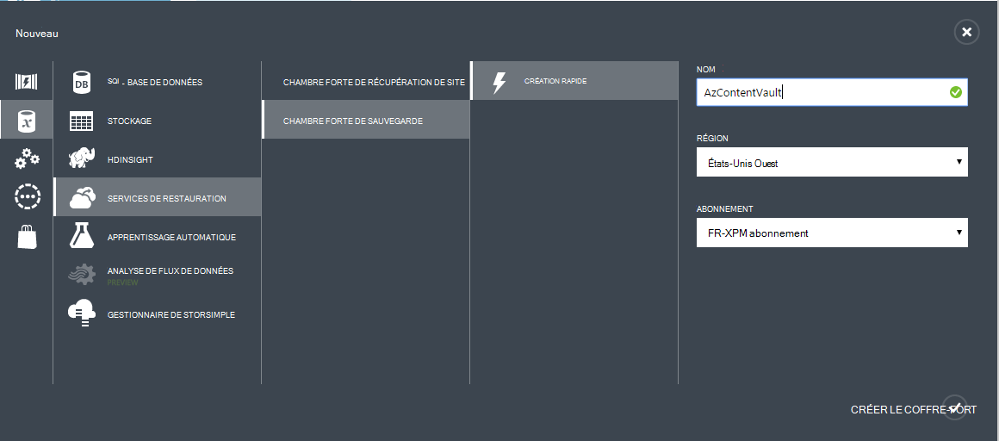
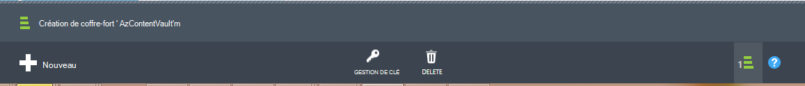

## Créer un coffre-fort de sauvegarde
Pour sauvegarder des fichiers et des données à partir de Windows Server ou Data Protection Manager (DPM) pour Azure ou lors de la sauvegarde d’ordinateurs virtuels de IaaS sur Azure, vous devez créer un coffre-fort de sauvegarde dans la zone géographique où vous souhaitez stocker les données.

La procédure suivante vous guidera tout au long de la création du coffre-fort utilisé pour stocker des sauvegardes.

1. Connectez-vous au [portail de gestion](https://manage.windowsazure.com/)
2. Cliquez sur **Nouveau** > **Data Services** > **Services de récupération de** > **Sauvegarde coffre-fort** et choisissez **Création rapide**.

    

3. Pour le paramètre de **nom** , entrez un nom convivial pour identifier le coffre-fort de sauvegarde. Il doit être unique pour chaque abonnement.

4. Pour le paramètre de **région** , sélectionnez la zone géographique pour le coffre-fort de sauvegarde. Le choix détermine la zone géographique à laquelle vos données de sauvegarde sont envoyées. En choisissant une région proche de votre emplacement, vous pouvez réduire la latence du réseau lors de la sauvegarde sur Azure.

5. Cliquez sur **Créer un coffre-fort** pour terminer le flux de travail. Elle peut prendre du temps pour le coffre-fort de sauvegarde à créer. Pour vérifier l’état, vous pouvez surveiller les notifications au bas du portail.

    

6. Après avoir créé le coffre-fort de sauvegarde, un message vous indique le coffre-fort a été créé avec succès. Le coffre-fort est également répertorié dans les ressources pour les Services de récupération comme **Active**.

    

### Sauvegarde Azure - Options de redondance de stockage

>[AZURE.IMPORTANT] Le meilleur moment pour identifier votre option de redondance de stockage est immédiatement après la création du coffre-fort, et avant que les ordinateurs sont inscrits dans la chambre forte. Une fois qu’un élément a été enregistré dans la chambre forte, l’option de redondance de stockage est verrouillée et ne peut pas être modifiée.

Besoins de votre entreprise doivent déterminer la redondance du stockage du stockage Azure sauvegarde back-end. Si vous utilisez Azure comme un point de terminaison de stockage de sauvegarde principal (par exemple, vous sauvegardez vers Azure à partir d’un serveur Windows Server), vous devez envisager de prélèvement (par défaut) géo-stockage redondante. Cela est visible sous l’option de **configuration** de votre coffre-fort de sauvegarde.

#### Stockage redondant geo (GRS)
GRS conserve de six copies de vos données. Avec GRS, vos données sont répliquées de trois fois dans la région principale et sont également répliquées trois fois dans une zone secondaire des centaines de miles en dehors de la région principale, offrant le plus haut niveau de durabilité. En cas de défaillance au niveau de la zone primaire, en stockant les données dans GRS, Azure sauvegarde garantit que vos données sont durables dans deux zones distinctes.

#### Stockage redondant localement (LRS)
Stockage redondant localement (LRS) gère trois copies de vos données. LRS sont répliquées trois fois dans un site unique dans une seule région. LRS protège vos données contre les pannes de matériel normal, mais pas à partir de l’échec d’une installation d’Azure ensemble.

Si vous utilisez Azure comme un point de terminaison de stockage de sauvegarde tertiaires (par exemple, vous utilisez SCDPM pour disposer d’une sauvegarde locale sur site & à l’aide d’Azure pour votre rétention à long terme doit copier), vous devriez choisir localement le stockage redondant à partir de l’option de **configuration** de votre coffre-fort de sauvegarde. Cela entraîne un dysfonctionnement du coût de stockage des données dans Azure, tout en offrant un niveau de durabilité de vos données peuvent être acceptables pour les copies tertiaires.

