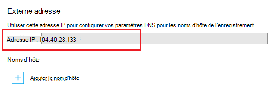

Le système de nom de domaine (DNS) est utilisé pour localiser les ressources sur internet. Par exemple, lorsque vous entrez une adresse d’application web dans votre navigateur, ou cliquez sur un lien sur une page web, il utilise le système DNS pour le domaine se traduire par une adresse IP. L’adresse IP est comme une adresse postale, mais il n’est pas convivial très humain. Par exemple, il est beaucoup plus facile de se souvenir d’un nom DNS comme **contoso.com** plutôt que de se souvenir d’une adresse IP telle que 192.168.1.88 ou 2001:0:4137:1f67:24a2:3888:9cce:fea3.

Le système DNS est basé sur des *enregistrements*. Les enregistrements associent un *nom*par exemple, **contoso.com**, avec une adresse IP ou un autre nom DNS. Lorsqu’une application, comme un navigateur web, recherche un nom dans DNS, il trouve l’enregistrement et l’utilise quel que soit il pointe vers l’adresse. Si la valeur qu’il désigne est une adresse IP, le navigateur utilisera cette valeur. Si elle pointe vers un autre nom DNS, l’application doit ensuite faire à nouveau de résolution. Enfin, toute la résolution de nom se termine dans une adresse IP.

Lorsque vous créez une application web dans le Service d’application, un nom DNS est automatiquement affecté à l’application web. Ce nom prend la forme de ** &lt;yourwebappname&gt;. azurewebsites.net**. Il est également une adresse IP virtuelle disponible pour une utilisation lors de la création de DNS d’enregistrements, vous pouvez créer des enregistrements qui pointent vers le **. azurewebsites.net**, ou vous pouvez pointer vers l’adresse IP.

> [AZURE.NOTE] L’adresse IP de votre application web change si vous supprimez et recréez votre application web ou passez en mode plan de Service d’application **libre** après que qu’il a été défini à la **base**, **partagée**ou **Standard**.

Il existe également plusieurs types d’enregistrements, chacun avec ses propres fonctions et les limites, mais pour les applications web nous occuper uniquement sur deux, les enregistrements *A* et *CNAME* .

###Enregistrement d’adresse (enregistrement)

Un enregistrement A mappe un domaine, tel que **contoso.com** ou **www.contoso.com**, *ou un domaine générique* tel que ** \*. contoso.com**, à une adresse IP. Dans le cas d’une application web dans le Service d’application, soit l’adresse IP virtuelle du service ou un spécifique d’adresses IP que vous avez achetées pour votre application web.

Les principaux avantages d’un enregistrement A sur un enregistrement CNAME sont les suivantes :

* Vous pouvez mapper un domaine racine, par exemple, **contoso.com** à une adresse IP ; de nombreux bureaux n’autorisent à l’aide d’un enregistrement

* Vous pouvez avoir une entrée qui utilise un caractère générique, tel que ** \*. contoso.com**, qui peut gérer des requêtes de plusieurs sous-domaines, par exemple **mail.contoso.com**, **blogs.contoso.com**ou **www.contso.com**.

> [AZURE.NOTE] Dans la mesure où un enregistrement A est mappé à une adresse IP statique, il ne peut pas résoudre automatiquement les modifications à l’adresse IP de votre application web. Une adresse IP pour une utilisation avec un enregistrements est fournie lorsque vous configurez les paramètres de nom de domaine personnalisé pour votre application web ; Toutefois, cette valeur peut changer si vous supprimez et recréez votre application web ou modifiez le mode de plan de Service d’application pour sauvegarder **libre**.

###Alias enregistrement (CNAME)

Un enregistrement CNAME associe un nom DNS *spécifique* , tel que **mail.contoso.com** ou **www.contoso.com**, à un autre nom de domaine (canonique). Dans le cas d’application de Service Web Apps, le nom de domaine canonique est la ** &lt;yourwebappname >. azurewebsites.net** nom de domaine de votre application web. Une fois créé, l’enregistrement CNAME crée un alias pour le ** &lt;yourwebappname >. azurewebsites.net** nom de domaine. L’entrée CNAME résout l’adresse IP de votre ** &lt;yourwebappname >. azurewebsites.net** nom de domaine automatiquement, donc si l’adresse IP de l’application web change, vous n’avez pas à intervenir.

> [AZURE.NOTE] Certains bureaux de domaine uniquement vous permettent de mapper les sous-domaines lors de l’utilisation d’un enregistrement CNAME, par exemple **www.contoso.com**et non les noms de racine, par exemple, **contoso.com**. Pour plus d’informations sur les enregistrements CNAME, consultez la documentation fournie par le document <a href="http://tools.ietf.org/html/rfc1035">IETF de noms de domaine - implémentation et spécification</a> , <a href="http://en.wikipedia.org/wiki/CNAME_record">l’entrée de Wikipedia sur l’enregistrement CNAME</a>ou votre registraire.

###Caractéristiques DNS d’application Web

Avec les applications Web à l’aide d’un enregistrement de nécessite tout d’abord créer un des enregistrements TXT suivantes :

* **Pour le domaine racine** - enregistrement A DNS TXT de **@** à ** &lt;yourwebappname&gt;. azurewebsites.net**.

* **Pour un sous-domaine spécifique** - un nom DNS de ** &lt;sous-domaine >** à ** &lt;yourwebappname&gt;. azurewebsites.net**. Par exemple, **blogs** si l’enregistrement A est de **blogs.contoso.com**.

* **Pour les génériques sub-dodmains** - enregistrement A DNS TXT de *** à ** &lt;yourwebappname&gt;. azurewebsites.net**.

Cet enregistrement TXT est utilisé pour vérifier que vous possédez le domaine que vous essayez d’utiliser. C’est en plus de créer un enregistrement A qui pointe vers l’adresse IP virtuelle de votre application web.

Vous pouvez trouver l’adresse IP et **. azurewebsites.net** les noms de votre application web en effectuant les opérations suivantes :

1. Dans votre navigateur, ouvrez le [Portail Azure](https://portal.azure.com).

2. De la lame **d’Applications Web** , cliquez sur le nom de votre application web et sélectionnez **Custom domains** à partir du bas de la page.

    

3. De la lame **Custom domains** , vous verrez l’adresse IP virtuelle. Enregistrer cette information, car il sera utilisé lors de la création d’enregistrements DNS

    

    > [AZURE.NOTE] Vous ne pouvez pas utiliser des noms de domaine personnalisé avec une application web de **libre** et que vous devez mettre à jour le plan de Service de l’application **partagée**, **base**, **Standard**ou **Premium** couche. Pour plus d’informations sur du plan Service d’application de tarification niveaux, y compris comment modifier le niveau de tarification de votre application web, consultez [Comment faire évoluer les applications web](../articles/web-sites-scale.md).
