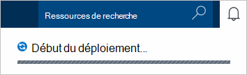
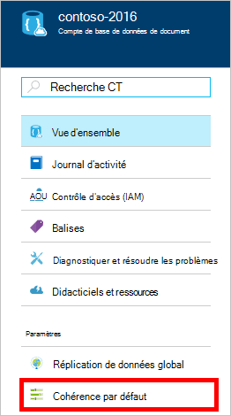
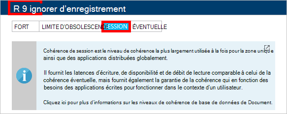

1.  Connectez-vous au [portail Azure](https://portal.azure.com/).
2.  Dans le Jumpbar, cliquez sur **Nouveau**, cliquez sur **données + de stockage**, puis cliquez sur **DocumentDB (NoSQL)**.

      

3. Dans la lame de **nouveau compte** , spécifiez la configuration souhaitée pour le compte DocumentDB.

    

    - Dans la zone **ID** , entrez un nom pour identifier le compte DocumentDB.  Lorsque l' **ID** est validée, une coche verte s’affiche dans la zone **ID** . La valeur **ID** devient le nom d’hôte dans l’URI. L' **ID** peut contenir uniquement des lettres minuscules, de nombres et '-' caractères et doit être comprise entre 3 et 50 caractères. Notez que *documents.azure.com* est ajouté au nom du point de terminaison que vous le choisissez, dont le résultat devient votre point de terminaison du compte DocumentDB.

    - Dans la zone de **l’API de NoSQL** , sélectionnez **DocumentDB**.  

    - Pour l' **abonnement**, sélectionnez l’abonnement Azure que vous souhaitez utiliser pour le compte DocumentDB. Si votre compte n’a qu’un seul abonnement, ce compte est sélectionné par défaut.

    - Dans le **Groupe de ressources**, sélectionnez ou créez un groupe de ressources pour votre compte de DocumentDB.  Par défaut, un nouveau groupe de ressources est créé. Pour plus d’informations, consultez [l’aide du portail Azure pour gérer vos ressources Azure](../articles/azure-portal/resource-group-portal.md).

    - **Emplacement** permet de spécifier l’emplacement géographique dans lequel vous souhaitez héberger votre compte DocumentDB. 

4.  Une fois les nouvelles options de compte DocumentDB sont configurées, cliquez sur **créer**. Pour vérifier l’état du déploiement, consultez le concentrateur de Notifications.  

      

    

5.  Après avoir créé le compte DocumentDB, il est prêt à être utilisé avec les paramètres par défaut. La cohérence par défaut du compte DocumentDB est définie pour la **Session**.  Vous pouvez ajuster la cohérence par défaut en cliquant sur **Cohérence par défaut** dans le menu ressources. Pour en savoir plus sur les niveaux de cohérence offerts par DocumentDB, consultez [niveaux de cohérence dans DocumentDB](../articles/documentdb/documentdb-consistency-levels.md).

      

      

[How to: Create a DocumentDB account]: #Howto
[Next steps]: #NextSteps
[documentdb-manage]:../articles/documentdb/documentdb-manage.md
