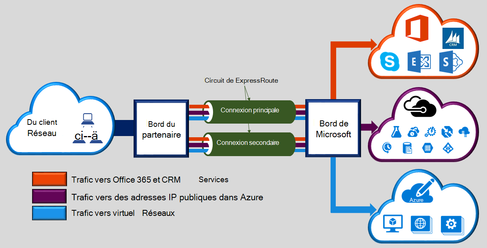

Microsoft Azure ExpressRoute vous permet d’étendre vos réseaux locaux dans le nuage de Microsoft via une connexion privée dédiée facilitée par un fournisseur de connectivité. ExpressRoute, vous pouvez établir des connexions aux services de cloud de Microsoft, comme Microsoft Azure, Office 365 et CRM en ligne. Connectivité peut provenir d’un réseau (IP VPN) pour tout, un réseau Ethernet de point à point ou une connexion croisée virtuelle via un fournisseur de connectivité dans un centre de colocalisation. ExpressRoute les connexions ne passent pas sur l’Internet public. Cela permet des connexions ExpressRoute offre plus la fiabilité, vitesses plus rapides, des latences inférieurs et une plus grande sécurité que les connexions classiques sur Internet.  

